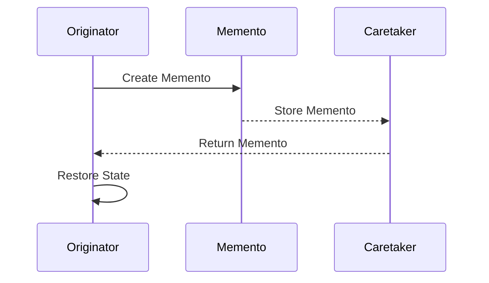

## 5.6.1 Intent and Motivation

In the world of software design, managing the state of an object is a frequent challenge. The Memento Pattern offers a robust solution by allowing us to capture and externalize an object's internal state without violating encapsulation. This capability is crucial for implementing features like undo/redo, where the ability to revert to a previous state is essential. Let's delve into the intent and motivation behind the Memento Pattern, explore its components, and understand its significance in modern software development.

### Understanding the Memento Pattern

The Memento Pattern is a behavioral design pattern that provides the ability to restore an object to its previous state. This is achieved by capturing the state of an object and storing it in a way that does not break the encapsulation of the object. The pattern involves three primary components:

1. **Originator**: This is the object whose state needs to be saved and restored. The Originator creates a Memento containing a snapshot of its current state.

2. **Memento**: This is a storage object that holds the state of the Originator. The Memento is immutable and does not expose the state to any external objects, preserving encapsulation.

3. **Caretaker**: This is responsible for keeping track of the Mementos. The Caretaker requests a Memento from the Originator, stores it, and later uses it to restore the Originator's state.

### Preserving Encapsulation

One of the key motivations for using the Memento Pattern is to preserve the encapsulation of the Originator's state. Encapsulation is a fundamental principle of object-oriented programming that restricts access to certain components of an object, thereby safeguarding its integrity. By using the Memento Pattern, we can externalize the state of an object without exposing its internal structure or implementation details.

Consider the analogy of saving a game state. When you save your progress in a game, you want to capture the current state of the game (e.g., player's position, inventory, level) without exposing the underlying game mechanics or data structures. The Memento Pattern allows you to do just that, providing a mechanism to save and restore the game state without compromising the game's encapsulation.

### Problems Addressed by the Memento Pattern

The Memento Pattern addresses several common problems in software design:

- **Undo/Redo Functionality**: Implementing undo/redo operations is a classic use case for the Memento Pattern. By capturing the state of an object at various points in time, you can easily revert to a previous state or redo a change.

- **State Management**: Managing the state of complex objects can be challenging, especially when changes need to be tracked and potentially reversed. The Memento Pattern provides a structured way to handle state changes and ensure consistency.

- **Encapsulation**: As mentioned earlier, preserving encapsulation is crucial for maintaining the integrity of an object. The Memento Pattern allows you to save and restore state without exposing the internal workings of the object.

### Implementing the Memento Pattern

Let's explore how the Memento Pattern can be implemented in JavaScript and TypeScript through a practical example. We'll create a simple text editor application that supports undo and redo operations.

#### JavaScript Implementation

```javascript
// Originator
class TextEditor {
    constructor() {
        this.content = '';
    }

    type(words) {
        this.content += words;
    }

    save() {
        return new Memento(this.content);
    }

    restore(memento) {
        this.content = memento.getContent();
    }

    getContent() {
        return this.content;
    }
}

// Memento
class Memento {
    constructor(content) {
        this.content = content;
    }

    getContent() {
        return this.content;
    }
}

// Caretaker
class Caretaker {
    constructor() {
        this.mementos = [];
    }

    addMemento(memento) {
        this.mementos.push(memento);
    }

    getMemento(index) {
        return this.mementos[index];
    }
}

// Usage
const editor = new TextEditor();
const caretaker = new Caretaker();

editor.type('Hello, ');
caretaker.addMemento(editor.save());

editor.type('World!');
caretaker.addMemento(editor.save());

console.log(editor.getContent()); // Output: Hello, World!

editor.restore(caretaker.getMemento(0));
console.log(editor.getContent()); // Output: Hello, 
```

In this example, the `TextEditor` class acts as the Originator, the `Memento` class stores the state of the editor, and the `Caretaker` manages the saved states. The editor can type text, save its state, and restore to a previous state using the Memento Pattern.

#### TypeScript Implementation

```typescript
// Originator
class TextEditor {
    private content: string = '';

    type(words: string): void {
        this.content += words;
    }

    save(): Memento {
        return new Memento(this.content);
    }

    restore(memento: Memento): void {
        this.content = memento.getContent();
    }

    getContent(): string {
        return this.content;
    }
}

// Memento
class Memento {
    constructor(private content: string) {}

    getContent(): string {
        return this.content;
    }
}

// Caretaker
class Caretaker {
    private mementos: Memento[] = [];

    addMemento(memento: Memento): void {
        this.mementos.push(memento);
    }

    getMemento(index: number): Memento {
        return this.mementos[index];
    }
}

// Usage
const editor = new TextEditor();
const caretaker = new Caretaker();

editor.type('Hello, ');
caretaker.addMemento(editor.save());

editor.type('World!');
caretaker.addMemento(editor.save());

console.log(editor.getContent()); // Output: Hello, World!

editor.restore(caretaker.getMemento(0));
console.log(editor.getContent()); // Output: Hello, 
```

The TypeScript implementation is similar to the JavaScript version, with the added benefit of type safety provided by TypeScript. The use of private fields and method signatures helps ensure that the code is robust and less prone to errors.

### Visualizing the Memento Pattern

To better understand the interaction between the components of the Memento Pattern, let's visualize the process using a sequence diagram.



**Diagram Description**: This sequence diagram illustrates the interaction between the Originator, Memento, and Caretaker. The Originator creates a Memento to capture its state, which is then stored by the Caretaker. When needed, the Caretaker returns the Memento to the Originator, allowing it to restore its state.

### Try It Yourself

To deepen your understanding of the Memento Pattern, try modifying the code examples provided. Here are some suggestions:

- **Add a Redo Functionality**: Extend the Caretaker to support redo operations by maintaining a separate stack for undone states.

- **Implement a History Limit**: Limit the number of Mementos stored by the Caretaker to prevent excessive memory usage.

- **Enhance the Editor**: Add more features to the text editor, such as formatting options, and ensure that these states are also captured by the Memento.

### References and Further Reading

- [MDN Web Docs: Encapsulation](https://developer.mozilla.org/en-US/docs/Glossary/Encapsulation)
- [Refactoring Guru: Memento Pattern](https://refactoring.guru/design-patterns/memento)
- [Wikipedia: Memento Pattern](https://en.wikipedia.org/wiki/Memento_pattern)

### Knowledge Check

Before we conclude, let's reinforce what we've learned with a few questions:

1. What are the three main components of the Memento Pattern?
2. How does the Memento Pattern preserve encapsulation?
3. What are some common use cases for the Memento Pattern?
4. How can the Memento Pattern be used to implement undo/redo functionality?

### Embrace the Journey

Remember, this is just the beginning. As you progress, you'll discover more ways to apply the Memento Pattern and other design patterns in your projects. Keep experimenting, stay curious, and enjoy the journey!

## Quiz Time!



### What is the primary purpose of the Memento Pattern?

- [x] To capture and restore an object's internal state without violating encapsulation.
- [ ] To provide a simplified interface to a complex subsystem.
- [ ] To allow incompatible interfaces to work together.
- [ ] To compose objects into tree structures.

> **Explanation:** The Memento Pattern is designed to capture and restore an object's state while preserving encapsulation.

### Which component of the Memento Pattern is responsible for storing the state of the Originator?

- [ ] Originator
- [x] Memento
- [ ] Caretaker
- [ ] Observer

> **Explanation:** The Memento is the component that stores the state of the Originator.

### How does the Memento Pattern help in implementing undo/redo functionality?

- [x] By capturing the state of an object at various points in time, allowing it to revert to a previous state.
- [ ] By decoupling an abstraction from its implementation.
- [ ] By adding responsibilities to objects dynamically.
- [ ] By providing a surrogate for another object.

> **Explanation:** The Memento Pattern captures the state of an object, enabling undo/redo functionality by allowing the object to revert to a previous state.

### What is the role of the Caretaker in the Memento Pattern?

- [ ] To create Mementos.
- [ ] To restore the state of the Originator.
- [x] To keep track of Mementos and manage saved states.
- [ ] To define a one-to-many dependency between objects.

> **Explanation:** The Caretaker is responsible for managing Mementos and keeping track of saved states.

### Why is encapsulation important in the Memento Pattern?

- [x] It ensures that the internal state of the Originator is not exposed or modified by external objects.
- [ ] It allows for the composition of objects into tree structures.
- [ ] It enables the creation of families of related objects.
- [ ] It provides a simplified interface to a complex subsystem.

> **Explanation:** Encapsulation is crucial in the Memento Pattern to protect the internal state of the Originator from external modification.

### In the provided JavaScript example, what method is used to save the state of the TextEditor?

- [ ] restore()
- [x] save()
- [ ] type()
- [ ] getContent()

> **Explanation:** The `save()` method is used to capture and save the state of the TextEditor.

### What is a potential modification you can try with the Memento Pattern example?

- [x] Add a Redo functionality by maintaining a separate stack for undone states.
- [ ] Implement a Proxy to control access to the Memento.
- [ ] Use the Decorator Pattern to add responsibilities to the Caretaker.
- [ ] Create a Facade to simplify the interaction between the Originator and Memento.

> **Explanation:** Adding a Redo functionality is a practical modification to enhance the Memento Pattern example.

### Which of the following is NOT a problem addressed by the Memento Pattern?

- [ ] Undo/Redo functionality
- [ ] State Management
- [ ] Encapsulation
- [x] Decoupling an abstraction from its implementation

> **Explanation:** Decoupling an abstraction from its implementation is addressed by the Bridge Pattern, not the Memento Pattern.

### What analogy is used to explain the Memento Pattern?

- [x] Saving a game state for future loading.
- [ ] Composing objects into tree structures.
- [ ] Providing a simplified interface to a complex subsystem.
- [ ] Allowing incompatible interfaces to work together.

> **Explanation:** The analogy of saving a game state is used to explain how the Memento Pattern captures and restores state.

### True or False: The Memento Pattern exposes the internal state of the Originator to external objects.

- [ ] True
- [x] False

> **Explanation:** False. The Memento Pattern preserves encapsulation by not exposing the internal state of the Originator.


