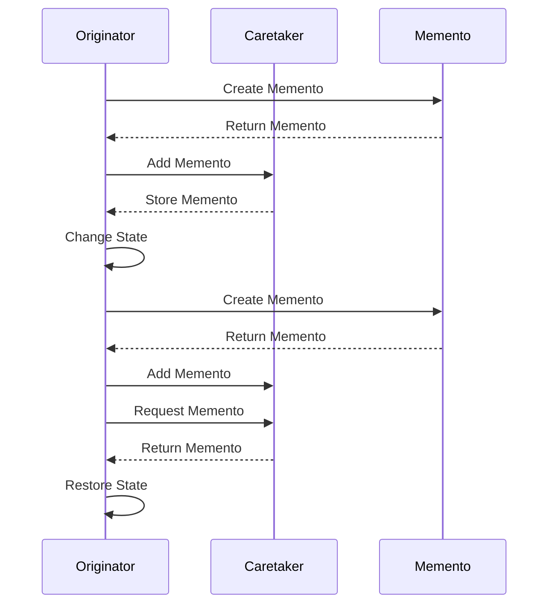

## 5.6.2 Implementation in JavaScript

The Memento Pattern is a behavioral design pattern that provides the ability to restore an object to its previous state. This is particularly useful in scenarios where you need to implement undo functionality or save checkpoints in an application. In this section, we will explore how to implement the Memento Pattern in JavaScript, focusing on the roles of the Originator, Memento, and Caretaker.

### Understanding the Memento Pattern

Before diving into the implementation, let's clarify the roles involved in the Memento Pattern:

- **Originator**: The object whose state needs to be saved and restored. It creates a Memento containing a snapshot of its current state.
- **Memento**: A snapshot of the Originator's state. It is immutable and does not allow direct access to its contents.
- **Caretaker**: Manages the Mementos. It is responsible for storing and retrieving Mementos but does not modify their content.

### Implementing the Memento Pattern in JavaScript

Let's break down the implementation into manageable steps, starting with the definition of each role.

#### Step 1: Define the Originator

The Originator is the object whose state we want to save and restore. It should have methods to create a Memento and restore its state from a Memento.

```javascript
class Originator {
  constructor(state) {
    this._state = state;
  }

  // Create a Memento containing a snapshot of the current state
  createMemento() {
    return new Memento(this._state);
  }

  // Restore the state from a Memento
  restore(memento) {
    this._state = memento.getState();
  }

  // Get the current state
  getState() {
    return this._state;
  }

  // Set a new state
  setState(state) {
    console.log(`Setting state to: ${state}`);
    this._state = state;
  }
}
```

**Explanation**: The `Originator` class has methods to create a Memento (`createMemento`) and restore its state from a Memento (`restore`). The state is encapsulated within the class, and state changes are logged for clarity.

#### Step 2: Define the Memento

The Memento is a simple object that stores the state of the Originator. It should not allow external modification of its state.

```javascript
class Memento {
  constructor(state) {
    this._state = state;
  }

  // Get the stored state
  getState() {
    return this._state;
  }
}
```

**Explanation**: The `Memento` class is straightforward, with a constructor that takes the state and a method to retrieve it. The state is private and immutable from outside the class.

#### Step 3: Define the Caretaker

The Caretaker manages the Mementos. It stores and retrieves Mementos but does not modify them.

```javascript
class Caretaker {
  constructor() {
    this._mementos = [];
  }

  // Add a Memento to the list
  addMemento(memento) {
    this._mementos.push(memento);
  }

  // Get a Memento from the list
  getMemento(index) {
    return this._mementos[index];
  }
}
```

**Explanation**: The `Caretaker` class maintains a list of Mementos. It provides methods to add a Memento to the list (`addMemento`) and retrieve a Memento by index (`getMemento`).

#### Step 4: Demonstrate the Memento Pattern

Now that we have defined the roles, let's demonstrate how they work together.

```javascript
// Create an Originator with an initial state
const originator = new Originator('State1');

// Create a Caretaker to manage Mementos
const caretaker = new Caretaker();

// Save the current state in a Memento
caretaker.addMemento(originator.createMemento());

// Change the state of the Originator
originator.setState('State2');

// Save the new state in another Memento
caretaker.addMemento(originator.createMemento());

// Change the state again
originator.setState('State3');

// Restore the state from the first Memento
originator.restore(caretaker.getMemento(0));
console.log(`Restored state: ${originator.getState()}`); // Output: Restored state: State1

// Restore the state from the second Memento
originator.restore(caretaker.getMemento(1));
console.log(`Restored state: ${originator.getState()}`); // Output: Restored state: State2
```

**Explanation**: In this example, we create an `Originator` with an initial state and a `Caretaker` to manage Mementos. We save the state at different points and demonstrate restoring the state from saved Mementos.

### Considerations for Serializing and Storing States

In real-world applications, you might need to serialize and store Mementos to persistent storage, such as a database or file system. Here are some considerations:

- **Serialization**: Convert the state to a format suitable for storage, such as JSON. Ensure that the state can be accurately reconstructed from the serialized format.
- **Security**: Be mindful of sensitive information when storing states. Consider encrypting the state if necessary.
- **Performance**: Storing large states or frequently saving states can impact performance. Optimize by storing only necessary information and using efficient storage mechanisms.

### Visualizing the Memento Pattern

To better understand the interaction between the Originator, Memento, and Caretaker, let's visualize the process using a sequence diagram.



**Diagram Description**: This sequence diagram illustrates the process of creating, storing, and restoring Mementos. The Originator creates a Memento, which is stored by the Caretaker. The Originator can later request a Memento to restore its state.

### Try It Yourself

Now that we've covered the basics, try modifying the code to explore different scenarios:

- **Add More States**: Extend the example to save and restore more states.
- **Implement Undo/Redo**: Modify the Caretaker to support undo and redo functionality.
- **Serialize Mementos**: Implement serialization to save Mementos to a file or database.

### Knowledge Check

To reinforce your understanding, consider these questions:

- How does the Memento Pattern help in implementing undo functionality?
- What are the roles of the Originator, Memento, and Caretaker?
- How can you ensure the security of stored states?

### Summary

In this section, we explored the Memento Pattern and its implementation in JavaScript. We defined the roles of the Originator, Memento, and Caretaker, and demonstrated how they work together to save and restore object states. We also discussed considerations for serializing and storing states. Remember, the Memento Pattern is a powerful tool for managing object states, and with practice, you'll be able to apply it effectively in your projects.

## Quiz Time!



### What is the primary role of the Originator in the Memento Pattern?

- [x] To create and restore Mementos
- [ ] To store Mementos
- [ ] To modify Mementos
- [ ] To delete Mementos

> **Explanation:** The Originator is responsible for creating Mementos and restoring its state from them.

### Which class is responsible for storing Mementos?

- [ ] Originator
- [x] Caretaker
- [ ] Memento
- [ ] Observer

> **Explanation:** The Caretaker stores and manages Mementos without modifying them.

### What does the Memento contain?

- [x] A snapshot of the Originator's state
- [ ] The Caretaker's state
- [ ] The entire application state
- [ ] A reference to the Originator

> **Explanation:** The Memento contains a snapshot of the Originator's state at a specific point in time.

### How can you ensure the security of stored states?

- [x] By encrypting the state
- [ ] By storing states in plain text
- [ ] By using global variables
- [ ] By avoiding serialization

> **Explanation:** Encrypting the state ensures that sensitive information is protected.

### What is a potential performance consideration when using the Memento Pattern?

- [x] Storing large states can impact performance
- [ ] Mementos cannot be serialized
- [ ] The Caretaker modifies Mementos
- [ ] The Originator cannot restore states

> **Explanation:** Storing large states or frequently saving states can impact performance.

### In the Memento Pattern, who is responsible for modifying the Memento?

- [ ] Originator
- [ ] Caretaker
- [x] No one
- [ ] Observer

> **Explanation:** The Memento is immutable and should not be modified by any class.

### What is the benefit of using the Memento Pattern?

- [x] It allows restoring an object to a previous state
- [ ] It increases the complexity of the code
- [ ] It prevents state changes
- [ ] It eliminates the need for serialization

> **Explanation:** The Memento Pattern allows restoring an object to a previous state, which is useful for undo functionality.

### How does the Caretaker interact with the Memento?

- [x] It stores and retrieves Mementos
- [ ] It modifies Mementos
- [ ] It creates Mementos
- [ ] It deletes Mementos

> **Explanation:** The Caretaker stores and retrieves Mementos but does not modify them.

### What is the purpose of the `createMemento` method in the Originator?

- [x] To create a Memento containing the current state
- [ ] To modify the current state
- [ ] To delete the current state
- [ ] To store the current state in the Caretaker

> **Explanation:** The `createMemento` method creates a Memento containing the current state of the Originator.

### True or False: The Memento Pattern is only useful for undo functionality.

- [ ] True
- [x] False

> **Explanation:** The Memento Pattern is useful for undo functionality but can also be used for saving checkpoints and restoring states in various scenarios.


