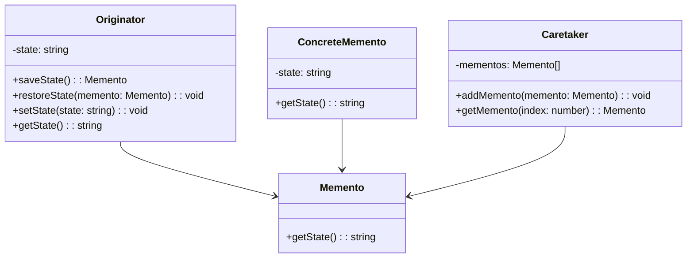

## 5.6.3 Implementation in TypeScript

In this section, we will delve into implementing the Memento Pattern using TypeScript, a powerful superset of JavaScript that provides static typing and other features to enhance code quality and maintainability. The Memento Pattern is a behavioral design pattern that allows an object to capture its internal state and restore it later without exposing its implementation details. This pattern is particularly useful for implementing undo mechanisms and state management in applications.

### Understanding the Memento Pattern

Before we jump into the TypeScript implementation, let's briefly recap the key components of the Memento Pattern:

1. **Originator**: The object whose state needs to be saved and restored.
2. **Memento**: A representation of the Originator's state at a particular point in time.
3. **Caretaker**: Manages the Memento's lifecycle, including saving and restoring the Originator's state.

### Implementing the Memento Pattern in TypeScript

TypeScript's static typing and access modifiers enhance the implementation of the Memento Pattern by ensuring type safety and encapsulation. Let's explore how we can define interfaces and classes for each component of the pattern.

#### Defining the Interfaces

First, we'll define interfaces for the Originator and Memento. These interfaces will specify the methods required for saving and restoring state.

```typescript
// Memento interface
interface Memento {
  getState(): string;
}

// Originator interface
interface Originator {
  saveState(): Memento;
  restoreState(memento: Memento): void;
}
```

#### Implementing the Originator Class

The Originator class will implement the `Originator` interface. It will have a private state and methods to save and restore this state using Mementos.

```typescript
class ConcreteOriginator implements Originator {
  private state: string;

  constructor(state: string) {
    this.state = state;
  }

  public saveState(): Memento {
    return new ConcreteMemento(this.state);
  }

  public restoreState(memento: Memento): void {
    this.state = memento.getState();
  }

  public setState(state: string): void {
    this.state = state;
  }

  public getState(): string {
    return this.state;
  }
}
```

#### Implementing the Memento Class

The Memento class will implement the `Memento` interface. It will store the state of the Originator and provide a method to retrieve it.

```typescript
class ConcreteMemento implements Memento {
  private readonly state: string;

  constructor(state: string) {
    this.state = state;
  }

  public getState(): string {
    return this.state;
  }
}
```

#### Implementing the Caretaker Class

The Caretaker class will manage the Mementos. It will store a list of Mementos and provide methods to save and restore the Originator's state.

```typescript
class Caretaker {
  private mementos: Memento[] = [];

  public addMemento(memento: Memento): void {
    this.mementos.push(memento);
  }

  public getMemento(index: number): Memento {
    return this.mementos[index];
  }
}
```

### TypeScript's Role in Enforcing Encapsulation and Data Integrity

TypeScript's access modifiers (`private`, `protected`, `public`, and `readonly`) play a crucial role in enforcing encapsulation and data integrity in the Memento Pattern.

- **Encapsulation**: By using `private` and `readonly` access modifiers, we ensure that the internal state of the Originator and Memento is not accessible from outside the class. This prevents unauthorized modifications and maintains the integrity of the object's state.

- **Type Safety**: TypeScript's static typing ensures that only valid Mementos are passed to the `restoreState` method, reducing runtime errors and enhancing code reliability.

- **Readability and Maintainability**: Type annotations and interfaces make the code more readable and maintainable by clearly defining the expected behavior and structure of each component.

### Benefits of TypeScript Over JavaScript

While JavaScript is a versatile language, TypeScript provides several advantages when implementing design patterns like the Memento Pattern:

1. **Static Typing**: TypeScript's static typing helps catch errors at compile time, reducing the likelihood of runtime errors and improving code quality.

2. **Improved Tooling**: TypeScript's integration with modern IDEs offers enhanced code completion, refactoring tools, and error checking, making development more efficient.

3. **Access Modifiers**: TypeScript's access modifiers allow for better encapsulation and control over the visibility of class members, which is crucial for implementing patterns that rely on data hiding.

4. **Interfaces and Generics**: TypeScript's support for interfaces and generics enables more flexible and reusable code, allowing developers to define clear contracts and create type-safe abstractions.

### Visualizing the Memento Pattern in TypeScript

To better understand the flow of the Memento Pattern in TypeScript, let's visualize the interactions between the Originator, Memento, and Caretaker using a class diagram.



### Try It Yourself

Now that we've covered the implementation of the Memento Pattern in TypeScript, let's encourage you to experiment with the code. Here are a few suggestions:

1. **Modify the State**: Try changing the state of the Originator and observe how the Caretaker manages the Mementos.

2. **Add More Functionality**: Implement additional methods in the Caretaker to manage Mementos, such as removing or listing all saved states.

3. **Enhance Type Safety**: Introduce generics to the Memento interface to support different types of state.

### Knowledge Check

Before we wrap up, let's reinforce what we've learned with a few questions:

- What are the key components of the Memento Pattern?
- How does TypeScript enhance the implementation of the Memento Pattern?
- What role do access modifiers play in the Memento Pattern?

### Conclusion

Implementing the Memento Pattern in TypeScript provides several benefits, including type safety, encapsulation, and improved code maintainability. By leveraging TypeScript's features, we can create robust and reliable applications that effectively manage state changes and undo operations.

Remember, this is just the beginning. As you progress, you'll build more complex and interactive applications. Keep experimenting, stay curious, and enjoy the journey!

## Quiz Time!



### What is the primary purpose of the Memento Pattern?

- [x] To capture and restore an object's internal state without exposing its implementation details.
- [ ] To manage object creation mechanisms.
- [ ] To define a family of algorithms.
- [ ] To allow incompatible interfaces to work together.

> **Explanation:** The Memento Pattern is used to capture and restore an object's internal state without exposing its implementation details, which is crucial for implementing undo mechanisms.

### Which component of the Memento Pattern is responsible for managing the lifecycle of Mementos?

- [ ] Originator
- [x] Caretaker
- [ ] Memento
- [ ] Observer

> **Explanation:** The Caretaker is responsible for managing the lifecycle of Mementos, including saving and restoring the Originator's state.

### How does TypeScript enhance the implementation of the Memento Pattern?

- [x] By providing static typing and access modifiers for better encapsulation and type safety.
- [ ] By allowing dynamic typing and runtime error checking.
- [ ] By enabling the use of global variables.
- [ ] By simplifying asynchronous programming.

> **Explanation:** TypeScript enhances the implementation of the Memento Pattern by providing static typing and access modifiers, which improve encapsulation and type safety.

### What access modifier in TypeScript is used to prevent unauthorized modifications to a class member?

- [ ] public
- [x] private
- [ ] protected
- [ ] static

> **Explanation:** The `private` access modifier is used to prevent unauthorized modifications to a class member, ensuring encapsulation and data integrity.

### In the Memento Pattern, what does the Originator class do?

- [x] It saves and restores its state using Mementos.
- [ ] It manages the lifecycle of Mementos.
- [ ] It provides an interface for creating families of related objects.
- [ ] It allows incompatible interfaces to work together.

> **Explanation:** The Originator class saves and restores its state using Mementos, which are managed by the Caretaker.

### What is a key benefit of using TypeScript over JavaScript for implementing design patterns?

- [x] Static typing reduces runtime errors and improves code quality.
- [ ] Dynamic typing allows for more flexible code.
- [ ] It simplifies the use of global variables.
- [ ] It automatically optimizes code performance.

> **Explanation:** TypeScript's static typing helps catch errors at compile time, reducing runtime errors and improving code quality, which is a key benefit over JavaScript.

### What role do interfaces play in TypeScript's implementation of the Memento Pattern?

- [x] They define clear contracts and expected behavior for each component.
- [ ] They allow for dynamic typing and runtime error checking.
- [ ] They simplify the use of global variables.
- [ ] They automatically optimize code performance.

> **Explanation:** Interfaces in TypeScript define clear contracts and expected behavior for each component, enhancing code readability and maintainability.

### Which TypeScript feature allows for better encapsulation and control over class member visibility?

- [ ] Static typing
- [x] Access modifiers
- [ ] Dynamic typing
- [ ] Global variables

> **Explanation:** Access modifiers in TypeScript allow for better encapsulation and control over class member visibility, which is crucial for implementing patterns that rely on data hiding.

### What is the role of the Memento class in the Memento Pattern?

- [x] To store the state of the Originator and provide a method to retrieve it.
- [ ] To manage the lifecycle of Mementos.
- [ ] To define a family of algorithms.
- [ ] To allow incompatible interfaces to work together.

> **Explanation:** The Memento class stores the state of the Originator and provides a method to retrieve it, which is essential for restoring the Originator's state.

### True or False: TypeScript's static typing can help catch errors at runtime.

- [ ] True
- [x] False

> **Explanation:** False. TypeScript's static typing helps catch errors at compile time, not runtime, reducing the likelihood of runtime errors.


