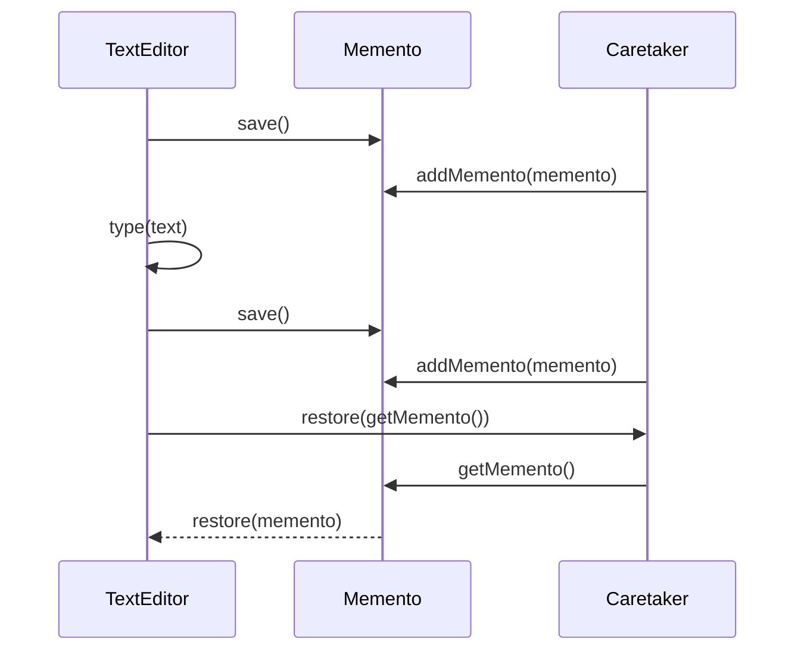

## 5.6.4 Use Cases and Examples

In this section, we will delve into the practical applications of the Memento Pattern in JavaScript and TypeScript. The Memento Pattern is a behavioral design pattern that allows an object's state to be saved and restored without exposing its implementation details. This pattern is particularly useful in scenarios where undo/redo functionality is required, such as in text editors or graphic applications. We will explore these use cases, provide code examples, and discuss considerations for memory management and performance.

### Understanding the Memento Pattern

Before diving into use cases, let's briefly recap the Memento Pattern's core components:

- **Originator**: The object whose state needs to be saved and restored.
- **Memento**: A representation of the saved state. It stores the internal state of the Originator.
- **Caretaker**: Manages the Memento's lifecycle, including saving and restoring states.

### Use Case 1: Implementing Undo/Redo Functionality

One of the most common applications of the Memento Pattern is implementing undo/redo functionality. This feature is crucial in applications where users need to revert changes, such as text editors, graphic design tools, or even complex data entry forms.

#### Example: Text Editor

Consider a simple text editor where users can type, delete, and undo their actions. Here's how we can implement the Memento Pattern in this scenario:

```typescript
// Originator
class TextEditor {
  private content: string = '';

  // Method to type text
  type(text: string): void {
    this.content += text;
  }

  // Method to save the current state
  save(): Memento {
    return new Memento(this.content);
  }

  // Method to restore a saved state
  restore(memento: Memento): void {
    this.content = memento.getContent();
  }

  // Method to get the current content
  getContent(): string {
    return this.content;
  }
}

// Memento
class Memento {
  constructor(private readonly content: string) {}

  // Method to get the saved content
  getContent(): string {
    return this.content;
  }
}

// Caretaker
class Caretaker {
  private mementos: Memento[] = [];

  // Method to add a memento
  addMemento(memento: Memento): void {
    this.mementos.push(memento);
  }

  // Method to get the last memento
  getMemento(): Memento | undefined {
    return this.mementos.pop();
  }
}

// Usage
const editor = new TextEditor();
const caretaker = new Caretaker();

editor.type('Hello, ');
caretaker.addMemento(editor.save());

editor.type('World!');
caretaker.addMemento(editor.save());

console.log(editor.getContent()); // Output: Hello, World!

// Undo
editor.restore(caretaker.getMemento()!);
console.log(editor.getContent()); // Output: Hello, 

// Undo
editor.restore(caretaker.getMemento()!);
console.log(editor.getContent()); // Output: 
```

In this example, the `TextEditor` class acts as the Originator, saving its state using the `Memento` class. The `Caretaker` manages the history of states, allowing the editor to undo actions.

### Considerations for Memory Management and Performance

When implementing the Memento Pattern, it's essential to consider memory usage, especially when dealing with large or complex states. Each saved state consumes memory, which can lead to performance issues if not managed properly.

#### Strategies for Efficient Memory Management

1. **Limit the Number of Mementos**: Implement a maximum limit for stored mementos to prevent excessive memory usage. For example, keep only the last 10 states.

2. **Use Incremental Changes**: Instead of saving the entire state, store only the changes. This approach reduces memory consumption significantly.

3. **Compression**: Compress the state data before saving it as a memento. This technique is particularly useful for large data sets.

4. **Garbage Collection**: Regularly clean up unused mementos to free up memory. This can be done by removing mementos that are no longer needed after a certain point.

### Handling Complex States or Large Amounts of Data

When dealing with complex states or large data, the Memento Pattern can become challenging. Here are some tips to handle such scenarios:

- **Divide and Conquer**: Break down the state into smaller, manageable parts. Save and restore these parts separately to simplify the process.

- **Use Serialization**: Serialize the state into a format that can be easily saved and restored. JSON is a common choice for serialization in JavaScript and TypeScript.

- **Leverage External Storage**: For very large states, consider using external storage solutions like databases or files to store mementos. This approach offloads memory usage from the application.

### Integrating the Memento Pattern with Other Patterns

The Memento Pattern can be effectively combined with other design patterns to enhance functionality and maintainability. Here are a few examples:

#### Memento and Command Pattern

The Command Pattern encapsulates a request as an object, allowing for parameterization and queuing of requests. By integrating the Memento Pattern, you can add undo/redo functionality to command-based systems.

```typescript
// Command interface
interface Command {
  execute(): void;
  undo(): void;
}

// Concrete Command
class AddTextCommand implements Command {
  private backup: Memento | null = null;

  constructor(private editor: TextEditor, private text: string) {}

  execute(): void {
    this.backup = this.editor.save();
    this.editor.type(this.text);
  }

  undo(): void {
    if (this.backup) {
      this.editor.restore(this.backup);
    }
  }
}

// Usage
const editor = new TextEditor();
const caretaker = new Caretaker();
const addTextCommand = new AddTextCommand(editor, 'Hello, World!');

addTextCommand.execute();
console.log(editor.getContent()); // Output: Hello, World!

addTextCommand.undo();
console.log(editor.getContent()); // Output: 
```

In this example, the `AddTextCommand` class uses the Memento Pattern to save the editor's state before executing the command, allowing it to undo the action if necessary.

#### Memento and Observer Pattern

The Observer Pattern defines a one-to-many dependency between objects, allowing observers to be notified of changes in the subject. By combining it with the Memento Pattern, you can notify observers of state changes and provide the ability to revert to previous states.

```typescript
// Observer interface
interface Observer {
  update(memento: Memento): void;
}

// Concrete Observer
class Logger implements Observer {
  update(memento: Memento): void {
    console.log('State changed:', memento.getContent());
  }
}

// Usage
const editor = new TextEditor();
const logger = new Logger();

editor.type('Hello, ');
const memento = editor.save();
logger.update(memento);

editor.type('World!');
const newMemento = editor.save();
logger.update(newMemento);
```

In this example, the `Logger` class observes changes in the `TextEditor` and logs the state whenever it changes. This integration provides a robust mechanism for tracking state changes and reverting them if needed.

### Try It Yourself

Now that we've explored various use cases and integrations of the Memento Pattern, it's time to experiment with the code. Here are a few suggestions:

- **Modify the Text Editor**: Add more features to the text editor, such as cut, copy, and paste operations. Implement undo/redo functionality for these actions using the Memento Pattern.

- **Optimize Memory Usage**: Implement a mechanism to limit the number of stored mementos. Experiment with different strategies to manage memory efficiently.

- **Combine with Other Patterns**: Try integrating the Memento Pattern with other design patterns, such as the Strategy Pattern, to enhance functionality.

### Visualizing the Memento Pattern

To better understand the flow of the Memento Pattern, let's visualize the interactions between its components using a sequence diagram:



This diagram illustrates the sequence of interactions between the `TextEditor`, `Memento`, and `Caretaker` components during the save and restore operations.

### Conclusion

The Memento Pattern is a powerful tool for managing object states, particularly in applications requiring undo/redo functionality. By understanding its use cases, memory management considerations, and integration with other patterns, you can effectively implement this pattern in your projects. Remember, this is just the beginning. As you progress, you'll discover more ways to leverage the Memento Pattern to create robust and maintainable applications. Keep experimenting, stay curious, and enjoy the journey!

## Quiz Time!



### What is the primary purpose of the Memento Pattern?

- [x] To save and restore an object's state without exposing its implementation details.
- [ ] To manage object creation.
- [ ] To define a one-to-many dependency between objects.
- [ ] To encapsulate a request as an object.

> **Explanation:** The Memento Pattern is designed to save and restore an object's state without exposing its implementation details.

### Which component of the Memento Pattern is responsible for managing the lifecycle of mementos?

- [ ] Originator
- [x] Caretaker
- [ ] Memento
- [ ] Observer

> **Explanation:** The Caretaker is responsible for managing the lifecycle of mementos, including saving and restoring states.

### In the context of the Memento Pattern, what is a common use case?

- [ ] Implementing a factory for object creation.
- [x] Implementing undo/redo functionality.
- [ ] Managing a collection of objects.
- [ ] Defining a family of algorithms.

> **Explanation:** A common use case for the Memento Pattern is implementing undo/redo functionality in applications like text editors.

### How can memory usage be optimized when using the Memento Pattern?

- [x] By limiting the number of stored mementos.
- [ ] By storing mementos in a global variable.
- [ ] By using a single memento for all states.
- [ ] By avoiding the use of mementos altogether.

> **Explanation:** Limiting the number of stored mementos is a strategy to optimize memory usage when using the Memento Pattern.

### Which design pattern can be combined with the Memento Pattern to add undo/redo functionality to command-based systems?

- [ ] Observer Pattern
- [x] Command Pattern
- [ ] Strategy Pattern
- [ ] Singleton Pattern

> **Explanation:** The Command Pattern can be combined with the Memento Pattern to add undo/redo functionality to command-based systems.

### What is a potential challenge when handling complex states with the Memento Pattern?

- [ ] Exposing the object's implementation details.
- [x] Managing large amounts of data efficiently.
- [ ] Defining a one-to-many dependency.
- [ ] Encapsulating requests as objects.

> **Explanation:** Managing large amounts of data efficiently is a potential challenge when handling complex states with the Memento Pattern.

### How can the Memento Pattern be integrated with the Observer Pattern?

- [ ] By using mementos to create observers.
- [x] By notifying observers of state changes and providing the ability to revert to previous states.
- [ ] By using observers to manage memento lifecycles.
- [ ] By encapsulating observer requests as mementos.

> **Explanation:** The Memento Pattern can be integrated with the Observer Pattern by notifying observers of state changes and providing the ability to revert to previous states.

### What is a benefit of using serialization with the Memento Pattern?

- [x] It allows for easy saving and restoring of states.
- [ ] It reduces the number of mementos needed.
- [ ] It eliminates the need for a Caretaker.
- [ ] It simplifies the implementation of the Originator.

> **Explanation:** Serialization allows for easy saving and restoring of states, making it beneficial when using the Memento Pattern.

### True or False: The Memento Pattern can only be used in text editors.

- [ ] True
- [x] False

> **Explanation:** False. The Memento Pattern can be used in various applications, not just text editors, wherever state management is needed.

### Which of the following is NOT a strategy for efficient memory management with the Memento Pattern?

- [ ] Limiting the number of mementos.
- [ ] Using incremental changes.
- [ ] Compressing state data.
- [x] Storing all states in a single memento.

> **Explanation:** Storing all states in a single memento is not a strategy for efficient memory management with the Memento Pattern.




