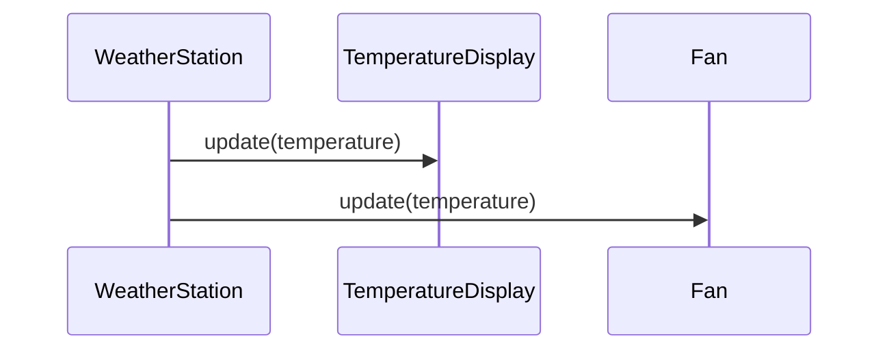

## 5.7.1 Intent and Motivation

The Observer Pattern is a fundamental design pattern in software development that facilitates a one-to-many relationship between objects. This pattern is particularly useful in scenarios where changes in one object, known as the Subject, need to be communicated to a set of dependent objects, called Observers. This communication ensures that all Observers remain consistent with the Subject's state. In this section, we'll delve into the intent and motivation behind the Observer Pattern, using real-world analogies and code examples to illustrate its application in JavaScript and TypeScript.

### Understanding the Observer Pattern

The core intent of the Observer Pattern is to define a dependency between objects such that when one object changes its state, all dependent objects are automatically notified and updated. This pattern is crucial for maintaining consistency across related objects without tightly coupling them.

#### Real-World Analogy: Newspaper Subscription

To better understand the Observer Pattern, let's consider a real-world analogy: a newspaper subscription service. In this scenario, the newspaper publisher is the Subject, and the subscribers are the Observers. Whenever a new edition of the newspaper is published, the publisher notifies all subscribers, who then receive their copies. This analogy highlights the key aspects of the Observer Pattern:

- **Subject**: The newspaper publisher, responsible for notifying subscribers of new editions.
- **Observers**: The subscribers, who are interested in receiving updates from the publisher.
- **Notification Mechanism**: The process through which the publisher informs subscribers of new editions.

This analogy illustrates how the Observer Pattern facilitates communication between the Subject and its Observers, ensuring that all parties remain informed and up-to-date.

### Problem: Maintaining Consistency Across Related Objects

In software development, maintaining consistency across related objects can be challenging, especially when these objects are tightly coupled. Tight coupling occurs when objects are directly dependent on each other's implementation details, making the system difficult to maintain and extend. The Observer Pattern addresses this problem by promoting loose coupling between the Subject and its Observers.

#### Loose Coupling Benefits

Loose coupling is a design principle that reduces dependencies between components, making the system more flexible and easier to maintain. The Observer Pattern achieves loose coupling by defining a clear interface for communication between the Subject and its Observers. This interface allows the Subject to notify Observers of changes without needing to know their implementation details.

### Implementing the Observer Pattern in JavaScript

Let's explore how to implement the Observer Pattern in JavaScript. We'll create a simple example involving a weather station (Subject) and various display devices (Observers) that need to be updated whenever the weather changes.

```javascript
// Subject: WeatherStation
class WeatherStation {
  constructor() {
    this.observers = [];
    this.temperature = 0;
  }

  // Add an observer
  addObserver(observer) {
    this.observers.push(observer);
  }

  // Remove an observer
  removeObserver(observer) {
    this.observers = this.observers.filter(obs => obs !== observer);
  }

  // Notify all observers
  notifyObservers() {
    this.observers.forEach(observer => observer.update(this.temperature));
  }

  // Set new temperature and notify observers
  setTemperature(temp) {
    console.log(`WeatherStation: new temperature measurement: ${temp}`);
    this.temperature = temp;
    this.notifyObservers();
  }
}

// Observer: TemperatureDisplay
class TemperatureDisplay {
  update(temperature) {
    console.log(`TemperatureDisplay: I need to update my display to ${temperature}`);
  }
}

// Observer: Fan
class Fan {
  update(temperature) {
    if (temperature > 25) {
      console.log('Fan: It\'s hot here, turning myself on...');
    } else {
      console.log('Fan: It\'s nice and cool, turning myself off...');
    }
  }
}

// Usage
const weatherStation = new WeatherStation();
const tempDisplay = new TemperatureDisplay();
const fan = new Fan();

weatherStation.addObserver(tempDisplay);
weatherStation.addObserver(fan);

// Simulate new temperature readings
weatherStation.setTemperature(20);
weatherStation.setTemperature(30);
```

#### Explanation of the Code

- **WeatherStation (Subject)**: Manages a list of Observers and notifies them of changes. It provides methods to add and remove Observers and a method to notify all Observers of a state change.
- **TemperatureDisplay and Fan (Observers)**: Implement the `update` method to receive notifications from the Subject. Each Observer reacts differently to the temperature change.
- **Usage**: We create instances of the Subject and Observers, add the Observers to the Subject, and simulate temperature changes to see how Observers react.

### Implementing the Observer Pattern in TypeScript

TypeScript enhances the Observer Pattern with strong typing, ensuring that the communication between the Subject and Observers is type-safe.

```typescript
// Observer interface
interface Observer {
  update(temperature: number): void;
}

// Subject interface
interface Subject {
  addObserver(observer: Observer): void;
  removeObserver(observer: Observer): void;
  notifyObservers(): void;
}

// Subject: WeatherStation
class WeatherStation implements Subject {
  private observers: Observer[] = [];
  private temperature: number = 0;

  addObserver(observer: Observer): void {
    this.observers.push(observer);
  }

  removeObserver(observer: Observer): void {
    this.observers = this.observers.filter(obs => obs !== observer);
  }

  notifyObservers(): void {
    this.observers.forEach(observer => observer.update(this.temperature));
  }

  setTemperature(temp: number): void {
    console.log(`WeatherStation: new temperature measurement: ${temp}`);
    this.temperature = temp;
    this.notifyObservers();
  }
}

// Observer: TemperatureDisplay
class TemperatureDisplay implements Observer {
  update(temperature: number): void {
    console.log(`TemperatureDisplay: I need to update my display to ${temperature}`);
  }
}

// Observer: Fan
class Fan implements Observer {
  update(temperature: number): void {
    if (temperature > 25) {
      console.log('Fan: It\'s hot here, turning myself on...');
    } else {
      console.log('Fan: It\'s nice and cool, turning myself off...');
    }
  }
}

// Usage
const weatherStation = new WeatherStation();
const tempDisplay = new TemperatureDisplay();
const fan = new Fan();

weatherStation.addObserver(tempDisplay);
weatherStation.addObserver(fan);

weatherStation.setTemperature(20);
weatherStation.setTemperature(30);
```

#### Explanation of the TypeScript Code

- **Interfaces**: We define `Observer` and `Subject` interfaces to enforce a contract for Observers and Subjects.
- **Type Safety**: TypeScript ensures that only objects implementing the `Observer` interface can be added to the `WeatherStation`.
- **Strong Typing**: The `setTemperature` method and `update` method are strongly typed, reducing runtime errors.

### Visualizing the Observer Pattern

To better understand the flow of communication in the Observer Pattern, let's visualize the interaction between the Subject and Observers using a sequence diagram.



#### Diagram Explanation

- **WeatherStation**: Acts as the Subject, notifying its Observers of changes.
- **TemperatureDisplay and Fan**: Represent the Observers, each receiving updates from the WeatherStation.

### Benefits of the Observer Pattern

The Observer Pattern offers several benefits, making it a valuable tool in software design:

- **Decoupling**: The pattern decouples the Subject from its Observers, allowing them to evolve independently.
- **Flexibility**: New Observers can be added without modifying the Subject, enhancing the system's flexibility.
- **Reusability**: Observers can be reused across different Subjects, promoting code reuse.
- **Scalability**: The pattern supports a dynamic number of Observers, making it scalable for large systems.

### Try It Yourself

Now that we've explored the Observer Pattern, let's encourage you to experiment with the code examples. Try modifying the code to add new Observers or change the notification mechanism. For instance, you could create a new Observer that logs temperature changes to a file or sends alerts via email.

### References and Further Reading

- [MDN Web Docs: Observer Pattern](https://developer.mozilla.org/en-US/docs/Web/JavaScript/Guide/Design_Patterns/Observer_Pattern)
- [W3Schools: JavaScript Design Patterns](https://www.w3schools.com/js/js_design_patterns.asp)

### Knowledge Check

Before we conclude, let's reinforce your understanding of the Observer Pattern with a few questions:

1. What is the primary intent of the Observer Pattern?
2. How does the Observer Pattern promote loose coupling?
3. Can you think of other real-world scenarios where the Observer Pattern might be useful?

### Embrace the Journey

Remember, mastering design patterns like the Observer Pattern is a journey. As you continue to explore and experiment, you'll gain a deeper understanding of how these patterns can enhance your software design. Keep experimenting, stay curious, and enjoy the journey!

## Quiz Time!



### What is the primary intent of the Observer Pattern?

- [x] To define a one-to-many dependency between objects so that when one object changes state, all its dependents are notified and updated automatically.
- [ ] To create a single instance of a class.
- [ ] To encapsulate a request as an object.
- [ ] To provide a simplified interface to a complex subsystem.

> **Explanation:** The Observer Pattern is designed to establish a one-to-many dependency between objects, ensuring that changes in one object are communicated to all dependent objects.

### Which of the following best describes the relationship between the Subject and Observers in the Observer Pattern?

- [x] Loose coupling
- [ ] Tight coupling
- [ ] No coupling
- [ ] Bidirectional coupling

> **Explanation:** The Observer Pattern promotes loose coupling between the Subject and Observers, allowing them to evolve independently.

### In the Observer Pattern, what role does the Subject play?

- [x] It manages a list of Observers and notifies them of changes.
- [ ] It receives updates from Observers.
- [ ] It encapsulates a request as an object.
- [ ] It provides a simplified interface to a complex subsystem.

> **Explanation:** The Subject is responsible for managing Observers and notifying them of any changes in its state.

### What is a real-world analogy for the Observer Pattern?

- [x] Newspaper subscription service
- [ ] Factory production line
- [ ] Restaurant menu
- [ ] Library book catalog

> **Explanation:** A newspaper subscription service is a classic analogy for the Observer Pattern, where the publisher (Subject) notifies subscribers (Observers) of new editions.

### How does the Observer Pattern enhance system flexibility?

- [x] By allowing new Observers to be added without modifying the Subject.
- [ ] By creating a single instance of a class.
- [ ] By encapsulating a request as an object.
- [ ] By providing a simplified interface to a complex subsystem.

> **Explanation:** The Observer Pattern enhances flexibility by enabling new Observers to be added without altering the Subject's implementation.

### Which of the following is NOT a benefit of the Observer Pattern?

- [ ] Decoupling
- [ ] Flexibility
- [ ] Reusability
- [x] Increased complexity

> **Explanation:** While the Observer Pattern offers many benefits, it can also increase complexity in the system due to the need to manage multiple Observers.

### How does TypeScript enhance the Observer Pattern?

- [x] By providing strong typing and ensuring type safety.
- [ ] By encapsulating a request as an object.
- [ ] By creating a single instance of a class.
- [ ] By providing a simplified interface to a complex subsystem.

> **Explanation:** TypeScript enhances the Observer Pattern by ensuring type safety and providing strong typing for Subjects and Observers.

### What is the role of the `update` method in the Observer Pattern?

- [x] It is implemented by Observers to receive notifications from the Subject.
- [ ] It is used by the Subject to notify Observers.
- [ ] It encapsulates a request as an object.
- [ ] It provides a simplified interface to a complex subsystem.

> **Explanation:** The `update` method is implemented by Observers to receive and handle notifications from the Subject.

### In the Observer Pattern, what happens when the Subject changes state?

- [x] All Observers are notified and updated automatically.
- [ ] The Subject creates a single instance of a class.
- [ ] The Subject encapsulates a request as an object.
- [ ] The Subject provides a simplified interface to a complex subsystem.

> **Explanation:** When the Subject changes state, it automatically notifies all Observers, ensuring they are updated with the latest information.

### True or False: The Observer Pattern is only applicable in graphical user interfaces.

- [ ] True
- [x] False

> **Explanation:** False. The Observer Pattern is applicable in various domains, including event handling, data binding, and more, not just graphical user interfaces.


