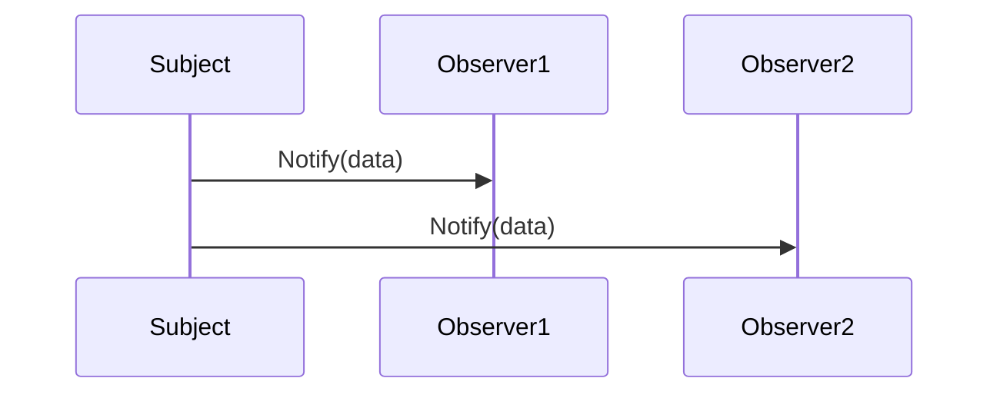

## 5.7.2 Observer Pattern Implementation in JavaScript

The Observer Pattern is a fundamental design pattern used to create a subscription mechanism that allows multiple objects, known as observers, to listen to and react to events or changes in another object, known as the subject. This pattern is particularly useful in scenarios where a change in one object requires updates to other objects, such as in event handling and state change notifications.

### Understanding the Observer Pattern

Before diving into the implementation, let's break down the core components of the Observer Pattern:

- **Subject**: This is the core object that maintains a list of observers and notifies them of any state changes.
- **Observer**: These are the objects that need to be notified when the subject's state changes.

The Observer Pattern is widely used in JavaScript, especially in frameworks and libraries that deal with event-driven architectures, such as React, Angular, and Node.js.

### Implementing the Observer Pattern in JavaScript

Let's explore how to implement the Observer Pattern in JavaScript by defining Subject and Observer objects and demonstrating how observers subscribe to subjects and receive updates.

#### Step 1: Define the Subject

The Subject is responsible for maintaining a list of observers and notifying them of any changes. Here's a basic implementation:

```javascript
class Subject {
  constructor() {
    this.observers = []; // Array to hold observer functions
  }

  // Method to add an observer
  addObserver(observer) {
    this.observers.push(observer);
  }

  // Method to remove an observer
  removeObserver(observer) {
    this.observers = this.observers.filter(obs => obs !== observer);
  }

  // Method to notify all observers
  notifyObservers(data) {
    this.observers.forEach(observer => observer(data));
  }
}
```

In this implementation, the `Subject` class maintains an array of observers and provides methods to add, remove, and notify observers.

#### Step 2: Define the Observer

Observers are functions or objects that need to be notified of changes. Here's a simple observer function:

```javascript
function observer1(data) {
  console.log(`Observer 1 received data: ${data}`);
}

function observer2(data) {
  console.log(`Observer 2 received data: ${data}`);
}
```

These functions will be called whenever the subject's state changes.

#### Step 3: Subscribing Observers to the Subject

Now, let's see how observers can subscribe to the subject and receive updates:

```javascript
// Create a subject
const subject = new Subject();

// Add observers
subject.addObserver(observer1);
subject.addObserver(observer2);

// Notify observers with some data
subject.notifyObservers('Hello, Observers!');
```

When `notifyObservers` is called, each observer function is executed with the provided data.

#### Step 4: Managing Multiple Observers

The Observer Pattern allows for multiple observers to be managed efficiently. Observers can be added or removed dynamically, and the subject can notify all observers simultaneously.

Here's how you can remove an observer:

```javascript
// Remove observer1
subject.removeObserver(observer1);

// Notify remaining observers
subject.notifyObservers('Observer 1 has been removed');
```

In this example, `observer1` is removed from the list of observers, and only `observer2` will receive the notification.

### Advanced Implementation with Event Emitters

JavaScript's built-in `EventEmitter` class, available in Node.js, provides a more advanced and efficient way to implement the Observer Pattern. Here's how you can use it:

```javascript
const EventEmitter = require('events');

class Subject extends EventEmitter {}

const subject = new Subject();

// Define observers
subject.on('event', data => {
  console.log(`Observer 1 received: ${data}`);
});

subject.on('event', data => {
  console.log(`Observer 2 received: ${data}`);
});

// Emit an event
subject.emit('event', 'Hello from EventEmitter!');
```

In this implementation, the `Subject` class extends `EventEmitter`, allowing it to manage events and listeners efficiently.

### Avoiding Memory Leaks

One potential issue with the Observer Pattern is memory leaks, which can occur if observers are not properly removed. To avoid this, ensure that observers are removed when they are no longer needed.

Here's how you can handle this with `EventEmitter`:

```javascript
// Remove a specific listener
subject.off('event', observer1);

// Remove all listeners for an event
subject.removeAllListeners('event');
```

By managing listeners carefully, you can prevent memory leaks and ensure efficient resource usage.

### Visualizing the Observer Pattern

To better understand the flow of the Observer Pattern, let's visualize the interaction between the subject and observers:



This diagram illustrates how the subject notifies each observer when an event occurs.

### Try It Yourself

To deepen your understanding, try modifying the code examples:

- Add more observers and see how they interact with the subject.
- Implement a custom event system without using `EventEmitter`.
- Experiment with different data types and structures for notifications.

### Knowledge Check

- What is the primary purpose of the Observer Pattern?
- How can you prevent memory leaks when using the Observer Pattern?
- What are some real-world applications of the Observer Pattern in JavaScript?

### Conclusion

The Observer Pattern is a powerful tool for managing event-driven architectures in JavaScript. By implementing subjects and observers, you can create flexible and scalable systems that respond to changes efficiently. Remember to manage observers carefully to avoid memory leaks and ensure optimal performance.

## Quiz Time!



### What is the primary role of the Subject in the Observer Pattern?

- [x] To maintain a list of observers and notify them of changes.
- [ ] To execute business logic.
- [ ] To handle user input.
- [ ] To manage database connections.

> **Explanation:** The Subject is responsible for maintaining a list of observers and notifying them of any changes in its state.

### How can you prevent memory leaks in the Observer Pattern?

- [x] By removing observers when they are no longer needed.
- [ ] By using global variables.
- [ ] By increasing the number of observers.
- [ ] By using synchronous code.

> **Explanation:** Memory leaks can be prevented by ensuring that observers are removed when they are no longer needed, thus freeing up resources.

### Which JavaScript feature can be used to implement the Observer Pattern efficiently?

- [x] EventEmitter
- [ ] Promises
- [ ] Callbacks
- [ ] Local Storage

> **Explanation:** The EventEmitter class in Node.js provides an efficient way to implement the Observer Pattern by managing events and listeners.

### What is a potential drawback of the Observer Pattern?

- [x] Memory leaks if observers are not properly managed.
- [ ] It cannot handle asynchronous operations.
- [ ] It is not suitable for web applications.
- [ ] It requires a database connection.

> **Explanation:** A potential drawback of the Observer Pattern is the risk of memory leaks if observers are not properly removed when they are no longer needed.

### In the Observer Pattern, what is the role of the Observer?

- [x] To receive notifications from the subject.
- [ ] To modify the subject's state.
- [ ] To manage the subject's lifecycle.
- [ ] To handle network requests.

> **Explanation:** Observers are responsible for receiving notifications from the subject and reacting to changes.

### What is a common use case for the Observer Pattern in JavaScript?

- [x] Event handling
- [ ] Database management
- [ ] File I/O operations
- [ ] Image processing

> **Explanation:** The Observer Pattern is commonly used in JavaScript for event handling, allowing objects to respond to events or state changes.

### How can you remove a specific listener in an EventEmitter?

- [x] Using the `off` method.
- [ ] Using the `addListener` method.
- [ ] Using the `emit` method.
- [ ] Using the `create` method.

> **Explanation:** The `off` method is used to remove a specific listener from an EventEmitter.

### What is the benefit of using the Observer Pattern?

- [x] It allows for a decoupled design where subjects and observers can interact without being tightly bound.
- [ ] It simplifies database queries.
- [ ] It enhances image rendering.
- [ ] It speeds up network requests.

> **Explanation:** The Observer Pattern allows for a decoupled design, enabling subjects and observers to interact without being tightly bound, which enhances flexibility and scalability.

### Which method is used to notify all observers in the basic implementation of the Observer Pattern?

- [x] notifyObservers
- [ ] addObserver
- [ ] removeObserver
- [ ] updateObservers

> **Explanation:** The `notifyObservers` method is used to notify all observers of a change in the subject's state.

### True or False: The Observer Pattern is only useful in server-side JavaScript applications.

- [ ] True
- [x] False

> **Explanation:** False. The Observer Pattern is useful in both client-side and server-side JavaScript applications, particularly in event-driven architectures.



Remember, this is just the beginning. As you progress, you'll build more complex and interactive systems using the Observer Pattern. Keep experimenting, stay curious, and enjoy the journey!
