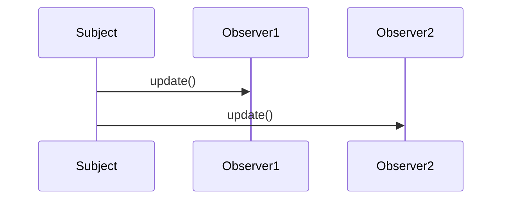

## 5.7.3 Implementation in TypeScript

In this section, we will delve into the implementation of the Observer Pattern in TypeScript. The Observer Pattern is a behavioral design pattern that establishes a one-to-many relationship between objects, allowing a single object (the subject) to notify multiple observer objects about changes in its state. This pattern is particularly useful in scenarios where an object needs to broadcast updates to other objects without being tightly coupled to them.

### Understanding the Observer Pattern

Before we dive into the TypeScript implementation, let's briefly recap the core components of the Observer Pattern:

- **Subject**: The subject maintains a list of observers and provides methods for adding, removing, and notifying observers.
- **Observer**: The observer defines an interface for objects that should be notified of changes in the subject.
- **Concrete Subject**: A concrete implementation of the subject, which stores the state of interest to observers.
- **Concrete Observer**: A concrete implementation of the observer, which reacts to changes in the subject's state.

### Implementing the Observer Pattern in TypeScript

TypeScript, with its strong typing and interface capabilities, offers a robust environment for implementing the Observer Pattern. Let's start by defining the interfaces for the Subject and Observer.

#### Defining Interfaces

In TypeScript, interfaces are used to define the structure of an object. They are particularly useful for enforcing a contract that classes must adhere to. Let's define the interfaces for our Subject and Observer:

```typescript
// Observer interface
interface Observer {
    update(subject: Subject): void;
}

// Subject interface
interface Subject {
    attach(observer: Observer): void;
    detach(observer: Observer): void;
    notify(): void;
}
```

In this example, the `Observer` interface declares a single method, `update`, which is called when the subject's state changes. The `Subject` interface provides methods for attaching, detaching, and notifying observers.

#### Implementing the Concrete Subject

Now, let's implement a concrete subject that maintains a list of observers and notifies them of changes:

```typescript
class ConcreteSubject implements Subject {
    private observers: Observer[] = [];
    private state: number;

    public getState(): number {
        return this.state;
    }

    public setState(state: number): void {
        this.state = state;
        this.notify();
    }

    public attach(observer: Observer): void {
        const isExist = this.observers.includes(observer);
        if (isExist) {
            return console.log('Observer has been attached already.');
        }
        this.observers.push(observer);
        console.log('Observer attached.');
    }

    public detach(observer: Observer): void {
        const observerIndex = this.observers.indexOf(observer);
        if (observerIndex === -1) {
            return console.log('Observer not found.');
        }
        this.observers.splice(observerIndex, 1);
        console.log('Observer detached.');
    }

    public notify(): void {
        console.log('Notifying observers...');
        for (const observer of this.observers) {
            observer.update(this);
        }
    }
}
```

In this implementation, the `ConcreteSubject` class maintains a list of observers and a state. When the state changes via the `setState` method, the `notify` method is called to update all attached observers.

#### Implementing the Concrete Observer

Next, let's implement a concrete observer that reacts to changes in the subject's state:

```typescript
class ConcreteObserver implements Observer {
    private name: string;

    constructor(name: string) {
        this.name = name;
    }

    public update(subject: Subject): void {
        if (subject instanceof ConcreteSubject) {
            console.log(`${this.name} received update. New state: ${subject.getState()}`);
        }
    }
}
```

The `ConcreteObserver` class implements the `Observer` interface and defines the `update` method, which logs the new state of the subject.

#### Using the Observer Pattern

Let's see how we can use these classes to create a simple observer pattern implementation:

```typescript
const subject = new ConcreteSubject();

const observer1 = new ConcreteObserver('Observer 1');
const observer2 = new ConcreteObserver('Observer 2');

subject.attach(observer1);
subject.attach(observer2);

subject.setState(1);
subject.setState(2);

subject.detach(observer1);

subject.setState(3);
```

In this example, we create a `ConcreteSubject` and two `ConcreteObserver` instances. We attach the observers to the subject, change the subject's state, and observe how the observers react to these changes.

### Advantages of Using TypeScript

TypeScript provides several advantages when implementing design patterns like the Observer Pattern:

1. **Strong Typing**: TypeScript's strong typing helps catch errors at compile time, reducing runtime errors and improving code reliability.
2. **Interfaces**: Interfaces in TypeScript allow you to define clear contracts for your classes, making your code more maintainable and understandable.
3. **Generics**: TypeScript's generics enable you to create reusable and flexible components, which can be particularly useful in design patterns.

#### Using Generics

Let's enhance our Observer Pattern implementation with generics to make it more flexible:

```typescript
interface Observer<T> {
    update(subject: Subject<T>): void;
}

interface Subject<T> {
    attach(observer: Observer<T>): void;
    detach(observer: Observer<T>): void;
    notify(): void;
}

class ConcreteSubject<T> implements Subject<T> {
    private observers: Observer<T>[] = [];
    private state: T;

    public getState(): T {
        return this.state;
    }

    public setState(state: T): void {
        this.state = state;
        this.notify();
    }

    public attach(observer: Observer<T>): void {
        const isExist = this.observers.includes(observer);
        if (isExist) {
            return console.log('Observer has been attached already.');
        }
        this.observers.push(observer);
        console.log('Observer attached.');
    }

    public detach(observer: Observer<T>): void {
        const observerIndex = this.observers.indexOf(observer);
        if (observerIndex === -1) {
            return console.log('Observer not found.');
        }
        this.observers.splice(observerIndex, 1);
        console.log('Observer detached.');
    }

    public notify(): void {
        console.log('Notifying observers...');
        for (const observer of this.observers) {
            observer.update(this);
        }
    }
}

class ConcreteObserver<T> implements Observer<T> {
    private name: string;

    constructor(name: string) {
        this.name = name;
    }

    public update(subject: Subject<T>): void {
        if (subject instanceof ConcreteSubject) {
            console.log(`${this.name} received update. New state: ${subject.getState()}`);
        }
    }
}
```

In this example, we use generics to allow the `ConcreteSubject` and `ConcreteObserver` to work with any type of state, making the pattern more versatile.

### Visualizing the Observer Pattern

To better understand the flow of the Observer Pattern, let's visualize the interaction between the subject and its observers using a sequence diagram.



**Diagram Description**: This sequence diagram illustrates how the `Subject` notifies `Observer1` and `Observer2` by calling their `update` methods.

### Try It Yourself

Now that we've covered the implementation of the Observer Pattern in TypeScript, let's encourage you to experiment with the code. Try the following modifications:

- **Add More Observers**: Create additional observer instances and attach them to the subject. Observe how they react to state changes.
- **Change State Types**: Modify the state type in the `ConcreteSubject` to a different data type, such as a string or an object, and update the observers accordingly.
- **Implement Additional Logic**: Add more complex logic to the `update` method in the `ConcreteObserver` to perform different actions based on the state.

### Knowledge Check

Let's reinforce what we've learned with a few questions:

- What are the core components of the Observer Pattern?
- How does TypeScript's strong typing benefit the implementation of the Observer Pattern?
- What is the advantage of using generics in the Observer Pattern?

### Conclusion

Implementing the Observer Pattern in TypeScript provides a robust and flexible solution for managing one-to-many relationships between objects. TypeScript's strong typing, interfaces, and generics enhance the maintainability and scalability of your code, making it an excellent choice for large-scale applications.

Remember, this is just the beginning. As you progress, you'll build more complex and interactive applications using design patterns. Keep experimenting, stay curious, and enjoy the journey!

## Quiz Time!



### What is the primary role of the Subject in the Observer Pattern?

- [x] To maintain a list of observers and notify them of changes.
- [ ] To update its state based on observer feedback.
- [ ] To act as a mediator between observers.
- [ ] To provide a user interface for observers.

> **Explanation:** The Subject's primary role is to maintain a list of observers and notify them of changes in its state.

### How does TypeScript's strong typing benefit the Observer Pattern implementation?

- [x] It helps catch errors at compile time.
- [ ] It allows dynamic typing of variables.
- [ ] It reduces the need for interfaces.
- [ ] It simplifies the code structure.

> **Explanation:** TypeScript's strong typing helps catch errors at compile time, improving code reliability.

### What is the purpose of using interfaces in TypeScript?

- [x] To define clear contracts for classes.
- [ ] To enable dynamic typing.
- [ ] To replace classes entirely.
- [ ] To simplify function definitions.

> **Explanation:** Interfaces in TypeScript define clear contracts for classes, making code more maintainable and understandable.

### What advantage do generics provide in the Observer Pattern?

- [x] They allow the pattern to work with any type of state.
- [ ] They simplify the implementation of the pattern.
- [ ] They enforce strict typing of state.
- [ ] They reduce the number of required interfaces.

> **Explanation:** Generics allow the Observer Pattern to work with any type of state, making it more versatile.

### Which method in the Subject interface is responsible for notifying observers?

- [x] notify()
- [ ] attach()
- [ ] detach()
- [ ] update()

> **Explanation:** The `notify()` method is responsible for notifying observers of changes in the subject's state.

### What is the role of the update method in the Observer interface?

- [x] To define how observers react to changes in the subject.
- [ ] To change the state of the subject.
- [ ] To attach the observer to the subject.
- [ ] To remove the observer from the subject.

> **Explanation:** The `update` method defines how observers react to changes in the subject's state.

### How can you make the Observer Pattern more flexible in TypeScript?

- [x] By using generics.
- [ ] By using dynamic typing.
- [ ] By removing interfaces.
- [ ] By simplifying the subject class.

> **Explanation:** Using generics makes the Observer Pattern more flexible by allowing it to work with any type of state.

### What is the benefit of using TypeScript for large-scale applications?

- [x] Improved maintainability and scalability.
- [ ] Simplified code structure.
- [ ] Reduced need for documentation.
- [ ] Dynamic typing of variables.

> **Explanation:** TypeScript improves maintainability and scalability, making it ideal for large-scale applications.

### True or False: The Observer Pattern creates a one-to-one relationship between objects.

- [ ] True
- [x] False

> **Explanation:** The Observer Pattern creates a one-to-many relationship between objects, where a single subject notifies multiple observers.

### What is a common use case for the Observer Pattern?

- [x] Event handling and reactive programming.
- [ ] Database management.
- [ ] User authentication.
- [ ] File I/O operations.

> **Explanation:** The Observer Pattern is commonly used in event handling and reactive programming, where changes in one object need to be communicated to multiple observers.


