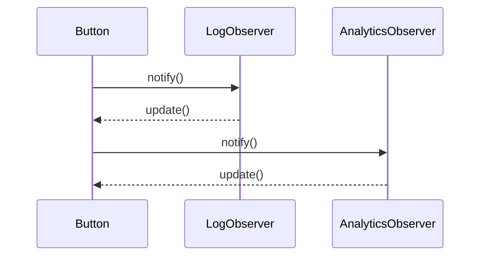

## 5.7.4 Use Cases and Examples

The Observer pattern is a fundamental design pattern in software development, particularly useful in scenarios where a change in one object requires notifying and updating multiple other objects. This pattern is prevalent in event-driven programming, real-time data feeds, and model-view synchronization. In this section, we will explore practical applications of the Observer pattern in JavaScript and TypeScript, demonstrating its versatility and effectiveness in building responsive and maintainable applications.

### Event Handling in GUI Frameworks

In graphical user interface (GUI) frameworks, the Observer pattern is often used to handle events such as button clicks, mouse movements, and keyboard inputs. The pattern allows for a decoupled architecture where the GUI components (observers) can react to user interactions (events) without tightly coupling the components to the event sources.

#### Example: Button Click Event Handling

Let's consider a simple example where we have a button, and we want to perform multiple actions when the button is clicked. We'll implement this using the Observer pattern.

```javascript
// Subject class
class Button {
  constructor() {
    this.observers = [];
  }

  // Method to add observers
  addObserver(observer) {
    this.observers.push(observer);
  }

  // Method to notify all observers
  notifyObservers() {
    this.observers.forEach(observer => observer.update());
  }

  // Simulate a button click
  click() {
    console.log('Button clicked');
    this.notifyObservers();
  }
}

// Observer classes
class LogObserver {
  update() {
    console.log('LogObserver: Button was clicked');
  }
}

class AnalyticsObserver {
  update() {
    console.log('AnalyticsObserver: Tracking button click');
  }
}

// Usage
const button = new Button();
const logObserver = new LogObserver();
const analyticsObserver = new AnalyticsObserver();

button.addObserver(logObserver);
button.addObserver(analyticsObserver);

// Simulate a button click
button.click();
```

In this example, the `Button` class acts as the subject, maintaining a list of observers. When the button is clicked, it notifies all registered observers, which then perform their respective actions. This setup allows for easy addition or removal of observers without modifying the button's code.

### Real-Time Data Feeds

The Observer pattern is also well-suited for real-time data feeds, where data changes need to be propagated to multiple parts of an application. This is common in applications like stock tickers, news feeds, or chat applications.

#### Example: Stock Ticker

Consider a stock ticker application that updates stock prices in real-time. We can use the Observer pattern to notify different parts of the application whenever a stock price changes.

```typescript
// Subject class
class StockTicker {
  private observers: Array<Observer> = [];
  private stockPrices: Map<string, number> = new Map();

  // Method to add observers
  addObserver(observer: Observer) {
    this.observers.push(observer);
  }

  // Method to notify all observers
  notifyObservers(stock: string) {
    this.observers.forEach(observer => observer.update(stock, this.stockPrices.get(stock)));
  }

  // Method to update stock price
  updateStockPrice(stock: string, price: number) {
    this.stockPrices.set(stock, price);
    this.notifyObservers(stock);
  }
}

// Observer interface
interface Observer {
  update(stock: string, price: number): void;
}

// Concrete observer classes
class DisplayObserver implements Observer {
  update(stock: string, price: number) {
    console.log(`DisplayObserver: ${stock} price updated to $${price}`);
  }
}

class AlertObserver implements Observer {
  update(stock: string, price: number) {
    if (price > 100) {
      console.log(`AlertObserver: ${stock} price is above $100!`);
    }
  }
}

// Usage
const stockTicker = new StockTicker();
const displayObserver = new DisplayObserver();
const alertObserver = new AlertObserver();

stockTicker.addObserver(displayObserver);
stockTicker.addObserver(alertObserver);

// Update stock prices
stockTicker.updateStockPrice('AAPL', 150);
stockTicker.updateStockPrice('GOOG', 95);
```

In this TypeScript example, the `StockTicker` class acts as the subject, maintaining stock prices and notifying observers whenever a price changes. The `DisplayObserver` and `AlertObserver` classes implement the `Observer` interface and react to stock price updates accordingly.

### Model-View Synchronization

In model-view synchronization, the Observer pattern helps keep the view updated whenever the model changes. This is particularly useful in applications with complex user interfaces where multiple views depend on the same underlying data.

#### Example: Todo List Application

Let's implement a simple todo list application where the view updates automatically whenever the model changes.

```javascript
// Subject class
class TodoModel {
  constructor() {
    this.todos = [];
    this.observers = [];
  }

  // Method to add observers
  addObserver(observer) {
    this.observers.push(observer);
  }

  // Method to notify all observers
  notifyObservers() {
    this.observers.forEach(observer => observer.update(this.todos));
  }

  // Method to add a new todo
  addTodo(todo) {
    this.todos.push(todo);
    this.notifyObservers();
  }
}

// Observer class
class TodoView {
  update(todos) {
    console.log('TodoView: Updating view with todos:', todos);
  }
}

// Usage
const todoModel = new TodoModel();
const todoView = new TodoView();

todoModel.addObserver(todoView);

// Add new todos
todoModel.addTodo('Learn JavaScript');
todoModel.addTodo('Practice TypeScript');
```

In this example, the `TodoModel` class acts as the subject, maintaining a list of todos and notifying the `TodoView` observer whenever the list changes. The view updates automatically, reflecting the current state of the model.

### Supporting Reactive Programming

The Observer pattern is a cornerstone of reactive programming, where applications react to changes in data streams. Libraries like RxJS in JavaScript leverage the Observer pattern to provide powerful tools for handling asynchronous data flows.

#### Example: Reactive Programming with RxJS

Let's explore how the Observer pattern supports reactive programming using RxJS, a popular library for reactive programming in JavaScript.

```javascript
import { Observable } from 'rxjs';

// Create an observable
const observable = new Observable(subscriber => {
  subscriber.next('Hello');
  subscriber.next('World');
  subscriber.complete();
});

// Create an observer
const observer = {
  next: (value) => console.log('Observer received:', value),
  error: (err) => console.error('Observer error:', err),
  complete: () => console.log('Observer complete')
};

// Subscribe the observer to the observable
observable.subscribe(observer);
```

In this example, we create an `Observable` that emits two values, "Hello" and "World", and then completes. The `observer` object defines how to handle the emitted values, errors, and completion. By subscribing the observer to the observable, we establish a reactive data flow where the observer reacts to the data emitted by the observable.

### Handling Asynchronous Updates

Asynchronous updates are a common challenge when implementing the Observer pattern. It's essential to ensure that observers are notified in a timely manner without blocking the main thread.

#### Example: Asynchronous Notifications

Let's modify our stock ticker example to handle asynchronous updates using promises.

```typescript
// Subject class with asynchronous notifications
class AsyncStockTicker {
  private observers: Array<Observer> = [];
  private stockPrices: Map<string, number> = new Map();

  addObserver(observer: Observer) {
    this.observers.push(observer);
  }

  async notifyObservers(stock: string) {
    for (const observer of this.observers) {
      await observer.update(stock, this.stockPrices.get(stock));
    }
  }

  updateStockPrice(stock: string, price: number) {
    this.stockPrices.set(stock, price);
    this.notifyObservers(stock);
  }
}

// Observer interface with asynchronous update
interface Observer {
  update(stock: string, price: number): Promise<void>;
}

// Concrete observer classes
class AsyncDisplayObserver implements Observer {
  async update(stock: string, price: number) {
    console.log(`AsyncDisplayObserver: ${stock} price updated to $${price}`);
  }
}

class AsyncAlertObserver implements Observer {
  async update(stock: string, price: number) {
    if (price > 100) {
      console.log(`AsyncAlertObserver: ${stock} price is above $100!`);
    }
  }
}

// Usage
const asyncStockTicker = new AsyncStockTicker();
const asyncDisplayObserver = new AsyncDisplayObserver();
const asyncAlertObserver = new AsyncAlertObserver();

asyncStockTicker.addObserver(asyncDisplayObserver);
asyncStockTicker.addObserver(asyncAlertObserver);

// Update stock prices
asyncStockTicker.updateStockPrice('AAPL', 150);
asyncStockTicker.updateStockPrice('GOOG', 95);
```

In this TypeScript example, we modify the `Observer` interface to include an asynchronous `update` method. The `AsyncStockTicker` class uses `await` to ensure that each observer is notified asynchronously, allowing for non-blocking updates.

### Managing Observer Lifecycles and Preventing Memory Issues

Managing the lifecycle of observers is crucial to prevent memory leaks, especially in long-running applications. It's important to remove observers when they are no longer needed.

#### Example: Removing Observers

Let's extend our todo list example to include a method for removing observers.

```javascript
// Subject class with observer removal
class TodoModel {
  constructor() {
    this.todos = [];
    this.observers = [];
  }

  addObserver(observer) {
    this.observers.push(observer);
  }

  removeObserver(observer) {
    this.observers = this.observers.filter(obs => obs !== observer);
  }

  notifyObservers() {
    this.observers.forEach(observer => observer.update(this.todos));
  }

  addTodo(todo) {
    this.todos.push(todo);
    this.notifyObservers();
  }
}

// Observer class
class TodoView {
  update(todos) {
    console.log('TodoView: Updating view with todos:', todos);
  }
}

// Usage
const todoModel = new TodoModel();
const todoView = new TodoView();

todoModel.addObserver(todoView);

// Add new todos
todoModel.addTodo('Learn JavaScript');
todoModel.addTodo('Practice TypeScript');

// Remove observer
todoModel.removeObserver(todoView);

// Add another todo
todoModel.addTodo('Explore Observer Pattern');
```

In this example, we add a `removeObserver` method to the `TodoModel` class, allowing us to remove observers when they are no longer needed. This helps prevent memory leaks by ensuring that unused observers are not retained in memory.

### Visualizing the Observer Pattern

To better understand the flow of the Observer pattern, let's visualize it using a sequence diagram.



**Diagram Description**: This sequence diagram illustrates the interaction between a `Button` (subject) and its observers (`LogObserver` and `AnalyticsObserver`). When the button is clicked, it notifies each observer, which then performs its update action.

### Try It Yourself

To deepen your understanding of the Observer pattern, try modifying the examples provided:

- **Add More Observers**: Extend the examples by adding more observer classes with different behaviors.
- **Implement Error Handling**: Modify the asynchronous stock ticker example to handle errors during observer updates.
- **Experiment with RxJS**: Create a more complex observable sequence using RxJS, such as a timer or interval-based observable.

### References and Links

- [MDN Web Docs: Observer Pattern](https://developer.mozilla.org/en-US/docs/Web/JavaScript/Guide/Design_Patterns#observer_pattern)
- [RxJS Documentation](https://rxjs.dev/guide/overview)
- [W3Schools: JavaScript Design Patterns](https://www.w3schools.com/js/js_design_patterns.asp)

### Knowledge Check

- **What are the key components of the Observer pattern?**
- **How can the Observer pattern be used in real-time data feeds?**
- **What are the benefits of using the Observer pattern in reactive programming?**

### Embrace the Journey

Remember, mastering design patterns like the Observer pattern is a journey. As you explore and experiment with these patterns, you'll gain valuable insights into building more responsive and maintainable applications. Keep experimenting, stay curious, and enjoy the journey!

## Quiz Time!



### What is the primary purpose of the Observer pattern?

- [x] To allow objects to be notified of changes in other objects
- [ ] To encapsulate a request as an object
- [ ] To provide a simplified interface to a complex subsystem
- [ ] To compose objects into tree structures

> **Explanation:** The Observer pattern allows objects (observers) to be notified of changes in another object (subject), enabling a decoupled architecture.

### In the button click example, what role does the `Button` class play?

- [x] Subject
- [ ] Observer
- [ ] Mediator
- [ ] Command

> **Explanation:** The `Button` class acts as the subject, maintaining a list of observers and notifying them when an event occurs.

### How does the Observer pattern support reactive programming?

- [x] By allowing observers to react to data changes in real-time
- [ ] By encapsulating requests as objects
- [ ] By providing a simplified interface to a complex subsystem
- [ ] By composing objects into tree structures

> **Explanation:** The Observer pattern supports reactive programming by allowing observers to react to data changes in real-time, enabling dynamic and responsive applications.

### What is a common challenge when implementing the Observer pattern?

- [x] Handling asynchronous updates
- [ ] Encapsulating requests as objects
- [ ] Providing a simplified interface to a complex subsystem
- [ ] Composing objects into tree structures

> **Explanation:** A common challenge when implementing the Observer pattern is handling asynchronous updates, ensuring that observers are notified in a timely manner without blocking the main thread.

### What method can be used to prevent memory leaks in the Observer pattern?

- [x] Removing observers when they are no longer needed
- [ ] Encapsulating requests as objects
- [ ] Providing a simplified interface to a complex subsystem
- [ ] Composing objects into tree structures

> **Explanation:** Removing observers when they are no longer needed helps prevent memory leaks by ensuring that unused observers are not retained in memory.

### In the stock ticker example, what does the `updateStockPrice` method do?

- [x] Updates the stock price and notifies observers
- [ ] Encapsulates a request as an object
- [ ] Provides a simplified interface to a complex subsystem
- [ ] Composes objects into tree structures

> **Explanation:** The `updateStockPrice` method updates the stock price and notifies all registered observers of the change.

### How can RxJS be used in conjunction with the Observer pattern?

- [x] By creating observables that emit data streams
- [ ] By encapsulating requests as objects
- [ ] By providing a simplified interface to a complex subsystem
- [ ] By composing objects into tree structures

> **Explanation:** RxJS can be used in conjunction with the Observer pattern by creating observables that emit data streams, allowing observers to react to data changes in real-time.

### What is the benefit of using asynchronous notifications in the Observer pattern?

- [x] Non-blocking updates
- [ ] Encapsulating requests as objects
- [ ] Providing a simplified interface to a complex subsystem
- [ ] Composing objects into tree structures

> **Explanation:** Asynchronous notifications in the Observer pattern allow for non-blocking updates, ensuring that observers are notified without blocking the main thread.

### What does the `notifyObservers` method do in the Observer pattern?

- [x] Notifies all registered observers of a change
- [ ] Encapsulates a request as an object
- [ ] Provides a simplified interface to a complex subsystem
- [ ] Composes objects into tree structures

> **Explanation:** The `notifyObservers` method notifies all registered observers of a change, allowing them to react accordingly.

### True or False: The Observer pattern is only applicable to GUI frameworks.

- [ ] True
- [x] False

> **Explanation:** False. The Observer pattern is applicable to a wide range of scenarios beyond GUI frameworks, including real-time data feeds, model-view synchronization, and reactive programming.


