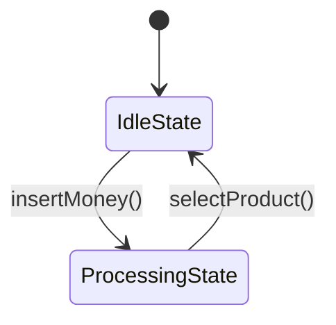

## 5.8.1 Intent and Motivation

In the realm of software design, the State Pattern stands out as a powerful tool for managing stateful behavior in a clean and organized manner. This pattern allows an object to alter its behavior when its internal state changes, making it appear as though the object has changed its class. Let's delve into the intricacies of the State Pattern, exploring its intent, motivation, and practical applications in JavaScript and TypeScript.

### Understanding the State Pattern

The State Pattern is a behavioral design pattern that enables an object to change its behavior when its internal state changes. This pattern is particularly useful when an object must exhibit different behaviors in different states, and it helps encapsulate state-specific logic within separate classes. By doing so, it eliminates the need for large conditional statements and enhances code maintainability.

#### Defining Stateful Behavior

Stateful behavior refers to the ability of an object to behave differently based on its current state. For instance, consider a vending machine. Depending on whether it is idle, processing a transaction, or out of stock, the vending machine will exhibit different behaviors. The State Pattern allows us to model such state-dependent behavior by delegating the behavior to state-specific classes.

### Analogies to Illustrate the State Pattern

To better understand the State Pattern, let's consider a few analogies that illustrate its application in real-world scenarios.

#### Vending Machine Analogy

Imagine a vending machine that changes its behavior based on its current state. When the machine is idle, it waits for a user to insert money. Once money is inserted, it transitions to a processing state, where it waits for the user to select a product. If the selected product is available, the machine dispenses the product and returns to the idle state. If the product is out of stock, it notifies the user and returns to the idle state.

In this analogy, the vending machine's behavior changes based on its state, and the State Pattern allows us to encapsulate each state's behavior within separate classes. This approach simplifies the code and makes it easier to manage and extend.

#### Traffic Light Analogy

Consider a traffic light system that changes its behavior based on its current state. In the red state, the light stops traffic. In the green state, it allows traffic to flow. In the yellow state, it warns traffic to slow down. Each state has its own behavior, and the State Pattern enables us to encapsulate these behaviors within separate classes, making the system more modular and maintainable.

### Avoiding Large Conditional Statements

One of the primary motivations for using the State Pattern is to avoid large conditional statements that can make code difficult to read and maintain. In traditional approaches, state-dependent behavior is often implemented using conditional statements, such as `if...else` or `switch` statements. As the number of states and behaviors increases, these conditional statements can become unwieldy and error-prone.

The State Pattern addresses this issue by encapsulating state-specific logic within separate classes. Each state is represented by a class that implements the behavior associated with that state. This approach not only simplifies the code but also makes it easier to add new states or modify existing ones without affecting other parts of the system.

### Benefits of Encapsulating State-Specific Logic

Encapsulating state-specific logic within separate classes offers several benefits:

1. **Improved Code Organization**: By separating state-specific logic into distinct classes, the code becomes more organized and easier to understand.

2. **Enhanced Maintainability**: Changes to a specific state's behavior can be made in isolation, without affecting other states. This makes the code easier to maintain and extend.

3. **Increased Flexibility**: New states can be added easily by creating new classes that implement the desired behavior. This flexibility makes it easier to adapt the system to changing requirements.

4. **Reduced Complexity**: By eliminating large conditional statements, the code becomes less complex and more readable.

### Implementing the State Pattern in JavaScript

Let's explore how the State Pattern can be implemented in JavaScript. We'll use the vending machine analogy to illustrate the implementation.

```javascript
// Define the State interface
class State {
  insertMoney() {}
  selectProduct() {}
  dispenseProduct() {}
}

// Define the IdleState class
class IdleState extends State {
  constructor(vendingMachine) {
    super();
    this.vendingMachine = vendingMachine;
  }

  insertMoney() {
    console.log("Money inserted. Transitioning to ProcessingState.");
    this.vendingMachine.setState(this.vendingMachine.processingState);
  }
}

// Define the ProcessingState class
class ProcessingState extends State {
  constructor(vendingMachine) {
    super();
    this.vendingMachine = vendingMachine;
  }

  selectProduct() {
    console.log("Product selected. Dispensing product.");
    this.vendingMachine.setState(this.vendingMachine.idleState);
  }
}

// Define the VendingMachine class
class VendingMachine {
  constructor() {
    this.idleState = new IdleState(this);
    this.processingState = new ProcessingState(this);
    this.currentState = this.idleState;
  }

  setState(state) {
    this.currentState = state;
  }

  insertMoney() {
    this.currentState.insertMoney();
  }

  selectProduct() {
    this.currentState.selectProduct();
  }
}

// Usage
const vendingMachine = new VendingMachine();
vendingMachine.insertMoney(); // Money inserted. Transitioning to ProcessingState.
vendingMachine.selectProduct(); // Product selected. Dispensing product.
```

In this implementation, we define a `State` interface with methods for each action the vending machine can perform. We then create classes for each state (`IdleState` and `ProcessingState`) that implement the `State` interface. The `VendingMachine` class maintains a reference to the current state and delegates actions to the current state's methods.

### Implementing the State Pattern in TypeScript

TypeScript's strong typing features can enhance the implementation of the State Pattern by providing type safety and better code organization.

```typescript
// Define the State interface
interface State {
  insertMoney(): void;
  selectProduct(): void;
  dispenseProduct(): void;
}

// Define the IdleState class
class IdleState implements State {
  constructor(private vendingMachine: VendingMachine) {}

  insertMoney(): void {
    console.log("Money inserted. Transitioning to ProcessingState.");
    this.vendingMachine.setState(this.vendingMachine.processingState);
  }

  selectProduct(): void {
    console.log("Cannot select product. Insert money first.");
  }

  dispenseProduct(): void {
    console.log("Cannot dispense product. Insert money first.");
  }
}

// Define the ProcessingState class
class ProcessingState implements State {
  constructor(private vendingMachine: VendingMachine) {}

  insertMoney(): void {
    console.log("Already processing. Please select a product.");
  }

  selectProduct(): void {
    console.log("Product selected. Dispensing product.");
    this.vendingMachine.setState(this.vendingMachine.idleState);
  }

  dispenseProduct(): void {
    console.log("Dispensing product.");
  }
}

// Define the VendingMachine class
class VendingMachine {
  idleState: State;
  processingState: State;
  private currentState: State;

  constructor() {
    this.idleState = new IdleState(this);
    this.processingState = new ProcessingState(this);
    this.currentState = this.idleState;
  }

  setState(state: State): void {
    this.currentState = state;
  }

  insertMoney(): void {
    this.currentState.insertMoney();
  }

  selectProduct(): void {
    this.currentState.selectProduct();
  }

  dispenseProduct(): void {
    this.currentState.dispenseProduct();
  }
}

// Usage
const vendingMachine = new VendingMachine();
vendingMachine.insertMoney(); // Money inserted. Transitioning to ProcessingState.
vendingMachine.selectProduct(); // Product selected. Dispensing product.
```

In this TypeScript implementation, we define a `State` interface with methods for each action. The `IdleState` and `ProcessingState` classes implement this interface, and the `VendingMachine` class manages state transitions. TypeScript's type system ensures that the implementation is type-safe and that state transitions are handled correctly.

### Visualizing the State Pattern

To further enhance our understanding of the State Pattern, let's visualize the state transitions using a state diagram.



**Figure 1: State Diagram for the Vending Machine**

In this state diagram, we see the initial state as `IdleState`. When money is inserted, the machine transitions to `ProcessingState`. Once a product is selected, it returns to `IdleState`. This visualization helps us understand the flow of state transitions in the vending machine.

### Try It Yourself

Now that we've explored the State Pattern, let's encourage you to experiment with the code examples. Try modifying the vending machine example to add new states, such as an `OutOfStockState` or a `MaintenanceState`. Consider how these new states would affect the behavior of the vending machine and how you would implement them using the State Pattern.

### References and Links

For further reading on the State Pattern and its applications, consider exploring the following resources:

- [State Pattern on Wikipedia](https://en.wikipedia.org/wiki/State_pattern)
- [MDN Web Docs: Classes](https://developer.mozilla.org/en-US/docs/Web/JavaScript/Reference/Classes)
- [TypeScript Handbook: Interfaces](https://www.typescriptlang.org/docs/handbook/interfaces.html)

### Knowledge Check

To reinforce your understanding of the State Pattern, consider the following questions:

1. What is the primary motivation for using the State Pattern?
2. How does the State Pattern help avoid large conditional statements?
3. What are the benefits of encapsulating state-specific logic within separate classes?
4. How would you implement a new state in the vending machine example?

### Embrace the Journey

Remember, mastering design patterns is a journey. As you continue to explore and apply the State Pattern in your projects, you'll gain a deeper understanding of its benefits and applications. Keep experimenting, stay curious, and enjoy the journey!

## Quiz Time!



### What is the primary motivation for using the State Pattern?

- [x] To allow an object to change its behavior when its internal state changes
- [ ] To increase the complexity of the code
- [ ] To eliminate the need for classes
- [ ] To simplify the user interface

> **Explanation:** The State Pattern allows an object to alter its behavior when its internal state changes, making it appear as though the object has changed its class.

### How does the State Pattern help avoid large conditional statements?

- [x] By encapsulating state-specific logic within separate classes
- [ ] By using more complex algorithms
- [ ] By eliminating the need for functions
- [ ] By increasing the number of states

> **Explanation:** The State Pattern encapsulates state-specific logic within separate classes, eliminating the need for large conditional statements and enhancing code maintainability.

### What is a benefit of encapsulating state-specific logic within separate classes?

- [x] Improved code organization
- [x] Enhanced maintainability
- [ ] Increased code complexity
- [ ] Reduced code readability

> **Explanation:** Encapsulating state-specific logic within separate classes improves code organization and maintainability by allowing changes to be made in isolation.

### In the vending machine analogy, what happens when money is inserted?

- [x] The machine transitions to the ProcessingState
- [ ] The machine dispenses a product
- [ ] The machine returns to the IdleState
- [ ] The machine enters the OutOfStockState

> **Explanation:** When money is inserted, the vending machine transitions from the IdleState to the ProcessingState, where it waits for a product selection.

### How can new states be added to the vending machine example?

- [x] By creating new classes that implement the State interface
- [ ] By adding more conditional statements
- [ ] By modifying existing states
- [ ] By eliminating the State interface

> **Explanation:** New states can be added by creating new classes that implement the State interface, allowing for easy extension of the system.

### What is the role of the State interface in the State Pattern?

- [x] To define the methods that each state must implement
- [ ] To eliminate the need for classes
- [ ] To increase code complexity
- [ ] To simplify the user interface

> **Explanation:** The State interface defines the methods that each state must implement, ensuring consistency and type safety in the implementation.

### What is a potential challenge when implementing the State Pattern?

- [x] Managing state transitions
- [ ] Increasing code complexity
- [ ] Reducing code readability
- [ ] Eliminating the need for classes

> **Explanation:** Managing state transitions can be a challenge when implementing the State Pattern, as it requires careful coordination between states.

### What is a key advantage of using TypeScript for implementing the State Pattern?

- [x] Type safety and better code organization
- [ ] Increased code complexity
- [ ] Reduced code readability
- [ ] Elimination of classes

> **Explanation:** TypeScript provides type safety and better code organization, enhancing the implementation of the State Pattern.

### What is the initial state of the vending machine in the example?

- [x] IdleState
- [ ] ProcessingState
- [ ] OutOfStockState
- [ ] MaintenanceState

> **Explanation:** The initial state of the vending machine in the example is IdleState, where it waits for money to be inserted.

### True or False: The State Pattern allows an object to change its class.

- [x] True
- [ ] False

> **Explanation:** The State Pattern allows an object to change its behavior when its internal state changes, making it appear as though the object has changed its class.




