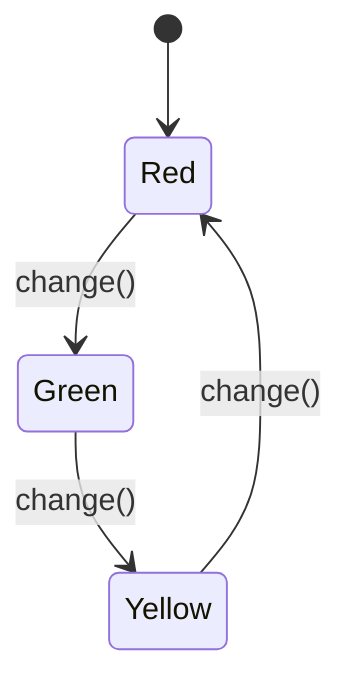

## 5.8.2 Implementation in JavaScript

In this section, we will delve into the implementation of the State pattern in JavaScript. The State pattern is a behavioral design pattern that allows an object to change its behavior when its internal state changes. This pattern is particularly useful in scenarios where an object must change its behavior at runtime depending on its state.

### Understanding the State Pattern

The State pattern is designed to allow an object to alter its behavior when its internal state changes. The object will appear to change its class. This pattern is particularly useful in scenarios where an object must change its behavior at runtime depending on its state.

#### Key Concepts

- **Context**: This is the class that maintains an instance of a ConcreteState subclass, which defines the current state.
- **State**: This is an interface that defines the behavior associated with a particular state of the Context.
- **ConcreteState**: These are classes that implement the State interface and define the behavior for a particular state of the Context.

### Implementing the State Pattern in JavaScript

Let's explore how to implement the State pattern in JavaScript by creating a simple example of a `TrafficLight` system. This system will have three states: `Red`, `Green`, and `Yellow`. The traffic light will change its behavior based on its current state.

#### Step 1: Define the State Interface

First, we need to define the State interface. In JavaScript, we can use a class to define this interface. Each state will implement this interface to provide its specific behavior.

```javascript
// State interface
class State {
  change(context) {
    throw new Error("This method should be overridden!");
  }
}
```

#### Step 2: Create Concrete State Classes

Next, we create concrete state classes that implement the State interface. Each class will define the behavior for a specific state of the traffic light.

```javascript
// Concrete State: Red
class RedState extends State {
  change(context) {
    console.log("Changing from Red to Green");
    context.setState(new GreenState());
  }
}

// Concrete State: Green
class GreenState extends State {
  change(context) {
    console.log("Changing from Green to Yellow");
    context.setState(new YellowState());
  }
}

// Concrete State: Yellow
class YellowState extends State {
  change(context) {
    console.log("Changing from Yellow to Red");
    context.setState(new RedState());
  }
}
```

#### Step 3: Define the Context Class

The Context class maintains an instance of a ConcreteState subclass. It delegates the state-specific behavior to the current state object.

```javascript
// Context class
class TrafficLight {
  constructor() {
    this.state = new RedState(); // Initial state
  }

  setState(state) {
    this.state = state;
  }

  change() {
    this.state.change(this);
  }
}
```

#### Step 4: Demonstrate the State Pattern

Now, let's demonstrate how the State pattern works by creating an instance of the `TrafficLight` and changing its state.

```javascript
// Client code
const trafficLight = new TrafficLight();

trafficLight.change(); // Changing from Red to Green
trafficLight.change(); // Changing from Green to Yellow
trafficLight.change(); // Changing from Yellow to Red
```

### Handling State Transitions

In the State pattern, state transitions are handled by the state objects themselves. Each state object is responsible for deciding when and how to transition to another state. This approach encapsulates the state-specific behavior and transitions within the state objects, making the code more maintainable and scalable.

### Avoiding Tight Coupling

To avoid tight coupling between the states and the context, we can use the following strategies:

1. **Use Interfaces**: Define a common interface for all state classes. This ensures that the context can interact with the states without knowing their concrete implementations.

2. **Encapsulate State Transitions**: Each state should encapsulate its transitions. The context should not be responsible for deciding which state to transition to next.

3. **Use Dependency Injection**: Inject state objects into the context rather than creating them within the context. This allows for more flexibility and easier testing.

### Code Comments for Clarity

Let's revisit our code with detailed comments for clarity.

```javascript
// State interface
class State {
  // Method to change the state
  change(context) {
    throw new Error("This method should be overridden!");
  }
}

// Concrete State: Red
class RedState extends State {
  // Change state from Red to Green
  change(context) {
    console.log("Changing from Red to Green");
    context.setState(new GreenState());
  }
}

// Concrete State: Green
class GreenState extends State {
  // Change state from Green to Yellow
  change(context) {
    console.log("Changing from Green to Yellow");
    context.setState(new YellowState());
  }
}

// Concrete State: Yellow
class YellowState extends State {
  // Change state from Yellow to Red
  change(context) {
    console.log("Changing from Yellow to Red");
    context.setState(new RedState());
  }
}

// Context class
class TrafficLight {
  constructor() {
    this.state = new RedState(); // Initial state
  }

  // Set the current state
  setState(state) {
    this.state = state;
  }

  // Change the current state
  change() {
    this.state.change(this);
  }
}

// Client code
const trafficLight = new TrafficLight();

trafficLight.change(); // Changing from Red to Green
trafficLight.change(); // Changing from Green to Yellow
trafficLight.change(); // Changing from Yellow to Red
```

### Try It Yourself

To gain a deeper understanding of the State pattern, try modifying the code to add a new state, such as `Blinking`. Implement the behavior for this state and integrate it into the state transitions.

### Visualizing the State Pattern

Let's visualize the State pattern using a state transition diagram. This diagram will help us understand how the traffic light transitions between different states.



**Figure 1**: State transition diagram for the TrafficLight system.

### References and Links

For further reading on the State pattern and its implementation in JavaScript, consider the following resources:

- [MDN Web Docs: State Pattern](https://developer.mozilla.org/en-US/docs/Web/JavaScript/Guide/State_Pattern)
- [Refactoring Guru: State Pattern](https://refactoring.guru/design-patterns/state)
- [JavaScript Design Patterns](https://addyosmani.com/resources/essentialjsdesignpatterns/book/)

### Knowledge Check

Before we conclude, let's pose a few questions to reinforce your understanding of the State pattern:

1. What is the primary purpose of the State pattern?
2. How does the State pattern improve code maintainability?
3. What role does the Context class play in the State pattern?
4. How can we avoid tight coupling between states and the context?

### Embrace the Journey

Remember, mastering design patterns like the State pattern is a journey. As you continue to explore and implement these patterns, you'll gain a deeper understanding of how to write maintainable and scalable code. Keep experimenting, stay curious, and enjoy the journey!

### Summary

In this section, we explored the implementation of the State pattern in JavaScript. We learned how to define a Context object and State classes, handle state transitions, and avoid tight coupling. By understanding and applying the State pattern, you can manage changing behaviors in your applications more effectively.

## Quiz Time!



### What is the primary purpose of the State pattern?

- [x] To allow an object to change its behavior when its internal state changes.
- [ ] To encapsulate a group of algorithms.
- [ ] To provide a way to create objects without specifying their concrete classes.
- [ ] To define a one-to-many dependency between objects.

> **Explanation:** The State pattern allows an object to change its behavior when its internal state changes, making it appear to change its class.

### How does the State pattern improve code maintainability?

- [x] By encapsulating state-specific behavior within state objects.
- [ ] By using global variables to manage state.
- [ ] By reducing the number of classes in the codebase.
- [ ] By eliminating the need for interfaces.

> **Explanation:** The State pattern improves code maintainability by encapsulating state-specific behavior within state objects, making the code more modular and easier to manage.

### What role does the Context class play in the State pattern?

- [x] It maintains an instance of a ConcreteState subclass and delegates behavior to it.
- [ ] It defines the behavior for a particular state of the system.
- [ ] It provides a simplified interface to a complex subsystem.
- [ ] It creates objects without specifying their concrete classes.

> **Explanation:** The Context class maintains an instance of a ConcreteState subclass and delegates behavior to it, allowing the system to change its behavior based on its current state.

### How can we avoid tight coupling between states and the context?

- [x] By using interfaces and encapsulating state transitions within state objects.
- [ ] By creating all state objects within the context.
- [ ] By using global variables to manage state.
- [ ] By eliminating the need for state objects.

> **Explanation:** To avoid tight coupling, we can use interfaces and encapsulate state transitions within state objects, allowing the context to interact with states without knowing their concrete implementations.

### Which of the following is a ConcreteState in the TrafficLight example?

- [x] RedState
- [ ] TrafficLight
- [ ] State
- [ ] Context

> **Explanation:** RedState is a ConcreteState that implements the State interface and defines the behavior for the "Red" state of the TrafficLight.

### What method is used to change the current state in the TrafficLight example?

- [x] change()
- [ ] transition()
- [ ] update()
- [ ] setState()

> **Explanation:** The change() method is used to change the current state in the TrafficLight example by delegating the behavior to the current state object.

### What is the initial state of the TrafficLight in the example?

- [x] RedState
- [ ] GreenState
- [ ] YellowState
- [ ] BlinkingState

> **Explanation:** The initial state of the TrafficLight in the example is RedState, as it is set in the constructor of the TrafficLight class.

### What happens when the change() method is called on the TrafficLight?

- [x] The current state is changed to the next state.
- [ ] The traffic light is reset to its initial state.
- [ ] The traffic light stops changing states.
- [ ] The traffic light enters a blinking state.

> **Explanation:** When the change() method is called on the TrafficLight, the current state is changed to the next state by delegating the behavior to the current state object.

### How does the State pattern handle state transitions?

- [x] State transitions are handled by the state objects themselves.
- [ ] State transitions are handled by the context.
- [ ] State transitions are handled by global variables.
- [ ] State transitions are not handled in the State pattern.

> **Explanation:** In the State pattern, state transitions are handled by the state objects themselves, encapsulating the transition logic within the state objects.

### True or False: The State pattern can be used to manage changing behaviors in a system.

- [x] True
- [ ] False

> **Explanation:** True. The State pattern is designed to manage changing behaviors in a system by allowing an object to change its behavior when its internal state changes.


