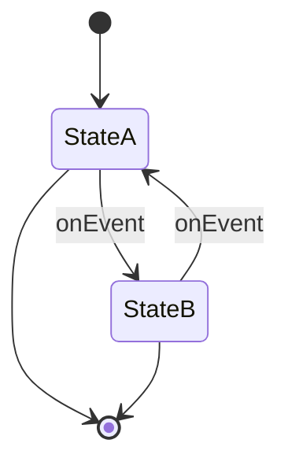

## 5.8.3 Implementation in TypeScript

The State pattern is a behavioral design pattern that allows an object to alter its behavior when its internal state changes. This pattern is particularly useful for managing state transitions in a clean and organized manner. In this section, we will explore how to implement the State pattern in TypeScript, leveraging its powerful type system, including interfaces, enums, and advanced features like discriminated unions and generics.

### Understanding the State Pattern

Before diving into the implementation, let's briefly revisit the core concept of the State pattern. The State pattern allows an object to change its behavior when its internal state changes. The object will appear to change its class. This is achieved by encapsulating state-specific behavior into separate state classes and delegating state-dependent behavior to the current state object.

### Key Components of the State Pattern

1. **Context**: The class that maintains an instance of a ConcreteState subclass that defines the current state.
2. **State Interface**: An interface that declares methods for state-specific behavior.
3. **Concrete States**: Classes that implement the State interface and define specific behavior for each state.

### Implementing the State Pattern in TypeScript

#### Step 1: Define the State Interface

In TypeScript, interfaces are a powerful way to define contracts for classes. We will use an interface to define the methods that each state must implement.

```typescript
// State.ts
export interface State {
  handleRequest(): void;
}
```

The `State` interface declares a method `handleRequest`, which each concrete state must implement.

#### Step 2: Create Concrete State Classes

Each concrete state class will implement the `State` interface and provide its own implementation of the `handleRequest` method.

```typescript
// ConcreteStateA.ts
import { State } from './State';

export class ConcreteStateA implements State {
  handleRequest(): void {
    console.log('Handling request in ConcreteStateA');
  }
}

// ConcreteStateB.ts
import { State } from './State';

export class ConcreteStateB implements State {
  handleRequest(): void {
    console.log('Handling request in ConcreteStateB');
  }
}
```

Here, `ConcreteStateA` and `ConcreteStateB` implement the `State` interface and define their own behavior for the `handleRequest` method.

#### Step 3: Implement the Context Class

The context class maintains a reference to the current state object and delegates state-specific behavior to this object.

```typescript
// Context.ts
import { State } from './State';

export class Context {
  private state: State;

  constructor(initialState: State) {
    this.state = initialState;
  }

  setState(state: State): void {
    this.state = state;
  }

  request(): void {
    this.state.handleRequest();
  }
}
```

The `Context` class holds a reference to a `State` object and provides a method `setState` to change the current state. The `request` method delegates the call to the current state's `handleRequest` method.

#### Step 4: Using Enums for State Representation

Enums in TypeScript can be used to represent different states in a more readable and maintainable way. Let's see how we can use enums to enhance our state management.

```typescript
// StateEnum.ts
export enum StateEnum {
  StateA,
  StateB
}
```

Enums provide a way to define a set of named constants, which can be used to represent different states.

#### Step 5: Integrate Enums with the Context

We can modify the `Context` class to use enums for state transitions.

```typescript
// ContextWithEnum.ts
import { StateEnum } from './StateEnum';
import { State } from './State';
import { ConcreteStateA } from './ConcreteStateA';
import { ConcreteStateB } from './ConcreteStateB';

export class ContextWithEnum {
  private state: State;

  constructor(initialState: StateEnum) {
    this.setState(initialState);
  }

  setState(state: StateEnum): void {
    switch (state) {
      case StateEnum.StateA:
        this.state = new ConcreteStateA();
        break;
      case StateEnum.StateB:
        this.state = new ConcreteStateB();
        break;
    }
  }

  request(): void {
    this.state.handleRequest();
  }
}
```

In this version of the `Context` class, we use the `StateEnum` to determine which concrete state to instantiate. This approach makes state transitions more explicit and easier to manage.

### Benefits of Using TypeScript for State Pattern

1. **Compile-Time Checks**: TypeScript's static type checking helps catch errors at compile time, reducing runtime errors.
2. **Interfaces and Enums**: Using interfaces and enums makes the code more readable and maintainable.
3. **Advanced Features**: TypeScript's advanced features, such as discriminated unions and generics, can be leveraged for more complex state management scenarios.

### Advanced TypeScript Features

#### Discriminated Unions

Discriminated unions are a powerful feature in TypeScript that allow you to create a type that can be one of several types, each with a common property. This can be useful for managing state transitions.

```typescript
// StateUnion.ts
type StateUnion = 
  | { type: 'StateA'; data: string }
  | { type: 'StateB'; data: number };

function handleState(state: StateUnion) {
  switch (state.type) {
    case 'StateA':
      console.log(`Handling StateA with data: ${state.data}`);
      break;
    case 'StateB':
      console.log(`Handling StateB with data: ${state.data}`);
      break;
  }
}
```

In this example, `StateUnion` is a discriminated union type that can be either `StateA` or `StateB`, each with its own data type. The `handleState` function uses a switch statement to handle each state appropriately.

#### Generics for Flexible State Management

Generics can be used to create flexible and reusable components for state management.

```typescript
// GenericState.ts
interface State<T> {
  handleRequest(data: T): void;
}

class GenericState<T> implements State<T> {
  handleRequest(data: T): void {
    console.log(`Handling request with data: ${data}`);
  }
}

const stringState = new GenericState<string>();
stringState.handleRequest('Hello, World!');

const numberState = new GenericState<number>();
numberState.handleRequest(42);
```

In this example, `GenericState` is a generic class that implements the `State` interface. It can handle requests with any type of data, making it highly flexible and reusable.

### Visualizing State Transitions

To better understand how the State pattern works, let's visualize the state transitions using a state diagram.



In this diagram, we have two states, `StateA` and `StateB`, with transitions between them triggered by an event. This visualization helps us understand the flow of state transitions in our application.

### Try It Yourself

Now that we've covered the implementation of the State pattern in TypeScript, let's encourage you to experiment with the code. Try modifying the `Context` class to add more states or change the behavior of existing states. You can also explore using discriminated unions and generics to create more complex state management solutions.

### Conclusion

Implementing the State pattern in TypeScript provides a robust and type-safe way to manage state transitions in your applications. By leveraging TypeScript's powerful features, such as interfaces, enums, discriminated unions, and generics, you can create flexible and maintainable state management solutions. Remember, this is just the beginning. As you progress, you'll build more complex and interactive applications. Keep experimenting, stay curious, and enjoy the journey!

## Quiz Time!



### What is the primary purpose of the State pattern?

- [x] To allow an object to change its behavior when its internal state changes.
- [ ] To encapsulate requests as objects.
- [ ] To define a family of algorithms.
- [ ] To provide a simplified interface to a complex subsystem.

> **Explanation:** The State pattern allows an object to alter its behavior when its internal state changes, effectively changing its class.

### Which TypeScript feature is used to define contracts for classes in the State pattern?

- [x] Interfaces
- [ ] Enums
- [ ] Generics
- [ ] Discriminated Unions

> **Explanation:** Interfaces in TypeScript are used to define contracts for classes, ensuring that they implement specific methods.

### How can enums be used in the State pattern implementation?

- [x] To represent different states in a readable and maintainable way.
- [ ] To encapsulate requests as objects.
- [ ] To define a family of algorithms.
- [ ] To provide a simplified interface to a complex subsystem.

> **Explanation:** Enums can be used to represent different states in a more readable and maintainable way, making state transitions explicit.

### What is a discriminated union in TypeScript?

- [x] A type that can be one of several types, each with a common property.
- [ ] A way to define a family of algorithms.
- [ ] A method for encapsulating requests as objects.
- [ ] A simplified interface to a complex subsystem.

> **Explanation:** Discriminated unions in TypeScript allow you to create a type that can be one of several types, each with a common property.

### What is the benefit of using generics in the State pattern?

- [x] To create flexible and reusable components for state management.
- [ ] To encapsulate requests as objects.
- [ ] To define a family of algorithms.
- [ ] To provide a simplified interface to a complex subsystem.

> **Explanation:** Generics allow you to create flexible and reusable components for state management, handling requests with any type of data.

### Which method in the Context class is responsible for delegating state-specific behavior?

- [x] request
- [ ] setState
- [ ] handleRequest
- [ ] changeState

> **Explanation:** The `request` method in the Context class delegates the call to the current state's `handleRequest` method.

### What does the `setState` method do in the Context class?

- [x] It changes the current state of the context.
- [ ] It handles requests in the current state.
- [ ] It encapsulates requests as objects.
- [ ] It defines a family of algorithms.

> **Explanation:** The `setState` method in the Context class is used to change the current state of the context.

### How does TypeScript's static type checking benefit the State pattern implementation?

- [x] It helps catch errors at compile time, reducing runtime errors.
- [ ] It allows encapsulation of requests as objects.
- [ ] It defines a family of algorithms.
- [ ] It provides a simplified interface to a complex subsystem.

> **Explanation:** TypeScript's static type checking helps catch errors at compile time, reducing runtime errors and improving code reliability.

### What is the role of the `handleRequest` method in the State pattern?

- [x] It defines the behavior for each state.
- [ ] It changes the current state of the context.
- [ ] It encapsulates requests as objects.
- [ ] It provides a simplified interface to a complex subsystem.

> **Explanation:** The `handleRequest` method defines the behavior for each state, as implemented by the concrete state classes.

### True or False: The State pattern allows an object to alter its behavior without changing its class.

- [x] True
- [ ] False

> **Explanation:** True. The State pattern allows an object to alter its behavior when its internal state changes, effectively changing its class without actually changing the class itself.


