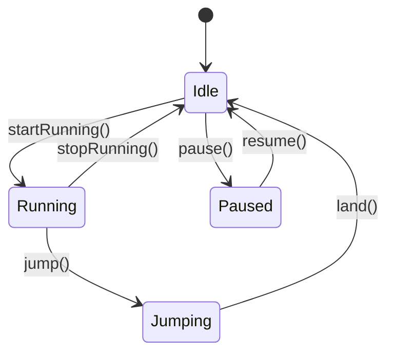

## 5.8.4 Use Cases and Examples

In this section, we delve into the practical applications of the State pattern in JavaScript and TypeScript. The State pattern is a behavioral design pattern that allows an object to change its behavior when its internal state changes. This pattern is particularly useful in scenarios where an object must exhibit different behaviors in different states, such as UI components with various modes, game character states, or workflow processes.

### Understanding the State Pattern

Before we explore specific use cases, let's briefly revisit the core concept of the State pattern. The pattern involves three main components:

1. **Context**: This is the object whose behavior varies with its state. It holds a reference to a state object and delegates state-specific behavior to it.

2. **State**: An interface or abstract class defining the behavior associated with a particular state of the context.

3. **Concrete States**: These are classes that implement the State interface, encapsulating the behavior associated with a particular state of the context.

The State pattern promotes code maintainability by localizing state-specific behavior and state transitions, making it easier to add new states without altering existing code.

### Use Case 1: UI Components with Different Modes

One of the most common applications of the State pattern is in UI components that can exist in multiple modes. Consider a text editor that can be in different modes such as "Edit", "Read-Only", and "Preview". Each mode has distinct behaviors and UI elements.

#### Code Example: Text Editor Modes

Let's implement a simple text editor using the State pattern in TypeScript:

```typescript
// State interface
interface EditorState {
    click(): void;
    type(text: string): void;
}

// Concrete States
class EditState implements EditorState {
    click(): void {
        console.log("Opening text editor for editing.");
    }
    type(text: string): void {
        console.log(`Typing: ${text}`);
    }
}

class ReadOnlyState implements EditorState {
    click(): void {
        console.log("Cannot edit, read-only mode.");
    }
    type(text: string): void {
        console.log("Cannot type, read-only mode.");
    }
}

class PreviewState implements EditorState {
    click(): void {
        console.log("Switching to preview mode.");
    }
    type(text: string): void {
        console.log("Cannot type in preview mode.");
    }
}

// Context
class TextEditor {
    private state: EditorState;

    constructor(initialState: EditorState) {
        this.state = initialState;
    }

    setState(state: EditorState): void {
        this.state = state;
    }

    click(): void {
        this.state.click();
    }

    type(text: string): void {
        this.state.type(text);
    }
}

// Usage
const editor = new TextEditor(new EditState());
editor.click(); // Output: Opening text editor for editing.
editor.type("Hello, World!"); // Output: Typing: Hello, World!

editor.setState(new ReadOnlyState());
editor.click(); // Output: Cannot edit, read-only mode.
editor.type("Hello, World!"); // Output: Cannot type, read-only mode.
```

In this example, the `TextEditor` class acts as the context, and the `EditorState` interface defines the behavior for different states. By encapsulating state-specific behavior in separate classes, we can easily add new states or modify existing ones without affecting the overall structure.

### Use Case 2: Game Character States

In game development, characters often have different states such as "Idle", "Running", "Jumping", or "Attacking". Each state has unique behaviors and animations.

#### Code Example: Game Character States

Let's implement a simple game character using the State pattern in JavaScript:

```javascript
// State interface
class CharacterState {
    enter(character) {}
    execute(character) {}
}

// Concrete States
class IdleState extends CharacterState {
    enter(character) {
        console.log(`${character.name} is now idle.`);
    }
    execute(character) {
        console.log(`${character.name} is standing still.`);
    }
}

class RunningState extends CharacterState {
    enter(character) {
        console.log(`${character.name} starts running.`);
    }
    execute(character) {
        console.log(`${character.name} is running.`);
    }
}

class JumpingState extends CharacterState {
    enter(character) {
        console.log(`${character.name} jumps.`);
    }
    execute(character) {
        console.log(`${character.name} is in the air.`);
    }
}

// Context
class GameCharacter {
    constructor(name) {
        this.name = name;
        this.state = new IdleState();
    }

    setState(state) {
        this.state = state;
        this.state.enter(this);
    }

    update() {
        this.state.execute(this);
    }
}

// Usage
const character = new GameCharacter("Hero");
character.update(); // Output: Hero is standing still.

character.setState(new RunningState());
character.update(); // Output: Hero is running.

character.setState(new JumpingState());
character.update(); // Output: Hero is in the air.
```

Here, the `GameCharacter` class serves as the context, and each state class implements the `CharacterState` interface. This setup allows for seamless transitions between states and easy addition of new character states.

### Use Case 3: Workflow Processes

The State pattern is also beneficial in workflow processes where tasks can be in different states such as "Pending", "In Progress", "Completed", or "Cancelled". Each state has specific actions and transitions.

#### Code Example: Workflow Process

Let's implement a simple task management system using the State pattern in TypeScript:

```typescript
// State interface
interface TaskState {
    start(task: Task): void;
    complete(task: Task): void;
    cancel(task: Task): void;
}

// Concrete States
class PendingState implements TaskState {
    start(task: Task): void {
        console.log(`Starting task: ${task.name}`);
        task.setState(new InProgressState());
    }
    complete(task: Task): void {
        console.log("Task cannot be completed as it is pending.");
    }
    cancel(task: Task): void {
        console.log(`Cancelling task: ${task.name}`);
        task.setState(new CancelledState());
    }
}

class InProgressState implements TaskState {
    start(task: Task): void {
        console.log("Task is already in progress.");
    }
    complete(task: Task): void {
        console.log(`Completing task: ${task.name}`);
        task.setState(new CompletedState());
    }
    cancel(task: Task): void {
        console.log(`Cancelling task: ${task.name}`);
        task.setState(new CancelledState());
    }
}

class CompletedState implements TaskState {
    start(task: Task): void {
        console.log("Task is already completed.");
    }
    complete(task: Task): void {
        console.log("Task is already completed.");
    }
    cancel(task: Task): void {
        console.log("Completed task cannot be cancelled.");
    }
}

class CancelledState implements TaskState {
    start(task: Task): void {
        console.log("Cancelled task cannot be started.");
    }
    complete(task: Task): void {
        console.log("Cancelled task cannot be completed.");
    }
    cancel(task: Task): void {
        console.log("Task is already cancelled.");
    }
}

// Context
class Task {
    private state: TaskState;

    constructor(public name: string) {
        this.state = new PendingState();
    }

    setState(state: TaskState): void {
        this.state = state;
    }

    start(): void {
        this.state.start(this);
    }

    complete(): void {
        this.state.complete(this);
    }

    cancel(): void {
        this.state.cancel(this);
    }
}

// Usage
const task = new Task("Design Document");
task.start(); // Output: Starting task: Design Document
task.complete(); // Output: Completing task: Design Document
task.cancel(); // Output: Completed task cannot be cancelled.
```

In this example, the `Task` class is the context, and each state class implements the `TaskState` interface. This design allows for clear and manageable transitions between task states.

### Benefits of the State Pattern

The State pattern offers several advantages that enhance code maintainability and scalability:

- **Encapsulation of State-Specific Behavior**: By encapsulating behavior in state classes, the pattern promotes separation of concerns, making the code easier to understand and maintain.

- **Ease of Adding New States**: Adding new states becomes straightforward as it involves creating a new state class without modifying existing code, adhering to the Open/Closed Principle.

- **Simplified State Transitions**: The pattern provides a clear mechanism for managing state transitions, reducing the complexity of conditional logic.

### Extending the State Pattern

Extending the State pattern involves adding new state classes that implement the state interface. This can be done without altering the existing codebase, ensuring that the system remains robust and adaptable to new requirements.

#### Example: Adding a New State

Let's add a "Paused" state to our game character example:

```javascript
class PausedState extends CharacterState {
    enter(character) {
        console.log(`${character.name} is paused.`);
    }
    execute(character) {
        console.log(`${character.name} is not moving.`);
    }
}

// Usage
character.setState(new PausedState());
character.update(); // Output: Hero is not moving.
```

By simply creating a new `PausedState` class, we can introduce new behavior without affecting existing states or the context.

### Integrating with Other Patterns

The State pattern can be integrated with other design patterns to enhance functionality and maintainability. For example, it can be combined with the Strategy pattern to dynamically select algorithms based on the current state. Additionally, the Observer pattern can be used to notify other components of state changes.

#### Example: Combining State and Strategy Patterns

Consider a scenario where a game character's attack strategy changes based on its state:

```typescript
// Strategy interface
interface AttackStrategy {
    attack(): void;
}

// Concrete Strategies
class MeleeAttack implements AttackStrategy {
    attack(): void {
        console.log("Performing melee attack.");
    }
}

class RangedAttack implements AttackStrategy {
    attack(): void {
        console.log("Performing ranged attack.");
    }
}

// State with Strategy
class AttackingState implements CharacterState {
    private strategy: AttackStrategy;

    constructor(strategy: AttackStrategy) {
        this.strategy = strategy;
    }

    enter(character: GameCharacter): void {
        console.log(`${character.name} is attacking.`);
    }

    execute(character: GameCharacter): void {
        this.strategy.attack();
    }
}

// Usage
character.setState(new AttackingState(new MeleeAttack()));
character.update(); // Output: Performing melee attack.

character.setState(new AttackingState(new RangedAttack()));
character.update(); // Output: Performing ranged attack.
```

In this example, the `AttackingState` uses a strategy to determine the attack method, demonstrating how the State and Strategy patterns can be effectively combined.

### Visualizing State Transitions

To better understand the flow of state transitions, let's visualize the state transitions using a state diagram.



This diagram illustrates the possible transitions between states for a game character. It provides a clear overview of how states interact and transition, aiding in the design and implementation process.

### Try It Yourself

To deepen your understanding of the State pattern, try modifying the examples provided:

- **Add a New Mode**: Extend the text editor example by adding a "Dark Mode" state that changes the editor's appearance.
- **Implement a New Character State**: Introduce a "Flying" state in the game character example and define its behavior.
- **Create a New Workflow State**: Add an "On Hold" state to the task management system and specify its transitions.

### Conclusion

The State pattern is a powerful tool for managing complex state-dependent behavior in JavaScript and TypeScript applications. By encapsulating state-specific behavior and transitions, it enhances code maintainability and scalability. Whether you're developing UI components, game characters, or workflow processes, the State pattern provides a robust framework for managing dynamic behavior.

Remember, this is just the beginning. As you continue to explore design patterns, you'll discover new ways to improve your code and tackle complex challenges. Keep experimenting, stay curious, and enjoy the journey!

## Quiz Time!



### Which component of the State pattern holds a reference to a state object?

- [x] Context
- [ ] State
- [ ] Concrete State
- [ ] Interface

> **Explanation:** The Context component holds a reference to a state object and delegates state-specific behavior to it.


### What is the primary benefit of using the State pattern?

- [x] Encapsulation of state-specific behavior
- [ ] Simplified code structure
- [ ] Reduced memory usage
- [ ] Improved performance

> **Explanation:** The State pattern encapsulates state-specific behavior, promoting separation of concerns and making the code easier to maintain.


### In the text editor example, which state allows typing?

- [x] EditState
- [ ] ReadOnlyState
- [ ] PreviewState
- [ ] None of the above

> **Explanation:** The EditState allows typing, while ReadOnlyState and PreviewState do not.


### How can new states be added in the State pattern?

- [x] By creating new state classes
- [ ] By modifying existing state classes
- [ ] By changing the context class
- [ ] By altering the state interface

> **Explanation:** New states can be added by creating new state classes that implement the state interface, without modifying existing code.


### Which pattern can be combined with the State pattern to dynamically select algorithms?

- [x] Strategy Pattern
- [ ] Observer Pattern
- [ ] Singleton Pattern
- [ ] Factory Pattern

> **Explanation:** The Strategy pattern can be combined with the State pattern to dynamically select algorithms based on the current state.


### What is the role of the Concrete State in the State pattern?

- [x] Implement state-specific behavior
- [ ] Define the state interface
- [ ] Manage state transitions
- [ ] Hold a reference to the context

> **Explanation:** Concrete States implement the state-specific behavior defined by the state interface.


### In the game character example, what does the `enter` method do?

- [x] Initializes the state
- [ ] Executes state behavior
- [ ] Transitions to a new state
- [ ] Resets the character

> **Explanation:** The `enter` method initializes the state when a character transitions into it.


### Which state in the task management example cannot be cancelled?

- [x] CompletedState
- [ ] PendingState
- [ ] InProgressState
- [ ] CancelledState

> **Explanation:** The CompletedState cannot be cancelled, as the task is already completed.


### What does the `execute` method do in the State pattern?

- [x] Executes the behavior associated with the current state
- [ ] Initializes the state
- [ ] Transitions to a new state
- [ ] Resets the context

> **Explanation:** The `execute` method performs the behavior associated with the current state.


### True or False: The State pattern is only useful for UI components.

- [ ] True
- [x] False

> **Explanation:** False. The State pattern is versatile and can be used in various scenarios, including UI components, game development, and workflow processes.




