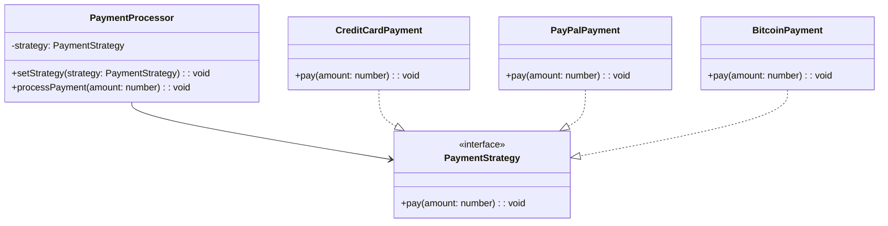

## 5.9.1 Intent and Motivation

In the realm of software design, flexibility and reusability are paramount. As developers, we often encounter scenarios where we need to choose between different algorithms or behaviors at runtime without altering the client code. This is where the Strategy Pattern shines. Let's delve into the intent and motivation behind this powerful design pattern, using JavaScript and TypeScript as our languages of choice.

### Understanding the Strategy Pattern

The Strategy Pattern is a behavioral design pattern that defines a family of algorithms, encapsulates each one, and makes them interchangeable. This pattern allows the algorithm to vary independently from the clients that use it. In simpler terms, the Strategy Pattern enables you to select an algorithm's behavior at runtime, providing a flexible alternative to hard-coding algorithms directly into the client code.

#### Real-World Analogy: Choosing Routes for Navigation

Imagine you're using a GPS navigation system. Depending on your preferences or current conditions, you might choose different routes: the fastest route, the shortest route, or the scenic route. Each of these routes represents a different algorithm for reaching your destination. The GPS system allows you to switch between these algorithms based on your needs, without changing the underlying system. This is akin to how the Strategy Pattern operates in software design.

### The Problem with Hard-Coding Algorithms

In traditional software design, algorithms are often hard-coded into the client classes. This approach poses several challenges:

1. **Lack of Flexibility**: Hard-coded algorithms make it difficult to change behavior without modifying the client code. This can lead to a rigid system that's hard to adapt or extend.

2. **Code Duplication**: When similar algorithms are needed in different parts of the application, they often get duplicated, leading to maintenance challenges.

3. **Reduced Reusability**: Hard-coded algorithms are tightly coupled with the client code, reducing the ability to reuse them in different contexts.

4. **Difficulty in Testing**: Testing becomes cumbersome as the algorithm logic is intertwined with the client code, making it hard to isolate and test individual components.

### How the Strategy Pattern Solves These Problems

The Strategy Pattern addresses these issues by promoting the encapsulation of algorithms. Here's how it works:

- **Encapsulation**: Each algorithm is encapsulated within its own class, implementing a common interface. This allows for easy interchangeability and isolation of logic.

- **Decoupling**: The client code is decoupled from the specific algorithm implementations. It interacts with the algorithm through a common interface, enabling flexibility.

- **Flexibility**: New algorithms can be introduced without altering the client code. This makes the system more adaptable to change.

- **Reusability**: Algorithms can be reused across different parts of the application or even in different projects, enhancing code reusability.

- **Testability**: With algorithms encapsulated in separate classes, they can be tested independently, improving test coverage and reliability.

### Implementing the Strategy Pattern in JavaScript

Let's explore how to implement the Strategy Pattern in JavaScript. We'll use a simple example of a payment processing system that supports multiple payment methods.

```javascript
// Define the Strategy interface
class PaymentStrategy {
  pay(amount) {
    throw new Error("This method should be overridden!");
  }
}

// Implement Concrete Strategies
class CreditCardPayment extends PaymentStrategy {
  pay(amount) {
    console.log(`Paid ${amount} using Credit Card.`);
  }
}

class PayPalPayment extends PaymentStrategy {
  pay(amount) {
    console.log(`Paid ${amount} using PayPal.`);
  }
}

class BitcoinPayment extends PaymentStrategy {
  pay(amount) {
    console.log(`Paid ${amount} using Bitcoin.`);
  }
}

// Context class
class PaymentProcessor {
  constructor(strategy) {
    this.strategy = strategy;
  }

  setStrategy(strategy) {
    this.strategy = strategy;
  }

  processPayment(amount) {
    this.strategy.pay(amount);
  }
}

// Client code
const paymentProcessor = new PaymentProcessor(new CreditCardPayment());
paymentProcessor.processPayment(100); // Paid 100 using Credit Card.

paymentProcessor.setStrategy(new PayPalPayment());
paymentProcessor.processPayment(200); // Paid 200 using PayPal.

paymentProcessor.setStrategy(new BitcoinPayment());
paymentProcessor.processPayment(300); // Paid 300 using Bitcoin.
```

In this example, the `PaymentStrategy` class defines the interface for payment algorithms. Concrete strategies like `CreditCardPayment`, `PayPalPayment`, and `BitcoinPayment` implement this interface. The `PaymentProcessor` class acts as the context, allowing the client to switch between different payment strategies at runtime.

### Implementing the Strategy Pattern in TypeScript

TypeScript enhances the Strategy Pattern implementation with strong typing and interfaces. Let's see how it looks in TypeScript.

```typescript
// Define the Strategy interface
interface PaymentStrategy {
  pay(amount: number): void;
}

// Implement Concrete Strategies
class CreditCardPayment implements PaymentStrategy {
  pay(amount: number): void {
    console.log(`Paid ${amount} using Credit Card.`);
  }
}

class PayPalPayment implements PaymentStrategy {
  pay(amount: number): void {
    console.log(`Paid ${amount} using PayPal.`);
  }
}

class BitcoinPayment implements PaymentStrategy {
  pay(amount: number): void {
    console.log(`Paid ${amount} using Bitcoin.`);
  }
}

// Context class
class PaymentProcessor {
  private strategy: PaymentStrategy;

  constructor(strategy: PaymentStrategy) {
    this.strategy = strategy;
  }

  setStrategy(strategy: PaymentStrategy): void {
    this.strategy = strategy;
  }

  processPayment(amount: number): void {
    this.strategy.pay(amount);
  }
}

// Client code
const paymentProcessor = new PaymentProcessor(new CreditCardPayment());
paymentProcessor.processPayment(100); // Paid 100 using Credit Card.

paymentProcessor.setStrategy(new PayPalPayment());
paymentProcessor.processPayment(200); // Paid 200 using PayPal.

paymentProcessor.setStrategy(new BitcoinPayment());
paymentProcessor.processPayment(300); // Paid 300 using Bitcoin.
```

In TypeScript, we define the `PaymentStrategy` interface to enforce a contract for all payment strategies. This ensures that each strategy class implements the `pay` method, providing type safety and reducing runtime errors.

### Benefits of the Strategy Pattern

The Strategy Pattern offers several benefits that make it a valuable tool in a developer's arsenal:

1. **Flexibility**: By encapsulating algorithms, the Strategy Pattern allows for dynamic changes in behavior at runtime. This flexibility is crucial in applications where requirements frequently change.

2. **Reusability**: Encapsulated strategies can be reused across different parts of an application or even in different projects, promoting code reuse and reducing duplication.

3. **Maintainability**: With algorithms decoupled from client code, the system becomes easier to maintain. Changes to an algorithm do not affect the client, minimizing the risk of introducing bugs.

4. **Scalability**: New strategies can be added without modifying existing code, making the system scalable and adaptable to future requirements.

5. **Testability**: Encapsulated strategies can be tested independently, improving test coverage and ensuring the reliability of each algorithm.

### Visualizing the Strategy Pattern

To better understand the Strategy Pattern, let's visualize its structure using a class diagram.



In this diagram, the `PaymentStrategy` interface defines the contract for all strategies. Concrete strategy classes like `CreditCardPayment`, `PayPalPayment`, and `BitcoinPayment` implement this interface. The `PaymentProcessor` class acts as the context, holding a reference to a `PaymentStrategy` and delegating the payment process to it.

### Try It Yourself

To deepen your understanding of the Strategy Pattern, try modifying the code examples above. Here are some suggestions:

- **Add a New Payment Method**: Implement a new payment strategy, such as `ApplePayPayment`, and integrate it into the `PaymentProcessor`.

- **Enhance the PaymentProcessor**: Add logging functionality to track which payment method was used for each transaction.

- **Experiment with Different Contexts**: Create a new context class, such as `ShippingProcessor`, that uses different shipping strategies.

### Knowledge Check

To reinforce your understanding of the Strategy Pattern, consider the following questions:

- How does the Strategy Pattern promote flexibility in software design?
- What are the benefits of encapsulating algorithms in separate classes?
- How does the Strategy Pattern improve code reusability and maintainability?
- What role does the context class play in the Strategy Pattern?
- How can TypeScript's strong typing enhance the implementation of the Strategy Pattern?

### Embrace the Journey

Remember, mastering design patterns is a journey. The Strategy Pattern is just one of many tools available to you as a developer. As you continue to explore and apply design patterns, you'll gain a deeper understanding of how to create flexible, maintainable, and scalable software. Keep experimenting, stay curious, and enjoy the journey!

## Quiz Time!



### What is the primary intent of the Strategy Pattern?

- [x] To define a family of algorithms, encapsulate each one, and make them interchangeable.
- [ ] To provide a simplified interface to a complex subsystem.
- [ ] To compose objects into tree structures.
- [ ] To allow incompatible interfaces to work together.

> **Explanation:** The Strategy Pattern's primary intent is to define a family of algorithms, encapsulate each one, and make them interchangeable, allowing the algorithm to vary independently from the clients that use it.

### How does the Strategy Pattern improve flexibility?

- [x] By allowing algorithms to be selected at runtime.
- [ ] By hard-coding algorithms into client classes.
- [ ] By reducing the number of classes in the system.
- [ ] By eliminating the need for interfaces.

> **Explanation:** The Strategy Pattern improves flexibility by allowing algorithms to be selected at runtime, enabling dynamic changes in behavior without altering client code.

### What is a key benefit of encapsulating algorithms in separate classes?

- [x] It enhances code reusability and maintainability.
- [ ] It reduces the number of lines of code.
- [ ] It eliminates the need for testing.
- [ ] It simplifies the user interface.

> **Explanation:** Encapsulating algorithms in separate classes enhances code reusability and maintainability by decoupling the algorithm from the client code, allowing for independent changes and reuse.

### In the Strategy Pattern, what role does the context class play?

- [x] It holds a reference to a strategy and delegates behavior to it.
- [ ] It implements all strategy algorithms directly.
- [ ] It acts as an interface for all strategies.
- [ ] It provides a default algorithm that cannot be changed.

> **Explanation:** The context class in the Strategy Pattern holds a reference to a strategy and delegates behavior to it, allowing for dynamic selection of algorithms.

### How does TypeScript enhance the Strategy Pattern implementation?

- [x] By providing strong typing and interfaces.
- [ ] By eliminating the need for interfaces.
- [ ] By reducing the number of strategy classes.
- [ ] By automatically selecting the best algorithm.

> **Explanation:** TypeScript enhances the Strategy Pattern implementation by providing strong typing and interfaces, ensuring that each strategy class adheres to a defined contract, reducing runtime errors.

### Which of the following is NOT a benefit of the Strategy Pattern?

- [ ] Flexibility
- [ ] Reusability
- [ ] Maintainability
- [x] Simplicity

> **Explanation:** While the Strategy Pattern offers flexibility, reusability, and maintainability, it does not necessarily simplify the system, as it introduces additional classes for each strategy.

### What is the main problem with hard-coding algorithms into client classes?

- [x] It reduces flexibility and adaptability.
- [ ] It increases the number of classes.
- [ ] It simplifies testing.
- [ ] It enhances code readability.

> **Explanation:** Hard-coding algorithms into client classes reduces flexibility and adaptability, making it difficult to change behavior without altering the client code.

### How can the Strategy Pattern improve testability?

- [x] By allowing algorithms to be tested independently.
- [ ] By eliminating the need for testing.
- [ ] By reducing the number of test cases.
- [ ] By combining all algorithms into a single class.

> **Explanation:** The Strategy Pattern improves testability by allowing algorithms to be tested independently, as they are encapsulated in separate classes.

### What is a real-world analogy for the Strategy Pattern?

- [x] Choosing different routes for navigation.
- [ ] Building a house with different materials.
- [ ] Cooking a meal with various ingredients.
- [ ] Writing a book with multiple authors.

> **Explanation:** A real-world analogy for the Strategy Pattern is choosing different routes for navigation, where each route represents a different algorithm for reaching a destination.

### True or False: The Strategy Pattern allows for dynamic changes in behavior at runtime.

- [x] True
- [ ] False

> **Explanation:** True. The Strategy Pattern allows for dynamic changes in behavior at runtime by enabling the selection of different algorithms without altering the client code.


