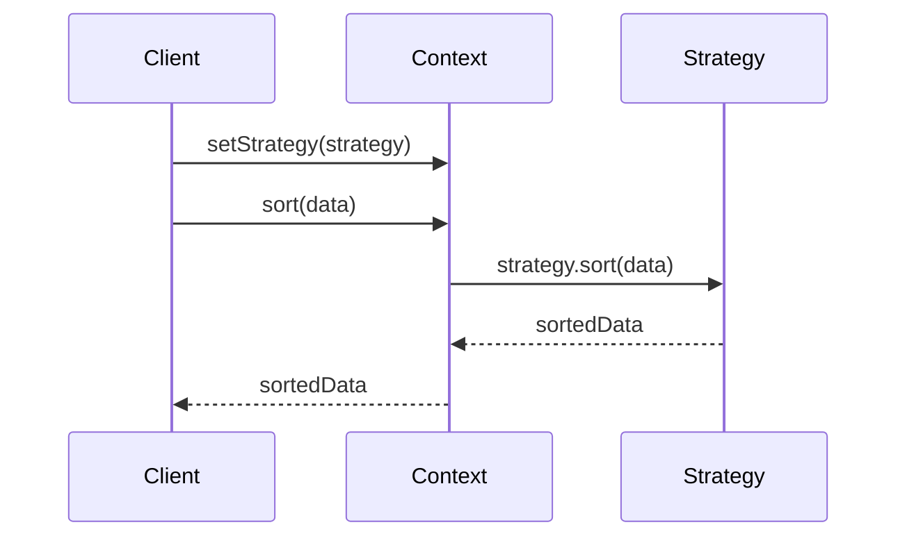

## 5.9.2 Implementation in JavaScript

The Strategy Pattern is a behavioral design pattern that allows you to define a family of algorithms, encapsulate each one as a strategy, and make them interchangeable. This pattern is particularly useful when you need to select an algorithm at runtime, providing flexibility and promoting code reusability. In this section, we will dive into the implementation of the Strategy Pattern in JavaScript, demonstrating how to create a context and multiple strategy objects, and how to dynamically swap strategies.

### Understanding the Strategy Pattern

Before we delve into the implementation, let's briefly understand the key components of the Strategy Pattern:

1. **Context**: This is the class that uses a Strategy to perform an operation. It maintains a reference to a Strategy object and delegates the algorithm execution to the Strategy.

2. **Strategy Interface**: This defines a common interface for all supported algorithms. Each concrete strategy implements this interface.

3. **Concrete Strategies**: These are classes that implement the Strategy interface, each providing a different algorithm.

The Strategy Pattern is particularly useful when you have multiple ways to perform a task, and you want to choose the best one based on the current context or user input.

### Implementing the Strategy Pattern in JavaScript

Let's start by implementing a simple example of the Strategy Pattern in JavaScript. We'll create a context that can perform a sorting operation using different sorting algorithms.

#### Step 1: Define the Strategy Interface

In JavaScript, we can use functions or classes to represent strategies. For simplicity, we'll use classes in this example. We'll define a `SortStrategy` interface that all concrete strategies will implement.

```javascript
// SortStrategy interface
class SortStrategy {
  sort(data) {
    throw new Error("This method should be overridden by subclasses");
  }
}
```

#### Step 2: Implement Concrete Strategies

Next, we'll implement two concrete strategies: `BubbleSortStrategy` and `QuickSortStrategy`. Each will provide a different sorting algorithm.

```javascript
// Concrete Strategy: Bubble Sort
class BubbleSortStrategy extends SortStrategy {
  sort(data) {
    console.log("Sorting using Bubble Sort");
    const arr = [...data];
    for (let i = 0; i < arr.length - 1; i++) {
      for (let j = 0; j < arr.length - i - 1; j++) {
        if (arr[j] > arr[j + 1]) {
          [arr[j], arr[j + 1]] = [arr[j + 1], arr[j]];
        }
      }
    }
    return arr;
  }
}

// Concrete Strategy: Quick Sort
class QuickSortStrategy extends SortStrategy {
  sort(data) {
    console.log("Sorting using Quick Sort");
    const arr = [...data];
    if (arr.length <= 1) return arr;
    const pivot = arr[arr.length - 1];
    const left = [];
    const right = [];
    for (let i = 0; i < arr.length - 1; i++) {
      if (arr[i] < pivot) left.push(arr[i]);
      else right.push(arr[i]);
    }
    return [...this.sort(left), pivot, ...this.sort(right)];
  }
}
```

#### Step 3: Create the Context

The context class will maintain a reference to a strategy object and delegate the sorting operation to the strategy.

```javascript
// Context
class SortContext {
  constructor(strategy) {
    this.strategy = strategy;
  }

  setStrategy(strategy) {
    this.strategy = strategy;
  }

  sort(data) {
    return this.strategy.sort(data);
  }
}
```

#### Step 4: Demonstrate Strategy Usage

Now, let's see how the context can use different strategies to sort data.

```javascript
// Client code
const data = [5, 2, 9, 1, 5, 6];

const bubbleSortStrategy = new BubbleSortStrategy();
const quickSortStrategy = new QuickSortStrategy();

const context = new SortContext(bubbleSortStrategy);
console.log("Sorted data:", context.sort(data));

context.setStrategy(quickSortStrategy);
console.log("Sorted data:", context.sort(data));
```

### Explanation of the Code

- **Strategy Interface**: The `SortStrategy` class defines the `sort` method, which must be implemented by all concrete strategies.
- **Concrete Strategies**: `BubbleSortStrategy` and `QuickSortStrategy` provide specific implementations of the `sort` method.
- **Context**: The `SortContext` class uses a strategy to perform the sorting operation. It allows changing the strategy at runtime using the `setStrategy` method.
- **Client Code**: We create a context with a specific strategy and sort the data. We then change the strategy and sort the data again, demonstrating the flexibility of the Strategy Pattern.

### Swapping Strategies at Runtime

One of the key benefits of the Strategy Pattern is the ability to swap strategies at runtime. This allows the application to adapt to different conditions or user preferences without changing the context's code.

In the example above, we demonstrated how to change the sorting algorithm by calling the `setStrategy` method on the context. This flexibility makes the Strategy Pattern a powerful tool for designing extensible and maintainable applications.

### Using Functions as Strategies

In JavaScript, functions are first-class citizens, meaning they can be passed around as arguments, returned from other functions, and assigned to variables. This makes it easy to use functions as strategies.

Let's modify our example to use functions instead of classes for the sorting strategies.

```javascript
// Strategy functions
const bubbleSort = (data) => {
  console.log("Sorting using Bubble Sort");
  const arr = [...data];
  for (let i = 0; i < arr.length - 1; i++) {
    for (let j = 0; j < arr.length - i - 1; j++) {
      if (arr[j] > arr[j + 1]) {
        [arr[j], arr[j + 1]] = [arr[j + 1], arr[j]];
      }
    }
  }
  return arr;
};

const quickSort = (data) => {
  console.log("Sorting using Quick Sort");
  const arr = [...data];
  if (arr.length <= 1) return arr;
  const pivot = arr[arr.length - 1];
  const left = [];
  const right = [];
  for (let i = 0; i < arr.length - 1; i++) {
    if (arr[i] < pivot) left.push(arr[i]);
    else right.push(arr[i]);
  }
  return [...quickSort(left), pivot, ...quickSort(right)];
};

// Context using functions
class SortContextFunction {
  constructor(strategy) {
    this.strategy = strategy;
  }

  setStrategy(strategy) {
    this.strategy = strategy;
  }

  sort(data) {
    return this.strategy(data);
  }
}

// Client code using functions
const contextFunction = new SortContextFunction(bubbleSort);
console.log("Sorted data:", contextFunction.sort(data));

contextFunction.setStrategy(quickSort);
console.log("Sorted data:", contextFunction.sort(data));
```

### Key Takeaways

- **Flexibility**: The Strategy Pattern provides a flexible way to choose an algorithm at runtime.
- **Reusability**: By encapsulating algorithms in separate classes or functions, you can reuse them across different contexts.
- **Maintainability**: The Strategy Pattern promotes clean code by separating concerns and reducing conditional logic.

### Visualizing the Strategy Pattern

To better understand how the Strategy Pattern works, let's visualize the interaction between the context and the strategies using a sequence diagram.



**Diagram Description**: This sequence diagram illustrates the interaction between the client, context, and strategy. The client sets a strategy on the context and calls the `sort` method. The context delegates the sorting operation to the strategy, which returns the sorted data to the context, and finally to the client.

### Try It Yourself

To deepen your understanding of the Strategy Pattern, try modifying the code examples:

- **Add a New Strategy**: Implement a new sorting algorithm, such as Merge Sort, and integrate it into the context.
- **Experiment with Data**: Use different datasets to see how each strategy performs.
- **Optimize Strategies**: Improve the efficiency of the existing strategies.

### Further Reading

For more information on the Strategy Pattern and other design patterns, consider exploring the following resources:

- [MDN Web Docs: JavaScript Functions](https://developer.mozilla.org/en-US/docs/Web/JavaScript/Guide/Functions)
- [Refactoring Guru: Strategy Pattern](https://refactoring.guru/design-patterns/strategy)
- [JavaScript Design Patterns](https://www.patterns.dev/posts/classic-design-patterns/)

### Embrace the Journey

Remember, mastering design patterns is a journey. As you practice and apply these patterns in your projects, you'll gain a deeper understanding of their benefits and nuances. Keep experimenting, stay curious, and enjoy the process of becoming a more proficient developer!

## Quiz Time!



### What is the primary purpose of the Strategy Pattern?

- [x] To define a family of algorithms and make them interchangeable
- [ ] To create a single algorithm that can handle all scenarios
- [ ] To encapsulate data within a single class
- [ ] To ensure a class has only one instance

> **Explanation:** The Strategy Pattern allows you to define a family of algorithms, encapsulate each one, and make them interchangeable.

### In the Strategy Pattern, what role does the Context play?

- [x] It uses a strategy to perform an operation
- [ ] It defines the algorithms
- [ ] It implements the algorithms
- [ ] It stores the data

> **Explanation:** The Context class maintains a reference to a Strategy object and delegates the algorithm execution to the Strategy.

### How can strategies be represented in JavaScript?

- [x] As functions or classes
- [ ] Only as classes
- [ ] Only as functions
- [ ] As variables

> **Explanation:** In JavaScript, strategies can be represented as either functions or classes, thanks to the language's flexibility.

### What method is used to change the strategy at runtime in the provided example?

- [x] setStrategy
- [ ] changeStrategy
- [ ] updateStrategy
- [ ] swapStrategy

> **Explanation:** The `setStrategy` method is used to change the strategy at runtime in the context class.

### Which of the following is a benefit of the Strategy Pattern?

- [x] Flexibility in algorithm selection
- [ ] Increased code complexity
- [ ] Reduced code readability
- [ ] Limited algorithm options

> **Explanation:** The Strategy Pattern provides flexibility by allowing different algorithms to be selected and used at runtime.

### What is a key characteristic of a Strategy Interface?

- [x] It defines a common interface for all supported algorithms
- [ ] It implements all algorithms
- [ ] It stores data for algorithms
- [ ] It provides a default algorithm

> **Explanation:** The Strategy Interface defines a common interface that all concrete strategies must implement.

### What is the benefit of using functions as strategies in JavaScript?

- [x] Functions are first-class citizens and can be easily passed around
- [ ] Functions are faster than classes
- [ ] Functions are easier to write than classes
- [ ] Functions require less memory

> **Explanation:** In JavaScript, functions are first-class citizens, meaning they can be passed around as arguments, returned from other functions, and assigned to variables, making them ideal for use as strategies.

### What is the role of Concrete Strategies in the Strategy Pattern?

- [x] They provide specific implementations of the Strategy interface
- [ ] They define the Strategy interface
- [ ] They store the data for the Context
- [ ] They manage the Context

> **Explanation:** Concrete Strategies implement the Strategy interface, providing specific algorithms for the Context to use.

### How does the Strategy Pattern promote code maintainability?

- [x] By separating concerns and reducing conditional logic
- [ ] By combining all algorithms into a single class
- [ ] By increasing the number of classes
- [ ] By using global variables

> **Explanation:** The Strategy Pattern promotes code maintainability by separating concerns, encapsulating algorithms, and reducing the need for conditional logic.

### True or False: The Strategy Pattern can only be used for sorting algorithms.

- [ ] True
- [x] False

> **Explanation:** False. The Strategy Pattern can be used for any scenario where multiple algorithms are applicable, not just sorting.


