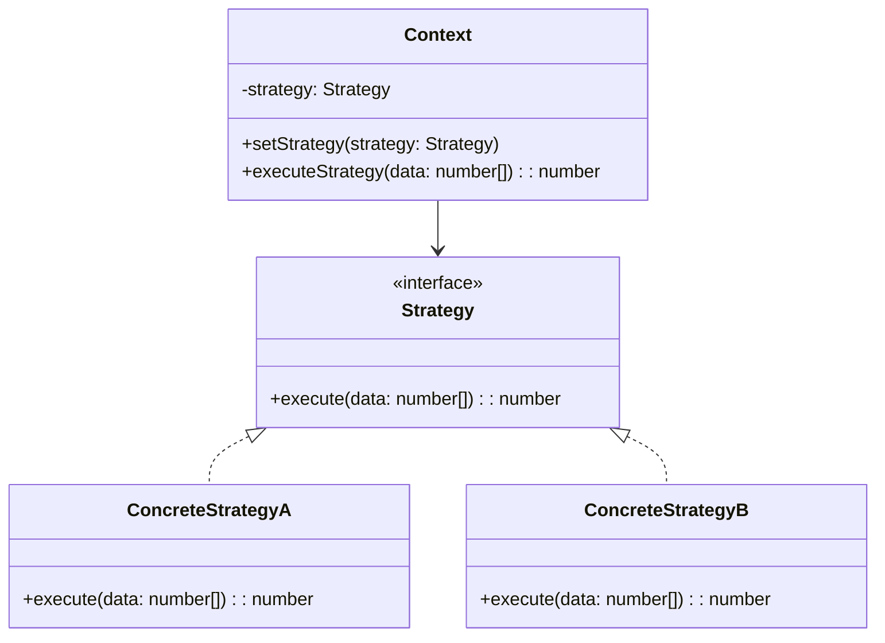

## 5.9.3 Implementation in TypeScript

In this section, we will delve into implementing the Strategy Pattern using TypeScript, a powerful language that enhances JavaScript with static types and other advanced features. The Strategy Pattern is a behavioral design pattern that enables selecting an algorithm's behavior at runtime. It defines a family of algorithms, encapsulates each one, and makes them interchangeable. This pattern is particularly useful in scenarios where multiple algorithms are applicable, and the choice of algorithm is determined at runtime.

### Understanding the Strategy Pattern

Before we dive into the TypeScript implementation, let's briefly recap the core components of the Strategy Pattern:

1. **Strategy Interface**: This defines a common interface for all supported algorithms. Each algorithm is encapsulated in a class that implements this interface.
2. **Concrete Strategies**: These are classes that implement the Strategy interface, providing specific implementations of the algorithm.
3. **Context**: This class maintains a reference to a Strategy object and delegates the algorithm's execution to the current strategy.

### Implementing the Strategy Pattern in TypeScript

TypeScript's strong typing and interface capabilities make it an excellent choice for implementing the Strategy Pattern. Let's explore how to define and use this pattern effectively.

#### Defining the Strategy Interface

In TypeScript, interfaces are used to define the structure of an object. We will start by defining a Strategy interface with type annotations. This interface will represent the algorithm's contract.

```typescript
// Strategy.ts
export interface Strategy {
    execute(data: number[]): number;
}
```

The `Strategy` interface declares a method `execute` that takes an array of numbers and returns a number. This method will be implemented by various concrete strategies.

#### Creating Concrete Strategies

Next, we'll create concrete strategy classes that implement the `Strategy` interface. Each class will provide a specific algorithm implementation.

```typescript
// ConcreteStrategyA.ts
import { Strategy } from './Strategy';

export class ConcreteStrategyA implements Strategy {
    execute(data: number[]): number {
        // Example algorithm: Sum all numbers
        return data.reduce((acc, value) => acc + value, 0);
    }
}

// ConcreteStrategyB.ts
import { Strategy } from './Strategy';

export class ConcreteStrategyB implements Strategy {
    execute(data: number[]): number {
        // Example algorithm: Find the maximum number
        return Math.max(...data);
    }
}
```

In these examples, `ConcreteStrategyA` sums all numbers in the array, while `ConcreteStrategyB` finds the maximum number.

#### Implementing the Context Class

The Context class will interact with the Strategy interface. It holds a reference to a Strategy object and delegates the algorithm's execution to the current strategy.

```typescript
// Context.ts
import { Strategy } from './Strategy';

export class Context {
    private strategy: Strategy;

    constructor(strategy: Strategy) {
        this.strategy = strategy;
    }

    setStrategy(strategy: Strategy) {
        this.strategy = strategy;
    }

    executeStrategy(data: number[]): number {
        return this.strategy.execute(data);
    }
}
```

The `Context` class has a `strategy` property that holds the current strategy. The `setStrategy` method allows changing the strategy at runtime. The `executeStrategy` method delegates the execution to the current strategy.

#### Using the Strategy Pattern

Now that we have defined the Strategy interface, concrete strategies, and the Context class, let's see how to use them together.

```typescript
// Client.ts
import { Context } from './Context';
import { ConcreteStrategyA } from './ConcreteStrategyA';
import { ConcreteStrategyB } from './ConcreteStrategyB';

// Create context with a specific strategy
const context = new Context(new ConcreteStrategyA());

const data = [1, 2, 3, 4, 5];
console.log('Strategy A result:', context.executeStrategy(data)); // Output: 15

// Change strategy at runtime
context.setStrategy(new ConcreteStrategyB());
console.log('Strategy B result:', context.executeStrategy(data)); // Output: 5
```

In this example, we create a `Context` with `ConcreteStrategyA`, execute the strategy, and then switch to `ConcreteStrategyB` at runtime.

### Advantages of Using TypeScript

TypeScript provides several advantages when implementing the Strategy Pattern:

1. **Type Safety**: TypeScript's static type checking ensures that the strategies conform to the defined interface, reducing runtime errors.
2. **IntelliSense Support**: With TypeScript, developers benefit from IntelliSense in IDEs, which provides code completion and documentation hints.
3. **Refactoring Ease**: TypeScript's type system makes it easier to refactor code by catching type mismatches and other errors during development.

### Advanced TypeScript Features

TypeScript offers advanced features that can enhance the Strategy Pattern implementation. Let's explore some of these features.

#### Generics

Generics allow creating reusable components that work with any data type. We can use generics to make our Strategy interface more flexible.

```typescript
// GenericStrategy.ts
export interface Strategy<T> {
    execute(data: T[]): T;
}
```

With generics, the `Strategy` interface can work with any data type, not just numbers.

#### Union Types and Type Guards

Union types and type guards can be used to create more flexible strategies that handle different data types.

```typescript
// FlexibleStrategy.ts
import { Strategy } from './GenericStrategy';

export class FlexibleStrategy implements Strategy<number | string> {
    execute(data: (number | string)[]): number | string {
        if (typeof data[0] === 'number') {
            return data.reduce((acc, value) => acc + (value as number), 0);
        } else {
            return data.join('');
        }
    }
}
```

In this example, `FlexibleStrategy` can handle arrays of numbers or strings, using type guards to determine the appropriate operation.

### Visualizing the Strategy Pattern

To better understand the Strategy Pattern, let's visualize its components and interactions using a class diagram.



**Diagram Description**: The diagram illustrates the Strategy Pattern's structure, showing the `Strategy` interface, `ConcreteStrategyA`, `ConcreteStrategyB`, and the `Context` class. The Context class depends on the Strategy interface, allowing it to interact with any concrete strategy.

### Try It Yourself

Experiment with the Strategy Pattern by modifying the code examples:

- **Add a New Strategy**: Implement a new strategy class, such as `ConcreteStrategyC`, that calculates the average of numbers.
- **Use Generics**: Modify the `Strategy` interface to use generics, allowing it to handle different data types.
- **Implement a Flexible Strategy**: Create a strategy that can handle both numbers and strings, using union types and type guards.

### Knowledge Check

Let's reinforce what we've learned with some questions and exercises:

1. **What is the main purpose of the Strategy Pattern?**
2. **How does TypeScript's type system enhance the Strategy Pattern?**
3. **Implement a new strategy that finds the minimum number in an array.**

### Embrace the Journey

Remember, mastering design patterns is a journey. The Strategy Pattern is just one of many patterns that can help you write more maintainable and scalable code. Keep experimenting, stay curious, and enjoy the process of learning and applying these powerful concepts.

## Quiz Time!



### What is the primary role of the Strategy interface in the Strategy Pattern?

- [x] To define a common interface for all supported algorithms.
- [ ] To execute the algorithm directly.
- [ ] To maintain the state of the context.
- [ ] To provide a default implementation of the algorithm.

> **Explanation:** The Strategy interface defines a common interface for all supported algorithms, allowing them to be interchangeable.

### How does TypeScript enhance the implementation of the Strategy Pattern?

- [x] By providing type safety and IntelliSense support.
- [ ] By allowing dynamic typing.
- [ ] By enforcing runtime checks.
- [ ] By eliminating the need for interfaces.

> **Explanation:** TypeScript enhances the Strategy Pattern by providing type safety and IntelliSense support, which helps catch errors during development.

### What is the purpose of the Context class in the Strategy Pattern?

- [x] To maintain a reference to a Strategy object and delegate the algorithm's execution.
- [ ] To implement the algorithm directly.
- [ ] To define the Strategy interface.
- [ ] To provide a default strategy.

> **Explanation:** The Context class maintains a reference to a Strategy object and delegates the algorithm's execution to the current strategy.

### Which TypeScript feature allows creating reusable components that work with any data type?

- [x] Generics
- [ ] Union types
- [ ] Type guards
- [ ] Interfaces

> **Explanation:** Generics allow creating reusable components that work with any data type, enhancing flexibility.

### How can union types and type guards be used in the Strategy Pattern?

- [x] To create flexible strategies that handle different data types.
- [ ] To enforce strict type checking.
- [ ] To eliminate the need for interfaces.
- [ ] To provide default implementations.

> **Explanation:** Union types and type guards can be used to create flexible strategies that handle different data types by determining the appropriate operation.

### What is the benefit of using interfaces in TypeScript?

- [x] They define the structure of an object and enforce type safety.
- [ ] They allow dynamic typing.
- [ ] They eliminate the need for classes.
- [ ] They provide default implementations.

> **Explanation:** Interfaces in TypeScript define the structure of an object and enforce type safety, ensuring that implementations conform to the defined contract.

### What is the advantage of using the Strategy Pattern?

- [x] It allows selecting an algorithm's behavior at runtime.
- [ ] It eliminates the need for multiple classes.
- [ ] It provides a single implementation for all algorithms.
- [ ] It enforces a strict execution order.

> **Explanation:** The Strategy Pattern allows selecting an algorithm's behavior at runtime, providing flexibility in choosing the appropriate algorithm.

### How does the Context class interact with the Strategy interface?

- [x] It holds a reference to a Strategy object and delegates execution.
- [ ] It implements the Strategy interface directly.
- [ ] It provides a default strategy.
- [ ] It defines the Strategy interface.

> **Explanation:** The Context class holds a reference to a Strategy object and delegates the algorithm's execution to the current strategy.

### What is the role of concrete strategy classes?

- [x] To provide specific implementations of the algorithm.
- [ ] To define the Strategy interface.
- [ ] To maintain the state of the context.
- [ ] To execute the algorithm directly.

> **Explanation:** Concrete strategy classes provide specific implementations of the algorithm, adhering to the Strategy interface.

### True or False: The Strategy Pattern is a structural design pattern.

- [ ] True
- [x] False

> **Explanation:** The Strategy Pattern is a behavioral design pattern, not a structural one.


