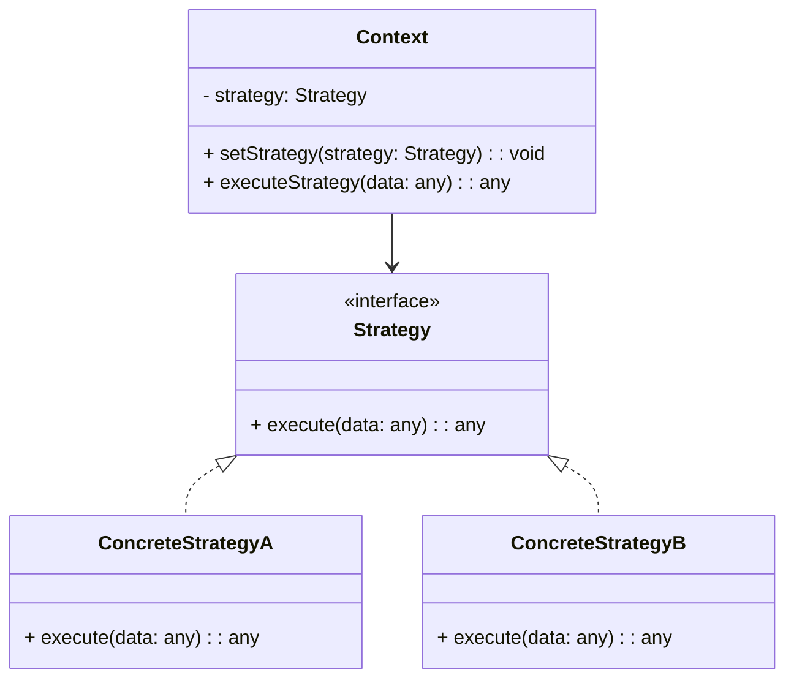

## 5.9.4 Use Cases and Examples

The Strategy Pattern is a powerful tool in the software developer's toolkit, especially when it comes to designing systems that require flexibility and scalability. It allows us to define a family of algorithms, encapsulate each one, and make them interchangeable. This pattern is particularly useful in scenarios where we need to choose an algorithm at runtime, such as sorting algorithms, payment methods, or data compression strategies. In this section, we will explore these use cases in detail, demonstrating how the Strategy Pattern can be implemented in JavaScript and TypeScript.

### Sorting Algorithms

Sorting is a fundamental operation in computer science, and different algorithms can be more efficient depending on the context. The Strategy Pattern allows us to switch between different sorting algorithms without changing the client code.

#### Example: Sorting Algorithms in JavaScript

Let's consider a scenario where we need to sort an array of numbers. We can define different sorting strategies like Bubble Sort, Quick Sort, and Merge Sort.

```javascript
// Define the Strategy interface
class SortStrategy {
    sort(data) {
        throw new Error("This method should be overridden!");
    }
}

// Implement Bubble Sort strategy
class BubbleSortStrategy extends SortStrategy {
    sort(data) {
        console.log("Sorting using Bubble Sort");
        // Bubble Sort implementation
        for (let i = 0; i < data.length; i++) {
            for (let j = 0; j < data.length - i - 1; j++) {
                if (data[j] > data[j + 1]) {
                    [data[j], data[j + 1]] = [data[j + 1], data[j]];
                }
            }
        }
        return data;
    }
}

// Implement Quick Sort strategy
class QuickSortStrategy extends SortStrategy {
    sort(data) {
        console.log("Sorting using Quick Sort");
        // Quick Sort implementation
        if (data.length <= 1) return data;
        let pivot = data[0];
        let left = data.slice(1).filter(item => item < pivot);
        let right = data.slice(1).filter(item => item >= pivot);
        return [...this.sort(left), pivot, ...this.sort(right)];
    }
}

// Context class
class SortContext {
    constructor(strategy) {
        this.strategy = strategy;
    }

    setStrategy(strategy) {
        this.strategy = strategy;
    }

    sort(data) {
        return this.strategy.sort(data);
    }
}

// Usage
let data = [5, 3, 8, 4, 2];
let context = new SortContext(new BubbleSortStrategy());
console.log(context.sort(data)); // Output: [2, 3, 4, 5, 8]

context.setStrategy(new QuickSortStrategy());
console.log(context.sort(data)); // Output: [2, 3, 4, 5, 8]
```

In this example, we define a `SortStrategy` interface and implement two different sorting strategies: `BubbleSortStrategy` and `QuickSortStrategy`. The `SortContext` class allows us to switch between these strategies at runtime.

#### Example: Sorting Algorithms in TypeScript

TypeScript provides strong typing, which can help catch errors at compile time. Let's implement the same example in TypeScript.

```typescript
// Define the Strategy interface
interface SortStrategy {
    sort(data: number[]): number[];
}

// Implement Bubble Sort strategy
class BubbleSortStrategy implements SortStrategy {
    sort(data: number[]): number[] {
        console.log("Sorting using Bubble Sort");
        for (let i = 0; i < data.length; i++) {
            for (let j = 0; j < data.length - i - 1; j++) {
                if (data[j] > data[j + 1]) {
                    [data[j], data[j + 1]] = [data[j + 1], data[j]];
                }
            }
        }
        return data;
    }
}

// Implement Quick Sort strategy
class QuickSortStrategy implements SortStrategy {
    sort(data: number[]): number[] {
        console.log("Sorting using Quick Sort");
        if (data.length <= 1) return data;
        let pivot = data[0];
        let left = data.slice(1).filter(item => item < pivot);
        let right = data.slice(1).filter(item => item >= pivot);
        return [...this.sort(left), pivot, ...this.sort(right)];
    }
}

// Context class
class SortContext {
    private strategy: SortStrategy;

    constructor(strategy: SortStrategy) {
        this.strategy = strategy;
    }

    setStrategy(strategy: SortStrategy) {
        this.strategy = strategy;
    }

    sort(data: number[]): number[] {
        return this.strategy.sort(data);
    }
}

// Usage
let data = [5, 3, 8, 4, 2];
let context = new SortContext(new BubbleSortStrategy());
console.log(context.sort(data)); // Output: [2, 3, 4, 5, 8]

context.setStrategy(new QuickSortStrategy());
console.log(context.sort(data)); // Output: [2, 3, 4, 5, 8]
```

### Payment Methods

In e-commerce applications, it's common to support multiple payment methods. The Strategy Pattern can help us manage these different payment strategies.

#### Example: Payment Methods in JavaScript

Consider a scenario where we need to process payments using different methods like Credit Card, PayPal, and Bitcoin.

```javascript
// Define the Strategy interface
class PaymentStrategy {
    pay(amount) {
        throw new Error("This method should be overridden!");
    }
}

// Implement Credit Card strategy
class CreditCardStrategy extends PaymentStrategy {
    pay(amount) {
        console.log(`Paying ${amount} using Credit Card`);
    }
}

// Implement PayPal strategy
class PayPalStrategy extends PaymentStrategy {
    pay(amount) {
        console.log(`Paying ${amount} using PayPal`);
    }
}

// Implement Bitcoin strategy
class BitcoinStrategy extends PaymentStrategy {
    pay(amount) {
        console.log(`Paying ${amount} using Bitcoin`);
    }
}

// Context class
class PaymentContext {
    constructor(strategy) {
        this.strategy = strategy;
    }

    setStrategy(strategy) {
        this.strategy = strategy;
    }

    pay(amount) {
        this.strategy.pay(amount);
    }
}

// Usage
let context = new PaymentContext(new CreditCardStrategy());
context.pay(100); // Output: Paying 100 using Credit Card

context.setStrategy(new PayPalStrategy());
context.pay(200); // Output: Paying 200 using PayPal

context.setStrategy(new BitcoinStrategy());
context.pay(300); // Output: Paying 300 using Bitcoin
```

#### Example: Payment Methods in TypeScript

Let's implement the same payment methods example in TypeScript.

```typescript
// Define the Strategy interface
interface PaymentStrategy {
    pay(amount: number): void;
}

// Implement Credit Card strategy
class CreditCardStrategy implements PaymentStrategy {
    pay(amount: number): void {
        console.log(`Paying ${amount} using Credit Card`);
    }
}

// Implement PayPal strategy
class PayPalStrategy implements PaymentStrategy {
    pay(amount: number): void {
        console.log(`Paying ${amount} using PayPal`);
    }
}

// Implement Bitcoin strategy
class BitcoinStrategy implements PaymentStrategy {
    pay(amount: number): void {
        console.log(`Paying ${amount} using Bitcoin`);
    }
}

// Context class
class PaymentContext {
    private strategy: PaymentStrategy;

    constructor(strategy: PaymentStrategy) {
        this.strategy = strategy;
    }

    setStrategy(strategy: PaymentStrategy) {
        this.strategy = strategy;
    }

    pay(amount: number): void {
        this.strategy.pay(amount);
    }
}

// Usage
let context = new PaymentContext(new CreditCardStrategy());
context.pay(100); // Output: Paying 100 using Credit Card

context.setStrategy(new PayPalStrategy());
context.pay(200); // Output: Paying 200 using PayPal

context.setStrategy(new BitcoinStrategy());
context.pay(300); // Output: Paying 300 using Bitcoin
```

### Data Compression Strategies

Data compression is another area where the Strategy Pattern shines. Different compression algorithms can be used depending on the data and the requirements.

#### Example: Data Compression in JavaScript

Let's consider a scenario where we need to compress data using different algorithms like ZIP and GZIP.

```javascript
// Define the Strategy interface
class CompressionStrategy {
    compress(data) {
        throw new Error("This method should be overridden!");
    }
}

// Implement ZIP compression strategy
class ZipCompressionStrategy extends CompressionStrategy {
    compress(data) {
        console.log("Compressing using ZIP");
        // ZIP compression implementation
        return "ZIP compressed data";
    }
}

// Implement GZIP compression strategy
class GzipCompressionStrategy extends CompressionStrategy {
    compress(data) {
        console.log("Compressing using GZIP");
        // GZIP compression implementation
        return "GZIP compressed data";
    }
}

// Context class
class CompressionContext {
    constructor(strategy) {
        this.strategy = strategy;
    }

    setStrategy(strategy) {
        this.strategy = strategy;
    }

    compress(data) {
        return this.strategy.compress(data);
    }
}

// Usage
let context = new CompressionContext(new ZipCompressionStrategy());
console.log(context.compress("Some data")); // Output: ZIP compressed data

context.setStrategy(new GzipCompressionStrategy());
console.log(context.compress("Some data")); // Output: GZIP compressed data
```

#### Example: Data Compression in TypeScript

Let's implement the same data compression example in TypeScript.

```typescript
// Define the Strategy interface
interface CompressionStrategy {
    compress(data: string): string;
}

// Implement ZIP compression strategy
class ZipCompressionStrategy implements CompressionStrategy {
    compress(data: string): string {
        console.log("Compressing using ZIP");
        return "ZIP compressed data";
    }
}

// Implement GZIP compression strategy
class GzipCompressionStrategy implements CompressionStrategy {
    compress(data: string): string {
        console.log("Compressing using GZIP");
        return "GZIP compressed data";
    }
}

// Context class
class CompressionContext {
    private strategy: CompressionStrategy;

    constructor(strategy: CompressionStrategy) {
        this.strategy = strategy;
    }

    setStrategy(strategy: CompressionStrategy) {
        this.strategy = strategy;
    }

    compress(data: string): string {
        return this.strategy.compress(data);
    }
}

// Usage
let context = new CompressionContext(new ZipCompressionStrategy());
console.log(context.compress("Some data")); // Output: ZIP compressed data

context.setStrategy(new GzipCompressionStrategy());
console.log(context.compress("Some data")); // Output: GZIP compressed data
```

### Benefits of the Strategy Pattern

The Strategy Pattern offers several benefits in terms of code organization and maintainability:

1. **Flexibility**: It allows us to switch between different algorithms or strategies at runtime without modifying the client code.

2. **Encapsulation**: Each strategy is encapsulated in its own class, making the code easier to understand and maintain.

3. **Scalability**: Adding new strategies is straightforward and does not affect the existing codebase.

4. **Separation of Concerns**: The pattern promotes the separation of concerns by isolating the algorithm implementation from the client code.

### Adding New Strategies

One of the key advantages of the Strategy Pattern is the ease with which new strategies can be added. To add a new strategy, simply create a new class that implements the strategy interface and update the context to use this new strategy. This process does not require any changes to the existing strategies or the client code.

### Choosing Between Strategy and Other Patterns

When deciding whether to use the Strategy Pattern or another pattern like State or Template Method, consider the following:

- **Strategy vs. State**: Use the Strategy Pattern when you need to switch between different algorithms or behaviors at runtime. Use the State Pattern when an object's behavior changes based on its internal state.

- **Strategy vs. Template Method**: Use the Strategy Pattern when you want to define a family of algorithms and make them interchangeable. Use the Template Method Pattern when you want to define the skeleton of an algorithm and allow subclasses to override specific steps.

### Try It Yourself

To deepen your understanding of the Strategy Pattern, try modifying the examples provided:

- **Sorting Algorithms**: Implement additional sorting strategies like Merge Sort or Insertion Sort and integrate them into the context.

- **Payment Methods**: Add new payment strategies like Apple Pay or Google Pay and test them with the context.

- **Data Compression**: Implement additional compression strategies like LZ77 or Huffman Coding and see how they fit into the context.

### Visualizing the Strategy Pattern

To better understand the Strategy Pattern, let's visualize how the context interacts with different strategies.



In this diagram, the `Context` class maintains a reference to a `Strategy` object and delegates the execution of the strategy to this object. The `ConcreteStrategyA` and `ConcreteStrategyB` classes implement the `Strategy` interface, allowing them to be used interchangeably by the `Context`.

### Knowledge Check

To ensure you have a solid understanding of the Strategy Pattern, consider the following questions:

1. What are the main benefits of using the Strategy Pattern?
2. How does the Strategy Pattern promote code maintainability?
3. What is the difference between the Strategy Pattern and the State Pattern?
4. How can new strategies be added without affecting the existing codebase?

### Embrace the Journey

Remember, mastering design patterns is a journey. As you progress, you'll find more opportunities to apply these patterns in your projects. Keep experimenting, stay curious, and enjoy the journey!

## Quiz Time!



### What is a primary benefit of using the Strategy Pattern?

- [x] It allows switching between algorithms at runtime.
- [ ] It reduces the number of classes in a system.
- [ ] It simplifies the user interface.
- [ ] It eliminates the need for interfaces.

> **Explanation:** The Strategy Pattern allows us to switch between different algorithms at runtime without modifying the client code.

### How does the Strategy Pattern promote code maintainability?

- [x] By encapsulating each strategy in its own class.
- [ ] By reducing the number of methods in a class.
- [ ] By combining multiple strategies into one class.
- [ ] By eliminating the need for classes.

> **Explanation:** Each strategy is encapsulated in its own class, making the code easier to understand and maintain.

### What is the difference between the Strategy Pattern and the State Pattern?

- [x] Strategy is for interchangeable algorithms; State is for behavior based on internal state.
- [ ] Strategy is for behavior based on internal state; State is for interchangeable algorithms.
- [ ] Both patterns are used for the same purpose.
- [ ] Strategy is only used in functional programming.

> **Explanation:** The Strategy Pattern is used for interchangeable algorithms, while the State Pattern is used when an object's behavior changes based on its internal state.

### How can new strategies be added to a system using the Strategy Pattern?

- [x] By creating a new class that implements the strategy interface.
- [ ] By modifying the existing strategy classes.
- [ ] By adding new methods to the context class.
- [ ] By changing the client code.

> **Explanation:** To add a new strategy, create a new class that implements the strategy interface, which does not require changes to existing strategies or client code.

### Which of the following is a use case for the Strategy Pattern?

- [x] Sorting algorithms
- [ ] Singleton instantiation
- [x] Payment methods
- [ ] Object cloning

> **Explanation:** The Strategy Pattern is suitable for scenarios like sorting algorithms and payment methods where different strategies can be used interchangeably.

### In the context of the Strategy Pattern, what is the role of the Context class?

- [x] It maintains a reference to a strategy object and delegates execution.
- [ ] It implements all the strategies.
- [ ] It defines the algorithm interface.
- [ ] It stores the results of the strategy execution.

> **Explanation:** The Context class maintains a reference to a strategy object and delegates the execution of the strategy to this object.

### When should you choose the Strategy Pattern over the Template Method Pattern?

- [x] When you want to define a family of algorithms and make them interchangeable.
- [ ] When you want to define the skeleton of an algorithm.
- [ ] When you want to eliminate the need for interfaces.
- [ ] When you want to reduce the number of classes.

> **Explanation:** The Strategy Pattern is used when you want to define a family of algorithms and make them interchangeable, whereas the Template Method Pattern is used to define the skeleton of an algorithm.

### What is the advantage of using TypeScript for implementing the Strategy Pattern?

- [x] Strong typing helps catch errors at compile time.
- [ ] It eliminates the need for interfaces.
- [ ] It reduces the number of classes needed.
- [ ] It simplifies the user interface.

> **Explanation:** TypeScript provides strong typing, which can help catch errors at compile time, making the implementation of the Strategy Pattern more robust.

### Which of the following is NOT a benefit of the Strategy Pattern?

- [ ] Flexibility
- [ ] Encapsulation
- [ ] Scalability
- [x] Reducing the number of classes

> **Explanation:** While the Strategy Pattern offers flexibility, encapsulation, and scalability, it does not necessarily reduce the number of classes; instead, it often increases them by encapsulating each strategy in its own class.

### True or False: The Strategy Pattern can be used to manage different compression algorithms.

- [x] True
- [ ] False

> **Explanation:** The Strategy Pattern is well-suited for managing different compression algorithms, allowing them to be interchangeable without affecting the client code.


