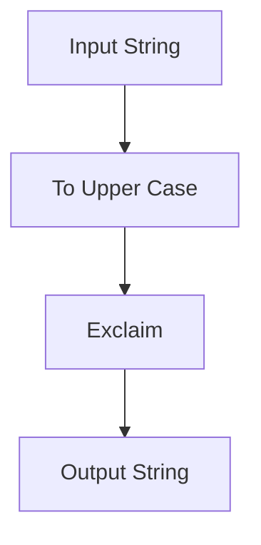

## 6.1 Introduction to Functional Programming in JavaScript

Functional programming (FP) is a programming paradigm that treats computation as the evaluation of mathematical functions and avoids changing state and mutable data. In recent years, FP has gained significant traction in the JavaScript community, thanks to its ability to produce more predictable and maintainable code. In this section, we will delve into the core principles of functional programming, explore why it is becoming increasingly popular, and demonstrate how these concepts can be applied in JavaScript and enhanced with TypeScript.

### What is Functional Programming?

Functional programming is a declarative programming paradigm, meaning that it focuses on what to solve rather than how to solve it. In contrast to imperative programming, which uses statements to change a program's state, FP uses expressions or declarations. Here are some core concepts of functional programming:

- **Pure Functions**: Functions that, given the same input, will always return the same output and have no side effects.
- **Immutability**: Data cannot be changed once created. Instead, new data structures are created from existing ones.
- **First-Class Functions**: Functions are treated as first-class citizens, meaning they can be assigned to variables, passed as arguments, and returned from other functions.
- **Higher-Order Functions**: Functions that take other functions as arguments or return them as results.
- **Function Composition**: The process of combining two or more functions to produce a new function.

### Why is Functional Programming Gaining Popularity?

Functional programming is gaining popularity for several reasons:

1. **Predictability and Testability**: Pure functions are predictable and easier to test because they do not rely on or modify external state.
2. **Concurrency**: FP's emphasis on immutability makes it easier to write concurrent programs because immutable data structures can be shared between threads without the risk of race conditions.
3. **Modularity and Reusability**: FP encourages small, reusable functions that can be composed to build complex functionality.
4. **Readability and Maintainability**: FP's declarative nature often leads to more readable and maintainable code.

### Core Principles of Functional Programming

#### Pure Functions

A pure function is a function where the output value is determined only by its input values, without observable side effects. This means that the function does not modify any external state or rely on data that may change. Let's look at an example:

```javascript
// Pure function example
function add(a, b) {
  return a + b;
}

console.log(add(2, 3)); // Always returns 5
```

In this example, `add` is a pure function because it always returns the same result for the same inputs and does not modify any external state.

#### Immutability

Immutability is the concept of data being unchangeable. Instead of modifying data, you create new data structures. This can be achieved in JavaScript using methods like `Object.freeze()` or libraries like Immutable.js. Here's an example:

```javascript
const person = {
  name: 'Alice',
  age: 30
};

// Using Object.freeze to make the object immutable
const immutablePerson = Object.freeze(person);

// Attempting to change the immutable object
immutablePerson.age = 31; // This will not change the age property

console.log(immutablePerson.age); // Still 30
```

#### First-Class and Higher-Order Functions

In JavaScript, functions are first-class citizens, meaning they can be stored in variables, passed as arguments, and returned from other functions. Higher-order functions are functions that operate on other functions. Here's an example:

```javascript
// Higher-order function example
function greet(name) {
  return `Hello, ${name}!`;
}

function sayHello(greetFunction, name) {
  console.log(greetFunction(name));
}

sayHello(greet, 'Bob'); // Outputs: Hello, Bob!
```

In this example, `sayHello` is a higher-order function because it takes a function (`greet`) as an argument.

#### Function Composition

Function composition is the process of combining two or more functions to produce a new function. This is a powerful concept in FP that allows for building complex operations from simple functions. Here's an example:

```javascript
// Function composition example
const toUpperCase = str => str.toUpperCase();
const exclaim = str => `${str}!`;

const shout = str => exclaim(toUpperCase(str));

console.log(shout('hello')); // Outputs: HELLO!
```

### Functional Programming in JavaScript

JavaScript is a versatile language that supports multiple programming paradigms, including functional programming. Here are some ways JavaScript supports FP:

- **Array Methods**: JavaScript arrays have built-in methods like `map`, `filter`, and `reduce` that are inspired by functional programming.
- **Arrow Functions**: Introduced in ES6, arrow functions provide a concise syntax for writing functions.
- **Closures**: JavaScript's closure feature allows functions to capture and remember their lexical environment, enabling powerful functional patterns.

#### Using Array Methods

Array methods like `map`, `filter`, and `reduce` are powerful tools for functional programming in JavaScript. Let's explore each of these methods with examples:

```javascript
// Using map to transform an array
const numbers = [1, 2, 3, 4, 5];
const doubled = numbers.map(num => num * 2);
console.log(doubled); // Outputs: [2, 4, 6, 8, 10]

// Using filter to select elements
const evenNumbers = numbers.filter(num => num % 2 === 0);
console.log(evenNumbers); // Outputs: [2, 4]

// Using reduce to accumulate values
const sum = numbers.reduce((acc, num) => acc + num, 0);
console.log(sum); // Outputs: 15
```

#### Arrow Functions and Closures

Arrow functions provide a more concise syntax for writing functions and automatically bind the `this` value. Closures allow functions to access variables from their outer scope even after the outer function has finished executing. Here's an example:

```javascript
// Arrow function example
const square = x => x * x;
console.log(square(5)); // Outputs: 25

// Closure example
function createCounter() {
  let count = 0;
  return function() {
    count += 1;
    return count;
  };
}

const counter = createCounter();
console.log(counter()); // Outputs: 1
console.log(counter()); // Outputs: 2
```

### Enhancing Functional Programming with TypeScript

TypeScript, a superset of JavaScript, adds static typing to the language, which can enhance functional programming by providing type safety and better tooling support. Here are some ways TypeScript can improve FP:

- **Type Annotations**: TypeScript allows you to define types for function parameters and return values, making your code more predictable and easier to understand.
- **Generics**: TypeScript's generics enable you to write reusable and type-safe functions.
- **Interfaces**: Interfaces in TypeScript can be used to define the shape of objects, ensuring that functions receive the correct data structure.

#### Type Annotations and Generics

Type annotations and generics can make your functional code more robust and maintainable. Here's an example:

```typescript
// Type annotations example
function add(a: number, b: number): number {
  return a + b;
}

console.log(add(2, 3)); // Outputs: 5

// Generics example
function identity<T>(arg: T): T {
  return arg;
}

console.log(identity<number>(42)); // Outputs: 42
console.log(identity<string>('Hello')); // Outputs: Hello
```

### Visualizing Functional Programming Concepts

To better understand the flow of data and function composition in functional programming, let's visualize these concepts using Mermaid.js diagrams.

#### Function Composition Flowchart



*Caption: This flowchart illustrates the process of function composition, where an input string is transformed by two functions: converting to uppercase and adding an exclamation mark.*

### Try It Yourself

To get hands-on experience with functional programming in JavaScript, try modifying the code examples provided. For instance, experiment with different array methods or create your own higher-order functions. Consider using TypeScript to add type annotations and see how it affects your code's readability and maintainability.

### Knowledge Check

Before we conclude, let's summarize the key takeaways from this section:

- Functional programming treats computation as the evaluation of mathematical functions and avoids changing state and mutable data.
- Core principles of FP include pure functions, immutability, first-class functions, higher-order functions, and function composition.
- JavaScript supports functional programming through features like array methods, arrow functions, and closures.
- TypeScript enhances functional programming by providing type safety and better tooling support.

### Embrace the Journey

Remember, this is just the beginning of your journey into functional programming. As you continue to explore and practice these concepts, you'll gain a deeper understanding of how to write more predictable, maintainable, and scalable code. Keep experimenting, stay curious, and enjoy the journey!

## Quiz Time!



### What is a pure function in functional programming?

- [x] A function that returns the same output for the same input and has no side effects
- [ ] A function that modifies external state
- [ ] A function that relies on global variables
- [ ] A function that can return different outputs for the same input

> **Explanation:** A pure function always returns the same output for the same input and does not cause any side effects, making it predictable and easy to test.

### Which of the following is a benefit of immutability in functional programming?

- [x] Easier to reason about code
- [ ] Increased memory usage
- [ ] More complex code
- [ ] Slower execution

> **Explanation:** Immutability makes it easier to reason about code because data cannot change unexpectedly, reducing bugs and improving maintainability.

### What is a higher-order function?

- [x] A function that takes other functions as arguments or returns them as results
- [ ] A function that modifies global variables
- [ ] A function that has side effects
- [ ] A function that is executed at a higher priority

> **Explanation:** Higher-order functions are functions that operate on other functions, either by taking them as arguments or returning them.

### How does TypeScript enhance functional programming in JavaScript?

- [x] By providing type safety and better tooling support
- [ ] By making JavaScript slower
- [ ] By removing functional programming features
- [ ] By increasing the complexity of code

> **Explanation:** TypeScript enhances functional programming by adding static typing, which provides type safety and better tooling support, making code more robust and maintainable.

### What is function composition?

- [x] The process of combining two or more functions to produce a new function
- [ ] The process of modifying a function's internal state
- [ ] The process of creating a function with side effects
- [ ] The process of executing functions in parallel

> **Explanation:** Function composition involves combining multiple functions to create a new function, allowing for complex operations to be built from simple functions.

### Which JavaScript feature allows functions to capture and remember their lexical environment?

- [x] Closures
- [ ] Promises
- [ ] Callbacks
- [ ] Prototypes

> **Explanation:** Closures allow functions to capture and remember their lexical environment, enabling powerful functional patterns.

### What is the purpose of the `map` method in JavaScript?

- [x] To transform each element in an array
- [ ] To filter elements from an array
- [ ] To reduce an array to a single value
- [ ] To sort elements in an array

> **Explanation:** The `map` method is used to transform each element in an array, creating a new array with the transformed elements.

### What does the `Object.freeze()` method do in JavaScript?

- [x] Makes an object immutable
- [ ] Deletes an object
- [ ] Copies an object
- [ ] Sorts an object

> **Explanation:** `Object.freeze()` makes an object immutable, preventing any changes to its properties.

### Which of the following is an example of a first-class function in JavaScript?

- [x] A function assigned to a variable
- [ ] A function that modifies global state
- [ ] A function that cannot be passed as an argument
- [ ] A function that is executed immediately

> **Explanation:** In JavaScript, functions are first-class citizens, meaning they can be assigned to variables, passed as arguments, and returned from other functions.

### True or False: Functional programming is only useful for small projects.

- [ ] True
- [x] False

> **Explanation:** Functional programming is beneficial for projects of all sizes, as it promotes modularity, reusability, and maintainability, making it suitable for both small and large projects.




