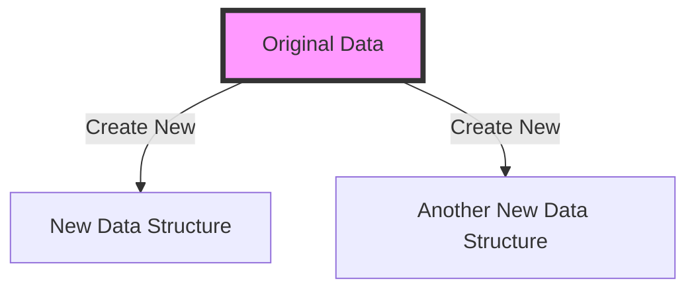

## 6.2.1 Intent and Motivation

In the realm of software development, particularly in functional programming (FP), the concept of immutability in data structures stands as a cornerstone. Immutability refers to the state of an object that cannot be modified after it is created. Instead of altering existing data, new data structures are created. This paradigm shift from mutable to immutable data structures offers numerous benefits, especially in JavaScript and TypeScript, where managing state and side effects can become complex.

### Understanding Immutable Data Structures

**Define Immutable Data Structures**: Immutable data structures are those that, once created, cannot be changed. Any modification to an immutable object results in the creation of a new object with the updated data, leaving the original object unchanged. This concept is pivotal in functional programming, where functions are expected to be pure, meaning they do not have side effects.

**Importance in Functional Programming**: Functional programming emphasizes the use of pure functions and immutable data. Pure functions are those that, given the same input, will always return the same output without altering any external state. Immutability supports this by ensuring that data passed to functions remains unchanged, thereby preventing unintended side effects.

### The Role of Immutability in Preventing Side Effects

**Preventing Side Effects**: Side effects occur when a function modifies some state outside its scope or interacts with the outside world (e.g., modifying a global variable, changing a DOM element, etc.). Immutability helps prevent these side effects by ensuring that data cannot be altered once it is created. This leads to more predictable and reliable code, as functions cannot inadvertently change the state of the application.

**Example: Strings in JavaScript**: In JavaScript, strings are immutable. Any operation that appears to modify a string actually creates a new string. For instance, when you concatenate strings, a new string is created rather than altering the original strings.

```javascript
let greeting = "Hello";
let newGreeting = greeting.concat(", World!");

console.log(greeting); // Output: "Hello"
console.log(newGreeting); // Output: "Hello, World!"
```

In this example, `greeting` remains unchanged, demonstrating immutability.

### Problems Solved by Immutability

1. **State Management**: Immutability simplifies state management by ensuring that state changes are explicit. This is particularly beneficial in applications with complex state management needs, such as those using Redux in React. By ensuring that state is immutable, developers can easily track changes and understand the flow of data.

2. **Concurrency**: In multi-threaded environments, mutable data can lead to race conditions, where the outcome of a program depends on the sequence or timing of uncontrollable events. Immutable data structures eliminate these issues, as data cannot be changed by multiple threads simultaneously.

3. **Debugging and Testing**: Immutable data structures make debugging and testing easier. Since data does not change unexpectedly, developers can rely on the consistency of data throughout the execution of a program. This predictability simplifies the identification of bugs and the creation of reliable tests.

4. **Undo/Redo Functionality**: In applications where undo/redo functionality is required, immutability allows developers to easily implement these features. Since each state change results in a new object, maintaining a history of states becomes straightforward.

### Implementing Immutability in JavaScript and TypeScript

While JavaScript and TypeScript do not enforce immutability by default, developers can implement immutability using various techniques and libraries.

#### Using `Object.freeze()`

JavaScript provides the `Object.freeze()` method to make an object immutable. Once an object is frozen, its properties cannot be added, removed, or changed.

```javascript
const user = {
  name: "Alice",
  age: 30
};

Object.freeze(user);

user.age = 31; // This will not change the age property
console.log(user.age); // Output: 30
```

However, `Object.freeze()` is shallow, meaning it only freezes the immediate properties of the object. Nested objects remain mutable.

#### Libraries for Immutability

Several libraries, such as Immutable.js, offer more robust solutions for immutability by providing persistent data structures that are deeply immutable.

```javascript
const { Map } = require('immutable');

let user = Map({ name: "Alice", age: 30 });
let updatedUser = user.set('age', 31);

console.log(user.get('age')); // Output: 30
console.log(updatedUser.get('age')); // Output: 31
```

Immutable.js ensures that even nested structures are immutable, providing a more comprehensive solution than `Object.freeze()`.

### Visualizing Immutability

To better understand how immutability works, consider the following diagram, which illustrates the creation of new data structures rather than modifying existing ones:



**Caption**: This diagram shows that any operation on the original data results in the creation of a new data structure, leaving the original data unchanged.

### Try It Yourself

Experiment with immutability by modifying the following code examples. Try freezing nested objects or using Immutable.js to create deeply immutable structures. Observe how changes to the data affect the program's behavior.

```javascript
// Nested object example
const user = {
  name: "Alice",
  address: {
    city: "Wonderland"
  }
};

Object.freeze(user);
Object.freeze(user.address);

user.address.city = "New Wonderland"; // Attempt to change nested property
console.log(user.address.city); // Output: "Wonderland"
```

### Knowledge Check

- Explain the concept of immutability and its importance in functional programming.
- Describe how immutability helps prevent side effects in JavaScript and TypeScript.
- Provide examples of problems solved by immutability, such as state management and concurrency issues.

### Further Reading

For more information on immutability and functional programming, consider exploring the following resources:

- [MDN Web Docs on Immutability](https://developer.mozilla.org/en-US/docs/Glossary/Immutable)
- [Immutable.js Documentation](https://immutable-js.github.io/immutable-js/)
- [Functional Programming Concepts](https://www.freecodecamp.org/news/functional-programming-concepts-in-javascript/)

### Embrace the Journey

Remember, mastering immutability is a journey. As you continue to explore functional programming, you'll discover more ways to leverage immutability to write cleaner, more efficient code. Keep experimenting, stay curious, and enjoy the journey!

## Quiz Time!



### What is immutability in data structures?

- [x] Data structures that cannot be changed after creation
- [ ] Data structures that can be modified at any time
- [ ] Data structures that are always mutable
- [ ] Data structures that are only used in object-oriented programming

> **Explanation:** Immutability refers to data structures that cannot be changed once they are created, promoting the creation of new data structures instead.

### How does immutability help prevent side effects?

- [x] By ensuring data cannot be altered, making functions pure
- [ ] By allowing data to be changed freely
- [ ] By promoting global variables
- [ ] By encouraging mutable data structures

> **Explanation:** Immutability ensures that data cannot be altered, which helps in writing pure functions that do not have side effects.

### Which JavaScript method can make an object immutable?

- [x] `Object.freeze()`
- [ ] `Object.seal()`
- [ ] `Object.lock()`
- [ ] `Object.immutable()`

> **Explanation:** `Object.freeze()` is a JavaScript method that makes an object immutable, preventing any changes to its properties.

### What is a drawback of using `Object.freeze()`?

- [x] It is shallow and does not freeze nested objects
- [ ] It makes objects mutable
- [ ] It is only available in TypeScript
- [ ] It cannot be used on arrays

> **Explanation:** `Object.freeze()` is shallow, meaning it only freezes the immediate properties of an object and not any nested objects.

### Which library provides persistent data structures for immutability?

- [x] Immutable.js
- [ ] Lodash
- [ ] jQuery
- [ ] Axios

> **Explanation:** Immutable.js provides persistent data structures that ensure deep immutability.

### What is a benefit of immutability in state management?

- [x] It simplifies tracking state changes
- [ ] It complicates state management
- [ ] It allows for mutable state
- [ ] It prevents state changes

> **Explanation:** Immutability simplifies state management by making state changes explicit and easy to track.

### How does immutability aid in debugging and testing?

- [x] By ensuring data consistency throughout execution
- [ ] By allowing data to change unexpectedly
- [ ] By making tests unreliable
- [ ] By introducing race conditions

> **Explanation:** Immutability ensures data consistency, making it easier to debug and test applications.

### What is a common use case for immutability in applications?

- [x] Implementing undo/redo functionality
- [ ] Creating mutable data structures
- [ ] Promoting side effects
- [ ] Encouraging global state

> **Explanation:** Immutability is commonly used in applications to implement undo/redo functionality by maintaining a history of states.

### How does immutability help with concurrency?

- [x] By eliminating race conditions
- [ ] By introducing race conditions
- [ ] By promoting mutable data
- [ ] By complicating thread management

> **Explanation:** Immutability eliminates race conditions by ensuring that data cannot be changed by multiple threads simultaneously.

### True or False: Immutability is only useful in functional programming.

- [ ] True
- [x] False

> **Explanation:** While immutability is a key concept in functional programming, it is also beneficial in other programming paradigms for improving code reliability and predictability.


