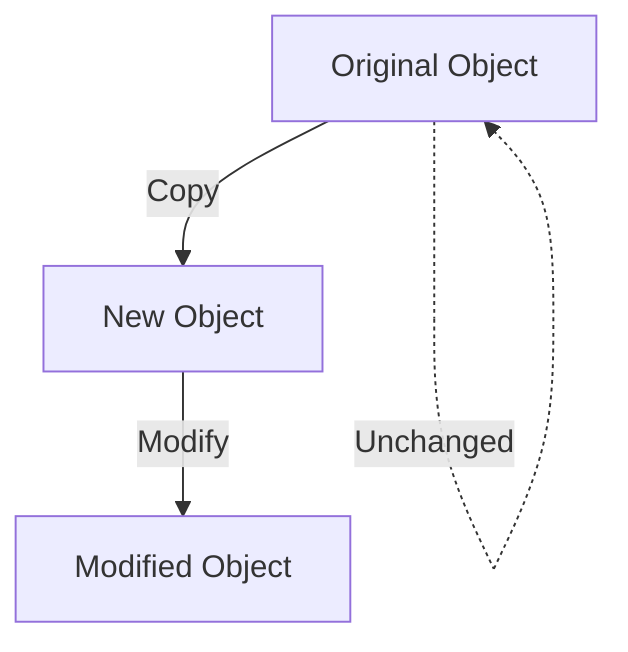

## 6.2.2 Implementation Techniques

In the realm of functional programming, immutability is a cornerstone concept that promotes predictability and reliability in code. By ensuring that data structures cannot be altered after their creation, we can prevent side effects and make our applications more robust. In this section, we will explore various techniques to implement immutable data structures in JavaScript and TypeScript, including the use of native methods like `Object.freeze()`, the spread operator, and popular libraries such as Immutable.js and Immer. We will also delve into how TypeScript can be leveraged to enforce immutability through its type system.

### Understanding Immutability

Before diving into implementation techniques, let's clarify what immutability means. In programming, an immutable object is one whose state cannot be modified after it is created. Instead of altering the original object, any changes result in the creation of a new object. This approach offers several benefits, including easier debugging, improved concurrency, and reduced risk of unintended side effects.

### Native JavaScript Techniques

JavaScript provides several built-in mechanisms to support immutability. Let's explore these native techniques.

#### Using `Object.freeze()`

`Object.freeze()` is a method that prevents modifications to an object. Once an object is frozen, you cannot add, remove, or change its properties.

```javascript
const person = {
  name: "Alice",
  age: 30
};

const frozenPerson = Object.freeze(person);

// Attempting to modify the frozen object
frozenPerson.age = 31; // This will not change the age property
console.log(frozenPerson.age); // Outputs: 30
```

**Key Points:**
- `Object.freeze()` is shallow, meaning it only freezes the immediate properties of the object. Nested objects are not frozen.
- To achieve deep immutability, you need to recursively freeze each nested object.

#### Using the Spread Operator

The spread operator (`...`) provides a convenient way to create shallow copies of objects and arrays, allowing you to implement immutability by creating new versions of data structures with updated values.

```javascript
const originalArray = [1, 2, 3];
const newArray = [...originalArray, 4]; // Adds 4 to the end of the array

console.log(originalArray); // Outputs: [1, 2, 3]
console.log(newArray); // Outputs: [1, 2, 3, 4]

const originalObject = { a: 1, b: 2 };
const newObject = { ...originalObject, b: 3 }; // Updates the value of b

console.log(originalObject); // Outputs: { a: 1, b: 2 }
console.log(newObject); // Outputs: { a: 1, b: 3 }
```

**Key Points:**
- The spread operator creates a shallow copy, so nested objects or arrays will still be mutable.
- Use it to create new versions of data structures with modifications.

### Libraries for Immutability

While native JavaScript techniques are useful, they can be cumbersome for complex data structures. Libraries like Immutable.js and Immer offer more advanced features to handle immutability efficiently.

#### Immutable.js

Immutable.js is a library that provides persistent immutable data structures. It offers a rich API for creating and manipulating immutable collections, such as Lists, Maps, and Sets.

```javascript
import { Map } from 'immutable';

const map1 = Map({ a: 1, b: 2, c: 3 });
const map2 = map1.set('b', 50);

console.log(map1.get('b')); // Outputs: 2
console.log(map2.get('b')); // Outputs: 50
```

**Key Points:**
- Immutable.js structures are persistent, meaning they share unchanged parts of the structure with the original, optimizing memory usage.
- The API is designed to be similar to JavaScript's native collections, making it easy to learn.

#### Immer

Immer is a library that allows you to work with immutable data using a "mutative" syntax. It uses a concept called "drafts" to let you write code that looks like you're modifying the data directly, but it produces a new immutable version.

```javascript
import produce from 'immer';

const baseState = [
  { todo: "Learn JavaScript", done: true },
  { todo: "Learn Immer", done: false }
];

const nextState = produce(baseState, draft => {
  draft.push({ todo: "Learn TypeScript", done: false });
  draft[1].done = true;
});

console.log(baseState[1].done); // Outputs: false
console.log(nextState[1].done); // Outputs: true
```

**Key Points:**
- Immer's API is intuitive and reduces the boilerplate code needed to manage immutable updates.
- It is particularly useful for managing complex state updates in applications like React.

### Performance Considerations

One concern with immutability is the potential performance impact due to frequent copying of data structures. Here are some strategies to mitigate these issues:

1. **Use Persistent Data Structures:** Libraries like Immutable.js use structural sharing to minimize memory usage and improve performance.
2. **Optimize Updates:** Only update the parts of the data structure that have changed. Immer, for example, automatically tracks changes to minimize copying.
3. **Leverage Browser Optimizations:** Modern JavaScript engines are optimized for immutability patterns, so use native methods where possible.

### Enforcing Immutability with TypeScript

TypeScript's type system can be leveraged to enforce immutability at compile time, providing an additional layer of safety.

#### Readonly Types

TypeScript provides the `readonly` modifier to prevent modification of object properties.

```typescript
type Person = {
  readonly name: string;
  readonly age: number;
};

const person: Person = { name: "Alice", age: 30 };

// Attempting to modify a readonly property will result in a compile-time error
// person.age = 31; // Error: Cannot assign to 'age' because it is a read-only property.
```

#### Immutable Utility Types

You can create utility types to enforce immutability across complex data structures.

```typescript
type DeepReadonly<T> = {
  readonly [P in keyof T]: DeepReadonly<T[P]>;
};

type NestedObject = {
  a: number;
  b: {
    c: string;
  };
};

const obj: DeepReadonly<NestedObject> = {
  a: 1,
  b: {
    c: "hello"
  }
};

// obj.b.c = "world"; // Error: Cannot assign to 'c' because it is a read-only property.
```

**Key Points:**
- Use `readonly` to prevent modifications to properties.
- Create utility types for deep immutability, ensuring nested objects are also immutable.

### Try It Yourself

Experiment with the code examples provided. Try modifying the frozen objects or readonly properties to see how immutability is enforced. Use the spread operator to create new versions of objects and arrays. Explore Immutable.js and Immer by creating complex data structures and updating them immutably.

### Visualizing Immutability

To better understand the concept of immutability, let's visualize how data structures are copied and modified.



**Diagram Description:**
- The diagram illustrates the process of copying an original object to create a new object, which is then modified. The original object remains unchanged, demonstrating immutability.

### References and Links

For further reading on immutability and functional programming in JavaScript and TypeScript, consider the following resources:

- [MDN Web Docs: Object.freeze()](https://developer.mozilla.org/en-US/docs/Web/JavaScript/Reference/Global_Objects/Object/freeze)
- [Immutable.js Documentation](https://immutable-js.github.io/immutable-js/)
- [Immer Documentation](https://immerjs.github.io/immer/)
- [TypeScript Handbook: Utility Types](https://www.typescriptlang.org/docs/handbook/utility-types.html)

### Knowledge Check

- What is immutability, and why is it important in functional programming?
- How does `Object.freeze()` differ from the spread operator in terms of immutability?
- What are the benefits of using libraries like Immutable.js and Immer?
- How can TypeScript's type system be used to enforce immutability?

### Embrace the Journey

Remember, mastering immutability is a journey. As you continue to explore and experiment with these techniques, you'll gain a deeper understanding of how to build reliable and maintainable applications. Keep experimenting, stay curious, and enjoy the journey!

## Quiz Time!



### What is the primary benefit of using immutable data structures?

- [x] Preventing unintended side effects
- [ ] Improving data mutability
- [ ] Increasing code complexity
- [ ] Enhancing data storage

> **Explanation:** Immutable data structures prevent unintended side effects by ensuring that data cannot be altered once created.

### Which method in JavaScript can be used to make an object immutable?

- [x] Object.freeze()
- [ ] Object.seal()
- [ ] Object.lock()
- [ ] Object.preventExtensions()

> **Explanation:** `Object.freeze()` is used to make an object immutable by preventing modifications to its properties.

### What is a key feature of the spread operator in JavaScript?

- [x] Creating shallow copies of objects and arrays
- [ ] Freezing objects
- [ ] Deep cloning objects
- [ ] Modifying original objects

> **Explanation:** The spread operator creates shallow copies of objects and arrays, allowing for immutability by creating new versions of data structures.

### How does Immutable.js optimize memory usage?

- [x] By using structural sharing
- [ ] By deep cloning objects
- [ ] By freezing objects
- [ ] By compressing data

> **Explanation:** Immutable.js uses structural sharing to optimize memory usage by sharing unchanged parts of data structures.

### What is the purpose of Immer in managing immutability?

- [x] Allowing a "mutative" syntax to produce immutable data
- [ ] Freezing objects
- [ ] Deep cloning objects
- [ ] Compressing data

> **Explanation:** Immer allows developers to use a "mutative" syntax to produce immutable data, simplifying the process of managing immutability.

### How can TypeScript enforce immutability at compile time?

- [x] By using the `readonly` modifier
- [ ] By using the `const` keyword
- [ ] By using `Object.freeze()`
- [ ] By using the spread operator

> **Explanation:** TypeScript can enforce immutability at compile time by using the `readonly` modifier to prevent modifications to object properties.

### What is a limitation of `Object.freeze()`?

- [x] It only provides shallow immutability
- [ ] It deep clones objects
- [ ] It compresses data
- [ ] It optimizes memory usage

> **Explanation:** `Object.freeze()` only provides shallow immutability, meaning nested objects are not frozen.

### Which library allows for persistent immutable data structures?

- [x] Immutable.js
- [ ] Immer
- [ ] Lodash
- [ ] Ramda

> **Explanation:** Immutable.js provides persistent immutable data structures with a rich API for creating and manipulating collections.

### How does Immer simplify working with immutable data?

- [x] By using drafts to track changes
- [ ] By deep cloning objects
- [ ] By freezing objects
- [ ] By compressing data

> **Explanation:** Immer simplifies working with immutable data by using drafts to track changes, allowing for a "mutative" syntax.

### True or False: The spread operator can be used to create deep copies of objects.

- [ ] True
- [x] False

> **Explanation:** The spread operator creates shallow copies, not deep copies, of objects and arrays.


