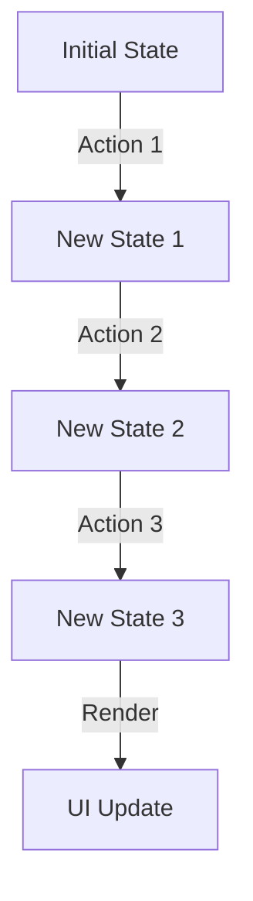

## 6.2.3 Use Cases and Examples

In the realm of software development, immutable data structures have emerged as a powerful tool for managing complexity, especially in environments where state management, concurrency, and performance are critical. In this section, we will explore various use cases and examples where immutable data structures shine, particularly in JavaScript and TypeScript applications.

### Understanding Immutability

Before diving into specific use cases, let's briefly revisit what immutability means. An immutable object is one whose state cannot be modified after it is created. Instead of altering the original object, any changes result in the creation of a new object. This concept is central to functional programming and offers numerous benefits, including easier reasoning about code, reduced side effects, and enhanced predictability.

### Use Case 1: State Management in React and Redux

One of the most common scenarios where immutability is beneficial is in managing state within React and Redux applications. React's component-based architecture and Redux's predictable state container both rely heavily on immutable data structures.

#### Why Immutability in React and Redux?

- **Predictability**: Immutable data ensures that state changes are predictable and traceable, which is crucial for debugging and maintaining complex applications.
- **Performance Optimization**: React can efficiently determine when to re-render components by comparing previous and current states. With immutable data, this comparison is straightforward and fast.
- **Time Travel Debugging**: Redux's ability to "time travel" through state changes is made possible by immutability, allowing developers to step through application states and identify issues.

#### Example: Managing State with Immutable.js

Let's demonstrate how to use immutable data structures in a Redux application using the `Immutable.js` library.

```javascript
import { Map } from 'immutable';

// Initial state
const initialState = Map({
  count: 0,
});

// Reducer function
function counterReducer(state = initialState, action) {
  switch (action.type) {
    case 'INCREMENT':
      return state.update('count', count => count + 1);
    case 'DECREMENT':
      return state.update('count', count => count - 1);
    default:
      return state;
  }
}

// Usage
const state1 = counterReducer(undefined, { type: 'INCREMENT' });
console.log(state1.get('count')); // Output: 1

const state2 = counterReducer(state1, { type: 'INCREMENT' });
console.log(state2.get('count')); // Output: 2
```

In this example, we use `Immutable.js` to manage the state of a simple counter. Each action results in a new state object, preserving the immutability principle.

### Use Case 2: Concurrency and Multithreading

Immutability plays a crucial role in concurrent programming, where multiple threads or processes operate on shared data. By ensuring that data cannot be modified, immutability eliminates race conditions and the need for complex locking mechanisms.

#### Why Immutability in Concurrency?

- **Thread Safety**: Immutable data structures are inherently thread-safe, as they cannot be altered by concurrent processes.
- **Simplified Code**: Without the need for locks or synchronization, code becomes simpler and easier to maintain.
- **Consistency**: Immutability guarantees that data remains consistent across different execution contexts.

#### Example: Immutable Data in Worker Threads

Consider a scenario where we use worker threads in Node.js to perform parallel computations. Immutability ensures that data shared between threads remains consistent.

```javascript
const { Worker, isMainThread, parentPort } = require('worker_threads');

if (isMainThread) {
  const worker = new Worker(__filename);
  worker.on('message', (result) => {
    console.log(`Result from worker: ${result}`);
  });
  worker.postMessage({ numbers: [1, 2, 3, 4, 5] });
} else {
  parentPort.on('message', (data) => {
    const sum = data.numbers.reduce((acc, num) => acc + num, 0);
    parentPort.postMessage(sum);
  });
}
```

In this example, the main thread sends an immutable array of numbers to a worker thread. The worker calculates the sum and sends the result back. The immutability of the array ensures that it remains unchanged during the computation.

### Use Case 3: Performance Trade-offs

While immutability offers numerous benefits, it can also introduce performance trade-offs. Creating new objects for every change can be costly in terms of memory and processing time. However, modern JavaScript engines and libraries like `Immutable.js` and `Immer` mitigate these issues with optimizations such as structural sharing.

#### When to Use Immutable Structures?

- **Frequent State Changes**: In applications with frequent state updates, such as real-time data feeds, immutability can simplify state management.
- **Complex State Logic**: When state logic becomes complex, immutability helps maintain clarity and predictability.
- **Concurrency**: In multi-threaded environments, immutability is essential for ensuring data consistency and thread safety.

#### Example: Using Immer for Performance Optimization

`Immer` is a library that allows you to work with immutable data structures while maintaining the simplicity of mutable operations.

```javascript
import produce from 'immer';

const initialState = {
  todos: [],
};

const nextState = produce(initialState, draft => {
  draft.todos.push({ id: 1, text: 'Learn Immer', completed: false });
});

console.log(initialState.todos.length); // Output: 0
console.log(nextState.todos.length); // Output: 1
```

In this example, `Immer` allows us to use a mutable-like syntax to update the state, while ensuring that the original state remains unchanged. This approach combines the benefits of immutability with the performance of mutable operations.

### Visualizing Immutability in State Management

To better understand how immutability works in state management, let's visualize the flow of state changes in a React application using a Mermaid.js diagram.



In this diagram, each action results in a new state, preserving the immutability principle. The UI is updated based on the latest state, ensuring consistency and predictability.

### Try It Yourself

To deepen your understanding of immutable data structures, try modifying the code examples provided. Experiment with different state management scenarios, such as adding new actions or handling asynchronous updates. Observe how immutability affects the flow of data and the behavior of your application.

### References and Links

For further reading on immutable data structures and their applications, consider exploring the following resources:

- [MDN Web Docs: Immutability](https://developer.mozilla.org/en-US/docs/Glossary/Immutable)
- [Immutable.js Documentation](https://immutable-js.github.io/immutable-js/)
- [Immer Documentation](https://immerjs.github.io/immer/)
- [Concurrency in JavaScript](https://developer.mozilla.org/en-US/docs/Web/JavaScript/EventLoop)

### Knowledge Check

To reinforce your understanding of immutable data structures, consider the following questions:

- How does immutability enhance predictability in state management?
- What are the performance trade-offs associated with immutable data structures?
- In what scenarios is immutability essential for concurrent programming?

### Embrace the Journey

Remember, mastering immutable data structures is a journey. As you continue to explore and experiment, you'll discover new ways to leverage immutability to build more robust and maintainable applications. Keep experimenting, stay curious, and enjoy the journey!

## Quiz Time!



### What is a key benefit of using immutable data structures in React applications?

- [x] Predictability and ease of debugging
- [ ] Increased memory usage
- [ ] Slower performance
- [ ] Complexity in code

> **Explanation:** Immutable data structures ensure that state changes are predictable and traceable, which is crucial for debugging and maintaining complex applications.

### How does immutability contribute to thread safety in concurrent programming?

- [x] It eliminates race conditions by preventing data modification.
- [ ] It requires complex locking mechanisms.
- [ ] It allows multiple threads to modify data simultaneously.
- [ ] It reduces the need for thread synchronization.

> **Explanation:** Immutability ensures that data cannot be modified, eliminating race conditions and the need for complex locking mechanisms.

### What is a potential performance trade-off of using immutable data structures?

- [x] Increased memory usage due to new object creation
- [ ] Decreased predictability in state management
- [ ] Increased complexity in code
- [ ] Reduced thread safety

> **Explanation:** Creating new objects for every change can be costly in terms of memory and processing time, which is a potential trade-off of using immutable data structures.

### Which library allows you to work with immutable data structures while maintaining the simplicity of mutable operations?

- [x] Immer
- [ ] Redux
- [ ] React
- [ ] Node.js

> **Explanation:** Immer is a library that allows you to work with immutable data structures while maintaining the simplicity of mutable operations.

### In what scenario is immutability particularly beneficial?

- [x] Managing state with frequent updates
- [ ] When performance is the only concern
- [ ] In single-threaded applications
- [ ] When data consistency is not important

> **Explanation:** Immutability is particularly beneficial in applications with frequent state updates, such as real-time data feeds, as it simplifies state management.

### What does the `produce` function from the Immer library do?

- [x] It allows mutable-like syntax while ensuring immutability.
- [ ] It modifies the original state directly.
- [ ] It creates a new mutable object.
- [ ] It reduces memory usage by sharing data.

> **Explanation:** The `produce` function from the Immer library allows you to use a mutable-like syntax to update the state, while ensuring that the original state remains unchanged.

### How does immutability affect the flow of data in a React application?

- [x] Each action results in a new state, preserving immutability.
- [ ] It allows direct modification of the original state.
- [ ] It complicates the rendering process.
- [ ] It reduces the need for state management.

> **Explanation:** In a React application, each action results in a new state, preserving immutability and ensuring consistency and predictability.

### What is the role of immutability in Redux's time travel debugging?

- [x] It allows stepping through application states.
- [ ] It complicates the debugging process.
- [ ] It reduces the need for debugging.
- [ ] It allows direct modification of past states.

> **Explanation:** Redux's ability to "time travel" through state changes is made possible by immutability, allowing developers to step through application states and identify issues.

### Which of the following is a library for managing immutable data structures in JavaScript?

- [x] Immutable.js
- [ ] Express.js
- [ ] Lodash
- [ ] jQuery

> **Explanation:** Immutable.js is a library for managing immutable data structures in JavaScript.

### True or False: Immutability guarantees that data remains consistent across different execution contexts.

- [x] True
- [ ] False

> **Explanation:** Immutability guarantees that data remains consistent across different execution contexts, as it cannot be altered by concurrent processes.


