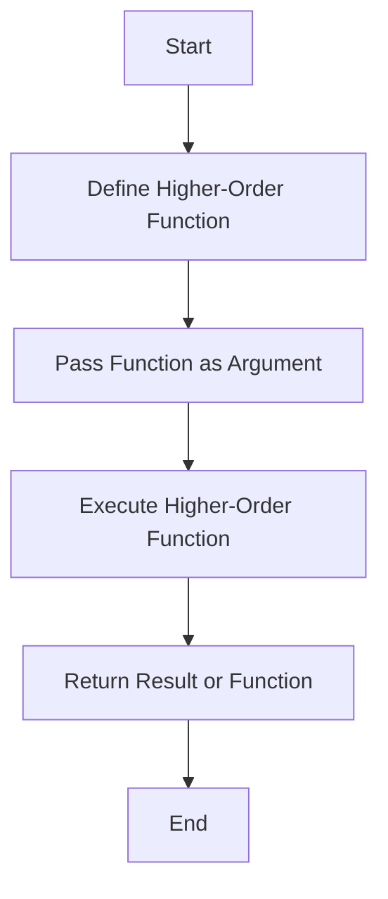

## 6.3.1 Intent and Motivation

In the realm of functional programming, higher-order functions (HOFs) stand as a cornerstone concept that empowers developers to write more abstract, reusable, and expressive code. By understanding and leveraging higher-order functions, we can elevate our JavaScript and TypeScript programming skills to new heights, enabling us to create more flexible and maintainable codebases. Let's delve into the intent and motivation behind higher-order functions, explore their advantages, and see how they can be applied in real-world scenarios.

### Understanding Higher-Order Functions

Higher-order functions are functions that either take other functions as arguments or return them as results. This concept is pivotal in functional programming as it allows functions to be treated as first-class citizens, meaning they can be passed around just like any other value.

#### Definition and Characteristics

A higher-order function is defined by its ability to:

1. **Accept Functions as Arguments**: This allows for the creation of more generic functions that can be customized with different behaviors.
2. **Return Functions as Results**: This enables the creation of function factories, which can generate new functions based on input parameters.

These characteristics allow higher-order functions to encapsulate behaviors, making them reusable and composable.

#### Simple Example

Let's begin with a simple example to illustrate a higher-order function that takes another function as an argument:

```javascript
// A higher-order function that takes a function as an argument
function applyOperation(a, b, operation) {
    return operation(a, b);
}

// A simple function to add two numbers
function add(x, y) {
    return x + y;
}

// Using the higher-order function
const result = applyOperation(5, 3, add);
console.log(result); // Output: 8
```

In this example, `applyOperation` is a higher-order function because it takes `operation`, a function, as an argument. The `add` function is passed to `applyOperation`, allowing it to perform addition on the given numbers.

### Advantages of Higher-Order Functions

Higher-order functions offer several advantages that make them a powerful tool in a developer's toolkit:

1. **Code Abstraction**: By abstracting common patterns into higher-order functions, we can reduce code duplication and increase readability.
2. **Reusability**: Functions that encapsulate behavior can be reused across different parts of an application, promoting DRY (Don't Repeat Yourself) principles.
3. **Composability**: Higher-order functions enable the composition of complex behaviors by combining simpler functions, leading to more modular and maintainable code.
4. **Flexibility**: By allowing functions to be passed as arguments, higher-order functions provide a flexible way to customize behavior without modifying the function itself.

### Exploring Callbacks and Event Handlers

One of the most common uses of higher-order functions is in the form of callbacks and event handlers. These are functions that are passed as arguments to be executed at a later time, often in response to an event or after a certain operation is complete.

#### Callbacks

Callbacks are functions passed as arguments to other functions, allowing asynchronous operations to be handled more effectively. They are a fundamental part of JavaScript's event-driven architecture.

```javascript
// A function that simulates an asynchronous operation
function fetchData(callback) {
    setTimeout(() => {
        const data = { name: 'John Doe', age: 30 };
        callback(data);
    }, 1000);
}

// A callback function to handle the fetched data
function handleData(data) {
    console.log(`Name: ${data.name}, Age: ${data.age}`);
}

// Using the higher-order function with a callback
fetchData(handleData);
```

In this example, `fetchData` is a higher-order function that takes `handleData` as a callback. Once the data is fetched, `handleData` is called with the data as its argument.

#### Event Handlers

Event handlers are another form of higher-order functions, commonly used in web development to handle user interactions.

```javascript
// An event handler function
function onClick(event) {
    console.log(`Button clicked! Event: ${event.type}`);
}

// Adding an event listener using a higher-order function
document.querySelector('button').addEventListener('click', onClick);
```

Here, `addEventListener` is a higher-order function that takes `onClick` as an argument, allowing it to handle click events on a button.

### Functional Utilities: Map, Filter, and Reduce

JavaScript provides several built-in higher-order functions that are indispensable for functional programming: `map`, `filter`, and `reduce`. These functions operate on arrays and provide a declarative way to process data.

#### Map

The `map` function creates a new array by applying a given function to each element of the original array.

```javascript
const numbers = [1, 2, 3, 4, 5];

// A higher-order function using map
const doubled = numbers.map(num => num * 2);

console.log(doubled); // Output: [2, 4, 6, 8, 10]
```

In this example, `map` takes an anonymous function that doubles each number in the array, returning a new array with the results.

#### Filter

The `filter` function creates a new array containing only the elements that satisfy a given condition.

```javascript
const numbers = [1, 2, 3, 4, 5];

// A higher-order function using filter
const evenNumbers = numbers.filter(num => num % 2 === 0);

console.log(evenNumbers); // Output: [2, 4]
```

Here, `filter` takes a function that checks if a number is even, returning a new array with only the even numbers.

#### Reduce

The `reduce` function applies a reducer function to each element of the array, resulting in a single output value.

```javascript
const numbers = [1, 2, 3, 4, 5];

// A higher-order function using reduce
const sum = numbers.reduce((accumulator, currentValue) => accumulator + currentValue, 0);

console.log(sum); // Output: 15
```

In this example, `reduce` takes a function that accumulates the sum of the numbers, starting with an initial value of 0.

### Try It Yourself

To truly grasp the power of higher-order functions, try modifying the examples above. For instance, change the `add` function in the `applyOperation` example to perform subtraction or multiplication. Experiment with different callback functions in the `fetchData` example to see how they affect the output. By playing around with these examples, you'll gain a deeper understanding of how higher-order functions can be used to create flexible and reusable code.

### Visualizing Higher-Order Functions

To better understand how higher-order functions work, let's visualize their operation using a flowchart. This will help clarify the process of passing functions as arguments and returning them as results.



**Figure 1: Flowchart of Higher-Order Function Operation**

This flowchart illustrates the typical flow of a higher-order function. We start by defining the higher-order function, pass another function as an argument, execute the higher-order function, and finally return a result or a new function.

### References and Links

For further reading on higher-order functions and functional programming in JavaScript, consider exploring the following resources:

- [MDN Web Docs: Functions](https://developer.mozilla.org/en-US/docs/Web/JavaScript/Guide/Functions)
- [Eloquent JavaScript: Higher-Order Functions](https://eloquentjavascript.net/05_higher_order.html)
- [JavaScript.info: Function Expressions and Arrows](https://javascript.info/function-expressions-arrows)

### Knowledge Check

To reinforce your understanding of higher-order functions, consider the following questions:

1. What is a higher-order function, and how does it differ from a regular function?
2. How can higher-order functions improve code reusability and abstraction?
3. What are some common use cases for higher-order functions in JavaScript?
4. How do `map`, `filter`, and `reduce` exemplify the use of higher-order functions?
5. What are the benefits of using callbacks and event handlers as higher-order functions?

### Embrace the Journey

Remember, mastering higher-order functions is just one step on your journey to becoming a proficient JavaScript and TypeScript developer. As you continue to explore functional programming concepts, you'll discover new ways to write cleaner, more efficient code. Keep experimenting, stay curious, and enjoy the journey!

## Quiz Time!



### What is a higher-order function?

- [x] A function that takes other functions as arguments or returns them as results
- [ ] A function that only performs arithmetic operations
- [ ] A function that is only used in object-oriented programming
- [ ] A function that cannot be reused

> **Explanation:** Higher-order functions are those that can take other functions as arguments or return them as results, enabling powerful abstraction and code reuse.

### How does a higher-order function improve code abstraction?

- [x] By encapsulating common patterns into reusable functions
- [ ] By making code more complex and harder to read
- [ ] By increasing the number of lines of code
- [ ] By only allowing primitive data types as arguments

> **Explanation:** Higher-order functions abstract common patterns into reusable functions, reducing code duplication and increasing readability.

### Which of the following is NOT a characteristic of higher-order functions?

- [ ] Accepting functions as arguments
- [ ] Returning functions as results
- [x] Only working with primitive data types
- [ ] Enabling code reusability

> **Explanation:** Higher-order functions can accept functions as arguments and return them as results, enabling code reusability. They are not limited to primitive data types.

### What is a common use case for higher-order functions in JavaScript?

- [x] Handling asynchronous operations with callbacks
- [ ] Declaring variables
- [ ] Performing basic arithmetic
- [ ] Creating HTML elements

> **Explanation:** Higher-order functions are commonly used to handle asynchronous operations with callbacks, allowing for more flexible and efficient code.

### How does the `map` function exemplify the use of higher-order functions?

- [x] It applies a given function to each element of an array
- [ ] It sorts an array in ascending order
- [ ] It removes duplicates from an array
- [ ] It concatenates two arrays

> **Explanation:** The `map` function is a higher-order function that applies a given function to each element of an array, creating a new array with the results.

### What is the purpose of using callbacks in higher-order functions?

- [x] To handle asynchronous operations and events
- [ ] To perform synchronous arithmetic operations
- [ ] To create new HTML elements
- [ ] To declare global variables

> **Explanation:** Callbacks are used in higher-order functions to handle asynchronous operations and events, allowing for more responsive and efficient code.

### How does the `reduce` function work as a higher-order function?

- [x] It applies a reducer function to each element of an array, resulting in a single output value
- [ ] It removes elements from an array
- [ ] It duplicates each element of an array
- [ ] It sorts an array in descending order

> **Explanation:** The `reduce` function is a higher-order function that applies a reducer function to each element of an array, resulting in a single output value.

### What is the benefit of using event handlers as higher-order functions?

- [x] They allow for dynamic and flexible responses to user interactions
- [ ] They make code execution slower
- [ ] They prevent errors from occurring
- [ ] They are only used in server-side programming

> **Explanation:** Event handlers as higher-order functions allow for dynamic and flexible responses to user interactions, enhancing the interactivity of web applications.

### Which built-in JavaScript function is NOT a higher-order function?

- [ ] map
- [ ] filter
- [x] parseInt
- [ ] reduce

> **Explanation:** `parseInt` is not a higher-order function; it does not take another function as an argument or return one as a result.

### True or False: Higher-order functions can only be used in functional programming languages.

- [ ] True
- [x] False

> **Explanation:** False. Higher-order functions can be used in any programming language that supports functions as first-class citizens, including JavaScript and TypeScript.


