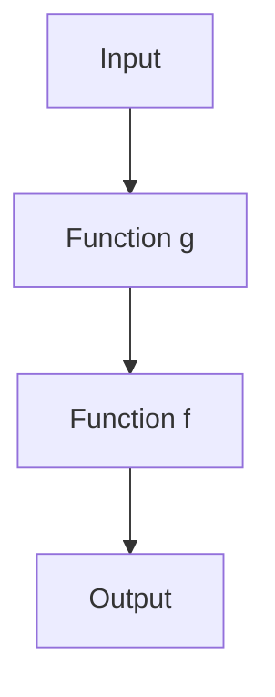

## 6.3.2 Implementation Examples

Higher-order functions are a cornerstone of functional programming, allowing us to write more abstract, flexible, and reusable code. In this section, we will delve into how to create and use higher-order functions in JavaScript and TypeScript. We will explore custom higher-order functions, function composition, and practical applications in event handling and array processing.

### Understanding Higher-Order Functions

A higher-order function is a function that either takes one or more functions as arguments or returns a function as its result. This capability allows us to abstract operations and create more modular code. Let's start by exploring how to create custom higher-order functions.

### Creating Custom Higher-Order Functions

To create a higher-order function, we need to define a function that accepts other functions as parameters or returns a function. Let's look at an example in JavaScript:

```javascript
// A simple higher-order function that takes a function as an argument
function applyOperation(a, b, operation) {
    return operation(a, b);
}

// A few simple operations to use with our higher-order function
function add(x, y) {
    return x + y;
}

function multiply(x, y) {
    return x * y;
}

// Using the higher-order function
console.log(applyOperation(5, 3, add)); // Output: 8
console.log(applyOperation(5, 3, multiply)); // Output: 15
```

In this example, `applyOperation` is a higher-order function that takes two numbers and a function `operation` as arguments. We can pass different functions like `add` and `multiply` to perform various operations.

### Returning Functions from Higher-Order Functions

Higher-order functions can also return functions. This is particularly useful for creating function factories or currying. Let's see an example:

```javascript
// A higher-order function that returns a new function
function createMultiplier(multiplier) {
    return function(x) {
        return x * multiplier;
    };
}

// Creating specific multiplier functions
const double = createMultiplier(2);
const triple = createMultiplier(3);

console.log(double(5)); // Output: 10
console.log(triple(5)); // Output: 15
```

Here, `createMultiplier` is a higher-order function that returns a new function. This returned function takes a number and multiplies it by the `multiplier` provided when the higher-order function was called.

### TypeScript's Function Types and Generics

TypeScript enhances the power of higher-order functions by providing strong typing and generics. This allows us to define more robust and type-safe higher-order functions.

#### Function Types

In TypeScript, we can define the types of functions that are passed as arguments or returned. Here's how we can type our previous `applyOperation` function:

```typescript
// Defining a type for the operation function
type Operation = (x: number, y: number) => number;

function applyOperation(a: number, b: number, operation: Operation): number {
    return operation(a, b);
}

function add(x: number, y: number): number {
    return x + y;
}

function multiply(x: number, y: number): number {
    return x * y;
}

console.log(applyOperation(5, 3, add)); // Output: 8
console.log(applyOperation(5, 3, multiply)); // Output: 15
```

By defining an `Operation` type, we ensure that any function passed as the `operation` argument must match this signature, providing compile-time safety.

#### Using Generics

Generics allow us to create functions that can work with any data type. Let's create a generic higher-order function:

```typescript
// A generic higher-order function
function mapArray<T, U>(array: T[], transform: (item: T) => U): U[] {
    return array.map(transform);
}

// Using the generic function
const numbers = [1, 2, 3, 4];
const strings = mapArray(numbers, num => num.toString());

console.log(strings); // Output: ["1", "2", "3", "4"]
```

In this example, `mapArray` is a generic higher-order function that transforms an array of type `T` into an array of type `U` using the `transform` function.

### Function Composition and Pipelines

Function composition is the process of combining two or more functions to produce a new function. This is a powerful technique for creating complex operations from simple functions.

#### Function Composition

Let's see how we can compose functions in JavaScript:

```javascript
// A simple compose function
function compose(f, g) {
    return function(x) {
        return f(g(x));
    };
}

// Simple functions to compose
function square(x) {
    return x * x;
}

function increment(x) {
    return x + 1;
}

// Composing functions
const incrementAndSquare = compose(square, increment);

console.log(incrementAndSquare(2)); // Output: 9
```

In this example, `compose` takes two functions `f` and `g` and returns a new function that applies `g` to its input and then applies `f` to the result.

#### Pipelines

Pipelines allow us to process data through a series of functions. This is particularly useful for data transformation tasks.

```javascript
// A simple pipeline function
function pipeline(...functions) {
    return function(initialValue) {
        return functions.reduce((value, fn) => fn(value), initialValue);
    };
}

// Functions to use in the pipeline
function double(x) {
    return x * 2;
}

function subtractOne(x) {
    return x - 1;
}

// Creating a pipeline
const processNumber = pipeline(double, subtractOne, square);

console.log(processNumber(3)); // Output: 35
```

Here, `pipeline` takes a series of functions and returns a new function that applies them in sequence to an initial value.

### Practical Applications

Higher-order functions are not just theoretical constructs; they have practical applications in real-world programming. Let's explore some common use cases.

#### Event Handling

In JavaScript, higher-order functions are often used in event handling. For example, we can create a function that logs events and then calls the original event handler:

```javascript
// A higher-order function for logging events
function logEvent(handler) {
    return function(event) {
        console.log('Event:', event.type);
        handler(event);
    };
}

// An example event handler
function handleClick(event) {
    console.log('Button clicked!');
}

// Using the higher-order function
document.querySelector('button').addEventListener('click', logEvent(handleClick));
```

In this example, `logEvent` is a higher-order function that wraps an event handler to log the event type before calling the original handler.

#### Array Processing

Higher-order functions are also widely used in array processing. Functions like `map`, `filter`, and `reduce` are higher-order functions that take other functions as arguments.

```javascript
// Using map to transform an array
const numbers = [1, 2, 3, 4];
const doubled = numbers.map(x => x * 2);

console.log(doubled); // Output: [2, 4, 6, 8]

// Using filter to select elements
const evenNumbers = numbers.filter(x => x % 2 === 0);

console.log(evenNumbers); // Output: [2, 4]

// Using reduce to accumulate values
const sum = numbers.reduce((acc, x) => acc + x, 0);

console.log(sum); // Output: 10
```

These built-in higher-order functions allow us to perform complex data transformations with concise and readable code.

### Visualizing Higher-Order Functions

To better understand how higher-order functions work, let's visualize the process of function composition using a flowchart.



**Figure 1: Function Composition Flowchart**  
This flowchart illustrates the process of function composition, where an input is first processed by function `g`, and the result is then processed by function `f`.

### Try It Yourself

Experimenting with higher-order functions is a great way to deepen your understanding. Try modifying the code examples above to see how changes affect the output. Here are some suggestions:

- Create a higher-order function that takes a list of operations and applies them to an input value.
- Modify the `pipeline` function to include error handling.
- Implement a higher-order function that memoizes the results of expensive computations.

### Knowledge Check

Before we wrap up, let's reinforce what we've learned with a few questions:

- What is a higher-order function?
- How can higher-order functions improve code modularity?
- How does TypeScript enhance higher-order functions with types and generics?

### Embrace the Journey

Remember, mastering higher-order functions is a journey. As you continue to experiment and apply these concepts, you'll find new ways to write more efficient and expressive code. Keep exploring, stay curious, and enjoy the process!

## Quiz Time!



### What is a higher-order function?

- [x] A function that takes one or more functions as arguments or returns a function
- [ ] A function that only performs arithmetic operations
- [ ] A function that only processes arrays
- [ ] A function that does not accept any arguments

> **Explanation:** A higher-order function is one that takes other functions as arguments or returns a function as its result.

### How can higher-order functions improve code modularity?

- [x] By abstracting operations and creating reusable code
- [ ] By making code more complex and harder to read
- [ ] By eliminating the need for functions
- [ ] By reducing the number of variables

> **Explanation:** Higher-order functions allow us to abstract operations, making code more modular and reusable.

### What is the purpose of the `compose` function in JavaScript?

- [x] To combine two functions into a new function
- [ ] To split a function into two separate functions
- [ ] To convert a function into a string
- [ ] To execute a function immediately

> **Explanation:** The `compose` function combines two functions into a new function, applying them in sequence.

### How does TypeScript enhance higher-order functions?

- [x] By providing strong typing and generics
- [ ] By removing the need for function arguments
- [ ] By converting functions into classes
- [ ] By making functions asynchronous

> **Explanation:** TypeScript enhances higher-order functions by providing strong typing and generics, ensuring type safety.

### What is the output of the following code: `console.log(applyOperation(5, 3, multiply));`?

- [x] 15
- [ ] 8
- [ ] 5
- [ ] 3

> **Explanation:** The `applyOperation` function calls the `multiply` function with arguments 5 and 3, resulting in 15.

### In the context of higher-order functions, what is currying?

- [x] Transforming a function with multiple arguments into a series of functions
- [ ] Combining two functions into one
- [ ] Executing a function immediately
- [ ] Converting a function into a string

> **Explanation:** Currying is the process of transforming a function with multiple arguments into a series of functions, each taking a single argument.

### What is the purpose of the `pipeline` function?

- [x] To process data through a series of functions
- [ ] To execute functions in parallel
- [ ] To convert functions into strings
- [ ] To split a function into two separate functions

> **Explanation:** The `pipeline` function processes data through a series of functions, applying them in sequence.

### What is a practical application of higher-order functions in JavaScript?

- [x] Event handling
- [ ] File I/O operations
- [ ] Database management
- [ ] Network communication

> **Explanation:** Higher-order functions are commonly used in event handling to create more flexible and reusable event handlers.

### What is the output of the following code: `console.log(double(5));` if `double` is created using `createMultiplier(2)`?

- [x] 10
- [ ] 5
- [ ] 15
- [ ] 20

> **Explanation:** The `double` function multiplies its input by 2, so `double(5)` results in 10.

### True or False: Higher-order functions can only be used with arrays.

- [ ] True
- [x] False

> **Explanation:** Higher-order functions can be used with any type of data, not just arrays.


