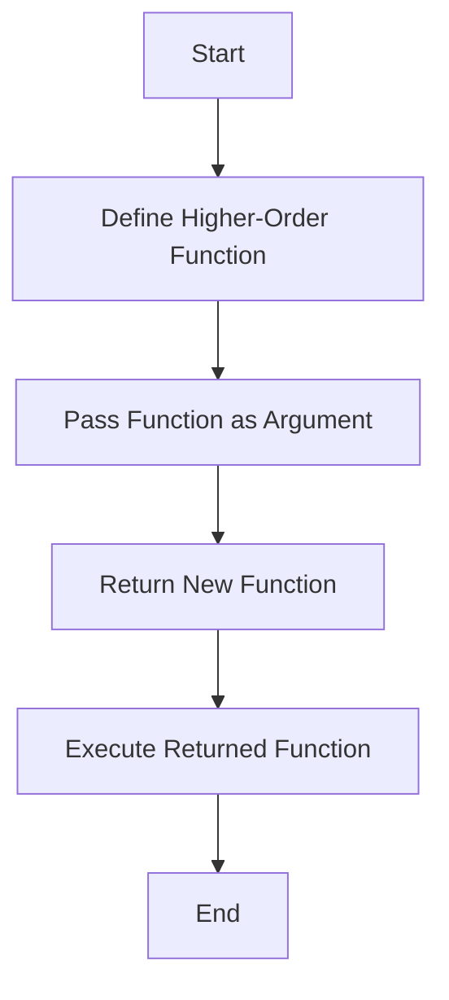

## 6.3.3 Use Cases and Examples

Higher-order functions (HOFs) are a powerful concept in functional programming that can greatly enhance the flexibility and reusability of your code. In this section, we will explore real-world scenarios where higher-order functions simplify coding tasks, such as debouncing, throttling, and middleware patterns. We will also discuss the benefits of using higher-order functions in terms of code modularity and reusability, and how they can be used to implement cross-cutting concerns. Additionally, we will provide tips for debugging and testing higher-order functions.

### Understanding Higher-Order Functions

Before diving into specific use cases, let's briefly recap what higher-order functions are. A higher-order function is a function that either takes one or more functions as arguments or returns a function as its result. This allows for a high degree of abstraction and code reuse.

### Use Case 1: Debouncing

Debouncing is a technique used to limit the rate at which a function is executed. It is particularly useful in scenarios where a function is triggered by events that can occur in rapid succession, such as keystrokes or window resizing.

#### Code Example: Debouncing in JavaScript

```javascript
// Debounce function
function debounce(func, wait) {
  let timeout;
  return function(...args) {
    const context = this;
    clearTimeout(timeout);
    timeout = setTimeout(() => func.apply(context, args), wait);
  };
}

// Usage example
const handleResize = debounce(() => {
  console.log('Window resized');
}, 200);

window.addEventListener('resize', handleResize);
```

In this example, the `debounce` function takes a function `func` and a delay `wait` as arguments. It returns a new function that delays the execution of `func` until after `wait` milliseconds have elapsed since the last time it was invoked.

#### Benefits of Debouncing

- **Performance Improvement**: Reduces the number of times a function is called, improving performance.
- **Resource Efficiency**: Minimizes resource usage by preventing unnecessary function executions.

### Use Case 2: Throttling

Throttling is similar to debouncing, but instead of delaying the execution, it ensures that a function is called at most once in a specified period.

#### Code Example: Throttling in JavaScript

```javascript
// Throttle function
function throttle(func, limit) {
  let lastFunc;
  let lastRan;
  return function(...args) {
    const context = this;
    if (!lastRan) {
      func.apply(context, args);
      lastRan = Date.now();
    } else {
      clearTimeout(lastFunc);
      lastFunc = setTimeout(() => {
        if ((Date.now() - lastRan) >= limit) {
          func.apply(context, args);
          lastRan = Date.now();
        }
      }, limit - (Date.now() - lastRan));
    }
  };
}

// Usage example
const handleScroll = throttle(() => {
  console.log('Scroll event');
}, 1000);

window.addEventListener('scroll', handleScroll);
```

Here, the `throttle` function ensures that `func` is executed at most once every `limit` milliseconds.

#### Benefits of Throttling

- **Controlled Execution**: Ensures consistent execution intervals.
- **Improved User Experience**: Prevents overwhelming the system with rapid function calls.

### Use Case 3: Middleware Pattern

Middleware is a pattern commonly used in web development frameworks, such as Express.js, to handle requests and responses. Higher-order functions can be used to create middleware functions that process requests in a modular and reusable way.

#### Code Example: Middleware in Express.js

```javascript
const express = require('express');
const app = express();

// Middleware function
function logger(req, res, next) {
  console.log(`${req.method} ${req.url}`);
  next();
}

// Apply middleware
app.use(logger);

app.get('/', (req, res) => {
  res.send('Hello World');
});

app.listen(3000, () => {
  console.log('Server is running on port 3000');
});
```

In this example, the `logger` function is a middleware that logs the HTTP method and URL of each request. It uses the `next` function to pass control to the next middleware in the stack.

#### Benefits of Middleware

- **Separation of Concerns**: Isolates request processing logic into separate functions.
- **Reusability**: Middleware functions can be reused across different routes and applications.

### Implementing Cross-Cutting Concerns

Higher-order functions are ideal for implementing cross-cutting concerns, such as logging, authentication, and error handling, which affect multiple parts of an application.

#### Code Example: Logging with Higher-Order Functions

```javascript
function withLogging(func) {
  return function(...args) {
    console.log(`Calling ${func.name} with arguments:`, args);
    const result = func.apply(this, args);
    console.log(`Result:`, result);
    return result;
  };
}

// Example function
function add(a, b) {
  return a + b;
}

// Wrap function with logging
const addWithLogging = withLogging(add);

addWithLogging(2, 3);
```

In this example, the `withLogging` function is a higher-order function that adds logging to any function it wraps.

#### Benefits of Cross-Cutting Concerns

- **Consistency**: Ensures consistent behavior across different parts of the application.
- **Modularity**: Allows for easy addition or removal of concerns without modifying existing code.

### Debugging and Testing Higher-Order Functions

Debugging and testing higher-order functions can be challenging due to their abstract nature. Here are some tips to make the process easier:

- **Use Descriptive Names**: Give your higher-order functions and the functions they wrap descriptive names to make it clear what they do.
- **Log Inputs and Outputs**: Use logging to track the inputs and outputs of your functions.
- **Write Unit Tests**: Write unit tests for both the higher-order functions and the functions they wrap to ensure they behave as expected.
- **Use TypeScript**: TypeScript can help catch errors at compile time by providing type safety for higher-order functions.

### Visualizing Higher-Order Functions

To better understand how higher-order functions work, let's visualize the process using a flowchart.



This flowchart illustrates the process of defining a higher-order function, passing a function as an argument, returning a new function, and executing the returned function.

### Try It Yourself

Now that we've covered some use cases and examples of higher-order functions, try experimenting with the code examples provided. Here are some suggestions:

- Modify the debounce and throttle functions to accept additional parameters, such as a leading or trailing option.
- Create a middleware function that measures the time taken to process a request and logs it.
- Implement a higher-order function that memoizes the results of a function to improve performance.

### References and Links

For more information on higher-order functions and their use cases, check out the following resources:

- [MDN Web Docs: Functions](https://developer.mozilla.org/en-US/docs/Web/JavaScript/Guide/Functions)
- [Eloquent JavaScript: Higher-Order Functions](https://eloquentjavascript.net/05_higher_order.html)
- [JavaScript.info: Higher-Order Functions](https://javascript.info/function-expressions-arrows#higher-order-functions)

### Knowledge Check

To reinforce your understanding of higher-order functions, try answering the following questions:

1. What is a higher-order function?
2. How does debouncing improve performance?
3. What is the difference between debouncing and throttling?
4. How can higher-order functions be used to implement cross-cutting concerns?

### Embrace the Journey

Remember, this is just the beginning. As you progress, you'll discover even more powerful ways to use higher-order functions to simplify and enhance your code. Keep experimenting, stay curious, and enjoy the journey!

## Quiz Time!



### What is a higher-order function?

- [x] A function that takes one or more functions as arguments or returns a function as its result.
- [ ] A function that executes immediately upon definition.
- [ ] A function that only returns primitive data types.
- [ ] A function that does not accept any arguments.

> **Explanation:** A higher-order function is one that takes other functions as arguments or returns a function, allowing for greater abstraction and code reuse.

### How does debouncing improve performance?

- [x] By limiting the rate at which a function is executed.
- [ ] By executing a function immediately after an event.
- [ ] By ensuring a function is called at most once in a specified period.
- [ ] By preventing a function from being called more than once.

> **Explanation:** Debouncing delays the execution of a function until after a specified time has elapsed since the last call, reducing the number of times the function is executed.

### What is the difference between debouncing and throttling?

- [x] Debouncing delays execution until after a specified time, while throttling ensures execution at most once in a specified period.
- [ ] Debouncing executes a function immediately, while throttling delays execution.
- [ ] Debouncing and throttling are the same.
- [ ] Throttling delays execution until after a specified time, while debouncing ensures execution at most once in a specified period.

> **Explanation:** Debouncing delays execution until after a specified time has elapsed since the last call, while throttling ensures a function is called at most once in a specified period.

### How can higher-order functions be used to implement cross-cutting concerns?

- [x] By wrapping functions to add additional behavior, such as logging or authentication.
- [ ] By executing functions immediately.
- [ ] By ensuring functions are called at most once in a specified period.
- [ ] By preventing functions from being called more than once.

> **Explanation:** Higher-order functions can wrap other functions to add cross-cutting concerns like logging, authentication, or error handling.

### What is a common use case for middleware in web development?

- [x] Handling requests and responses in a modular way.
- [ ] Executing functions immediately upon request.
- [ ] Ensuring functions are called at most once in a specified period.
- [ ] Preventing functions from being called more than once.

> **Explanation:** Middleware is used to handle requests and responses in a modular and reusable way, often seen in web development frameworks like Express.js.

### What is a benefit of using higher-order functions for debouncing?

- [x] They allow for reusable and modular code.
- [ ] They execute functions immediately.
- [ ] They prevent functions from being called more than once.
- [ ] They ensure functions are called at most once in a specified period.

> **Explanation:** Higher-order functions enable reusable and modular code, making it easy to implement debouncing across different parts of an application.

### How can higher-order functions improve code modularity?

- [x] By allowing functions to be composed and reused in different contexts.
- [ ] By executing functions immediately.
- [ ] By preventing functions from being called more than once.
- [ ] By ensuring functions are called at most once in a specified period.

> **Explanation:** Higher-order functions allow for the composition and reuse of functions, improving code modularity and flexibility.

### What is a challenge when debugging higher-order functions?

- [x] Their abstract nature can make it difficult to track inputs and outputs.
- [ ] They execute functions immediately.
- [ ] They prevent functions from being called more than once.
- [ ] They ensure functions are called at most once in a specified period.

> **Explanation:** The abstract nature of higher-order functions can make it challenging to track inputs and outputs, requiring careful logging and testing.

### How can TypeScript help with higher-order functions?

- [x] By providing type safety and catching errors at compile time.
- [ ] By executing functions immediately.
- [ ] By preventing functions from being called more than once.
- [ ] By ensuring functions are called at most once in a specified period.

> **Explanation:** TypeScript provides type safety, helping to catch errors at compile time and making it easier to work with higher-order functions.

### True or False: Throttling ensures a function is executed at most once in a specified period.

- [x] True
- [ ] False

> **Explanation:** Throttling ensures that a function is called at most once in a specified period, controlling the execution rate.


