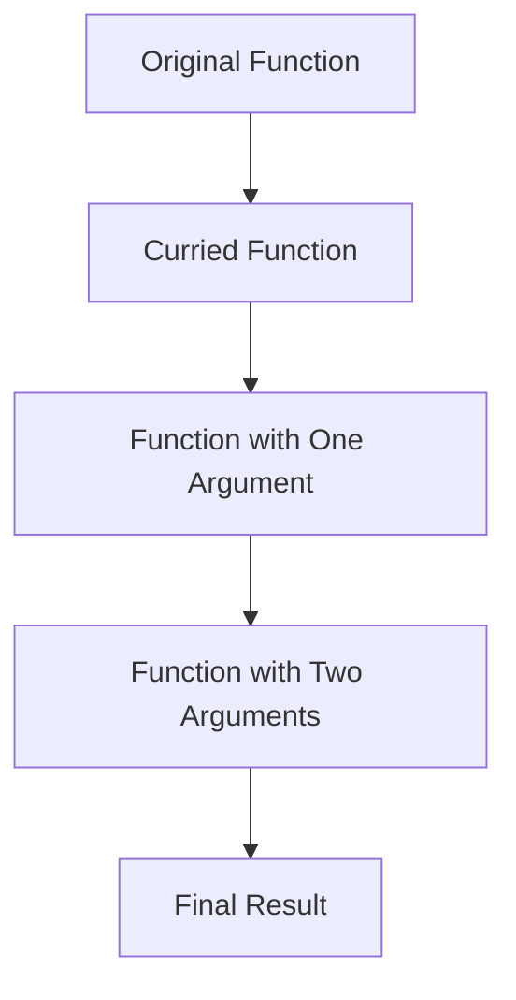
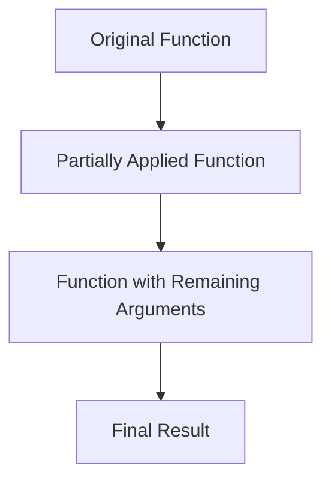

## 6.4.1 Intent and Motivation

In the realm of functional programming, currying and partial application are two powerful techniques that can transform the way we write and think about code. These concepts are particularly useful in JavaScript and TypeScript, where functions are first-class citizens, meaning they can be passed around as arguments, returned from other functions, and assigned to variables. Understanding and applying currying and partial application can lead to more flexible, reusable, and maintainable codebases.

### Defining Currying

Currying is the process of transforming a function that takes multiple arguments into a sequence of functions, each taking a single argument. This transformation allows us to create more modular and reusable functions by breaking down complex operations into simpler, smaller functions.

#### Example of Currying in JavaScript

Let's start with a simple example in JavaScript to illustrate currying:

```javascript
// A function that takes three arguments
function addThreeNumbers(a, b, c) {
  return a + b + c;
}

// Curried version of the function
function curriedAdd(a) {
  return function(b) {
    return function(c) {
      return a + b + c;
    };
  };
}

// Usage
const addFive = curriedAdd(2)(3); // Partially applied function
console.log(addFive(4)); // Outputs: 9
```

In this example, `curriedAdd` is a curried version of the `addThreeNumbers` function. Instead of taking all three arguments at once, it takes them one at a time, returning a new function at each step.

#### Currying in TypeScript

TypeScript enhances the currying process by providing type safety, ensuring that each function in the sequence receives the correct type of argument:

```typescript
// TypeScript version of the curried function
function curriedAddTS(a: number): (b: number) => (c: number) => number {
  return (b: number) => (c: number) => a + b + c;
}

// Usage
const addFiveTS = curriedAddTS(2)(3);
console.log(addFiveTS(4)); // Outputs: 9
```

Here, TypeScript's type annotations ensure that each step in the currying process receives a `number`, preventing type-related errors.

### Defining Partial Application

Partial application, on the other hand, involves applying a function to some of its arguments, producing another function that takes the remaining arguments. This technique allows us to create specialized functions from more general ones by pre-filling some of the arguments.

#### Example of Partial Application in JavaScript

Consider the following example:

```javascript
// A function that takes three arguments
function multiply(a, b, c) {
  return a * b * c;
}

// Partially applied version
function partialMultiply(a) {
  return function(b, c) {
    return multiply(a, b, c);
  };
}

// Usage
const multiplyByTwo = partialMultiply(2);
console.log(multiplyByTwo(3, 4)); // Outputs: 24
```

In this example, `partialMultiply` creates a new function `multiplyByTwo` by pre-filling the first argument of the `multiply` function.

#### Partial Application in TypeScript

TypeScript can also be used to implement partial application with type safety:

```typescript
// TypeScript version of the partially applied function
function partialMultiplyTS(a: number): (b: number, c: number) => number {
  return (b: number, c: number) => a * b * c;
}

// Usage
const multiplyByTwoTS = partialMultiplyTS(2);
console.log(multiplyByTwoTS(3, 4)); // Outputs: 24
```

Again, TypeScript ensures that the types of the arguments are correct, enhancing the reliability of the code.

### Differentiating Between Currying and Partial Application

While currying and partial application may seem similar, they serve different purposes and are used in different contexts:

- **Currying** transforms a function with multiple arguments into a series of unary functions (functions that take one argument). It is a complete transformation of the function's signature.
- **Partial Application** involves fixing a few arguments of a function, producing another function that takes the remaining arguments. It is more about creating a specialized version of a function by pre-filling some arguments.

### Motivation for Using Currying and Partial Application

#### Creating Higher-Order Functions

Both currying and partial application enable the creation of higher-order functions, which are functions that operate on other functions. This capability is a cornerstone of functional programming, allowing for more abstract and flexible code.

#### Enhancing Code Reusability

By breaking down complex functions into smaller, more manageable pieces, currying and partial application promote code reusability. We can create generic functions and then specialize them as needed, reducing duplication and improving maintainability.

#### Promoting Functional Programming Practices

Currying and partial application encourage a functional programming style, which emphasizes immutability, pure functions, and declarative code. This style can lead to more predictable and easier-to-test codebases.

#### Practical Benefits

- **Cleaner Code**: Currying and partial application can lead to cleaner and more readable code by reducing the need for repetitive argument passing.
- **Modular Design**: These techniques support modular design, allowing us to compose functions in a flexible and reusable manner.
- **Improved Testing**: Smaller, curried, or partially applied functions are easier to test in isolation, improving overall test coverage and reliability.

### Simple Examples to Illustrate Concepts

Let's explore some simple examples to further illustrate the concepts of currying and partial application.

#### Currying Example: String Concatenation

```javascript
// Curried function for string concatenation
function curriedConcat(str1) {
  return function(str2) {
    return function(str3) {
      return str1 + str2 + str3;
    };
  };
}

// Usage
const greet = curriedConcat("Hello, ")("World");
console.log(greet("!")); // Outputs: Hello, World!
```

In this example, we create a curried function for string concatenation, allowing us to build a greeting message step by step.

#### Partial Application Example: Logging

```javascript
// Function for logging messages with a prefix
function log(prefix, message) {
  console.log(`[${prefix}] ${message}`);
}

// Partially applied function
const infoLog = log.bind(null, "INFO");

// Usage
infoLog("This is an informational message."); // Outputs: [INFO] This is an informational message.
```

Here, we use partial application to create a specialized logging function with a predefined prefix.

### Emphasizing Practical Benefits

Currying and partial application are not just theoretical concepts; they have practical benefits that can greatly improve the quality of our codebases.

#### Cleaner and More Maintainable Codebases

By using currying and partial application, we can create cleaner and more maintainable codebases. These techniques allow us to write code that is easier to understand, modify, and extend.

#### Encouraging Experimentation

Currying and partial application encourage experimentation and creativity in coding. By breaking down functions into smaller pieces, we can explore different ways to compose and reuse them, leading to innovative solutions.

#### Supporting Functional Programming Paradigms

These techniques support functional programming paradigms, which are becoming increasingly popular in modern software development. By embracing currying and partial application, we can align our code with these paradigms and take advantage of their benefits.

### Try It Yourself

To truly understand the power of currying and partial application, we encourage you to try modifying the code examples provided. Experiment with different arguments, create new curried or partially applied functions, and observe how they behave. This hands-on experience will deepen your understanding and help you apply these concepts in your own projects.

### Visualizing Currying and Partial Application

To better understand the flow of currying and partial application, let's visualize these concepts using Mermaid.js diagrams.

#### Currying Flowchart



This flowchart illustrates the transformation of an original function into a curried function, which is then applied step by step until the final result is obtained.

#### Partial Application Flowchart



This flowchart shows how a partially applied function is created from an original function and then completed with the remaining arguments to produce the final result.

### References and Links

For further reading and deeper dives into currying and partial application, consider the following resources:

- [MDN Web Docs on Functions](https://developer.mozilla.org/en-US/docs/Web/JavaScript/Guide/Functions)
- [JavaScript Info on Currying](https://javascript.info/currying-partials)
- [TypeScript Handbook on Functions](https://www.typescriptlang.org/docs/handbook/functions.html)

### Knowledge Check

To reinforce your understanding of currying and partial application, consider the following questions and challenges:

1. What is the primary difference between currying and partial application?
2. How can currying improve code reusability?
3. Implement a curried function for multiplying three numbers in TypeScript.
4. Create a partially applied function for calculating the area of a rectangle with a fixed width.
5. How do currying and partial application support functional programming paradigms?

### Embrace the Journey

Remember, this is just the beginning. As you progress in your journey with JavaScript and TypeScript, you'll discover more ways to leverage currying and partial application to create elegant and efficient code. Keep experimenting, stay curious, and enjoy the journey!

## Quiz Time!



### What is currying in functional programming?

- [x] Transforming a function with multiple arguments into a sequence of functions each taking a single argument.
- [ ] Applying a function to some of its arguments, producing another function that takes the remaining arguments.
- [ ] A method for optimizing function performance.
- [ ] A technique for creating asynchronous functions.

> **Explanation:** Currying transforms a function with multiple arguments into a series of unary functions.

### What is partial application?

- [ ] Transforming a function with multiple arguments into a sequence of functions each taking a single argument.
- [x] Applying a function to some of its arguments, producing another function that takes the remaining arguments.
- [ ] A method for optimizing function performance.
- [ ] A technique for creating asynchronous functions.

> **Explanation:** Partial application involves applying a function to some of its arguments, producing another function that takes the remaining arguments.

### How does currying enhance code reusability?

- [x] By breaking down complex functions into smaller, more manageable pieces.
- [ ] By increasing the number of arguments a function can take.
- [ ] By reducing the number of functions in a codebase.
- [ ] By making functions asynchronous.

> **Explanation:** Currying enhances code reusability by allowing functions to be broken down into smaller, reusable components.

### Which of the following is a benefit of partial application?

- [x] Creating specialized functions from more general ones.
- [ ] Reducing the number of arguments a function takes.
- [ ] Making functions synchronous.
- [ ] Increasing the complexity of functions.

> **Explanation:** Partial application allows for the creation of specialized functions by pre-filling some arguments.

### In TypeScript, what does currying help ensure?

- [x] Type safety by ensuring each function in the sequence receives the correct type of argument.
- [ ] That functions are executed in parallel.
- [ ] That functions are executed asynchronously.
- [ ] That functions have no side effects.

> **Explanation:** Currying in TypeScript ensures type safety by enforcing correct argument types at each step.

### What is a higher-order function?

- [x] A function that operates on other functions.
- [ ] A function that takes no arguments.
- [ ] A function that is executed immediately.
- [ ] A function that is always asynchronous.

> **Explanation:** A higher-order function is one that takes other functions as arguments or returns them as results.

### How can currying and partial application support functional programming?

- [x] By promoting immutability and pure functions.
- [ ] By making functions stateful.
- [ ] By increasing the number of side effects.
- [ ] By reducing the number of functions.

> **Explanation:** Currying and partial application support functional programming by encouraging immutability and pure functions.

### What is the result of applying a curried function step by step?

- [x] A final result after all arguments have been provided.
- [ ] An immediate result without any arguments.
- [ ] A function that takes no arguments.
- [ ] A function that is always asynchronous.

> **Explanation:** A curried function produces a final result after all arguments have been provided in sequence.

### How can partial application lead to cleaner code?

- [x] By reducing the need for repetitive argument passing.
- [ ] By increasing the number of arguments a function takes.
- [ ] By making functions synchronous.
- [ ] By increasing the complexity of functions.

> **Explanation:** Partial application leads to cleaner code by reducing repetitive argument passing and creating specialized functions.

### True or False: Currying and partial application are only applicable in functional programming languages.

- [ ] True
- [x] False

> **Explanation:** Currying and partial application can be applied in any language that supports first-class functions, including JavaScript and TypeScript.


