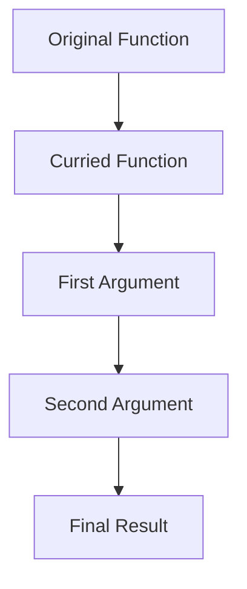
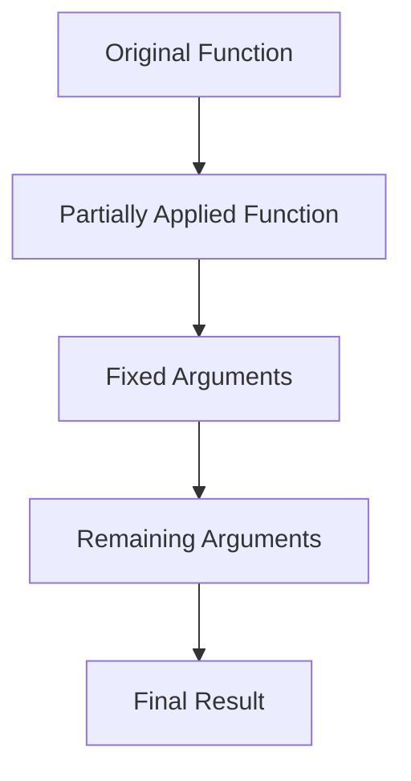

## 6.4.2 Implementation Techniques

Currying and partial application are powerful techniques in functional programming that enhance code reusability and readability. In this section, we'll delve into the practical implementation of these concepts in JavaScript and TypeScript. We'll explore manual implementations, leverage ES6+ features, utilize utility libraries, and discuss TypeScript considerations, edge cases, performance impacts, and best practices.

### Manual Implementation

#### Currying with Closures

Currying transforms a function with multiple arguments into a sequence of functions, each taking a single argument. This transformation is achieved using closures, which allow functions to retain access to their lexical scope.

Let's manually implement currying in JavaScript:

```javascript
// A simple add function that takes two arguments
function add(a, b) {
  return a + b;
}

// Curried version of the add function
function curryAdd(a) {
  return function(b) {
    return add(a, b);
  };
}

// Usage
const addFive = curryAdd(5);
console.log(addFive(3)); // Output: 8
```

In this example, `curryAdd` returns a new function that takes the second argument, effectively transforming `add` into a curried function.

#### Partial Application with Higher-Order Functions

Partial application involves fixing a number of arguments to a function, producing another function of smaller arity. This is particularly useful for creating specialized functions from more general ones.

Here's how you can manually implement partial application:

```javascript
// A generic multiply function
function multiply(a, b, c) {
  return a * b * c;
}

// Partial application function
function partial(fn, ...fixedArgs) {
  return function(...remainingArgs) {
    return fn(...fixedArgs, ...remainingArgs);
  };
}

// Usage
const double = partial(multiply, 2);
console.log(double(3, 4)); // Output: 24
```

The `partial` function fixes the first argument of `multiply`, creating a new function `double` that multiplies its arguments by 2.

### Leveraging ES6+ Features

ES6 introduces features like arrow functions and spread/rest operators, which simplify the implementation of currying and partial application.

#### Currying with Arrow Functions

Arrow functions provide a concise syntax for writing functions, making currying more elegant:

```javascript
const curryAdd = a => b => a + b;

// Usage
const addTen = curryAdd(10);
console.log(addTen(5)); // Output: 15
```

#### Partial Application with Spread/Rest Operators

The spread and rest operators allow for flexible argument handling, which is crucial for partial application:

```javascript
const partial = (fn, ...fixedArgs) => (...remainingArgs) => fn(...fixedArgs, ...remainingArgs);

// Usage
const triple = partial(multiply, 3);
console.log(triple(4, 5)); // Output: 60
```

### Using Utility Libraries

Libraries like Lodash and Ramda offer built-in functions for currying and partial application, reducing boilerplate code.

#### Currying with Lodash

Lodash provides a `_.curry` function that automatically curries a given function:

```javascript
const _ = require('lodash');

const curriedAdd = _.curry((a, b, c) => a + b + c);

// Usage
console.log(curriedAdd(1)(2)(3)); // Output: 6
console.log(curriedAdd(1, 2)(3)); // Output: 6
```

Lodash's `_.curry` handles multiple arguments seamlessly, allowing flexible invocation patterns.

#### Partial Application with Ramda

Ramda's `R.partial` function simplifies partial application:

```javascript
const R = require('ramda');

const partialMultiply = R.partial(multiply, [2, 3]);

// Usage
console.log(partialMultiply(4)); // Output: 24
```

Ramda's functional approach aligns well with JavaScript's functional programming paradigm, offering a clean syntax for partial application.

### TypeScript Considerations

TypeScript adds type safety to currying and partial application, ensuring that functions are invoked with the correct argument types.

#### Typing Curried Functions

When currying functions in TypeScript, it's essential to define types for each function in the chain:

```typescript
type CurriedAdd = (a: number) => (b: number) => number;

const curryAdd: CurriedAdd = a => b => a + b;

// Usage
const addTwenty = curryAdd(20);
console.log(addTwenty(10)); // Output: 30
```

#### Typing Partial Application

For partial application, TypeScript's type inference can be leveraged to maintain type safety:

```typescript
type Multiply = (a: number, b: number, c: number) => number;

const partial = <T extends any[], U extends any[]>(fn: (...args: [...T, ...U]) => any, ...fixedArgs: T) => 
  (...remainingArgs: U) => fn(...fixedArgs, ...remainingArgs);

// Usage
const partialDouble = partial(multiply, 2);
console.log(partialDouble(3, 4)); // Output: 24
```

### Edge Cases and Pitfalls

#### Handling `this` Context

Currying and partial application can lead to issues with the `this` context, especially in object-oriented code. Using arrow functions can mitigate this, as they do not have their own `this` binding.

```javascript
class Calculator {
  constructor(value) {
    this.value = value;
  }

  add = (a) => {
    this.value += a;
    return this;
  }
}

const calc = new Calculator(10);
calc.add(5).add(10); // Chaining works due to arrow function
```

#### Variadic Functions

Functions with a variable number of arguments (variadic functions) require careful handling when curried or partially applied. Consider using the rest operator to capture remaining arguments.

```javascript
const sum = (...args) => args.reduce((acc, val) => acc + val, 0);

const curriedSum = a => b => sum(a, b);

// Usage
console.log(curriedSum(5)(10)); // Output: 15
```

### Performance Considerations

Currying and partial application can introduce overhead, particularly in performance-critical applications. To mitigate this, consider:

- **Memoization**: Cache results of expensive function calls to avoid redundant computations.
- **Avoiding Deep Currying**: Limit the depth of currying to reduce function call overhead.
- **Profiling**: Use performance profiling tools to identify bottlenecks.

### Best Practices

- **Use Libraries**: Leverage libraries like Lodash and Ramda for robust implementations.
- **Type Safety**: In TypeScript, ensure functions are correctly typed to prevent runtime errors.
- **Keep Functions Pure**: Maintain purity by avoiding side effects, enhancing testability and predictability.
- **Document Intent**: Clearly document the purpose and usage of curried and partially applied functions to aid maintainability.

### Visualizing Currying and Partial Application

To better understand the flow of currying and partial application, let's visualize these concepts using Mermaid.js diagrams.

#### Currying Flow



#### Partial Application Flow



These diagrams illustrate how currying and partial application transform functions, highlighting the sequential nature of argument application.

### Try It Yourself

Experiment with the provided code examples by:

- Modifying the number of arguments in curried and partially applied functions.
- Implementing currying and partial application for different operations, such as string concatenation or array manipulation.
- Exploring how TypeScript's type system can be leveraged to enhance function safety and readability.

### References and Links

- [MDN Web Docs: Closures](https://developer.mozilla.org/en-US/docs/Web/JavaScript/Closures)
- [Lodash Documentation](https://lodash.com/docs/4.17.15#curry)
- [Ramda Documentation](https://ramdajs.com/docs/#partial)

### Knowledge Check

- What is the primary difference between currying and partial application?
- How can arrow functions simplify the implementation of currying?
- What are some potential pitfalls when using currying and partial application in object-oriented code?

### Embrace the Journey

Remember, mastering currying and partial application is a journey. As you continue to explore functional programming, you'll discover new ways to write concise, expressive, and reusable code. Stay curious, experiment with different techniques, and enjoy the process of learning and growing as a developer!

## Quiz Time!



### What is currying in functional programming?

- [x] Transforming a function with multiple arguments into a sequence of functions each taking a single argument.
- [ ] Combining multiple functions into a single function.
- [ ] Modifying a function to accept a variable number of arguments.
- [ ] Creating a new function by fixing some arguments of an existing function.

> **Explanation:** Currying is the process of transforming a function with multiple arguments into a sequence of functions, each taking a single argument.

### How does partial application differ from currying?

- [x] Partial application fixes a number of arguments to a function, producing another function of smaller arity.
- [ ] Partial application transforms a function into a sequence of functions.
- [ ] Partial application combines multiple functions into one.
- [ ] Partial application modifies a function to accept a variable number of arguments.

> **Explanation:** Partial application involves fixing a number of arguments to a function, resulting in a new function with fewer arguments, unlike currying which transforms a function into a sequence of unary functions.

### Which ES6 feature simplifies currying?

- [x] Arrow functions
- [ ] Template literals
- [ ] Destructuring assignment
- [ ] Default parameters

> **Explanation:** Arrow functions provide a concise syntax for writing functions, making currying more elegant and readable.

### What is a common challenge when currying methods in object-oriented code?

- [x] Handling the `this` context
- [ ] Managing memory usage
- [ ] Ensuring type safety
- [ ] Avoiding deep currying

> **Explanation:** Currying methods in object-oriented code can lead to issues with the `this` context, as the function may lose its binding to the object instance.

### Which utility library provides a built-in function for currying?

- [x] Lodash
- [ ] jQuery
- [ ] Axios
- [ ] D3.js

> **Explanation:** Lodash provides a `_.curry` function that automatically curries a given function, simplifying the process.

### How can TypeScript enhance currying and partial application?

- [x] By adding type safety to ensure correct argument types
- [ ] By reducing the number of arguments needed
- [ ] By automatically currying functions
- [ ] By improving performance

> **Explanation:** TypeScript adds type safety to currying and partial application, ensuring that functions are invoked with the correct argument types.

### What is a potential performance impact of currying?

- [x] Increased function call overhead
- [ ] Reduced memory usage
- [ ] Faster execution time
- [ ] Improved readability

> **Explanation:** Currying can introduce overhead due to the additional function calls, which may impact performance in critical applications.

### How can memoization help with currying performance?

- [x] By caching results of expensive function calls to avoid redundant computations
- [ ] By reducing the number of arguments needed
- [ ] By automatically currying functions
- [ ] By improving readability

> **Explanation:** Memoization caches results of expensive function calls, reducing redundant computations and improving performance.

### What is a best practice for implementing currying and partial application?

- [x] Use libraries like Lodash and Ramda for robust implementations
- [ ] Avoid using TypeScript
- [ ] Always use deep currying
- [ ] Use global variables for storing intermediate results

> **Explanation:** Leveraging libraries like Lodash and Ramda provides robust implementations of currying and partial application, reducing boilerplate code.

### Currying and partial application are only useful in functional programming.

- [ ] True
- [x] False

> **Explanation:** While currying and partial application are fundamental concepts in functional programming, they can be useful in other programming paradigms for enhancing code reusability and readability.


