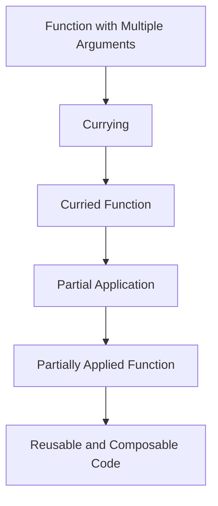

## 6.4.3 Use Cases and Examples

Currying and partial application are powerful functional programming techniques that can significantly enhance the way we write JavaScript and TypeScript code. By transforming functions and fixing arguments, these techniques allow us to create more reusable, composable, and testable code. In this section, we will explore various real-world scenarios where currying and partial application provide substantial benefits, along with practical examples and exercises to solidify your understanding.

### Function Composition

**Function composition** is the process of combining simple functions to build more complex ones. Currying and partial application facilitate this by allowing us to create pipelines where the output of one function becomes the input of another.

#### Example: Creating a Pipeline

Let's consider a scenario where we need to process a list of numbers by first doubling them and then filtering out the ones greater than 10. Using currying and function composition, we can achieve this elegantly:

```javascript
// A simple function to double a number
const double = x => x * 2;

// A function to check if a number is greater than a given threshold
const isGreaterThan = threshold => x => x > threshold;

// Composing functions to create a pipeline
const processNumbers = numbers => numbers.map(double).filter(isGreaterThan(10));

const numbers = [3, 5, 7, 10];
console.log(processNumbers(numbers)); // Output: [14, 20]
```

In this example, `isGreaterThan` is a curried function that takes a threshold and returns a new function. This makes it easy to create specific conditions without rewriting the logic.

#### Try It Yourself

Modify the `processNumbers` function to include additional transformations, such as squaring the numbers or converting them to strings. Experiment with different compositions to see how they affect the output.

### Event Handling

In JavaScript, event handling is a common task, especially in web development. Partial application can simplify event listener setup by pre-filling certain arguments.

#### Example: Partially Applied Event Handlers

Consider a scenario where we want to log events with a specific prefix:

```javascript
// A function to log events with a prefix
const logEvent = prefix => event => console.log(`${prefix}: ${event.type}`);

// Partially applying the logEvent function
const logClickEvent = logEvent('Click Event');

document.getElementById('myButton').addEventListener('click', logClickEvent);
```

Here, `logEvent` is partially applied to create `logClickEvent`, which is then used as an event handler. This approach reduces redundancy and keeps the code clean.

#### Try It Yourself

Create a new event handler for mouseover events using partial application. Test it by applying it to different elements on a webpage.

### Configuration Functions

Currying and partial application are excellent for creating **configurable functions** where certain parameters are fixed, allowing the remaining parameters to be specified later.

#### Example: Configurable API Call

Imagine we have a function to make API calls, and we want to configure it with a base URL:

```javascript
// A function to make an API call
const makeApiCall = baseUrl => endpoint => fetch(`${baseUrl}${endpoint}`)
  .then(response => response.json());

// Configuring the function with a base URL
const apiCallWithBaseUrl = makeApiCall('https://api.example.com');

// Using the configured function
apiCallWithBaseUrl('/users')
  .then(data => console.log(data));
```

This pattern is particularly useful in applications with multiple API endpoints, as it allows for easy configuration and reuse.

#### Try It Yourself

Extend the `makeApiCall` function to include additional configuration options, such as headers or query parameters. Experiment with different configurations to see how they affect the API requests.

### Reusability

One of the key benefits of currying and partial application is increased **reusability**. By breaking down functions into smaller, curried versions, we can reuse logic across different parts of an application.

#### Example: Reusable Validation Functions

Consider a scenario where we need to validate user input for different forms:

```javascript
// A function to check if a value is required
const isRequired = fieldName => value => value ? null : `${fieldName} is required`;

// A function to check if a value is a valid email
const isValidEmail = value => /\S+@\S+\.\S+/.test(value) ? null : 'Invalid email';

// Using the validation functions
const validateName = isRequired('Name');
const validateEmail = isValidEmail;

console.log(validateName('')); // Output: "Name is required"
console.log(validateEmail('test@example.com')); // Output: null
```

By currying the `isRequired` function, we create a reusable validation function that can be applied to any field.

#### Try It Yourself

Create additional validation functions for different data types, such as numbers or dates. Use these functions to validate a form with multiple fields.

### Simplifying Complex Functions

Breaking down complex functions into curried versions can simplify **testing** and **reasoning** about code. This approach allows us to isolate and test individual parts of a function.

#### Example: Testing Curried Functions

Let's consider a function that calculates the total price of items in a cart, including tax:

```javascript
// A function to calculate the total price
const calculateTotal = taxRate => price => price + (price * taxRate);

// Testing the function
const calculateWithTax = calculateTotal(0.2);

console.log(calculateWithTax(100)); // Output: 120
```

By currying the `calculateTotal` function, we can easily test the tax calculation logic independently.

#### Try It Yourself

Write unit tests for the `calculateTotal` function using a testing framework like Jest or Mocha. Experiment with different tax rates and prices to ensure the function behaves as expected.

### Examples in Libraries/Frameworks

Currying is widely used in popular libraries and frameworks, such as Redux and RxJS, to enhance code composability and reusability.

#### Example: Currying in Redux

In Redux, action creators can be curried to create more flexible and reusable actions:

```javascript
// A curried action creator
const createAction = type => payload => ({ type, payload });

// Using the action creator
const addTodo = createAction('ADD_TODO');

console.log(addTodo({ id: 1, text: 'Learn Currying' }));
// Output: { type: 'ADD_TODO', payload: { id: 1, text: 'Learn Currying' } }
```

This pattern allows for consistent action creation across different parts of an application.

#### Example: Currying in RxJS

RxJS uses currying to create operators that can be easily composed into observables:

```javascript
import { of } from 'rxjs';
import { map, filter } from 'rxjs/operators';

// Creating an observable with curried operators
const numbers$ = of(1, 2, 3, 4, 5).pipe(
  map(x => x * 2),
  filter(x => x > 5)
);

numbers$.subscribe(console.log); // Output: 6, 8, 10
```

Currying allows RxJS operators to be chained together, creating powerful data processing pipelines.

#### Try It Yourself

Explore the Redux and RxJS documentation to find other examples of currying. Experiment with creating your own curried functions and operators.

### Encouraging Practice

To truly master currying and partial application, it's essential to practice and experiment with these concepts. Here are some exercises and projects to help you apply what you've learned:

1. **Build a Calculator**: Create a simple calculator application that uses curried functions for operations like addition, subtraction, multiplication, and division.

2. **Form Validation Library**: Develop a small library of curried validation functions that can be used to validate different types of form inputs.

3. **Event Logger**: Implement an event logging system that uses partially applied functions to log different types of events with specific prefixes.

4. **API Wrapper**: Create a wrapper around a public API that uses currying to configure endpoints and query parameters.

5. **Data Transformation Pipeline**: Build a data transformation pipeline that processes a stream of data using curried functions for mapping, filtering, and reducing.

Remember, this is just the beginning. As you progress, you'll discover even more ways to leverage currying and partial application in your projects. Keep experimenting, stay curious, and enjoy the journey!

### Visualizing Currying and Partial Application

To better understand how currying and partial application work, let's visualize the process using a flowchart:



**Figure 1**: This flowchart illustrates the transformation of a function with multiple arguments into a curried function, followed by partial application, resulting in reusable and composable code.

### References and Links

For further reading and deeper dives into currying and partial application, consider exploring the following resources:

- [MDN Web Docs: Functions](https://developer.mozilla.org/en-US/docs/Web/JavaScript/Guide/Functions)
- [JavaScript Info: Currying](https://javascript.info/currying-partials)
- [Functional Programming in JavaScript](https://www.smashingmagazine.com/2014/07/dont-be-scared-of-functional-programming/)

### Knowledge Check

To reinforce your understanding of currying and partial application, try answering the following questions and challenges:

1. **Explain** how currying can improve code reusability.
2. **Demonstrate** how to create a partially applied function for an event handler.
3. **Provide** an example of a curried function used in a library or framework.
4. **Discuss** the benefits of breaking down complex functions into curried versions.

## Quiz Time!



### What is the primary benefit of using currying in function composition?

- [x] It allows functions to be easily composed and reused.
- [ ] It reduces the number of function arguments.
- [ ] It simplifies function definitions.
- [ ] It eliminates the need for closures.

> **Explanation:** Currying transforms functions so they can be easily composed and reused, enhancing code modularity.

### How does partial application differ from currying?

- [x] Partial application fixes some arguments of a function, while currying transforms a function into a series of unary functions.
- [ ] Partial application and currying are the same.
- [ ] Currying fixes arguments, while partial application transforms functions.
- [ ] Partial application is used only in event handling.

> **Explanation:** Partial application fixes certain arguments, whereas currying transforms a function into a series of unary functions.

### In which scenario is partial application particularly useful?

- [x] When setting up event handlers with specific configurations.
- [ ] When defining complex algorithms.
- [ ] When creating classes and objects.
- [ ] When handling asynchronous operations.

> **Explanation:** Partial application is useful for configuring event handlers by pre-filling certain arguments.

### What is a common use case for currying in libraries like Redux?

- [x] Creating flexible and reusable action creators.
- [ ] Managing state transitions.
- [ ] Handling asynchronous actions.
- [ ] Defining reducers.

> **Explanation:** Currying is used in Redux to create flexible and reusable action creators.

### Which of the following is a benefit of breaking down complex functions into curried versions?

- [x] Simplifies testing and reasoning about code.
- [ ] Reduces the number of function calls.
- [ ] Increases execution speed.
- [ ] Eliminates the need for documentation.

> **Explanation:** Currying simplifies testing and reasoning by isolating parts of a function.

### What is the result of applying a curried function to all its arguments?

- [x] A final result or value.
- [ ] Another curried function.
- [ ] A partially applied function.
- [ ] An error.

> **Explanation:** Applying a curried function to all its arguments results in a final value.

### How can currying enhance code reusability?

- [x] By allowing functions to be reused with different configurations.
- [ ] By reducing the number of variables.
- [ ] By eliminating loops.
- [ ] By simplifying syntax.

> **Explanation:** Currying enhances reusability by enabling functions to be reused with different configurations.

### What is a typical application of currying in RxJS?

- [x] Composing operators into observables.
- [ ] Managing subscriptions.
- [ ] Handling errors.
- [ ] Defining subjects.

> **Explanation:** Currying is used in RxJS to compose operators into observables.

### Which of the following best describes a curried function?

- [x] A function that returns a new function for each argument.
- [ ] A function that accepts multiple arguments at once.
- [ ] A function that modifies its arguments.
- [ ] A function that is used only in functional programming.

> **Explanation:** A curried function returns a new function for each argument, allowing for partial application.

### True or False: Currying and partial application are interchangeable terms.

- [ ] True
- [x] False

> **Explanation:** Currying and partial application are related but distinct concepts; currying transforms functions, while partial application fixes arguments.



Remember, mastering currying and partial application takes practice and experimentation. Keep exploring these concepts, and you'll find new ways to enhance your JavaScript and TypeScript code.
