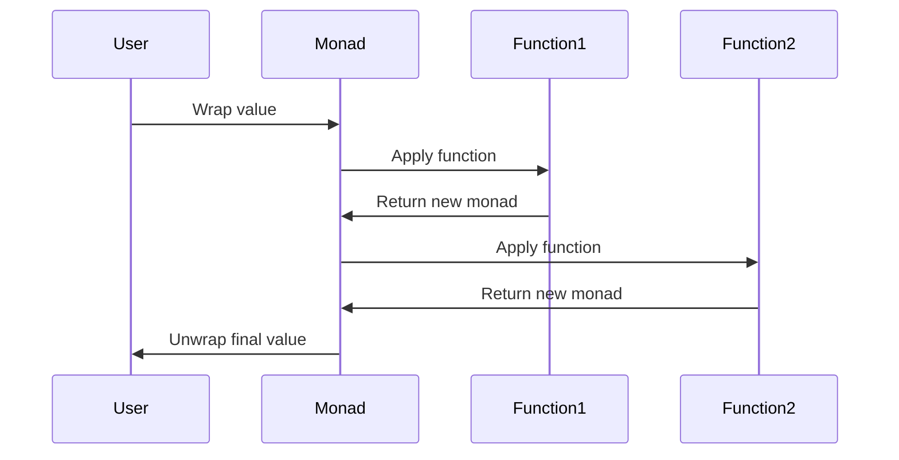

## 6.5.1 Intent and Motivation

In the realm of functional programming, monads play a crucial role in managing complexity, particularly when dealing with operations like chaining computations, managing side effects, and handling asynchronous processes. This section aims to demystify the concept of monads and illustrate their significance in JavaScript and TypeScript development.

### Defining Monads

At its core, a monad is a design pattern used to handle programmatic effects such as state, exceptions, or I/O, in a functional way. Think of a monad as a "container" or "pipeline" that wraps a value and provides a way to apply functions to that value, while managing side effects or additional computations.

In simpler terms, a monad is a type that implements two essential operations:

1. **Unit (or Return)**: This operation takes a value and puts it into a monad.
2. **Bind (or FlatMap)**: This operation takes a monad and a function that returns a monad, applies the function to the wrapped value, and returns a new monad.

These operations allow for chaining operations in a clean, composable manner, making monads a powerful tool in functional programming.

### The Problem: Handling Complexity

In programming, we often encounter challenges such as:

- **Null or Undefined Values**: These can lead to runtime errors if not handled properly.
- **Asynchronous Operations**: Managing asynchronous code, especially in JavaScript, can be cumbersome and error-prone.
- **Side Effects**: Functions that interact with the outside world (like I/O operations) can introduce unpredictability into our code.

Monads provide a structured way to address these issues by encapsulating values and computations, allowing us to build complex operations from simple, composable parts.

### Monad as a Pattern

Monads offer a pattern for dealing with complexity by allowing us to:

- **Chain Computations**: Monads enable us to sequence operations in a linear, readable manner, even when dealing with asynchronous or side-effect-laden computations.
- **Manage Side Effects**: By encapsulating side effects within monads, we can isolate them from the rest of our code, making our programs more predictable and easier to reason about.
- **Handle Errors Gracefully**: Monads like `Maybe` or `Either` provide a way to handle errors without resorting to exceptions, leading to more robust code.

### Using Analogies

To better understand monads, consider the analogy of a "pipeline." Imagine a series of pipes through which water flows. Each pipe represents a function, and the water represents the data being processed. A monad acts as a connector between these pipes, ensuring that the water flows smoothly from one pipe to the next, even if some pipes are blocked or require special handling.

Another analogy is that of a "container." A monad can be thought of as a container that holds a value. This container provides methods to transform the value inside, while ensuring that the transformations adhere to certain rules, such as handling null values or asynchronous operations.

### Different Types of Monads

There are several types of monads, each serving a different purpose:

1. **Maybe Monad**: Used to handle computations that might fail. It encapsulates a value that might be `null` or `undefined`, allowing us to chain operations without worrying about null checks.

   ```typescript
   class Maybe<T> {
       constructor(private value: T | null) {}

       static of<T>(value: T | null): Maybe<T> {
           return new Maybe(value);
       }

       map<U>(fn: (value: T) => U): Maybe<U> {
           if (this.value === null) {
               return new Maybe<U>(null);
           }
           return new Maybe<U>(fn(this.value));
       }
   }

   const result = Maybe.of(5).map(x => x * 2); // Maybe(10)
   ```

2. **Either Monad**: Similar to `Maybe`, but provides more information about the failure. It encapsulates a value that can be either a success or a failure, allowing us to handle errors more gracefully.

   ```typescript
   class Either<L, R> {
       constructor(private left: L | null, private right: R | null) {}

       static left<L, R>(value: L): Either<L, R> {
           return new Either(value, null);
       }

       static right<L, R>(value: R): Either<L, R> {
           return new Either(null, value);
       }

       map<U>(fn: (value: R) => U): Either<L, U> {
           if (this.right === null) {
               return Either.left<L, U>(this.left as L);
           }
           return Either.right<L, U>(fn(this.right));
       }
   }

   const success = Either.right<string, number>(10).map(x => x * 2); // Either(null, 20)
   const failure = Either.left<string, number>("Error").map(x => x * 2); // Either("Error", null)
   ```

3. **Promise Monad**: Widely used in JavaScript for handling asynchronous operations. Promises allow us to chain asynchronous computations in a clean and readable manner.

   ```javascript
   const fetchData = () => {
       return new Promise((resolve, reject) => {
           setTimeout(() => resolve("Data"), 1000);
       });
   };

   fetchData()
       .then(data => console.log(data)) // "Data"
       .catch(error => console.error(error));
   ```

### Emphasizing Relevance

Monads are particularly relevant in modern JavaScript and TypeScript applications due to their ability to handle asynchronous code and manage side effects effectively. With the rise of functional programming paradigms and the increasing complexity of web applications, understanding and utilizing monads can lead to more robust, maintainable, and scalable codebases.

In JavaScript, the `Promise` monad has become a staple for dealing with asynchronous operations, providing a clear and concise way to handle success and failure cases. Similarly, libraries like `Ramda` and `Folktale` offer implementations of other monads, such as `Maybe` and `Either`, allowing developers to leverage these patterns in their applications.

### Visualizing Monads

To better understand how monads work, let's visualize the flow of data through a monad using a sequence diagram.



This diagram illustrates how a value is wrapped in a monad, passed through a series of functions, and finally unwrapped to obtain the result. Each function operates on the value within the monad, ensuring that side effects and errors are managed appropriately.

### Try It Yourself

To get a hands-on understanding of monads, try modifying the code examples provided above. Experiment with different functions and see how the monads handle various scenarios, such as null values or asynchronous operations. This will help solidify your understanding of how monads work and their benefits in real-world applications.

### References and Links

For further reading on monads and functional programming in JavaScript and TypeScript, consider exploring the following resources:

- [MDN Web Docs: Promises](https://developer.mozilla.org/en-US/docs/Web/JavaScript/Guide/Using_promises)
- [Ramda Documentation](https://ramdajs.com/)
- [Folktale Documentation](https://folktale.origamitower.com/)

### Knowledge Check

To reinforce your understanding of monads, consider the following questions:

- What are the two essential operations of a monad?
- How do monads help manage side effects in functional programming?
- What is the difference between a `Maybe` monad and an `Either` monad?
- How does the `Promise` monad handle asynchronous operations in JavaScript?

### Embrace the Journey

Remember, understanding monads is just the beginning of your journey into functional programming. As you continue to explore this paradigm, you'll discover new patterns and techniques that can help you write more efficient and maintainable code. Keep experimenting, stay curious, and enjoy the journey!

## Quiz Time!



### What is the primary purpose of a monad in functional programming?

- [x] To handle programmatic effects like state, exceptions, or I/O in a functional way.
- [ ] To provide a way to write object-oriented code in JavaScript.
- [ ] To simplify the syntax of JavaScript functions.
- [ ] To create complex UI components.

> **Explanation:** Monads are used to manage programmatic effects in a functional manner, allowing for clean and composable handling of state, exceptions, and I/O operations.

### Which operation is NOT essential for a monad?

- [ ] Unit (or Return)
- [ ] Bind (or FlatMap)
- [x] Filter
- [ ] Map

> **Explanation:** Monads require the Unit (or Return) and Bind (or FlatMap) operations. Filter is not an essential operation for monads.

### How does the Maybe monad help in handling null or undefined values?

- [x] It encapsulates a value that might be null or undefined, allowing chaining without null checks.
- [ ] It throws an error whenever a null or undefined value is encountered.
- [ ] It converts null values to zero.
- [ ] It logs an error message to the console.

> **Explanation:** The Maybe monad encapsulates values that might be null or undefined, enabling safe chaining of operations without explicit null checks.

### What is the main difference between the Maybe and Either monads?

- [x] Either provides more information about the failure, while Maybe does not.
- [ ] Maybe can only handle numbers, while Either can handle any type.
- [ ] Either is used for synchronous operations, while Maybe is for asynchronous.
- [ ] Maybe is a subtype of Either.

> **Explanation:** The Either monad provides more information about the failure by encapsulating a success or failure value, whereas Maybe simply handles null or undefined values.

### Which monad is commonly used in JavaScript for handling asynchronous operations?

- [x] Promise
- [ ] Maybe
- [ ] Either
- [ ] List

> **Explanation:** The Promise monad is widely used in JavaScript to handle asynchronous operations, providing a clean way to manage success and failure cases.

### What analogy is often used to describe monads?

- [x] A container or pipeline
- [ ] A tree structure
- [ ] A loop
- [ ] A stack

> **Explanation:** Monads are often described as containers or pipelines that wrap values and allow for function application while managing side effects.

### How do monads help in managing side effects?

- [x] By encapsulating side effects within the monad, isolating them from the rest of the code.
- [ ] By eliminating side effects entirely.
- [ ] By logging side effects to a file.
- [ ] By converting side effects into synchronous operations.

> **Explanation:** Monads encapsulate side effects, isolating them from the rest of the code and making programs more predictable and easier to reason about.

### What is the role of the Bind (or FlatMap) operation in a monad?

- [x] To apply a function to the wrapped value and return a new monad.
- [ ] To unwrap the value from the monad.
- [ ] To convert the monad into a string.
- [ ] To log the value of the monad to the console.

> **Explanation:** The Bind (or FlatMap) operation applies a function to the wrapped value and returns a new monad, enabling chaining of operations.

### Why are monads particularly relevant in modern JavaScript and TypeScript applications?

- [x] They handle asynchronous code and manage side effects effectively.
- [ ] They simplify the syntax of JavaScript functions.
- [ ] They are required by the ECMAScript standard.
- [ ] They are used to create complex UI components.

> **Explanation:** Monads are relevant because they provide a structured way to handle asynchronous code and manage side effects, which are common challenges in modern applications.

### True or False: Monads can only be used in functional programming languages.

- [ ] True
- [x] False

> **Explanation:** Monads can be used in any language that supports functional programming concepts, including JavaScript and TypeScript.




