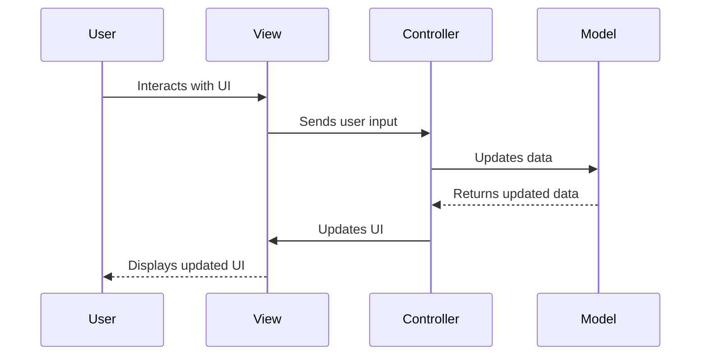

## 7.1.1 Intent and Motivation

In the realm of software architecture, the Model-View-Controller (MVC) pattern stands as a cornerstone for structuring applications. It provides a framework for separating concerns, which is crucial for building scalable and maintainable software. In this section, we will delve into the intent and motivation behind the MVC pattern, specifically in the context of JavaScript and TypeScript, and explore how it addresses common architectural challenges.

### Understanding the MVC Pattern

The MVC pattern divides an application into three interconnected components: the Model, the View, and the Controller. Each component has a distinct responsibility, which helps in organizing code and managing complexity.

- **Model**: This component represents the data and the business logic of the application. It is responsible for managing the data, logic, and rules of the application. The Model directly manages the data, logic, and rules of the application. For instance, if you are developing a shopping cart application, the Model would handle the items, prices, and quantities.

- **View**: The View is responsible for displaying the data to the user. It represents the UI of the application. The View retrieves data from the Model and presents it to the user in a specific format. It is essentially the presentation layer of the application. Using the shopping cart example, the View would display the list of items, their prices, and the total cost to the user.

- **Controller**: The Controller acts as an intermediary between the Model and the View. It listens to user inputs from the View, processes them (often by invoking methods on the Model), and then updates the View accordingly. Continuing with the shopping cart example, the Controller would handle actions like adding an item to the cart or removing an item, updating the Model, and then refreshing the View to reflect these changes.

### Benefits of Separating Concerns

The primary motivation behind the MVC pattern is to separate concerns within an application. This separation offers several benefits:

1. **Improved Maintainability**: By dividing the application into three distinct components, developers can work on each component independently. This modularity makes it easier to maintain and update the application over time.

2. **Enhanced Testability**: With clear separation, each component can be tested independently. For instance, you can test the business logic in the Model without worrying about the UI in the View.

3. **Facilitated Collaboration**: Different teams can work on different components simultaneously. For example, front-end developers can focus on the View, while back-end developers work on the Model.

4. **Reusability**: Components can be reused across different parts of the application or even in different projects. For instance, the same Model can be used with different Views.

5. **Scalability**: As the application grows, the MVC pattern allows for easier scaling. New features can be added with minimal impact on existing code.

### Visualizing the MVC Flow

To better understand the interaction between the Model, View, and Controller, let's visualize the flow using a diagram.



**Diagram Description**: This sequence diagram illustrates the flow of interactions in an MVC architecture. The user interacts with the View, which sends input to the Controller. The Controller updates the Model, retrieves the updated data, and then updates the View, which finally presents the updated UI to the user.

### Addressing Common Architectural Problems

The MVC pattern addresses several common problems in software architecture, such as code duplication and tight coupling.

#### Code Duplication

In traditional architectures, code duplication can occur when the same logic is implemented in multiple places. The MVC pattern mitigates this by centralizing the business logic in the Model. This ensures that any changes to the logic need to be made only once, reducing the risk of inconsistencies and errors.

#### Tight Coupling

Tight coupling refers to a scenario where components are heavily dependent on each other, making it difficult to modify or replace one component without affecting others. The MVC pattern promotes loose coupling by clearly defining the responsibilities of each component and minimizing dependencies between them. This allows developers to modify one component with minimal impact on the others.

### Implementing MVC in JavaScript and TypeScript

Let's explore how to implement the MVC pattern in JavaScript and TypeScript with a simple example.

#### JavaScript Implementation

```javascript
// Model
class ShoppingCartModel {
    constructor() {
        this.items = [];
    }

    addItem(item) {
        this.items.push(item);
    }

    removeItem(item) {
        this.items = this.items.filter(i => i !== item);
    }

    getItems() {
        return this.items;
    }
}

// View
class ShoppingCartView {
    constructor() {
        this.cartElement = document.getElementById('cart');
    }

    render(items) {
        this.cartElement.innerHTML = items.map(item => `<li>${item}</li>`).join('');
    }
}

// Controller
class ShoppingCartController {
    constructor(model, view) {
        this.model = model;
        this.view = view;

        this.view.render(this.model.getItems());

        document.getElementById('addItem').addEventListener('click', () => {
            const item = document.getElementById('itemInput').value;
            this.model.addItem(item);
            this.view.render(this.model.getItems());
        });

        document.getElementById('removeItem').addEventListener('click', () => {
            const item = document.getElementById('itemInput').value;
            this.model.removeItem(item);
            this.view.render(this.model.getItems());
        });
    }
}

// Instantiate MVC components
const model = new ShoppingCartModel();
const view = new ShoppingCartView();
const controller = new ShoppingCartController(model, view);
```

**Code Explanation**: In this JavaScript example, we have a simple shopping cart application. The `ShoppingCartModel` manages the items in the cart, the `ShoppingCartView` handles the display of items, and the `ShoppingCartController` connects the Model and View, handling user interactions.

#### TypeScript Implementation

```typescript
// Model
class ShoppingCartModel {
    private items: string[] = [];

    addItem(item: string): void {
        this.items.push(item);
    }

    removeItem(item: string): void {
        this.items = this.items.filter(i => i !== item);
    }

    getItems(): string[] {
        return this.items;
    }
}

// View
class ShoppingCartView {
    private cartElement: HTMLElement;

    constructor() {
        this.cartElement = document.getElementById('cart')!;
    }

    render(items: string[]): void {
        this.cartElement.innerHTML = items.map(item => `<li>${item}</li>`).join('');
    }
}

// Controller
class ShoppingCartController {
    private model: ShoppingCartModel;
    private view: ShoppingCartView;

    constructor(model: ShoppingCartModel, view: ShoppingCartView) {
        this.model = model;
        this.view = view;

        this.view.render(this.model.getItems());

        document.getElementById('addItem')!.addEventListener('click', () => {
            const item = (document.getElementById('itemInput') as HTMLInputElement).value;
            this.model.addItem(item);
            this.view.render(this.model.getItems());
        });

        document.getElementById('removeItem')!.addEventListener('click', () => {
            const item = (document.getElementById('itemInput') as HTMLInputElement).value;
            this.model.removeItem(item);
            this.view.render(this.model.getItems());
        });
    }
}

// Instantiate MVC components
const model = new ShoppingCartModel();
const view = new ShoppingCartView();
const controller = new ShoppingCartController(model, view);
```

**Code Explanation**: The TypeScript implementation is similar to the JavaScript version but includes type annotations for better type safety and error checking. This enhances the robustness of the application.

### Try It Yourself

To deepen your understanding of the MVC pattern, try modifying the code examples above:

- **Add a new feature**: Implement a feature to update the quantity of an item in the cart.
- **Enhance the View**: Style the cart items using CSS and make the UI more interactive.
- **Refactor the Controller**: Separate the event listeners into their own methods for better organization.

### Knowledge Check

Before we wrap up, let's reinforce what we've learned:

- **What are the three components of the MVC pattern, and what are their responsibilities?**
- **How does the MVC pattern improve maintainability and testability?**
- **What problems does the MVC pattern address, and how?**

### Embrace the Journey

Remember, mastering design patterns like MVC is a journey. As you continue to explore and implement these patterns, you'll gain a deeper understanding of software architecture and design. Keep experimenting, stay curious, and enjoy the journey!

## Quiz Time!



### What are the three components of the MVC pattern?

- [x] Model, View, Controller
- [ ] Module, View, Component
- [ ] Model, View, Component
- [ ] Module, View, Controller

> **Explanation:** The MVC pattern consists of three components: Model, View, and Controller, each with distinct responsibilities.

### What is the primary responsibility of the Model in MVC?

- [x] Managing data and business logic
- [ ] Displaying data to the user
- [ ] Handling user input
- [ ] Managing user interface

> **Explanation:** The Model is responsible for managing the data and business logic of the application.

### How does the MVC pattern improve maintainability?

- [x] By separating concerns into distinct components
- [ ] By increasing code duplication
- [ ] By tightly coupling components
- [ ] By reducing modularity

> **Explanation:** The MVC pattern improves maintainability by separating concerns, allowing each component to be developed and maintained independently.

### What problem does the MVC pattern address related to code duplication?

- [x] Centralizes business logic in the Model
- [ ] Increases code duplication across components
- [ ] Tightly couples the View and Controller
- [ ] Reduces the need for a Controller

> **Explanation:** The MVC pattern centralizes business logic in the Model, reducing code duplication across components.

### How does the Controller interact with the Model and View?

- [x] It processes user input, updates the Model, and refreshes the View
- [ ] It directly displays data to the user
- [ ] It manages data and business logic
- [ ] It only handles user input

> **Explanation:** The Controller processes user input, updates the Model, and refreshes the View to reflect changes.

### What is a key benefit of using the MVC pattern in terms of testability?

- [x] Each component can be tested independently
- [ ] Testing is more complex due to tight coupling
- [ ] Only the View can be tested
- [ ] Testing is not necessary with MVC

> **Explanation:** The MVC pattern allows each component to be tested independently, enhancing testability.

### Which component is responsible for displaying data to the user in MVC?

- [x] View
- [ ] Model
- [ ] Controller
- [ ] Module

> **Explanation:** The View is responsible for displaying data to the user in the MVC pattern.

### What does the separation of concerns in MVC facilitate?

- [x] Collaboration between different teams
- [ ] Increased code duplication
- [ ] Tighter coupling of components
- [ ] Reduced modularity

> **Explanation:** The separation of concerns in MVC facilitates collaboration between different teams, as each can focus on a specific component.

### How does the MVC pattern enhance scalability?

- [x] By allowing new features to be added with minimal impact
- [ ] By increasing the complexity of the codebase
- [ ] By tightly coupling components
- [ ] By reducing the modularity of the application

> **Explanation:** The MVC pattern enhances scalability by allowing new features to be added with minimal impact on existing code.

### True or False: The MVC pattern is only applicable to web applications.

- [ ] True
- [x] False

> **Explanation:** False. The MVC pattern can be applied to various types of applications, not just web applications.


