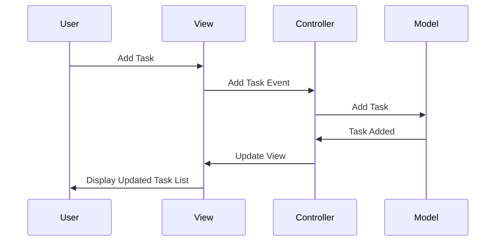

## 7.1.2 Implementation in JavaScript

In this section, we will explore how to implement the Model-View-Controller (MVC) architectural pattern using plain JavaScript. The MVC pattern is a powerful way to structure applications, promoting separation of concerns and making your code more maintainable and scalable. Let's dive into each component of MVC and see how they interact within a JavaScript application.

### Understanding MVC Components

The MVC pattern divides an application into three interconnected components:

- **Model**: Represents the data and the business logic of the application. It is responsible for managing the data, logic, and rules of the application.
- **View**: Represents the presentation layer. It displays data to the user and sends user commands to the controller.
- **Controller**: Acts as an intermediary between the model and the view. It listens to user input from the view, processes it (often updating the model), and returns the results to the view.

### Implementing MVC in JavaScript

Let's build a simple JavaScript application using the MVC pattern. We'll create a basic to-do list application that allows users to add, remove, and view tasks.

#### Step 1: Define the Model

The model is responsible for managing the data of the application. In our to-do list example, the model will handle the list of tasks.

```javascript
// Model
class TodoModel {
    constructor() {
        this.todos = [];
    }

    addTodo(todo) {
        this.todos.push(todo);
    }

    removeTodo(index) {
        this.todos.splice(index, 1);
    }

    getTodos() {
        return this.todos;
    }
}
```

**Explanation**: 
- The `TodoModel` class manages the list of tasks. 
- It includes methods to add, remove, and retrieve tasks.

#### Step 2: Create the View

The view is responsible for displaying the data to the user and capturing user input. In our example, the view will render the list of tasks and provide input fields for adding new tasks.

```javascript
// View
class TodoView {
    constructor() {
        this.app = this.getElement('#root');
        this.form = this.createElement('form');
        this.input = this.createElement('input');
        this.input.type = 'text';
        this.input.placeholder = 'Add a new task';
        this.input.name = 'todo';
        this.submitButton = this.createElement('button');
        this.submitButton.textContent = 'Submit';
        this.todoList = this.createElement('ul', 'todo-list');

        this.form.append(this.input, this.submitButton);
        this.app.append(this.form, this.todoList);
    }

    createElement(tag, className) {
        const element = document.createElement(tag);
        if (className) element.classList.add(className);
        return element;
    }

    getElement(selector) {
        return document.querySelector(selector);
    }

    displayTodos(todos) {
        // Remove all child nodes
        while (this.todoList.firstChild) {
            this.todoList.removeChild(this.todoList.firstChild);
        }

        // Show default message
        if (todos.length === 0) {
            const p = this.createElement('p');
            p.textContent = 'Nothing to do! Add a task?';
            this.todoList.append(p);
        } else {
            // Create todo item nodes for each todo
            todos.forEach((todo, index) => {
                const li = this.createElement('li');
                li.id = index;

                const span = this.createElement('span');
                span.textContent = todo;

                const deleteButton = this.createElement('button', 'delete');
                deleteButton.textContent = 'Delete';
                li.append(span, deleteButton);

                // Append nodes
                this.todoList.append(li);
            });
        }
    }

    bindAddTodo(handler) {
        this.form.addEventListener('submit', event => {
            event.preventDefault();

            if (this.input.value) {
                handler(this.input.value);
                this.input.value = '';
            }
        });
    }

    bindDeleteTodo(handler) {
        this.todoList.addEventListener('click', event => {
            if (event.target.className === 'delete') {
                const id = parseInt(event.target.parentElement.id);
                handler(id);
            }
        });
    }
}
```

**Explanation**:
- The `TodoView` class handles the DOM elements for displaying the to-do list.
- It provides methods to display tasks and bind user actions (add and delete tasks).

#### Step 3: Develop the Controller

The controller acts as an intermediary between the model and the view. It handles user input, updates the model, and refreshes the view.

```javascript
// Controller
class TodoController {
    constructor(model, view) {
        this.model = model;
        this.view = view;

        this.view.bindAddTodo(this.handleAddTodo);
        this.view.bindDeleteTodo(this.handleDeleteTodo);

        // Display initial todos
        this.onTodoListChanged(this.model.getTodos());
    }

    onTodoListChanged = todos => {
        this.view.displayTodos(todos);
    }

    handleAddTodo = todoText => {
        this.model.addTodo(todoText);
        this.onTodoListChanged(this.model.getTodos());
    }

    handleDeleteTodo = index => {
        this.model.removeTodo(index);
        this.onTodoListChanged(this.model.getTodos());
    }
}

// Initialize the app
const app = new TodoController(new TodoModel(), new TodoView());
```

**Explanation**:
- The `TodoController` class connects the model and the view.
- It binds the view's user input events to the model's data manipulation methods.
- It updates the view whenever the model changes.

### DOM Manipulation in MVC

In the MVC pattern, DOM manipulation is primarily handled by the view. The view listens for user interactions and updates the DOM accordingly. This separation ensures that the model remains unaware of the presentation logic, adhering to the separation of concerns principle.

### Challenges of Implementing MVC Without Frameworks

Implementing MVC in plain JavaScript can be challenging due to the following reasons:

1. **Manual DOM Manipulation**: Without frameworks, you need to manually handle DOM updates, which can become cumbersome as the application grows.
2. **State Management**: Managing state changes and ensuring the view reflects the current state can be complex.
3. **Boilerplate Code**: Setting up the MVC structure involves a lot of boilerplate code, which can be reduced by using frameworks.

Despite these challenges, implementing MVC in plain JavaScript is an excellent way to understand the pattern deeply and appreciate the abstractions provided by frameworks.

### Try It Yourself

To get hands-on experience, try modifying the code examples:

- Add a feature to edit existing tasks.
- Implement a filter to show only completed tasks.
- Enhance the UI with CSS for a better user experience.

### Visualizing MVC Interaction

Below is a diagram illustrating the interaction between the Model, View, and Controller in our JavaScript application:



**Diagram Explanation**: This sequence diagram shows how user actions flow through the MVC components. The user interacts with the view, which communicates with the controller. The controller updates the model, and the model's changes are reflected back in the view.

### Further Reading

For more in-depth information on MVC and JavaScript, consider exploring the following resources:

- [MDN Web Docs on MVC](https://developer.mozilla.org/en-US/docs/Glossary/MVC)
- [JavaScript.info on MVC](https://javascript.info/mvc)
- [W3Schools JavaScript Tutorial](https://www.w3schools.com/js/)

### Key Takeaways

- **MVC Pattern**: Separates concerns into three components: Model, View, and Controller.
- **Model**: Manages data and business logic.
- **View**: Handles presentation and user interaction.
- **Controller**: Acts as an intermediary, processing input and updating the model and view.
- **Challenges**: Implementing MVC without frameworks can be complex but offers a deeper understanding of the pattern.

Remember, mastering MVC in JavaScript is just the beginning. As you progress, you'll be able to build more complex and interactive applications. Keep experimenting, stay curious, and enjoy the journey!

## Quiz Time!



### What is the primary role of the Model in the MVC pattern?

- [x] To manage the data and business logic of the application.
- [ ] To handle user input and update the view.
- [ ] To display data to the user.
- [ ] To manage the application's routing.

> **Explanation:** The Model is responsible for managing the data and business logic of the application.

### In the MVC pattern, which component is responsible for updating the DOM?

- [ ] Model
- [x] View
- [ ] Controller
- [ ] Router

> **Explanation:** The View is responsible for updating the DOM and presenting data to the user.

### How does the Controller interact with the Model in MVC?

- [x] It updates the Model based on user input.
- [ ] It directly manipulates the DOM.
- [ ] It only displays data to the user.
- [ ] It does not interact with the Model.

> **Explanation:** The Controller updates the Model based on user input and processes data.

### What is a challenge of implementing MVC without frameworks?

- [x] Manual DOM manipulation can become cumbersome.
- [ ] It is impossible to separate concerns.
- [ ] MVC cannot be implemented without frameworks.
- [ ] There are no challenges.

> **Explanation:** Manual DOM manipulation can become cumbersome as the application grows.

### Which of the following is a benefit of using the MVC pattern?

- [x] Separation of concerns.
- [x] Improved code maintainability.
- [ ] Reduced code complexity.
- [ ] Faster application performance.

> **Explanation:** MVC provides separation of concerns and improves code maintainability.

### In the MVC pattern, which component acts as an intermediary between the Model and the View?

- [ ] Model
- [ ] View
- [x] Controller
- [ ] Router

> **Explanation:** The Controller acts as an intermediary between the Model and the View.

### What does the View do when it receives user input?

- [x] It sends the input to the Controller.
- [ ] It updates the Model directly.
- [ ] It displays the input immediately.
- [ ] It ignores the input.

> **Explanation:** The View sends user input to the Controller for processing.

### Which method in the View class is responsible for displaying the list of tasks?

- [x] displayTodos
- [ ] bindAddTodo
- [ ] bindDeleteTodo
- [ ] createElement

> **Explanation:** The `displayTodos` method is responsible for displaying the list of tasks.

### What is the purpose of the `bindAddTodo` method in the View?

- [x] To bind the form submission event to a handler function.
- [ ] To display the list of tasks.
- [ ] To create DOM elements.
- [ ] To remove tasks from the list.

> **Explanation:** The `bindAddTodo` method binds the form submission event to a handler function.

### True or False: The MVC pattern cannot be implemented in plain JavaScript.

- [ ] True
- [x] False

> **Explanation:** The MVC pattern can be implemented in plain JavaScript, though it may require more manual setup compared to using frameworks.


