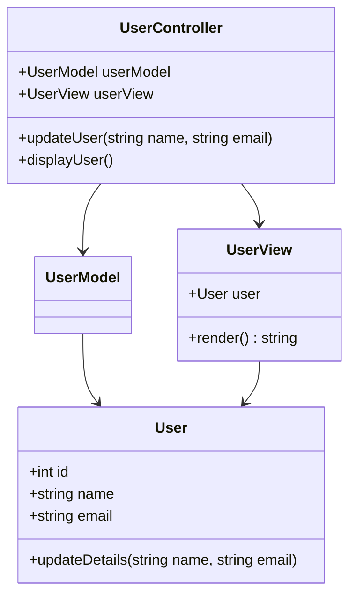

## 7.1.3 Implementation in TypeScript

The Model-View-Controller (MVC) architectural pattern is a cornerstone of software design, providing a structured approach to building applications by separating concerns into three interconnected components: Models, Views, and Controllers. In this section, we will delve into implementing MVC in TypeScript, leveraging its strong typing capabilities to enhance code quality, maintainability, and error checking.

### Understanding MVC in TypeScript

Before diving into the implementation, let's briefly revisit the MVC components:

- **Model**: Represents the data and business logic of the application. It is responsible for retrieving data from the database and processing it.
- **View**: Handles the presentation layer, displaying data to the user and capturing user input.
- **Controller**: Acts as an intermediary between the Model and the View, processing user input, updating the Model, and selecting the View for presentation.

### Leveraging TypeScript for MVC

TypeScript, with its static typing and advanced features, provides several advantages when implementing the MVC pattern:

- **Type Safety**: Ensures that data types are consistent across components, reducing runtime errors.
- **Interfaces and Classes**: Facilitate clear definitions of Models, Views, and Controllers, promoting better code organization.
- **Enhanced Tooling**: Offers improved code navigation, refactoring, and error checking in IDEs.

### Implementing Models in TypeScript

In TypeScript, Models can be defined using classes and interfaces. This allows us to enforce data structures and business logic consistently.

```typescript
// Define an interface for a User Model
interface IUser {
  id: number;
  name: string;
  email: string;
}

// Implement the User Model class
class UserModel implements IUser {
  constructor(public id: number, public name: string, public email: string) {}

  // Method to update user details
  updateDetails(name: string, email: string): void {
    this.name = name;
    this.email = email;
  }
}
```

In this example, we define an `IUser` interface to specify the structure of a user object. The `UserModel` class implements this interface, ensuring that any instance of `UserModel` adheres to the defined structure.

### Implementing Views in TypeScript

Views in MVC are responsible for rendering the user interface. In TypeScript, we can define Views as classes that interact with the DOM or a templating engine.

```typescript
// Define a View class for displaying user information
class UserView {
  constructor(private user: IUser) {}

  // Method to render user details
  render(): string {
    return `<div>
              <h1>${this.user.name}</h1>
              <p>Email: ${this.user.email}</p>
            </div>`;
  }
}
```

The `UserView` class takes a `user` object as a parameter and provides a `render` method to generate HTML content. This separation allows for easy updates to the presentation logic without affecting the underlying data.

### Implementing Controllers in TypeScript

Controllers coordinate the interaction between Models and Views. They handle user input, update the Model, and determine which View to display.

```typescript
// Define a Controller class for managing user interactions
class UserController {
  private userModel: UserModel;
  private userView: UserView;

  constructor(userModel: UserModel, userView: UserView) {
    this.userModel = userModel;
    this.userView = userView;
  }

  // Method to update user information
  updateUser(name: string, email: string): void {
    this.userModel.updateDetails(name, email);
    this.displayUser();
  }

  // Method to display user information
  displayUser(): void {
    const userHtml = this.userView.render();
    document.getElementById('user-container')!.innerHTML = userHtml;
  }
}
```

The `UserController` class manages interactions between the `UserModel` and `UserView`. It provides methods to update user data and refresh the view, ensuring that changes in the Model are reflected in the View.

### Ensuring Type Safety Across Components

TypeScript's strong typing ensures that data passed between Models, Views, and Controllers is consistent and error-free. By defining interfaces and using type annotations, we can catch errors at compile time, reducing the likelihood of runtime issues.

### Benefits of TypeScript in MVC Implementation

Implementing MVC in TypeScript offers several benefits:

- **Improved Code Organization**: Classes and interfaces provide a clear structure for organizing code, making it easier to manage and maintain.
- **Error Checking**: TypeScript's static analysis helps identify potential errors early in the development process.
- **Enhanced Readability**: Strong typing and clear interfaces improve code readability, making it easier for developers to understand and collaborate on projects.

### Example: Using TypeScript with Angular

Angular is a popular framework that uses TypeScript and follows the MVC pattern. Let's explore how Angular leverages TypeScript's features to implement MVC principles.

```typescript
// Define a User model in Angular
export class User {
  constructor(public id: number, public name: string, public email: string) {}
}

// Define a User service to manage user data
@Injectable({
  providedIn: 'root',
})
export class UserService {
  private users: User[] = [];

  addUser(user: User): void {
    this.users.push(user);
  }

  getUsers(): User[] {
    return this.users;
  }
}

// Define a User component to display user information
@Component({
  selector: 'app-user',
  template: `
    <div *ngFor="let user of users">
      <h1>{{ user.name }}</h1>
      <p>Email: {{ user.email }}</p>
    </div>
  `,
})
export class UserComponent implements OnInit {
  users: User[] = [];

  constructor(private userService: UserService) {}

  ngOnInit(): void {
    this.users = this.userService.getUsers();
  }
}
```

In this Angular example, we define a `User` model, a `UserService` to manage user data, and a `UserComponent` to display user information. TypeScript's strong typing ensures that data is consistent across components, enhancing code quality and maintainability.

### Visualizing MVC in TypeScript

To better understand the interaction between Models, Views, and Controllers in TypeScript, let's visualize the MVC architecture using a class diagram.



This diagram illustrates the relationships between the `UserModel`, `UserView`, and `UserController` classes, highlighting how they interact to implement the MVC pattern.

### Try It Yourself

To deepen your understanding of MVC in TypeScript, try modifying the code examples:

- **Add New Features**: Extend the `UserModel` class to include additional properties, such as `address` or `phone number`, and update the `UserView` and `UserController` to handle these new properties.
- **Implement Validation**: Add validation logic to the `UserModel` class to ensure that user data is valid before updating the Model.
- **Experiment with Different Views**: Create multiple `UserView` classes to display user information in different formats, such as a table or a card layout.

### References and Further Reading

- [TypeScript Official Documentation](https://www.typescriptlang.org/docs/)
- [Angular Documentation](https://angular.io/docs)
- [MDN Web Docs: MVC](https://developer.mozilla.org/en-US/docs/Glossary/MVC)

### Knowledge Check

To reinforce your understanding of MVC implementation in TypeScript, consider the following questions and exercises:

- **What are the main components of the MVC pattern, and what are their responsibilities?**
- **How does TypeScript's strong typing enhance the implementation of MVC?**
- **What are the benefits of using TypeScript for MVC implementation?**
- **Try implementing a simple MVC application in TypeScript, such as a to-do list or a contact manager.**

### Embrace the Journey

Remember, mastering MVC in TypeScript is a journey. As you continue to explore and experiment with this pattern, you'll gain a deeper understanding of how to build robust and maintainable applications. Keep experimenting, stay curious, and enjoy the journey!

## Quiz Time!



### What is the primary role of the Model in the MVC pattern?

- [x] To represent the data and business logic of the application.
- [ ] To handle user input and update the View.
- [ ] To display data to the user.
- [ ] To manage the interaction between the View and the Controller.

> **Explanation:** The Model is responsible for representing the data and business logic of the application.

### How does TypeScript enhance the implementation of the MVC pattern?

- [x] By providing strong typing and interfaces for better code organization.
- [ ] By allowing dynamic typing for flexibility.
- [ ] By simplifying the code structure with fewer lines of code.
- [ ] By eliminating the need for Models and Views.

> **Explanation:** TypeScript enhances MVC implementation by providing strong typing and interfaces, which improve code organization and error checking.

### In the provided TypeScript MVC example, what is the role of the UserController class?

- [x] To manage interactions between the UserModel and UserView.
- [ ] To render the user interface.
- [ ] To store user data in a database.
- [ ] To define the structure of a user object.

> **Explanation:** The UserController class manages interactions between the UserModel and UserView, handling user input and updating the View.

### What is one benefit of using TypeScript for MVC implementation?

- [x] Improved error checking through static analysis.
- [ ] Increased runtime performance.
- [ ] Simplified syntax compared to JavaScript.
- [ ] Reduced need for testing.

> **Explanation:** TypeScript provides improved error checking through static analysis, helping to identify potential errors early in the development process.

### Which Angular component is responsible for managing user data in the provided example?

- [x] UserService
- [ ] UserComponent
- [ ] UserModel
- [ ] UserView

> **Explanation:** The UserService is responsible for managing user data in the Angular example.

### What is the purpose of the render method in the UserView class?

- [x] To generate HTML content for displaying user information.
- [ ] To update user details in the Model.
- [ ] To handle user input and update the Controller.
- [ ] To store user data in a database.

> **Explanation:** The render method in the UserView class generates HTML content for displaying user information.

### How can you ensure type safety across MVC components in TypeScript?

- [x] By defining interfaces and using type annotations.
- [ ] By using dynamic typing and avoiding interfaces.
- [ ] By minimizing the use of classes and methods.
- [ ] By relying on runtime error checking.

> **Explanation:** Type safety across MVC components in TypeScript can be ensured by defining interfaces and using type annotations.

### What is a key advantage of using classes and interfaces in TypeScript for MVC?

- [x] They provide a clear structure for organizing code.
- [ ] They allow for more concise code with fewer lines.
- [ ] They eliminate the need for error handling.
- [ ] They simplify the deployment process.

> **Explanation:** Classes and interfaces in TypeScript provide a clear structure for organizing code, making it easier to manage and maintain.

### What does the UserComponent class do in the Angular example?

- [x] It displays user information using the UserService.
- [ ] It manages user data and updates the Model.
- [ ] It defines the structure of a user object.
- [ ] It handles user input and updates the Controller.

> **Explanation:** The UserComponent class displays user information using the UserService in the Angular example.

### True or False: TypeScript's strong typing eliminates the need for testing in MVC applications.

- [ ] True
- [x] False

> **Explanation:** While TypeScript's strong typing helps catch errors at compile time, it does not eliminate the need for testing, which is essential for ensuring application functionality and reliability.


