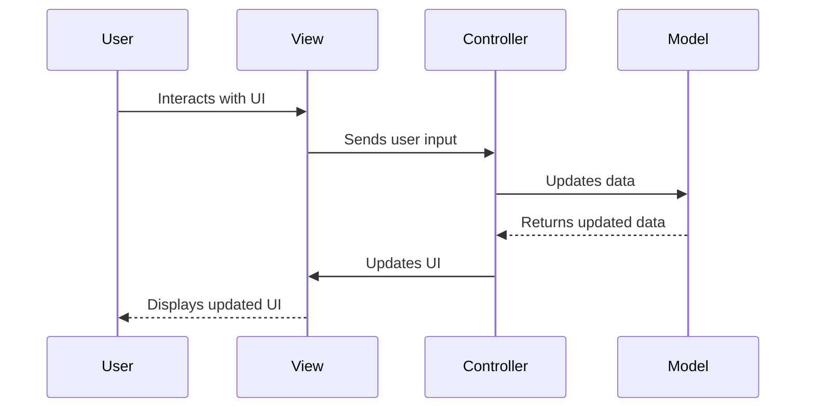

## 7.1.4 Use Cases and Examples

The Model-View-Controller (MVC) architectural pattern is a cornerstone in software development, particularly in web applications. It provides a structured approach to separating concerns, which enhances maintainability and testability. In this section, we will delve into practical applications of MVC in various domains, including web, mobile, and desktop software. We'll also explore popular frameworks that leverage MVC, such as AngularJS, and compare MVC to other architectural patterns like MVVM. Finally, we'll offer best practices and highlight common pitfalls to avoid.

### Understanding MVC in Practice

Before diving into specific use cases, let's briefly revisit the core components of MVC:

- **Model**: Represents the data and business logic. It is responsible for managing the data of the application and responding to requests for information or instructions to change state.
- **View**: The user interface of the application. It displays data from the model to the user and sends user commands to the controller.
- **Controller**: Acts as an intermediary between the model and the view. It listens to the input from the view, processes it (often by invoking methods on the model), and updates the view with the new data.

### Web Applications

#### Example: Building a Simple To-Do List Application

Let's start with a classic example of a web application: a to-do list. This application will demonstrate how MVC can be applied to manage tasks effectively.

**Model (JavaScript/TypeScript):**

```typescript
// Task.ts
export class Task {
    constructor(public id: number, public title: string, public completed: boolean = false) {}

    toggleCompletion(): void {
        this.completed = !this.completed;
    }
}
```

**View (HTML and JavaScript/TypeScript):**

```html
<!-- index.html -->
<!DOCTYPE html>
<html lang="en">
<head>
    <meta charset="UTF-8">
    <title>To-Do List</title>
</head>
<body>
    <div id="app">
        <h1>To-Do List</h1>
        <ul id="task-list"></ul>
        <input type="text" id="new-task" placeholder="New task">
        <button id="add-task">Add Task</button>
    </div>
    <script src="controller.js" type="module"></script>
</body>
</html>
```

**Controller (JavaScript/TypeScript):**

```typescript
// controller.ts
import { Task } from './Task';

class TaskController {
    private tasks: Task[] = [];
    private taskListElement: HTMLElement | null = document.getElementById('task-list');
    private newTaskInput: HTMLInputElement | null = document.getElementById('new-task') as HTMLInputElement;
    private addTaskButton: HTMLElement | null = document.getElementById('add-task');

    constructor() {
        this.addTaskButton?.addEventListener('click', () => this.addTask());
        this.render();
    }

    addTask(): void {
        if (this.newTaskInput?.value) {
            const task = new Task(this.tasks.length + 1, this.newTaskInput.value);
            this.tasks.push(task);
            this.newTaskInput.value = '';
            this.render();
        }
    }

    toggleTaskCompletion(taskId: number): void {
        const task = this.tasks.find(t => t.id === taskId);
        if (task) {
            task.toggleCompletion();
            this.render();
        }
    }

    render(): void {
        if (this.taskListElement) {
            this.taskListElement.innerHTML = '';
            this.tasks.forEach(task => {
                const taskItem = document.createElement('li');
                taskItem.textContent = task.title;
                taskItem.style.textDecoration = task.completed ? 'line-through' : 'none';
                taskItem.addEventListener('click', () => this.toggleTaskCompletion(task.id));
                this.taskListElement?.appendChild(taskItem);
            });
        }
    }
}

new TaskController();
```

**Explanation:**

- The **Model** (`Task`) manages the data and business logic, such as toggling the completion status of a task.
- The **View** is represented by the HTML structure and dynamically updated by JavaScript.
- The **Controller** (`TaskController`) handles user interactions, updates the model, and refreshes the view.

#### Benefits of MVC in Web Applications

1. **Separation of Concerns**: MVC separates the application logic into distinct components, making it easier to manage and scale.
2. **Maintainability**: Changes in one component (e.g., the view) do not affect others (e.g., the model), simplifying updates and maintenance.
3. **Testability**: Each component can be tested independently, improving the reliability of the application.

### Mobile Applications

While MVC is more commonly associated with web development, it can also be applied to mobile applications. Frameworks like React Native and Flutter allow developers to implement MVC-like architectures.

#### Example: A Simple Note-Taking App in React Native

**Model (JavaScript/TypeScript):**

```typescript
// Note.ts
export class Note {
    constructor(public id: number, public content: string) {}
}
```

**View (React Native Component):**

```typescript
// NoteView.tsx
import React from 'react';
import { View, Text, TextInput, Button, FlatList } from 'react-native';
import { Note } from './Note';

interface NoteViewProps {
    notes: Note[];
    onAddNote: (content: string) => void;
}

export const NoteView: React.FC<NoteViewProps> = ({ notes, onAddNote }) => {
    const [newNoteContent, setNewNoteContent] = React.useState('');

    return (
        <View>
            <Text>Notes</Text>
            <FlatList
                data={notes}
                renderItem={({ item }) => <Text>{item.content}</Text>}
                keyExtractor={item => item.id.toString()}
            />
            <TextInput
                value={newNoteContent}
                onChangeText={setNewNoteContent}
                placeholder="New note"
            />
            <Button title="Add Note" onPress={() => {
                onAddNote(newNoteContent);
                setNewNoteContent('');
            }} />
        </View>
    );
};
```

**Controller (React Native Component):**

```typescript
// NoteController.tsx
import React from 'react';
import { Note } from './Note';
import { NoteView } from './NoteView';

export const NoteController: React.FC = () => {
    const [notes, setNotes] = React.useState<Note[]>([]);

    const addNote = (content: string) => {
        const newNote = new Note(notes.length + 1, content);
        setNotes([...notes, newNote]);
    };

    return (
        <NoteView notes={notes} onAddNote={addNote} />
    );
};
```

**Explanation:**

- The **Model** (`Note`) represents the data structure for a note.
- The **View** (`NoteView`) is a React Native component that displays notes and provides input for new notes.
- The **Controller** (`NoteController`) manages the state and logic for adding notes.

### Desktop Applications

MVC can also be applied to desktop applications, particularly those built with frameworks like Electron, which allows web technologies to be used for desktop development.

#### Example: A Simple Calculator in Electron

**Model (JavaScript/TypeScript):**

```typescript
// CalculatorModel.ts
export class CalculatorModel {
    private currentValue: number = 0;

    add(value: number): number {
        this.currentValue += value;
        return this.currentValue;
    }

    subtract(value: number): number {
        this.currentValue -= value;
        return this.currentValue;
    }

    getCurrentValue(): number {
        return this.currentValue;
    }
}
```

**View (HTML and JavaScript/TypeScript):**

```html
<!-- index.html -->
<!DOCTYPE html>
<html lang="en">
<head>
    <meta charset="UTF-8">
    <title>Calculator</title>
</head>
<body>
    <div id="calculator">
        <input type="text" id="display" readonly>
        <button id="add">Add</button>
        <button id="subtract">Subtract</button>
    </div>
    <script src="controller.js" type="module"></script>
</body>
</html>
```

**Controller (JavaScript/TypeScript):**

```typescript
// controller.ts
import { CalculatorModel } from './CalculatorModel';

class CalculatorController {
    private model: CalculatorModel = new CalculatorModel();
    private display: HTMLInputElement | null = document.getElementById('display') as HTMLInputElement;
    private addButton: HTMLElement | null = document.getElementById('add');
    private subtractButton: HTMLElement | null = document.getElementById('subtract');

    constructor() {
        this.addButton?.addEventListener('click', () => this.updateDisplay(this.model.add(1)));
        this.subtractButton?.addEventListener('click', () => this.updateDisplay(this.model.subtract(1)));
        this.updateDisplay(this.model.getCurrentValue());
    }

    updateDisplay(value: number): void {
        if (this.display) {
            this.display.value = value.toString();
        }
    }
}

new CalculatorController();
```

**Explanation:**

- The **Model** (`CalculatorModel`) handles the arithmetic operations and maintains the current value.
- The **View** is a simple HTML interface with buttons for adding and subtracting.
- The **Controller** (`CalculatorController`) links the model and view, updating the display based on user interactions.

### MVC in Popular Frameworks

Many popular frameworks implement MVC or MVC-like patterns to help developers structure their applications efficiently.

#### AngularJS

AngularJS is a widely-used framework that follows the MVC pattern. It allows developers to create dynamic web applications by separating the application logic from the user interface.

**Example: AngularJS MVC Structure**

- **Model**: AngularJS services or factories that manage data.
- **View**: HTML templates with AngularJS directives.
- **Controller**: JavaScript functions that handle user input and update the model and view.

```javascript
// app.js
angular.module('todoApp', [])
.controller('TodoController', function($scope) {
    $scope.tasks = [];
    $scope.addTask = function(taskTitle) {
        $scope.tasks.push({ title: taskTitle, completed: false });
        $scope.newTaskTitle = '';
    };
    $scope.toggleCompletion = function(task) {
        task.completed = !task.completed;
    };
});
```

```html
<!-- index.html -->
<!DOCTYPE html>
<html lang="en" ng-app="todoApp">
<head>
    <meta charset="UTF-8">
    <title>To-Do List</title>
</head>
<body ng-controller="TodoController">
    <h1>To-Do List</h1>
    <ul>
        <li ng-repeat="task in tasks" ng-click="toggleCompletion(task)" ng-style="{ 'text-decoration': task.completed ? 'line-through' : 'none' }">
            {{ task.title }}
        </li>
    </ul>
    <input type="text" ng-model="newTaskTitle" placeholder="New task">
    <button ng-click="addTask(newTaskTitle)">Add Task</button>
</body>
</html>
```

**Explanation:**

- AngularJS uses a declarative approach to bind the model and view, reducing the need for boilerplate code.
- The controller in AngularJS is responsible for setting up the initial state and handling user interactions.

### Comparing MVC with MVVM

The Model-View-ViewModel (MVVM) pattern is another architectural pattern that is often compared to MVC. MVVM is commonly used in frameworks like Angular and React.

#### Key Differences

- **ViewModel**: In MVVM, the ViewModel acts as an intermediary between the view and the model, similar to the controller in MVC. However, the ViewModel is more focused on data binding and state management.
- **Data Binding**: MVVM often relies on two-way data binding, where changes in the view automatically update the ViewModel and vice versa. This reduces the need for manual synchronization between the view and the model.

#### Example: MVVM in Angular

```typescript
// app.component.ts
import { Component } from '@angular/core';

@Component({
  selector: 'app-root',
  template: `
    <h1>To-Do List</h1>
    <ul>
      <li *ngFor="let task of tasks" (click)="toggleCompletion(task)" [style.textDecoration]="task.completed ? 'line-through' : 'none'">
        {{ task.title }}
      </li>
    </ul>
    <input [(ngModel)]="newTaskTitle" placeholder="New task">
    <button (click)="addTask()">Add Task</button>
  `
})
export class AppComponent {
  tasks = [];
  newTaskTitle = '';

  addTask() {
    if (this.newTaskTitle) {
      this.tasks.push({ title: this.newTaskTitle, completed: false });
      this.newTaskTitle = '';
    }
  }

  toggleCompletion(task) {
    task.completed = !task.completed;
  }
}
```

**Explanation:**

- Angular's use of two-way data binding simplifies the interaction between the view and the ViewModel, reducing the need for explicit controller logic.

### Best Practices and Common Pitfalls

#### Best Practices

1. **Keep Controllers Lightweight**: Avoid placing too much logic in the controller. Delegate business logic to the model and keep the controller focused on handling user input and updating the view.
2. **Use Services for Shared Logic**: In frameworks like AngularJS, use services to encapsulate shared logic and data access, promoting reusability and separation of concerns.
3. **Leverage Framework Features**: Take advantage of framework-specific features like data binding in Angular or state management in React to simplify your code.

#### Common Pitfalls

1. **Overcomplicating the View**: Avoid placing too much logic in the view. Keep the view focused on presentation and delegate logic to the controller or ViewModel.
2. **Ignoring Separation of Concerns**: Resist the temptation to mix concerns by placing business logic in the view or presentation logic in the model.
3. **Neglecting Testability**: Ensure that each component (model, view, controller) is testable independently. Write unit tests for models and controllers, and use integration tests for views.

### Visualizing MVC Architecture

To better understand the flow and interaction between the components in an MVC architecture, let's visualize it using a Mermaid.js diagram.



**Diagram Explanation:**

- The user interacts with the view, which sends input to the controller.
- The controller processes the input and updates the model.
- The model returns updated data to the controller.
- The controller updates the view, which then displays the updated UI to the user.

### Try It Yourself

To deepen your understanding of MVC, try modifying the examples provided:

1. **Add Features**: Extend the to-do list application by adding features such as task prioritization or due dates.
2. **Refactor Code**: Refactor the calculator example to include additional operations like multiplication and division.
3. **Experiment with Frameworks**: Try implementing the note-taking app using a different framework like Flutter or Xamarin.

### Conclusion

The MVC pattern is a powerful tool for structuring applications, providing clear separation of concerns and enhancing maintainability and testability. By understanding and applying MVC in various contexts, from web to mobile to desktop applications, developers can create robust and scalable software solutions. Remember to follow best practices and avoid common pitfalls to make the most of MVC in your projects.

## Quiz Time!



### What is the primary role of the Model in MVC architecture?

- [x] To manage the data and business logic of the application.
- [ ] To handle user input and update the view.
- [ ] To display data to the user.
- [ ] To act as an intermediary between the view and the controller.

> **Explanation:** The Model is responsible for managing the data and business logic of the application, responding to requests for information or instructions to change state.

### In an MVC architecture, what is the main responsibility of the Controller?

- [ ] To manage the data and business logic.
- [x] To handle user input and update the view.
- [ ] To display data to the user.
- [ ] To store and retrieve data from a database.

> **Explanation:** The Controller acts as an intermediary between the Model and the View, handling user input and updating the view with new data.

### Which of the following is a common benefit of using MVC architecture?

- [x] Improved maintainability and testability.
- [ ] Increased complexity in application design.
- [ ] Reduced performance due to separation of concerns.
- [ ] Limited scalability for large applications.

> **Explanation:** MVC architecture improves maintainability and testability by separating concerns into distinct components, allowing for easier updates and independent testing.

### How does the ViewModel in MVVM differ from the Controller in MVC?

- [x] The ViewModel focuses on data binding and state management.
- [ ] The ViewModel directly manages user input and updates the view.
- [ ] The ViewModel stores and retrieves data from a database.
- [ ] The ViewModel is responsible for rendering the user interface.

> **Explanation:** The ViewModel in MVVM focuses on data binding and state management, often relying on two-way data binding to synchronize the view and model.

### Which framework is known for implementing the MVC pattern?

- [x] AngularJS
- [ ] React
- [ ] Vue.js
- [ ] Svelte

> **Explanation:** AngularJS is a popular framework that implements the MVC pattern, allowing developers to create dynamic web applications with a clear separation of concerns.

### What is a common pitfall when using MVC architecture?

- [x] Overcomplicating the View with too much logic.
- [ ] Keeping Controllers lightweight and focused.
- [ ] Using services for shared logic.
- [ ] Leveraging framework features like data binding.

> **Explanation:** A common pitfall in MVC architecture is overcomplicating the View with too much logic, which should be handled by the Controller or Model.

### What is the purpose of the sequence diagram in the context of MVC?

- [x] To visualize the flow and interaction between MVC components.
- [ ] To show the database schema used by the Model.
- [ ] To illustrate the user interface layout.
- [ ] To depict the server-side architecture.

> **Explanation:** The sequence diagram visualizes the flow and interaction between MVC components, helping to understand how data and control flow through the system.

### In the provided to-do list example, what is the role of the Task class?

- [x] To represent the data and business logic for a task.
- [ ] To handle user input and update the view.
- [ ] To display the task list to the user.
- [ ] To manage the application state.

> **Explanation:** The Task class represents the data and business logic for a task, such as toggling its completion status.

### What is a key difference between MVC and MVVM?

- [x] MVVM often relies on two-way data binding.
- [ ] MVC uses a ViewModel to manage data binding.
- [ ] MVVM separates the view and controller into distinct components.
- [ ] MVC focuses on state management and data binding.

> **Explanation:** MVVM often relies on two-way data binding, where changes in the view automatically update the ViewModel and vice versa, reducing the need for manual synchronization.

### True or False: MVC architecture is only applicable to web applications.

- [ ] True
- [x] False

> **Explanation:** False. MVC architecture can be applied to web, mobile, and desktop applications, providing a structured approach to separating concerns in various software domains.


