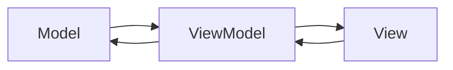

## 7.2.1 Intent and Motivation

The Model-View-ViewModel (MVVM) architectural pattern is a powerful design pattern that has gained popularity in the development of user interfaces, particularly in web and mobile applications. It provides a robust framework for separating the graphical user interface (GUI) from the business logic, enhancing both testability and maintainability. In this section, we will delve into the intent and motivation behind the MVVM pattern, exploring its components, advantages, and how it addresses common challenges in software development.

### Understanding the MVVM Pattern

The MVVM pattern is an evolution of the Model-View-Controller (MVC) pattern, designed to facilitate the separation of concerns in application design. It consists of three core components:

1. **Model**: Represents the data and business logic of the application. It is responsible for managing the data, performing operations on it, and notifying the ViewModel of any changes. The Model is independent of the user interface and does not contain any UI-specific logic.

2. **View**: The View is the user interface of the application. It displays the data to the user and sends user interactions to the ViewModel. The View is typically a visual representation of the data and is responsible for rendering the UI components.

3. **ViewModel**: Acts as an intermediary between the View and the Model. It holds the presentation logic and is responsible for preparing the data for display in the View. The ViewModel also handles user interactions and updates the Model accordingly. It is the key component that facilitates data binding, allowing for automatic synchronization between the View and the Model.

### Key Differences Between MVVM and MVC

While both MVVM and MVC aim to separate concerns within an application, they differ in how they achieve this separation:

- **Data Binding**: One of the most significant differences between MVVM and MVC is the use of data binding. In MVVM, data binding is a core feature that allows the View to automatically update in response to changes in the ViewModel. This reduces the need for manual DOM manipulation and enhances the responsiveness of the application.

- **ViewModel vs. Controller**: In MVC, the Controller handles user input and updates the Model and View. In contrast, MVVM introduces the ViewModel, which not only handles user input but also manages the presentation logic and data binding. This leads to a more declarative approach to UI development.

- **Separation of Concerns**: MVVM provides a clearer separation of concerns by decoupling the View from the Model through the ViewModel. This separation enhances testability, as the ViewModel can be tested independently of the UI.

### Advantages of Using MVVM

The MVVM pattern offers several advantages that make it an attractive choice for modern application development:

- **Enhanced Testability**: By separating the presentation logic from the UI, MVVM allows for easier unit testing of the ViewModel. This leads to more reliable and maintainable code.

- **Improved Maintainability**: The clear separation of concerns in MVVM makes it easier to manage and update the codebase. Changes to the UI or business logic can be made independently, reducing the risk of introducing bugs.

- **Responsive UI**: Data binding in MVVM ensures that the UI is automatically updated in response to changes in the data. This leads to a more responsive and dynamic user experience.

- **Reusability**: The ViewModel can be reused across different Views, promoting code reuse and reducing duplication.

### Addressing Common Challenges with MVVM

The MVVM pattern addresses several common challenges in software development, particularly in the context of UI development:

- **Reducing Tight Coupling**: By decoupling the UI from the business logic, MVVM reduces tight coupling and promotes a more modular architecture. This makes it easier to evolve the application over time.

- **Managing Complexity**: As applications grow in complexity, managing the interactions between the UI and business logic can become challenging. MVVM provides a structured approach to managing this complexity, making it easier to reason about the code.

- **Facilitating Collaboration**: The separation of concerns in MVVM allows developers and designers to work more independently. Developers can focus on the business logic, while designers can focus on the UI, leading to more efficient collaboration.

### Visualizing the MVVM Pattern

To better understand the relationships and data flow between the components of the MVVM pattern, let's visualize it using a diagram:



**Diagram Description**: This diagram illustrates the data flow in the MVVM pattern. The Model and ViewModel interact bidirectionally, allowing the ViewModel to update the Model and vice versa. The View and ViewModel also interact bidirectionally, enabling data binding and user interaction handling.

### The Role of Data Binding in MVVM

Data binding is a fundamental concept in the MVVM pattern, enabling automatic synchronization between the View and the ViewModel. This feature enhances the responsiveness and efficiency of applications by reducing the need for manual DOM manipulation.

#### How Data Binding Works

In MVVM, data binding allows the View to automatically reflect changes in the ViewModel. When the data in the ViewModel changes, the View is updated to display the new data. Similarly, when the user interacts with the View, the ViewModel is updated to reflect the changes.

#### Benefits of Data Binding

- **Automatic UI Updates**: Data binding ensures that the UI is always in sync with the underlying data, reducing the need for manual updates.

- **Simplified Code**: By eliminating the need for manual DOM manipulation, data binding simplifies the code and reduces the likelihood of errors.

- **Improved Performance**: Data binding can improve the performance of applications by minimizing the number of DOM updates required.

### Implementing MVVM in JavaScript and TypeScript

Let's explore how the MVVM pattern can be implemented in JavaScript and TypeScript, using a simple example to illustrate the concepts.

#### JavaScript Example

```javascript
// Model
class ProductModel {
  constructor(name, price) {
    this.name = name;
    this.price = price;
  }
}

// ViewModel
class ProductViewModel {
  constructor(model) {
    this.model = model;
    this.name = model.name;
    this.price = model.price;
  }

  updatePrice(newPrice) {
    this.price = newPrice;
    this.model.price = newPrice;
    // Notify the view to update
    this.notifyView();
  }

  notifyView() {
    // Logic to update the view
    console.log(`The price of ${this.name} is now ${this.price}`);
  }
}

// View
const productModel = new ProductModel('Laptop', 1000);
const productViewModel = new ProductViewModel(productModel);

// Simulate user interaction
productViewModel.updatePrice(1200);
```

**Code Explanation**: In this example, we define a simple `ProductModel` representing the data. The `ProductViewModel` acts as an intermediary, managing the presentation logic and updating the model. The `updatePrice` method simulates a user interaction, updating the price and notifying the view.

#### TypeScript Example

```typescript
// Model
class ProductModel {
  constructor(public name: string, public price: number) {}
}

// ViewModel
class ProductViewModel {
  private model: ProductModel;
  public name: string;
  public price: number;

  constructor(model: ProductModel) {
    this.model = model;
    this.name = model.name;
    this.price = model.price;
  }

  updatePrice(newPrice: number): void {
    this.price = newPrice;
    this.model.price = newPrice;
    this.notifyView();
  }

  private notifyView(): void {
    console.log(`The price of ${this.name} is now ${this.price}`);
  }
}

// View
const productModel = new ProductModel('Laptop', 1000);
const productViewModel = new ProductViewModel(productModel);

// Simulate user interaction
productViewModel.updatePrice(1200);
```

**Code Explanation**: The TypeScript example is similar to the JavaScript example, with the addition of type annotations for enhanced type safety. The `ProductViewModel` manages the data and presentation logic, updating the model and notifying the view of changes.

### Try It Yourself

To better understand the MVVM pattern, try modifying the code examples above:

- **Add a new property** to the `ProductModel` and update the `ProductViewModel` to handle it.
- **Implement a method** in the `ProductViewModel` to simulate a user interaction, such as changing the product name.
- **Experiment with data binding** by creating a simple HTML view and updating it in response to changes in the `ProductViewModel`.

### Conclusion

The MVVM pattern is a powerful architectural pattern that provides a clear separation of concerns, enhancing the testability and maintainability of applications. By decoupling the UI from the business logic, MVVM promotes a more modular architecture, making it easier to manage complexity and facilitate collaboration. The use of data binding in MVVM enhances the responsiveness and efficiency of applications, providing a more dynamic user experience.

As you continue to explore the MVVM pattern, remember that this is just the beginning. Keep experimenting, stay curious, and enjoy the journey of building more complex and interactive applications.

## Quiz Time!



### What is the primary purpose of the MVVM pattern?

- [x] To separate the GUI from business logic
- [ ] To enhance the speed of applications
- [ ] To integrate third-party libraries
- [ ] To reduce the number of files in a project

> **Explanation:** The MVVM pattern is designed to separate the graphical user interface (GUI) from business logic, enhancing testability and maintainability.

### Which component in MVVM is responsible for data binding?

- [ ] Model
- [ ] View
- [x] ViewModel
- [ ] Controller

> **Explanation:** The ViewModel is responsible for managing data binding between the Model and the View.

### How does MVVM differ from MVC in terms of handling user input?

- [x] MVVM uses ViewModel, while MVC uses Controller
- [ ] MVVM uses Model, while MVC uses View
- [ ] MVVM uses View, while MVC uses Model
- [ ] MVVM uses Controller, while MVC uses ViewModel

> **Explanation:** In MVVM, the ViewModel handles user input, whereas in MVC, the Controller handles user input.

### What is a key advantage of data binding in MVVM?

- [ ] It reduces the number of classes
- [x] It ensures automatic UI updates
- [ ] It increases code complexity
- [ ] It eliminates the need for a Model

> **Explanation:** Data binding ensures that the UI is automatically updated in response to changes in the data, reducing the need for manual updates.

### What does the ViewModel in MVVM primarily manage?

- [x] Presentation logic and data binding
- [ ] User interface rendering
- [ ] Database connections
- [ ] Network requests

> **Explanation:** The ViewModel manages the presentation logic and data binding, acting as an intermediary between the View and the Model.

### Which of the following is NOT a benefit of using MVVM?

- [ ] Enhanced testability
- [ ] Improved maintainability
- [ ] Responsive UI
- [x] Increased file size

> **Explanation:** MVVM enhances testability, maintainability, and UI responsiveness, but it does not inherently increase file size.

### What problem does MVVM address in software development?

- [x] Reducing tight coupling between UI and business logic
- [ ] Increasing the number of developers needed
- [ ] Decreasing application performance
- [ ] Simplifying database queries

> **Explanation:** MVVM addresses the problem of tight coupling between the UI and business logic, promoting a more modular architecture.

### In MVVM, which component is typically responsible for rendering the UI?

- [ ] Model
- [x] View
- [ ] ViewModel
- [ ] Controller

> **Explanation:** The View is responsible for rendering the user interface in the MVVM pattern.

### How does MVVM facilitate collaboration between developers and designers?

- [x] By separating concerns, allowing independent work
- [ ] By combining UI and business logic
- [ ] By reducing the number of files
- [ ] By eliminating the need for a View

> **Explanation:** MVVM facilitates collaboration by separating concerns, allowing developers and designers to work independently.

### True or False: The ViewModel in MVVM can be reused across different Views.

- [x] True
- [ ] False

> **Explanation:** The ViewModel can be reused across different Views, promoting code reuse and reducing duplication.


