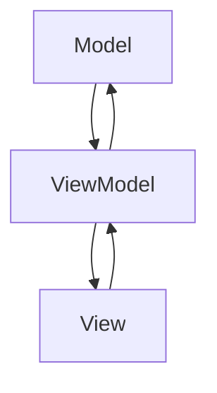

## 7.2.2 Implementation in JavaScript

In this section, we delve into the implementation of the Model-View-ViewModel (MVVM) architectural pattern in JavaScript applications. The MVVM pattern is particularly useful in creating interactive and dynamic web applications, as it facilitates a clear separation of concerns and enhances maintainability. We will explore how JavaScript frameworks like Knockout.js and Vue.js embody MVVM principles, focusing on data binding, reactive data, and computed properties. By the end of this section, you'll have a solid understanding of how to implement MVVM in your JavaScript projects, along with best practices for managing state and optimizing performance.

### Understanding MVVM

Before diving into the implementation, let's briefly recap the MVVM pattern. MVVM is an architectural pattern that separates the development of the graphical user interface (UI) from the business logic or back-end logic (the data model). It consists of three main components:

- **Model**: Represents the data and business logic of the application. It is responsible for managing the data and ensuring its integrity.
- **View**: The UI of the application, which displays the data and sends user commands to the ViewModel.
- **ViewModel**: Acts as an intermediary between the View and the Model. It handles the presentation logic and state of the View, exposing data from the Model in a way that the View can easily consume.

### Implementing MVVM with Knockout.js

Knockout.js is a lightweight JavaScript library that provides a simple way to implement the MVVM pattern through declarative bindings and automatic UI updates. Let's explore how to set up a basic MVVM structure using Knockout.js.

#### Setting Up Knockout.js

To get started with Knockout.js, include the library in your HTML file:

```html
<!DOCTYPE html>
<html lang="en">
<head>
    <meta charset="UTF-8">
    <title>Knockout.js MVVM Example</title>
    <script src="https://cdnjs.cloudflare.com/ajax/libs/knockout/3.5.1/knockout-min.js"></script>
</head>
<body>
    <!-- Your HTML content will go here -->
</body>
</html>
```

#### Defining the Model

In Knockout.js, the Model is typically a plain JavaScript object. For our example, let's create a simple Model representing a `Person`:

```javascript
function Person(firstName, lastName) {
    this.firstName = firstName;
    this.lastName = lastName;
}
```

#### Creating the ViewModel

The ViewModel in Knockout.js is responsible for exposing the Model's data to the View and handling user interactions. Here's how we can define a ViewModel for our `Person` model:

```javascript
function PersonViewModel() {
    // Observable properties
    this.firstName = ko.observable('John');
    this.lastName = ko.observable('Doe');

    // Computed property
    this.fullName = ko.computed(() => {
        return this.firstName() + ' ' + this.lastName();
    });
}

// Apply bindings
ko.applyBindings(new PersonViewModel());
```

In this example, `ko.observable` is used to create observable properties, which automatically update the View when their values change. The `ko.computed` function is used to define a computed property, `fullName`, which concatenates the `firstName` and `lastName`.

#### Building the View

The View in Knockout.js is defined using HTML with data-bind attributes to bind the ViewModel's properties to the UI elements:

```html
<div>
    <label>First Name:</label>
    <input type="text" data-bind="value: firstName">
</div>
<div>
    <label>Last Name:</label>
    <input type="text" data-bind="value: lastName">
</div>
<div>
    <h2>Full Name: <span data-bind="text: fullName"></span></h2>
</div>
```

In this HTML, the `data-bind` attribute is used to bind the input fields to the `firstName` and `lastName` observables, and the `fullName` computed property is displayed in a span element.

#### Try It Yourself

Experiment with the code by adding new properties to the `Person` model, such as `age` or `email`, and update the ViewModel and View accordingly. Observe how changes in the input fields automatically update the displayed full name.

### Implementing MVVM with Vue.js

Vue.js is a progressive JavaScript framework that makes it easy to build interactive UIs. It provides a more comprehensive solution for implementing the MVVM pattern, with built-in support for reactive data and computed properties.

#### Setting Up Vue.js

To start using Vue.js, include the library in your HTML file:

```html
<!DOCTYPE html>
<html lang="en">
<head>
    <meta charset="UTF-8">
    <title>Vue.js MVVM Example</title>
    <script src="https://cdn.jsdelivr.net/npm/vue@2.6.14/dist/vue.js"></script>
</head>
<body>
    <div id="app">
        <!-- Your Vue.js app will go here -->
    </div>
</body>
</html>
```

#### Defining the Model

In Vue.js, the Model is often represented by the `data` object in a Vue instance. Let's create a simple Model for a `Person`:

```javascript
var app = new Vue({
    el: '#app',
    data: {
        firstName: 'John',
        lastName: 'Doe'
    }
});
```

#### Creating the ViewModel

In Vue.js, the ViewModel is integrated into the Vue instance. It manages the state and exposes data to the View through the `data` object and computed properties:

```javascript
var app = new Vue({
    el: '#app',
    data: {
        firstName: 'John',
        lastName: 'Doe'
    },
    computed: {
        fullName: function() {
            return this.firstName + ' ' + this.lastName;
        }
    }
});
```

The `computed` property in Vue.js is similar to Knockout.js's `ko.computed`, allowing us to define reactive properties that automatically update when their dependencies change.

#### Building the View

The View in Vue.js is defined using HTML with Vue directives to bind the ViewModel's properties to the UI elements:

```html
<div id="app">
    <div>
        <label>First Name:</label>
        <input type="text" v-model="firstName">
    </div>
    <div>
        <label>Last Name:</label>
        <input type="text" v-model="lastName">
    </div>
    <div>
        <h2>Full Name: {{ fullName }}</h2>
    </div>
</div>
```

In this HTML, the `v-model` directive is used to create two-way data bindings between the input fields and the `firstName` and `lastName` properties. The `fullName` computed property is displayed using the `{{ }}` syntax for text interpolation.

#### Try It Yourself

Modify the Vue.js example by adding a new computed property that calculates the initials of the person. Update the View to display the initials alongside the full name.

### Data Binding in JavaScript Frameworks

Data binding is a core feature of MVVM frameworks like Knockout.js and Vue.js, enabling automatic synchronization between the Model and the View. This is achieved through observables and computed properties, which ensure that changes in the data are immediately reflected in the UI, and vice versa.

#### Observables and Reactive Data

Observables in Knockout.js and reactive data in Vue.js provide a mechanism for tracking changes to data and automatically updating the UI. This is crucial for maintaining a responsive and interactive user experience.

In Knockout.js, observables are created using `ko.observable`:

```javascript
var myObservable = ko.observable('Initial value');
myObservable.subscribe(function(newValue) {
    console.log('The new value is: ' + newValue);
});
```

In Vue.js, reactive data is defined within the `data` object of a Vue instance:

```javascript
var app = new Vue({
    data: {
        myData: 'Initial value'
    },
    watch: {
        myData: function(newValue) {
            console.log('The new value is: ' + newValue);
        }
    }
});
```

#### Computed Properties

Computed properties are a powerful feature in both Knockout.js and Vue.js, allowing us to define properties that automatically update when their dependencies change.

In Knockout.js, computed properties are created using `ko.computed`:

```javascript
var viewModel = {
    firstName: ko.observable('John'),
    lastName: ko.observable('Doe'),
    fullName: ko.computed(function() {
        return this.firstName() + ' ' + this.lastName();
    }, this)
};
```

In Vue.js, computed properties are defined within the `computed` object:

```javascript
var app = new Vue({
    data: {
        firstName: 'John',
        lastName: 'Doe'
    },
    computed: {
        fullName: function() {
            return this.firstName + ' ' + this.lastName;
        }
    }
});
```

### Challenges and Best Practices

Implementing the MVVM pattern in JavaScript comes with its own set of challenges. Here are some best practices to consider:

1. **Managing State**: Ensure that your application's state is managed efficiently. Use Vuex in Vue.js or other state management libraries to handle complex state interactions.

2. **Optimizing Performance**: Avoid unnecessary computations by leveraging computed properties and watchers. In Vue.js, use the `watch` option to monitor specific data changes and perform actions accordingly.

3. **Separation of Concerns**: Maintain a clear separation between the Model, View, and ViewModel. This enhances code readability and maintainability.

4. **Testing**: Write unit tests for your ViewModel logic to ensure that it behaves as expected. Use testing frameworks like Jest or Mocha for this purpose.

5. **Scalability**: As your application grows, consider breaking down your ViewModel into smaller, reusable components. This is particularly easy in Vue.js, which supports component-based architecture.

### Visualizing MVVM Interaction

To better understand the interaction between the Model, View, and ViewModel in the MVVM pattern, let's visualize this relationship using a Mermaid.js diagram:



**Diagram Description**: This diagram illustrates the flow of data and commands in the MVVM pattern. The Model provides data to the ViewModel, which then exposes it to the View. User interactions in the View are sent to the ViewModel, which updates the Model accordingly.

### References and Further Reading

- [Knockout.js Documentation](https://knockoutjs.com/documentation/introduction.html)
- [Vue.js Guide](https://vuejs.org/v2/guide/)
- [MDN Web Docs: JavaScript](https://developer.mozilla.org/en-US/docs/Web/JavaScript)
- [Vuex: State Management for Vue.js](https://vuex.vuejs.org/)

### Knowledge Check

1. What are the three main components of the MVVM pattern?
2. How does data binding work in Knockout.js?
3. What is the purpose of computed properties in Vue.js?
4. How can you manage complex state interactions in a Vue.js application?
5. What are some best practices for implementing MVVM in JavaScript?

### Embrace the Journey

Remember, mastering the MVVM pattern in JavaScript is a journey. As you continue to explore and experiment with frameworks like Knockout.js and Vue.js, you'll discover new ways to create dynamic and responsive web applications. Stay curious, keep learning, and enjoy the process!

## Quiz Time!



### What is the primary role of the ViewModel in the MVVM pattern?

- [x] To act as an intermediary between the View and the Model
- [ ] To directly manipulate the UI elements
- [ ] To store the application's state permanently
- [ ] To handle all server-side logic

> **Explanation:** The ViewModel acts as an intermediary between the View and the Model, managing the presentation logic and exposing data to the View.

### How does Knockout.js achieve data binding?

- [x] Through the use of observables and computed properties
- [ ] By directly manipulating the DOM
- [ ] By using server-side rendering
- [ ] By storing data in local storage

> **Explanation:** Knockout.js uses observables and computed properties to achieve data binding, allowing automatic synchronization between the Model and the View.

### In Vue.js, what directive is used for two-way data binding?

- [x] v-model
- [ ] v-bind
- [ ] v-if
- [ ] v-for

> **Explanation:** The `v-model` directive in Vue.js is used for two-way data binding between input elements and the data properties.

### What is a common challenge when implementing MVVM in JavaScript?

- [x] Managing state efficiently
- [ ] Writing HTML code
- [ ] Using CSS for styling
- [ ] Deploying the application

> **Explanation:** Managing state efficiently is a common challenge in MVVM implementations, especially as applications grow in complexity.

### Which library is recommended for state management in Vue.js applications?

- [x] Vuex
- [ ] Redux
- [ ] MobX
- [ ] Backbone.js

> **Explanation:** Vuex is a state management library specifically designed for Vue.js applications, providing a centralized store for all the components.

### What is the purpose of computed properties in MVVM frameworks?

- [x] To automatically update when their dependencies change
- [ ] To store static data
- [ ] To handle user input events
- [ ] To manage server-side operations

> **Explanation:** Computed properties automatically update when their dependencies change, providing a way to define reactive data in MVVM frameworks.

### How can you optimize performance in a Vue.js application?

- [x] By using computed properties and watchers
- [ ] By increasing the server's RAM
- [ ] By reducing the number of HTML elements
- [ ] By using inline styles

> **Explanation:** Using computed properties and watchers helps optimize performance by avoiding unnecessary computations and efficiently managing data changes.

### What is a best practice for maintaining a clear separation of concerns in MVVM?

- [x] Keeping the Model, View, and ViewModel distinct and separate
- [ ] Combining all logic into a single file
- [ ] Using global variables for data storage
- [ ] Directly manipulating the DOM in the ViewModel

> **Explanation:** Maintaining a clear separation between the Model, View, and ViewModel enhances code readability and maintainability.

### What is the role of the `ko.applyBindings` function in Knockout.js?

- [x] To apply the ViewModel to the View
- [ ] To initialize the Model
- [ ] To render the HTML elements
- [ ] To handle server-side requests

> **Explanation:** The `ko.applyBindings` function in Knockout.js applies the ViewModel to the View, enabling data binding and UI updates.

### True or False: Vue.js supports component-based architecture.

- [x] True
- [ ] False

> **Explanation:** True. Vue.js supports component-based architecture, allowing developers to create reusable and modular components for their applications.


