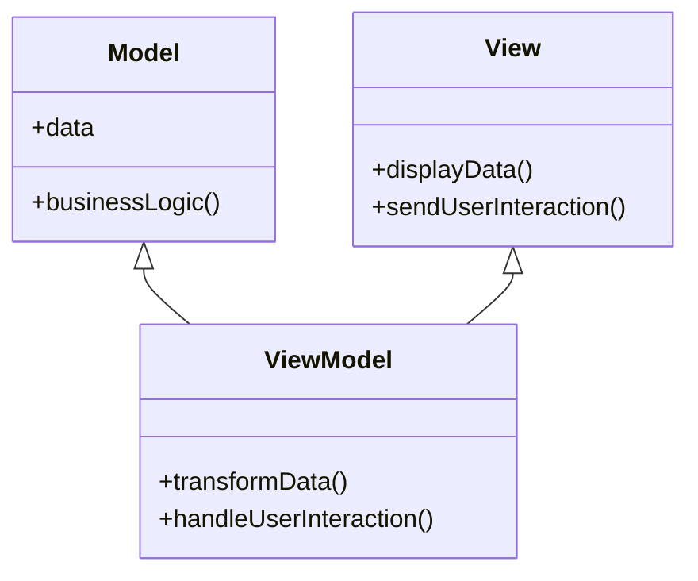

## 7.2.3 Implementation in TypeScript

In this section, we will explore how to implement the Model-View-ViewModel (MVVM) architectural pattern using TypeScript. We will leverage TypeScript's static typing and object-oriented features to create robust and maintainable applications. We'll use popular frameworks like Angular and Vue.js, which have excellent TypeScript support, to demonstrate practical examples.

### Understanding MVVM in TypeScript

The MVVM pattern is designed to separate the development of the graphical user interface (UI) from the business logic or back-end logic (the data model). This separation allows developers to work on the UI and business logic independently, improving code maintainability and scalability.

**Components of MVVM:**

- **Model**: Represents the data and business logic. It notifies the ViewModel of any changes.
- **View**: The UI layer that displays the data and sends user interactions to the ViewModel.
- **ViewModel**: Acts as an intermediary between the View and the Model. It handles the presentation logic and data transformations.

### Benefits of Using TypeScript in MVVM

TypeScript enhances MVVM implementation by providing:

- **Static Typing**: Catch errors at compile time, reducing runtime errors.
- **Interfaces and Classes**: Define clear contracts and reusable components.
- **Decorators**: Simplify data binding and component communication.
- **Type Annotations**: Improve code readability and maintainability.

### Implementing MVVM in Angular with TypeScript

Angular is a popular framework for building web applications, and it fully supports TypeScript. Let's explore how to implement MVVM in Angular.

#### Setting Up an Angular Project

To get started, you need to have Node.js and npm installed. Then, install Angular CLI:

```bash
npm install -g @angular/cli
```

Create a new Angular project:

```bash
ng new mvvm-demo
cd mvvm-demo
```

#### Defining the Model

In Angular, the Model is typically a TypeScript class that represents the data structure. Here's an example of a simple `User` model:

```typescript
export class User {
  constructor(
    public id: number,
    public name: string,
    public email: string
  ) {}
}
```

#### Creating the ViewModel

The ViewModel in Angular is often implemented as a service. It manages the data and business logic and communicates with the Model. Here's an example of a `UserService`:

```typescript
import { Injectable } from '@angular/core';
import { User } from './user.model';

@Injectable({
  providedIn: 'root'
})
export class UserService {
  private users: User[] = [];

  addUser(user: User): void {
    this.users.push(user);
  }

  getUsers(): User[] {
    return this.users;
  }
}
```

#### Building the View

The View in Angular is defined using HTML templates and components. Here's an example of a `UserComponent`:

```typescript
import { Component } from '@angular/core';
import { UserService } from './user.service';
import { User } from './user.model';

@Component({
  selector: 'app-user',
  template: `
    <div *ngFor="let user of users">
      <h2>{{ user.name }}</h2>
      <p>{{ user.email }}</p>
    </div>
  `
})
export class UserComponent {
  users: User[];

  constructor(private userService: UserService) {
    this.users = this.userService.getUsers();
  }
}
```

#### Data Binding and Decorators

Angular uses decorators to facilitate data binding and component communication. The `@Component` decorator defines a component, and the `@Injectable` decorator marks a service for dependency injection.

### Implementing MVVM in Vue.js with TypeScript

Vue.js is another popular framework that supports TypeScript. Let's see how to implement MVVM in Vue.js.

#### Setting Up a Vue.js Project

First, install Vue CLI:

```bash
npm install -g @vue/cli
```

Create a new Vue project with TypeScript support:

```bash
vue create mvvm-demo
cd mvvm-demo
vue add typescript
```

#### Defining the Model

In Vue.js, the Model can be a TypeScript interface or class. Here's an example of a `Product` model:

```typescript
export interface Product {
  id: number;
  name: string;
  price: number;
}
```

#### Creating the ViewModel

The ViewModel in Vue.js is often a component script. Here's an example of a `ProductComponent`:

```typescript
<template>
  <div v-for="product in products" :key="product.id">
    <h2>{{ product.name }}</h2>
    <p>{{ product.price }}</p>
  </div>
</template>

<script lang="ts">
import { defineComponent } from 'vue';
import { Product } from './product.model';

export default defineComponent({
  data() {
    return {
      products: [] as Product[]
    };
  },
  methods: {
    fetchProducts() {
      // Fetch products from an API or service
    }
  },
  created() {
    this.fetchProducts();
  }
});
</script>
```

#### Using Type Annotations and Decorators

Vue.js with TypeScript allows you to use type annotations to define the data types. You can also use decorators with libraries like `vue-class-component` to enhance your components.

### Strongly-Typed Models and ViewModels

Using TypeScript, you can define strongly-typed models and viewmodels, which improves development efficiency by providing clear contracts and reducing errors.

#### Example: Strongly-Typed User Model

```typescript
export interface User {
  id: number;
  name: string;
  email: string;
}
```

#### Example: Strongly-Typed ViewModel

```typescript
import { User } from './user.model';

export class UserViewModel {
  private users: User[] = [];

  addUser(user: User): void {
    this.users.push(user);
  }

  getUsers(): User[] {
    return this.users;
  }
}
```

### Benefits of TypeScript in MVVM

TypeScript offers several benefits in MVVM architecture:

- **Error Checking**: Catch errors at compile time, reducing runtime issues.
- **Code Maintainability**: Improve code readability and maintainability with clear type definitions.
- **Development Efficiency**: Increase development speed with autocompletion and type inference.

### Try It Yourself

To solidify your understanding, try modifying the code examples:

- Add new properties to the `User` or `Product` models and update the View and ViewModel accordingly.
- Implement additional methods in the ViewModel to manipulate the data.
- Experiment with different data binding techniques in Angular or Vue.js.

### Visualizing MVVM Architecture

Below is a diagram illustrating the interaction between the Model, View, and ViewModel in an MVVM architecture:



**Diagram Description**: This diagram shows the relationship between the Model, View, and ViewModel. The Model provides data and business logic, the View displays data and sends user interactions, and the ViewModel transforms data and handles user interactions.

### References and Links

- [Angular Documentation](https://angular.io/docs)
- [Vue.js Documentation](https://vuejs.org/v2/guide/typescript.html)
- [TypeScript Handbook](https://www.typescriptlang.org/docs/)

### Knowledge Check

- What are the main components of the MVVM pattern?
- How does TypeScript enhance MVVM implementation?
- What are the benefits of using decorators in Angular?
- How can you define a strongly-typed model in TypeScript?

### Embrace the Journey

Remember, this is just the beginning. As you progress, you'll build more complex and interactive applications using MVVM and TypeScript. Keep experimenting, stay curious, and enjoy the journey!

## Quiz Time!



### What are the main components of the MVVM pattern?

- [x] Model, View, ViewModel
- [ ] Model, View, Controller
- [ ] Model, View, Presenter
- [ ] Model, View, Adapter

> **Explanation:** The MVVM pattern consists of the Model, View, and ViewModel components.

### How does TypeScript enhance MVVM implementation?

- [x] By providing static typing and interfaces
- [ ] By allowing dynamic typing
- [ ] By removing the need for classes
- [ ] By enforcing strict coding standards

> **Explanation:** TypeScript enhances MVVM implementation by providing static typing and interfaces, which improve code maintainability and error checking.

### What is the role of the ViewModel in MVVM?

- [x] It acts as an intermediary between the View and the Model
- [ ] It directly manipulates the UI
- [ ] It only handles data storage
- [ ] It is responsible for rendering the UI

> **Explanation:** The ViewModel acts as an intermediary between the View and the Model, handling presentation logic and data transformations.

### Which Angular decorator is used to define a component?

- [x] @Component
- [ ] @Injectable
- [ ] @Directive
- [ ] @Pipe

> **Explanation:** The `@Component` decorator is used in Angular to define a component.

### How can you define a strongly-typed model in TypeScript?

- [x] Using interfaces or classes
- [ ] Using plain JavaScript objects
- [ ] Using dynamic typing
- [ ] Using decorators

> **Explanation:** Strongly-typed models in TypeScript can be defined using interfaces or classes.

### What is the benefit of using decorators in Angular?

- [x] Simplifying data binding and component communication
- [ ] Enforcing strict typing
- [ ] Removing the need for services
- [ ] Allowing dynamic component creation

> **Explanation:** Decorators in Angular simplify data binding and component communication.

### What is the purpose of the View in MVVM?

- [x] To display data and send user interactions to the ViewModel
- [ ] To transform data
- [ ] To handle business logic
- [ ] To store data

> **Explanation:** The View is responsible for displaying data and sending user interactions to the ViewModel.

### How does TypeScript improve code maintainability in MVVM?

- [x] By providing clear type definitions and error checking
- [ ] By enforcing dynamic typing
- [ ] By removing the need for interfaces
- [ ] By allowing inline styling

> **Explanation:** TypeScript improves code maintainability by providing clear type definitions and error checking.

### What is the advantage of using TypeScript's static typing?

- [x] Catching errors at compile time
- [ ] Allowing runtime type changes
- [ ] Removing the need for testing
- [ ] Enforcing strict coding standards

> **Explanation:** Static typing in TypeScript helps catch errors at compile time, reducing runtime issues.

### True or False: The ViewModel directly manipulates the UI in MVVM.

- [ ] True
- [x] False

> **Explanation:** False. The ViewModel does not directly manipulate the UI; it acts as an intermediary between the View and the Model.


