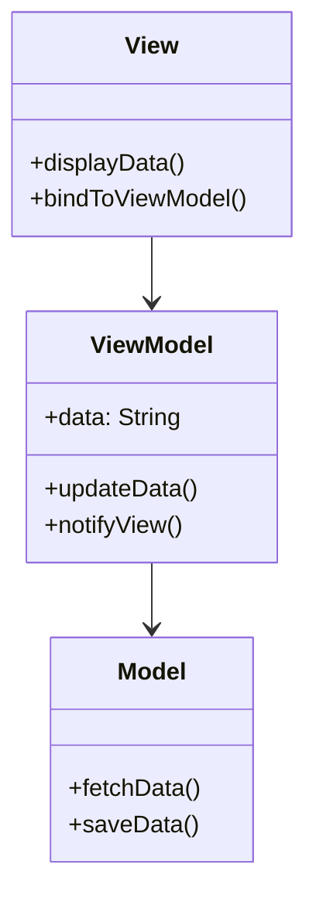
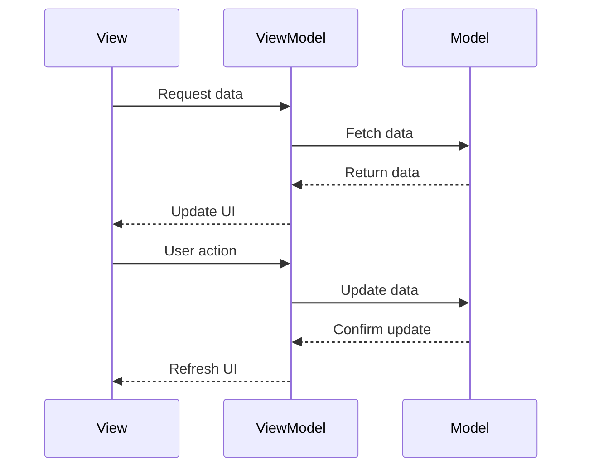

## 7.2.4 Use Cases and Examples

The Model-View-ViewModel (MVVM) architectural pattern is a powerful tool for building scalable, maintainable, and testable applications. It is particularly useful in applications where the user interface (UI) is complex and requires a clear separation of concerns. In this section, we will explore real-world applications of MVVM, focusing on its implementation in JavaScript and TypeScript. We will also discuss how MVVM improves testability and supports scalable codebases, and provide insights into when to choose MVVM over other architectural patterns.

### Real-World Applications of MVVM

#### Desktop Applications

One of the most well-known implementations of the MVVM pattern is in desktop applications, particularly those built using Windows Presentation Foundation (WPF). In WPF, MVVM is used to separate the UI (View) from the business logic (ViewModel) and data (Model). This separation allows for a more modular and testable codebase.

**Example: WPF Application**

In a WPF application, the View is typically defined using XAML, a markup language for designing UI elements. The ViewModel is a class that contains properties and commands that the View binds to. The Model represents the data and business logic.

```csharp
// ViewModel.cs
public class ViewModel : INotifyPropertyChanged
{
    private string _text;
    public string Text
    {
        get { return _text; }
        set
        {
            _text = value;
            OnPropertyChanged(nameof(Text));
        }
    }

    public ICommand UpdateTextCommand { get; }

    public ViewModel()
    {
        UpdateTextCommand = new RelayCommand(UpdateText);
    }

    private void UpdateText()
    {
        Text = "Updated Text";
    }

    public event PropertyChangedEventHandler PropertyChanged;

    protected virtual void OnPropertyChanged(string propertyName)
    {
        PropertyChanged?.Invoke(this, new PropertyChangedEventArgs(propertyName));
    }
}
```

In this example, the `ViewModel` class implements the `INotifyPropertyChanged` interface, which allows the View to be notified of changes to the `Text` property. The `UpdateTextCommand` is a command that the View can bind to, allowing the user to trigger the `UpdateText` method.

#### Modern Web Applications

In modern web applications, MVVM is often used in conjunction with frameworks like Angular and Vue.js. These frameworks provide built-in support for MVVM, making it easier to implement the pattern.

**Example: Angular Application**

In an Angular application, the View is defined using HTML templates, and the ViewModel is represented by a component class. The Model is typically a service that provides data to the component.

```typescript
// app.component.ts
import { Component } from '@angular/core';
import { DataService } from './data.service';

@Component({
  selector: 'app-root',
  templateUrl: './app.component.html',
  styleUrls: ['./app.component.css']
})
export class AppComponent {
  title = 'MVVM Example';
  data: string;

  constructor(private dataService: DataService) {
    this.data = this.dataService.getData();
  }

  updateData() {
    this.data = 'Updated Data';
  }
}

// app.component.html
<div>
  <h1>{{ title }}</h1>
  <p>{{ data }}</p>
  <button (click)="updateData()">Update Data</button>
</div>
```

In this Angular example, the `AppComponent` class acts as the ViewModel, binding the `title` and `data` properties to the View. The `updateData` method updates the `data` property, demonstrating the two-way data binding characteristic of MVVM.

### Architectural Diagrams

To better understand the MVVM pattern, let's visualize the interaction between the Model, View, and ViewModel using a diagram.



In this diagram, the View binds to the ViewModel, which in turn interacts with the Model. The ViewModel acts as an intermediary, ensuring that the View remains decoupled from the Model.

### Improving Testability with MVVM

One of the key benefits of the MVVM pattern is improved testability, particularly of the ViewModel layer. Since the ViewModel contains the application's business logic and state, it can be tested independently of the UI. This separation allows developers to write unit tests for the ViewModel, ensuring that the application behaves as expected.

**Example: Testing a ViewModel in TypeScript**

Let's consider a simple example of testing a ViewModel in a TypeScript application.

```typescript
// view-model.ts
export class ViewModel {
  private _data: string;

  constructor() {
    this._data = 'Initial Data';
  }

  get data(): string {
    return this._data;
  }

  updateData(newData: string): void {
    this._data = newData;
  }
}

// view-model.spec.ts
import { ViewModel } from './view-model';

describe('ViewModel', () => {
  let viewModel: ViewModel;

  beforeEach(() => {
    viewModel = new ViewModel();
  });

  it('should initialize with default data', () => {
    expect(viewModel.data).toBe('Initial Data');
  });

  it('should update data correctly', () => {
    viewModel.updateData('Updated Data');
    expect(viewModel.data).toBe('Updated Data');
  });
});
```

In this example, we define a `ViewModel` class with a `data` property and an `updateData` method. We then write unit tests to verify that the `ViewModel` initializes with the correct data and updates the data as expected.

### Supporting Scalable and Maintainable Codebases

MVVM supports scalable and maintainable codebases by promoting a clear separation of concerns. This separation allows developers to work on different parts of the application independently, reducing the risk of introducing bugs and making it easier to add new features.

**Example: Large-Scale Application**

Consider a large-scale application with multiple teams working on different features. By adopting the MVVM pattern, each team can focus on their specific area of the application without affecting other parts. The ViewModel acts as a contract between the View and the Model, ensuring that changes to one part of the application do not impact others.

```typescript
// user-view-model.ts
export class UserViewModel {
  private _userData: UserData;

  constructor(private userService: UserService) {
    this._userData = this.userService.getUserData();
  }

  get userData(): UserData {
    return this._userData;
  }

  updateUserData(newData: UserData): void {
    this._userData = newData;
    this.userService.saveUserData(newData);
  }
}

// order-view-model.ts
export class OrderViewModel {
  private _orderData: OrderData;

  constructor(private orderService: OrderService) {
    this._orderData = this.orderService.getOrderData();
  }

  get orderData(): OrderData {
    return this._orderData;
  }

  updateOrderData(newData: OrderData): void {
    this._orderData = newData;
    this.orderService.saveOrderData(newData);
  }
}
```

In this example, we have separate `UserViewModel` and `OrderViewModel` classes, each responsible for managing their respective data. This separation allows teams to work independently, improving the overall scalability and maintainability of the application.

### Choosing MVVM Over Other Architectural Patterns

When deciding whether to use MVVM in a project, consider factors such as project size, team expertise, and the complexity of the UI. MVVM is particularly well-suited for applications with complex UIs that require a clear separation of concerns. It is also a good choice for projects where testability and maintainability are priorities.

**Comparison with MVC and MVP**

- **MVC (Model-View-Controller)**: MVC is a simpler pattern that is often used in smaller projects. It provides a clear separation between the Model and the View but does not explicitly define a ViewModel layer. This can make it more challenging to test the UI logic independently.

- **MVP (Model-View-Presenter)**: MVP is similar to MVVM but focuses more on the Presenter, which acts as an intermediary between the Model and the View. MVP is often used in applications with simpler UIs where the ViewModel layer of MVVM may not be necessary.

**When to Choose MVVM**

- **Complex UIs**: If your application has a complex UI with many interactive elements, MVVM can help manage the complexity by separating the UI logic from the business logic.

- **Testability**: If testability is a priority, MVVM allows you to write unit tests for the ViewModel, ensuring that the application behaves as expected.

- **Scalability**: For large-scale applications with multiple teams, MVVM supports a modular architecture that allows teams to work independently.

- **Framework Support**: If you are using a framework like Angular or Vue.js that provides built-in support for MVVM, it may be easier to implement the pattern.

### Try It Yourself

To better understand the MVVM pattern, try implementing a simple application using the pattern. Start with a basic application that displays a list of items and allows the user to add new items. Use the MVVM pattern to separate the UI logic from the business logic, and write unit tests for the ViewModel.

- **Modify the ViewModel**: Try adding new features to the ViewModel, such as filtering or sorting the list of items. Observe how the separation of concerns makes it easier to add new features without affecting other parts of the application.

- **Experiment with Different Frameworks**: If you are familiar with multiple frameworks, try implementing the same application in different frameworks to see how each one supports the MVVM pattern.

### Visualizing MVVM in Web Applications

To further illustrate the MVVM pattern in web applications, let's visualize the interaction between the View, ViewModel, and Model using a sequence diagram.



In this sequence diagram, the View requests data from the ViewModel, which in turn fetches the data from the Model. The ViewModel then updates the UI with the data. When the user performs an action, the ViewModel updates the data in the Model and refreshes the UI.

### Key Takeaways

- **Separation of Concerns**: MVVM provides a clear separation between the UI and business logic, making it easier to manage complex applications.

- **Improved Testability**: By isolating the ViewModel, MVVM allows developers to write unit tests for the application's logic, ensuring that it behaves as expected.

- **Scalability and Maintainability**: MVVM supports scalable and maintainable codebases by promoting a modular architecture that allows teams to work independently.

- **Framework Support**: Many modern frameworks, such as Angular and Vue.js, provide built-in support for MVVM, making it easier to implement the pattern in web applications.

- **Choosing MVVM**: Consider using MVVM for applications with complex UIs, where testability and maintainability are priorities, and when using frameworks that support the pattern.

### References and Further Reading

- [MVVM Pattern on Wikipedia](https://en.wikipedia.org/wiki/Model%E2%80%93view%E2%80%93viewmodel)
- [Angular Documentation](https://angular.io/docs)
- [Vue.js Guide](https://vuejs.org/v2/guide/)
- [WPF and MVVM](https://docs.microsoft.com/en-us/dotnet/desktop/wpf/mvvm/)

### Embrace the Journey

Remember, mastering MVVM is a journey. As you continue to explore and implement the pattern in your projects, you'll gain a deeper understanding of its benefits and how it can improve your applications. Keep experimenting, stay curious, and enjoy the journey!

## Quiz Time!



### What is a key benefit of using the MVVM pattern?

- [x] Improved testability
- [ ] Reduced code complexity
- [ ] Faster development time
- [ ] Smaller codebase

> **Explanation:** MVVM improves testability by isolating the ViewModel, allowing developers to write unit tests for the application's logic.

### In which type of application is MVVM particularly useful?

- [x] Applications with complex UIs
- [ ] Simple command-line applications
- [ ] Static websites
- [ ] Single-page applications with no user interaction

> **Explanation:** MVVM is particularly useful in applications with complex UIs that require a clear separation of concerns.

### Which component in MVVM acts as an intermediary between the View and the Model?

- [x] ViewModel
- [ ] Controller
- [ ] Presenter
- [ ] Service

> **Explanation:** The ViewModel acts as an intermediary between the View and the Model, managing the application's state and business logic.

### What is a common use case for MVVM in web applications?

- [x] Managing complex UI interactions
- [ ] Handling server-side logic
- [ ] Optimizing database queries
- [ ] Reducing network latency

> **Explanation:** MVVM is commonly used to manage complex UI interactions by separating the UI logic from the business logic.

### Which framework provides built-in support for the MVVM pattern?

- [x] Angular
- [ ] React
- [ ] Express.js
- [ ] Django

> **Explanation:** Angular provides built-in support for the MVVM pattern, making it easier to implement in web applications.

### What is the role of the Model in the MVVM pattern?

- [x] To represent the data and business logic
- [ ] To handle user input
- [ ] To render the UI
- [ ] To manage network requests

> **Explanation:** The Model represents the data and business logic in the MVVM pattern.

### How does MVVM improve scalability in large projects?

- [x] By promoting a modular architecture
- [ ] By reducing the number of files
- [ ] By minimizing code duplication
- [ ] By using fewer resources

> **Explanation:** MVVM improves scalability by promoting a modular architecture that allows teams to work independently.

### What is a common challenge when implementing MVVM?

- [x] Managing the complexity of the ViewModel
- [ ] Ensuring cross-browser compatibility
- [ ] Optimizing for mobile devices
- [ ] Reducing page load times

> **Explanation:** Managing the complexity of the ViewModel can be a challenge when implementing MVVM, especially in large applications.

### Which pattern is similar to MVVM but focuses more on the Presenter?

- [x] MVP (Model-View-Presenter)
- [ ] MVC (Model-View-Controller)
- [ ] MVU (Model-View-Update)
- [ ] MVI (Model-View-Intent)

> **Explanation:** MVP (Model-View-Presenter) is similar to MVVM but focuses more on the Presenter, which acts as an intermediary between the Model and the View.

### True or False: MVVM is only suitable for desktop applications.

- [ ] True
- [x] False

> **Explanation:** False. MVVM is suitable for both desktop and web applications, particularly those with complex UIs.


