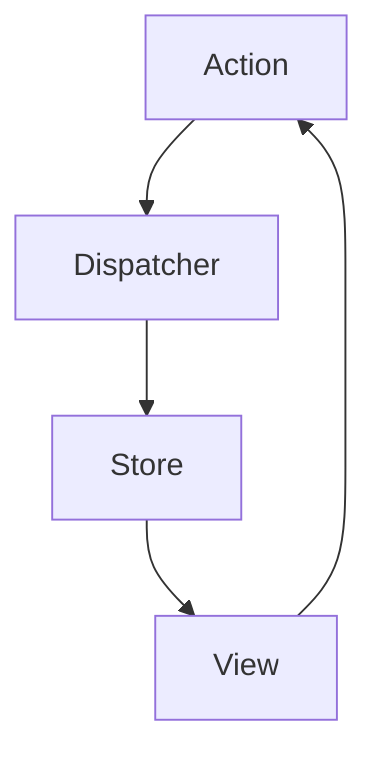

## 7.3.1 Intent and Motivation

In the realm of modern web development, managing application state efficiently and predictably is crucial. As applications grow in complexity, the challenge of maintaining a consistent state across various components becomes increasingly daunting. This is where architectural patterns like Flux and its popular implementation, Redux, come into play. Let's delve into the intent and motivation behind these patterns and understand how they revolutionize state management in client-side applications, particularly with React.

### Origins of Flux in React Applications

Flux was introduced by Facebook to address the complexities of state management in large-scale React applications. React, known for its component-based architecture, excels at rendering UI components efficiently. However, as applications scale, managing state across numerous components can become cumbersome. Traditional patterns like Model-View-Controller (MVC) often fall short in handling complex state interactions, leading to issues such as inconsistent state and unpredictable behavior.

Flux emerged as a solution to these problems by introducing a unidirectional data flow architecture. This approach ensures that data flows in a single direction, making state changes more predictable and easier to debug. By separating concerns and establishing clear pathways for data flow, Flux provides a robust framework for managing state in React applications.

### Key Concepts of Flux: Unidirectional Data Flow

At the core of Flux lies the concept of unidirectional data flow. This architecture consists of four key components: actions, dispatchers, stores, and views. Each component plays a vital role in the data flow process, ensuring that state changes are handled systematically and predictably.

#### Actions

Actions are payloads of information that send data from the application to the dispatcher. They are the sole source of information for the dispatcher and, subsequently, the stores. Actions are typically triggered by user interactions or other events within the application. They encapsulate the intent to change the state and provide a clear mechanism for initiating state transitions.

```javascript
// Example of an action in Flux
const addItemAction = {
  type: 'ADD_ITEM',
  payload: { item: 'New Item' }
};
```

#### Dispatchers

The dispatcher is a central hub that receives actions and broadcasts them to the appropriate stores. It acts as a registry of callbacks and ensures that actions are dispatched in a controlled manner. The dispatcher is responsible for invoking the registered callbacks in the stores, facilitating the unidirectional flow of data.

```javascript
// Example of a dispatcher in Flux
class Dispatcher {
  constructor() {
    this.callbacks = [];
  }

  register(callback) {
    this.callbacks.push(callback);
  }

  dispatch(action) {
    this.callbacks.forEach(callback => callback(action));
  }
}

const dispatcher = new Dispatcher();
```

#### Stores

Stores hold the application's state and logic. They listen for actions dispatched by the dispatcher and update their state accordingly. Stores are responsible for managing the state of specific domains within the application. They emit change events when their state changes, allowing views to update accordingly.

```javascript
// Example of a store in Flux
class Store {
  constructor() {
    this.state = { items: [] };
    dispatcher.register(this.handleActions.bind(this));
  }

  handleActions(action) {
    switch (action.type) {
      case 'ADD_ITEM':
        this.state.items.push(action.payload.item);
        this.emitChange();
        break;
      // Handle other actions
    }
  }

  emitChange() {
    // Notify views of state change
  }
}

const store = new Store();
```

#### Views

Views are React components that render the UI based on the state provided by the stores. They listen for change events from the stores and re-render when the state changes. Views are responsible for displaying the data and interacting with users, triggering actions in response to user inputs.

```javascript
// Example of a view in Flux
class ItemListView extends React.Component {
  constructor(props) {
    super(props);
    this.state = store.state;
  }

  componentDidMount() {
    store.addChangeListener(this.handleStoreChange.bind(this));
  }

  handleStoreChange() {
    this.setState(store.state);
  }

  render() {
    return (
      <ul>
        {this.state.items.map((item, index) => (
          <li key={index}>{item}</li>
        ))}
      </ul>
    );
  }
}
```

### Limitations of Traditional MVC Patterns

Traditional MVC patterns have been the backbone of application architecture for many years. However, as applications grow in complexity, MVC can become a bottleneck in managing state effectively. In MVC, the flow of data is bidirectional, meaning changes in the model can directly affect the view and vice versa. This bidirectional flow can lead to tangled dependencies and make it challenging to trace the source of state changes.

In large applications, the bidirectional nature of MVC can result in a phenomenon known as "spaghetti code," where the interdependencies between components become so complex that the codebase becomes difficult to maintain and extend. This complexity often leads to bugs and makes it challenging to implement new features without introducing regressions.

### How Flux and Redux Address State Management Challenges

Flux addresses the limitations of traditional MVC patterns by enforcing a unidirectional data flow. This architecture simplifies the flow of data and makes it easier to reason about state changes. By decoupling the components and establishing clear pathways for data flow, Flux reduces the complexity of managing state in large applications.

Redux, a popular implementation of Flux, takes these concepts further by introducing additional principles that enhance state management. Redux emphasizes immutability and pure functions, which play a crucial role in ensuring predictable state transitions.

#### Immutability and Pure Functions in Redux

Immutability is a core principle in Redux that ensures the state is never modified directly. Instead, new state objects are created in response to actions. This approach provides several benefits, including easier debugging, improved performance through state comparison, and the ability to implement features like time-travel debugging.

Pure functions are another key concept in Redux. A pure function is a function that, given the same input, always produces the same output and has no side effects. In Redux, reducers are pure functions that take the current state and an action as arguments and return a new state. This predictability makes it easier to understand and test state transitions.

```javascript
// Example of a reducer in Redux
function itemsReducer(state = [], action) {
  switch (action.type) {
    case 'ADD_ITEM':
      return [...state, action.payload.item];
    default:
      return state;
  }
}
```

### Visualizing the Flux Architecture

To better understand the flow of data in Flux, let's visualize the architecture using a Mermaid.js diagram. This diagram illustrates the unidirectional flow of data from actions to dispatchers, stores, and views.



**Caption**: The diagram illustrates the unidirectional data flow in Flux, where actions are dispatched to stores, which update the state and notify views.

### Try It Yourself

To gain a deeper understanding of Flux and Redux, try modifying the code examples provided. Experiment with adding new actions, updating the state in stores, and observing how the views react to state changes. This hands-on approach will help solidify your understanding of these architectural patterns.

### References and Further Reading

For more information on Flux and Redux, consider exploring the following resources:

- [Flux Architecture on Facebook](https://facebook.github.io/flux/)
- [Redux Documentation](https://redux.js.org/)
- [MDN Web Docs on State Management](https://developer.mozilla.org/en-US/docs/Web/JavaScript/Guide/State_management)

### Knowledge Check

To reinforce your understanding of Flux and Redux, consider the following questions:

- What are the key components of the Flux architecture?
- How does unidirectional data flow simplify state management?
- Why is immutability important in Redux?
- How do pure functions contribute to predictable state transitions?

### Embrace the Journey

Remember, mastering Flux and Redux is a journey. As you continue to explore these patterns, you'll gain a deeper understanding of state management and its importance in building scalable applications. Keep experimenting, stay curious, and enjoy the process of learning and growing as a developer.

## Quiz Time!



### What is the primary motivation behind the Flux architecture?

- [x] To enforce unidirectional data flow for predictable state management
- [ ] To allow bidirectional data flow for flexible state management
- [ ] To simplify the MVC pattern for smaller applications
- [ ] To eliminate the need for state management in React

> **Explanation:** Flux enforces unidirectional data flow to make state management more predictable and easier to debug.

### Which component in Flux is responsible for holding the application's state?

- [ ] Action
- [ ] Dispatcher
- [x] Store
- [ ] View

> **Explanation:** Stores hold the application's state and manage state changes in response to actions.

### How does Redux enhance the Flux architecture?

- [x] By emphasizing immutability and pure functions
- [ ] By allowing bidirectional data flow
- [ ] By removing the dispatcher component
- [ ] By using classes instead of functions

> **Explanation:** Redux enhances Flux by emphasizing immutability and pure functions, ensuring predictable state transitions.

### What is the role of actions in Flux?

- [x] To send data from the application to the dispatcher
- [ ] To directly update the state in the store
- [ ] To render the UI components
- [ ] To manage user interactions

> **Explanation:** Actions are payloads of information that send data from the application to the dispatcher.

### Why is immutability important in Redux?

- [x] It ensures state is never modified directly
- [ ] It allows direct state mutations for performance
- [ ] It simplifies the view layer
- [ ] It eliminates the need for reducers

> **Explanation:** Immutability ensures that state is never modified directly, allowing for predictable state transitions and easier debugging.

### What is a pure function in the context of Redux?

- [x] A function that always produces the same output for the same input without side effects
- [ ] A function that modifies the state directly
- [ ] A function that handles user interactions
- [ ] A function that renders the UI components

> **Explanation:** Pure functions always produce the same output for the same input and have no side effects, making state transitions predictable.

### How does unidirectional data flow benefit state management?

- [x] It makes state changes more predictable and easier to debug
- [ ] It allows for more flexible state interactions
- [ ] It simplifies the view layer
- [ ] It eliminates the need for actions

> **Explanation:** Unidirectional data flow makes state changes more predictable and easier to debug by establishing clear pathways for data flow.

### What is the role of the dispatcher in Flux?

- [x] To receive actions and broadcast them to the stores
- [ ] To hold the application's state
- [ ] To render the UI components
- [ ] To manage user interactions

> **Explanation:** The dispatcher receives actions and broadcasts them to the appropriate stores, facilitating the unidirectional flow of data.

### Which of the following is NOT a component of the Flux architecture?

- [ ] Action
- [ ] Dispatcher
- [ ] Store
- [x] Controller

> **Explanation:** Controller is not a component of the Flux architecture; Flux consists of actions, dispatchers, stores, and views.

### True or False: Redux allows for direct state mutations to improve performance.

- [ ] True
- [x] False

> **Explanation:** False. Redux emphasizes immutability, meaning state is never modified directly. Instead, new state objects are created in response to actions.


