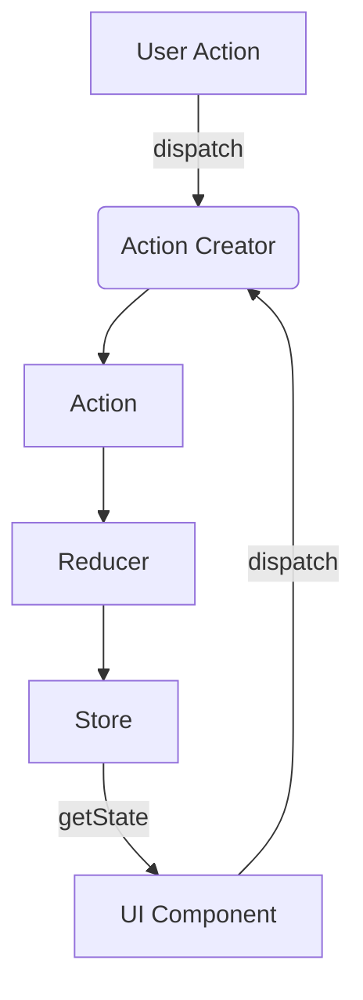

## 7.3.2 Implementation in JavaScript

State management is a crucial aspect of modern web development, especially in complex applications where multiple components need to share and update data consistently. In this section, we will delve into the implementation of Flux and Redux patterns in JavaScript, focusing on how they help manage state effectively.

### Understanding Flux and Redux

Before we dive into the implementation details, let's briefly understand what Flux and Redux are.

- **Flux** is an architectural pattern introduced by Facebook for building client-side web applications. It emphasizes a unidirectional data flow, making it easier to reason about an application's state changes.

- **Redux** is a predictable state container for JavaScript applications, inspired by Flux. It provides a centralized store for all application state, making state management more predictable and easier to debug.

### Setting Up Redux in a JavaScript Project

To start using Redux in a JavaScript project, you need to install the Redux library. If you're using a package manager like npm, you can install Redux with the following command:

```bash
npm install redux
```

Additionally, if you're working with React, you might want to install `react-redux`, which provides bindings to use Redux with React:

```bash
npm install react-redux
```

### Defining Actions, Reducers, and the Store

In Redux, the core concepts revolve around **actions**, **reducers**, and the **store**. Let's explore each of these components.

#### Actions

Actions are payloads of information that send data from your application to your Redux store. They are the only source of information for the store. You send them to the store using `store.dispatch()`.

An action is a plain JavaScript object with a `type` property. Here's an example of a simple action:

```javascript
// actions.js
export const INCREMENT = 'INCREMENT';
export const DECREMENT = 'DECREMENT';

export const increment = () => ({
  type: INCREMENT,
});

export const decrement = () => ({
  type: DECREMENT,
});
```

#### Reducers

Reducers specify how the application's state changes in response to actions sent to the store. Remember that actions only describe what happened, but don't describe how the application's state changes.

A reducer is a pure function that takes the previous state and an action, and returns the next state. Here's an example of a simple reducer:

```javascript
// reducer.js
import { INCREMENT, DECREMENT } from './actions';

const initialState = {
  count: 0,
};

const counterReducer = (state = initialState, action) => {
  switch (action.type) {
    case INCREMENT:
      return { count: state.count + 1 };
    case DECREMENT:
      return { count: state.count - 1 };
    default:
      return state;
  }
};

export default counterReducer;
```

#### The Store

The store is the object that brings actions and reducers together. The store has the following responsibilities:

- Holds application state.
- Allows access to state via `getState()`.
- Allows state to be updated via `dispatch(action)`.
- Registers listeners via `subscribe(listener)`.
- Handles unregistering of listeners via the function returned by `subscribe(listener)`.

To create a store, you need to import the `createStore` function from Redux and pass your reducer to it:

```javascript
// store.js
import { createStore } from 'redux';
import counterReducer from './reducer';

const store = createStore(counterReducer);

export default store;
```

### Connecting Redux to a UI

Now that we have our actions, reducer, and store set up, let's see how we can connect Redux to a UI. We'll use React for this example, but Redux can be used with any UI library.

First, wrap your application in a `Provider` component, which makes the Redux store available to any nested components that need to access the Redux store.

```javascript
// index.js
import React from 'react';
import ReactDOM from 'react-dom';
import { Provider } from 'react-redux';
import App from './App';
import store from './store';

ReactDOM.render(
  <Provider store={store}>
    <App />
  </Provider>,
  document.getElementById('root')
);
```

Next, use the `connect` function from `react-redux` to connect your components to the Redux store.

```javascript
// Counter.js
import React from 'react';
import { connect } from 'react-redux';
import { increment, decrement } from './actions';

const Counter = ({ count, increment, decrement }) => (
  <div>
    <h1>{count}</h1>
    <button onClick={increment}>Increment</button>
    <button onClick={decrement}>Decrement</button>
  </div>
);

const mapStateToProps = (state) => ({
  count: state.count,
});

const mapDispatchToProps = {
  increment,
  decrement,
};

export default connect(mapStateToProps, mapDispatchToProps)(Counter);
```

### Middleware in Redux

Middleware provides a way to extend Redux with custom functionality. It is often used for logging, crash reporting, talking to an asynchronous API, routing, and more.

#### Redux Thunk

Redux Thunk is a middleware that allows you to write action creators that return a function instead of an action. This can be used to delay the dispatch of an action, or to dispatch only if a certain condition is met.

To use Redux Thunk, install it via npm:

```bash
npm install redux-thunk
```

Then, apply it as middleware when creating the store:

```javascript
// store.js
import { createStore, applyMiddleware } from 'redux';
import thunk from 'redux-thunk';
import counterReducer from './reducer';

const store = createStore(counterReducer, applyMiddleware(thunk));

export default store;
```

Here's an example of an asynchronous action creator using Redux Thunk:

```javascript
// actions.js
export const fetchUserData = () => {
  return (dispatch) => {
    dispatch({ type: 'FETCH_USER_REQUEST' });
    fetch('/api/user')
      .then(response => response.json())
      .then(data => dispatch({ type: 'FETCH_USER_SUCCESS', payload: data }))
      .catch(error => dispatch({ type: 'FETCH_USER_FAILURE', error }));
  };
};
```

#### Redux Saga

Redux Saga is another middleware that aims to make application side effects (e.g., asynchronous actions) easier to manage, more efficient to execute, and better at handling failures.

To use Redux Saga, install it via npm:

```bash
npm install redux-saga
```

Then, create a saga and run it with the middleware:

```javascript
// sagas.js
import { call, put, takeEvery } from 'redux-saga/effects';

function* fetchUser() {
  try {
    const user = yield call(fetch, '/api/user');
    const data = yield user.json();
    yield put({ type: 'FETCH_USER_SUCCESS', payload: data });
  } catch (e) {
    yield put({ type: 'FETCH_USER_FAILURE', error: e.message });
  }
}

function* mySaga() {
  yield takeEvery('FETCH_USER_REQUEST', fetchUser);
}

export default mySaga;
```

```javascript
// store.js
import { createStore, applyMiddleware } from 'redux';
import createSagaMiddleware from 'redux-saga';
import counterReducer from './reducer';
import mySaga from './sagas';

const sagaMiddleware = createSagaMiddleware();
const store = createStore(counterReducer, applyMiddleware(sagaMiddleware));

sagaMiddleware.run(mySaga);

export default store;
```

### Best Practices for Organizing Redux Code

To maintain a clean and scalable codebase, consider the following best practices when organizing your Redux code:

- **Folder Structure**: Organize files by feature or domain, rather than by type. This makes it easier to locate related files and understand the structure of your application.

  ```
  src/
    actions/
      counterActions.js
    reducers/
      counterReducer.js
    components/
      Counter.js
    store/
      index.js
    sagas/
      index.js
  ```

- **Separation of Concerns**: Keep your action creators, reducers, and components separate. This separation makes it easier to test and maintain each part of your application.

- **Use Constants for Action Types**: Define action types as constants to avoid typos and make it easier to manage actions.

- **Leverage Middleware**: Use middleware like Redux Thunk or Redux Saga to handle asynchronous actions and side effects.

- **Keep Reducers Pure**: Ensure that reducers are pure functions that do not have side effects. They should only calculate the next state based on the previous state and the action.

### Visualizing Redux Flow

To better understand how Redux works, let's visualize the flow of data in a Redux application.



**Figure 1**: This diagram illustrates the unidirectional data flow in a Redux application. User actions trigger action creators, which dispatch actions to reducers. Reducers update the store, and the UI components read from the store to update the view.

### Try It Yourself

To solidify your understanding of Redux, try modifying the code examples provided:

- Add a new action and reducer to handle resetting the counter to zero.
- Implement a new asynchronous action using Redux Thunk to fetch data from an API.
- Experiment with Redux Saga by creating a saga that logs every dispatched action to the console.

### References and Links

For further reading and deeper dives into Redux and its ecosystem, consider the following resources:

- [Redux Official Documentation](https://redux.js.org/)
- [React Redux Documentation](https://react-redux.js.org/)
- [Redux Thunk GitHub Repository](https://github.com/reduxjs/redux-thunk)
- [Redux Saga GitHub Repository](https://github.com/redux-saga/redux-saga)

### Knowledge Check

Before moving on, let's review some key concepts:

- What are the core components of Redux?
- How does middleware enhance Redux functionality?
- What are the benefits of using Redux in a JavaScript application?

### Embrace the Journey

Remember, mastering Redux takes practice and patience. As you continue to build more complex applications, you'll find Redux to be an invaluable tool for managing state predictably and efficiently. Keep experimenting, stay curious, and enjoy the journey!

## Quiz Time!



### What is the primary purpose of Redux in a JavaScript application?

- [x] To manage the state of the application in a predictable way
- [ ] To handle UI rendering
- [ ] To manage server-side operations
- [ ] To replace the need for a database

> **Explanation:** Redux is primarily used to manage the state of a JavaScript application in a predictable and centralized manner.

### Which function is used to create a Redux store?

- [x] createStore
- [ ] createReducer
- [ ] createAction
- [ ] createMiddleware

> **Explanation:** The `createStore` function from Redux is used to create a store that holds the application's state.

### What is a reducer in Redux?

- [x] A pure function that returns the next state based on the previous state and an action
- [ ] A function that modifies the UI
- [ ] A component that handles user input
- [ ] A middleware function for handling asynchronous actions

> **Explanation:** A reducer is a pure function in Redux that calculates the next state based on the previous state and the dispatched action.

### How do you connect a React component to the Redux store?

- [x] Using the `connect` function from `react-redux`
- [ ] By directly accessing the store
- [ ] By using a middleware
- [ ] By defining a reducer

> **Explanation:** The `connect` function from `react-redux` is used to connect a React component to the Redux store, allowing it to access state and dispatch actions.

### What is the role of middleware in Redux?

- [x] To extend Redux with custom functionality, such as handling asynchronous actions
- [ ] To define the initial state of the application
- [ ] To render the UI components
- [ ] To create actions

> **Explanation:** Middleware in Redux is used to extend its functionality, often for handling asynchronous actions or side effects.

### Which middleware allows you to write action creators that return a function instead of an action?

- [x] Redux Thunk
- [ ] Redux Saga
- [ ] Redux Logger
- [ ] Redux DevTools

> **Explanation:** Redux Thunk allows you to write action creators that return a function instead of an action, enabling delayed dispatch or conditional dispatch.

### What is the purpose of the `Provider` component in a React-Redux application?

- [x] To make the Redux store available to any nested components
- [ ] To define the initial state of the store
- [ ] To handle UI rendering
- [ ] To manage server-side operations

> **Explanation:** The `Provider` component from `react-redux` makes the Redux store available to any nested components that need to access it.

### What is a common practice for organizing Redux code?

- [x] Organizing files by feature or domain
- [ ] Organizing files by type
- [ ] Keeping all code in a single file
- [ ] Using global variables for state

> **Explanation:** A common practice for organizing Redux code is to organize files by feature or domain, which makes it easier to locate related files and understand the application's structure.

### What is a key benefit of using Redux Saga over Redux Thunk?

- [x] Better management of complex asynchronous workflows
- [ ] Simpler syntax for action creators
- [ ] Direct manipulation of the DOM
- [ ] Automatic state updates

> **Explanation:** Redux Saga provides better management of complex asynchronous workflows compared to Redux Thunk, making it more suitable for handling complex side effects.

### True or False: Redux can be used with any UI library, not just React.

- [x] True
- [ ] False

> **Explanation:** True. Redux is a standalone library that can be used with any UI library, not just React, to manage application state.


