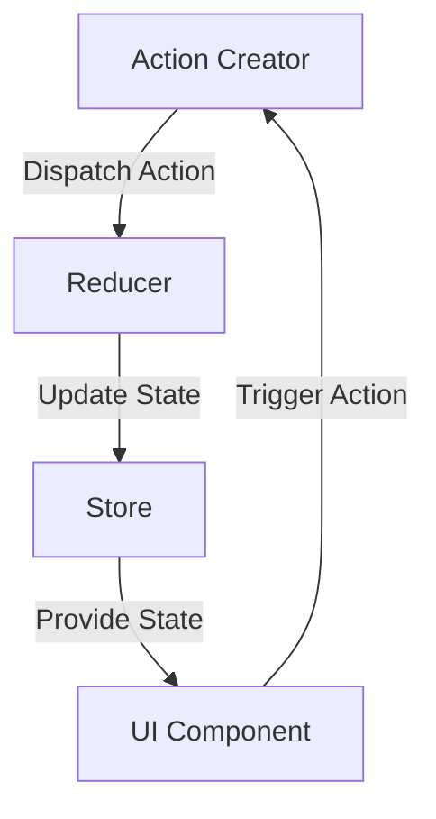

## 7.3.3 Implementation in TypeScript

In this section, we will delve into implementing Redux using TypeScript. By leveraging TypeScript's powerful type system, we can enhance the robustness of our Redux applications, catching errors at compile-time and enjoying improved IDE support. We'll explore how to define actions, action creators, reducers, and the store with TypeScript annotations, and discuss the benefits of using TypeScript with Redux.

### Introduction to Redux and TypeScript

Redux is a predictable state container for JavaScript applications, often used with React. It helps manage the state of an application in a single, centralized store, making state management more predictable and easier to debug. TypeScript, on the other hand, is a superset of JavaScript that adds static typing to the language. By combining Redux with TypeScript, we can ensure that our state management logic is type-safe, reducing runtime errors and improving the developer experience.

### Defining Action Types and State Shape

The first step in implementing Redux with TypeScript is to define the shape of our state and the types of actions that can be dispatched. TypeScript's interfaces and enums are perfect for this task.

#### Defining the State Shape

Let's start by defining the shape of our state using an interface. Suppose we are building a simple counter application:

```typescript
// Define the shape of the state
interface CounterState {
  count: number;
}

// Initial state
const initialState: CounterState = {
  count: 0,
};
```

Here, we define a `CounterState` interface with a single property `count`. This interface ensures that our state object always has the correct shape.

#### Defining Action Types

Next, we define the types of actions that can be dispatched. We'll use an enum to represent the different action types:

```typescript
// Define action types
enum CounterActionTypes {
  INCREMENT = 'INCREMENT',
  DECREMENT = 'DECREMENT',
}
```

Using an enum for action types helps prevent typos and makes it easier to manage action types as the application grows.

### Creating Actions and Action Creators

Actions are plain objects that describe what happened in the application. Action creators are functions that return these action objects.

#### Defining Actions with TypeScript

We can define our actions using TypeScript interfaces:

```typescript
// Define action interfaces
interface IncrementAction {
  type: CounterActionTypes.INCREMENT;
}

interface DecrementAction {
  type: CounterActionTypes.DECREMENT;
}

// Union type for all actions
type CounterActions = IncrementAction | DecrementAction;
```

By defining actions as interfaces, we can ensure that each action object has the correct structure.

#### Creating Action Creators

Action creators are functions that return action objects. Here's how we can define them in TypeScript:

```typescript
// Action creators
const increment = (): IncrementAction => ({
  type: CounterActionTypes.INCREMENT,
});

const decrement = (): DecrementAction => ({
  type: CounterActionTypes.DECREMENT,
});
```

These functions return action objects with the correct type, ensuring type safety.

### Implementing Reducers

Reducers are pure functions that take the current state and an action, and return a new state. Let's implement a reducer for our counter application:

```typescript
// Reducer function
const counterReducer = (
  state: CounterState = initialState,
  action: CounterActions
): CounterState => {
  switch (action.type) {
    case CounterActionTypes.INCREMENT:
      return { count: state.count + 1 };
    case CounterActionTypes.DECREMENT:
      return { count: state.count - 1 };
    default:
      return state;
  }
};
```

The reducer function uses a switch statement to handle different action types. TypeScript ensures that the action parameter is one of the defined `CounterActions`, providing compile-time safety.

### Creating the Redux Store

The Redux store holds the application state and provides methods to dispatch actions and subscribe to state changes. Let's create a store for our counter application:

```typescript
import { createStore } from 'redux';

// Create the Redux store
const store = createStore(counterReducer);

// Log the initial state
console.log(store.getState());

// Dispatch some actions
store.dispatch(increment());
store.dispatch(decrement());

// Log the updated state
console.log(store.getState());
```

Here, we use the `createStore` function from Redux to create a store with our `counterReducer`. We can then dispatch actions and log the state to see the changes.

### Benefits of Using TypeScript with Redux

Using TypeScript with Redux offers several benefits:

1. **Type Safety**: TypeScript catches type errors at compile-time, reducing runtime errors and improving code reliability.

2. **Improved IDE Support**: TypeScript provides better autocompletion, refactoring, and navigation features in IDEs, enhancing the developer experience.

3. **Clearer Code**: TypeScript's type annotations make the code more readable and self-documenting, making it easier to understand and maintain.

### Using Utility Types and Libraries

TypeScript provides utility types that can simplify Redux code. Let's explore some of these utilities and libraries that facilitate TypeScript integration with Redux.

#### Using `ReturnType` Utility

The `ReturnType` utility type can be used to infer the return type of a function. This is useful for defining action types based on action creators:

```typescript
// Infer action types using ReturnType
type IncrementActionType = ReturnType<typeof increment>;
type DecrementActionType = ReturnType<typeof decrement>;
```

By using `ReturnType`, we can ensure that our action types are always in sync with the action creators.

#### Using Redux Toolkit

The Redux Toolkit is a set of tools that simplifies Redux development. It includes utilities like `createSlice` and `createAsyncThunk` that work seamlessly with TypeScript.

##### Creating a Slice with Redux Toolkit

The `createSlice` function simplifies the process of creating reducers and action creators:

```typescript
import { createSlice, PayloadAction } from '@reduxjs/toolkit';

// Create a slice
const counterSlice = createSlice({
  name: 'counter',
  initialState,
  reducers: {
    increment(state) {
      state.count += 1;
    },
    decrement(state) {
      state.count -= 1;
    },
    incrementByAmount(state, action: PayloadAction<number>) {
      state.count += action.payload;
    },
  },
});

// Export actions and reducer
export const { increment, decrement, incrementByAmount } = counterSlice.actions;
export default counterSlice.reducer;
```

The `createSlice` function automatically generates action creators and action types, reducing boilerplate code.

### Integrating Middleware and Async Actions

Redux middleware allows us to extend Redux with custom functionality. One common use case is handling asynchronous actions with middleware like `redux-thunk`.

#### Using `redux-thunk` with TypeScript

`redux-thunk` is a middleware that allows us to write action creators that return a function instead of an action. Let's see how to use it with TypeScript:

```typescript
import { ThunkAction } from 'redux-thunk';
import { RootState } from './store';

// Define a thunk action
export const fetchCount = (): ThunkAction<void, RootState, unknown, CounterActions> => async dispatch => {
  const response = await fetch('/api/count');
  const data = await response.json();
  dispatch(incrementByAmount(data.count));
};
```

In this example, we define a thunk action `fetchCount` that fetches data from an API and dispatches an action with the result. TypeScript ensures that the thunk action has the correct type signature.

### Tools and Libraries for TypeScript Integration

Several tools and libraries facilitate TypeScript integration with Redux:

- **@types/redux**: Type definitions for Redux, providing type safety for Redux functions and objects.
- **redux-thunk**: Middleware for handling asynchronous actions, with TypeScript support.
- **Redux Toolkit**: A set of tools that simplifies Redux development, with built-in TypeScript support.

### Try It Yourself

Now that we've covered the basics of implementing Redux with TypeScript, it's time to try it yourself. Here are some suggestions for experimentation:

1. **Add New Actions**: Extend the counter application by adding new actions, such as resetting the count or setting it to a specific value.

2. **Use Async Actions**: Implement an async action that fetches data from an API and updates the state.

3. **Refactor with Redux Toolkit**: Refactor the application to use Redux Toolkit's `createSlice` and `createAsyncThunk` functions.

4. **Explore Middleware**: Experiment with different middleware, such as logging or error handling middleware.

### Visualizing Redux with TypeScript

To better understand how Redux works with TypeScript, let's visualize the flow of data in a Redux application:



**Diagram Description**: This diagram illustrates the flow of data in a Redux application. Action creators dispatch actions to reducers, which update the state in the store. The UI component receives the updated state and can trigger new actions.

### Knowledge Check

Before we wrap up, let's reinforce what we've learned with a few questions:

- What are the benefits of using TypeScript with Redux?
- How can we define action types and state shape in TypeScript?
- What is the purpose of action creators in Redux?
- How does the `createSlice` function from Redux Toolkit simplify Redux development?

### Conclusion

Implementing Redux with TypeScript enhances the robustness and maintainability of your applications. By leveraging TypeScript's type system, you can catch errors at compile-time, enjoy improved IDE support, and write clearer, more self-documenting code. As you continue to explore Redux and TypeScript, remember to experiment with different patterns and tools to find the best approach for your projects.

## Quiz Time!



### What is the primary benefit of using TypeScript with Redux?

- [x] Type safety and compile-time error checking
- [ ] Faster runtime performance
- [ ] Smaller bundle size
- [ ] Easier integration with CSS

> **Explanation:** TypeScript provides type safety and compile-time error checking, which helps catch errors early and improves code reliability.

### How do you define the shape of the state in TypeScript for a Redux application?

- [x] Using an interface
- [ ] Using a class
- [ ] Using a function
- [ ] Using a string

> **Explanation:** In TypeScript, we define the shape of the state using an interface to ensure that the state object has the correct structure.

### What TypeScript feature can be used to prevent typos in action types?

- [x] Enums
- [ ] Classes
- [ ] Functions
- [ ] Arrays

> **Explanation:** Enums in TypeScript are used to define a set of named constants, which helps prevent typos in action types.

### What is the purpose of action creators in Redux?

- [x] To return action objects
- [ ] To update the state directly
- [ ] To render UI components
- [ ] To manage middleware

> **Explanation:** Action creators are functions that return action objects, which are then dispatched to reducers to update the state.

### Which utility type can be used to infer the return type of a function in TypeScript?

- [x] ReturnType
- [ ] PayloadAction
- [ ] ThunkAction
- [ ] ActionType

> **Explanation:** The `ReturnType` utility type in TypeScript is used to infer the return type of a function.

### What is the role of a reducer in a Redux application?

- [x] To update the state based on an action
- [ ] To dispatch actions
- [ ] To render UI components
- [ ] To manage middleware

> **Explanation:** Reducers are pure functions that take the current state and an action, and return a new state.

### Which library provides a set of tools that simplify Redux development?

- [x] Redux Toolkit
- [ ] React Router
- [ ] Axios
- [ ] Lodash

> **Explanation:** Redux Toolkit is a library that provides tools to simplify Redux development, including utilities like `createSlice`.

### How can you handle asynchronous actions in Redux with TypeScript?

- [x] Using redux-thunk middleware
- [ ] Using synchronous action creators
- [ ] Using CSS-in-JS
- [ ] Using HTML templates

> **Explanation:** The `redux-thunk` middleware allows us to write action creators that return a function, enabling asynchronous actions in Redux.

### What is the benefit of using the `createSlice` function from Redux Toolkit?

- [x] It reduces boilerplate code
- [ ] It increases bundle size
- [ ] It decreases performance
- [ ] It complicates the codebase

> **Explanation:** The `createSlice` function from Redux Toolkit reduces boilerplate code by automatically generating action creators and action types.

### True or False: TypeScript can catch runtime errors in a Redux application.

- [ ] True
- [x] False

> **Explanation:** TypeScript catches errors at compile-time, not runtime. It ensures type safety and helps prevent errors before the code is executed.


