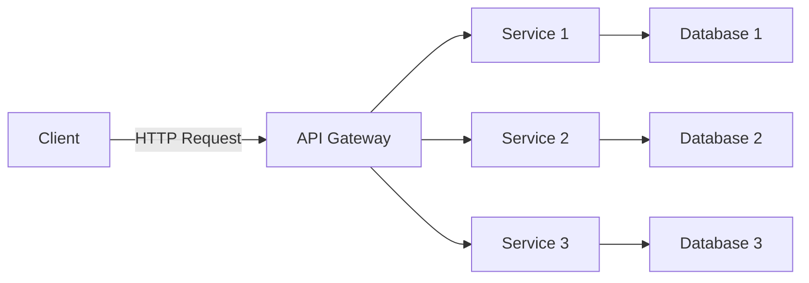

## 7.4.1 Intent and Motivation

In the ever-evolving landscape of software development, the architectural style known as microservices has emerged as a powerful approach to building scalable, maintainable, and flexible applications. This section delves into the intent and motivation behind adopting microservices architecture, contrasting it with the traditional monolithic architecture, and exploring its core principles, benefits, and inherent challenges.

### Understanding Microservices Architecture

Microservices architecture is an architectural style that structures an application as a collection of loosely coupled services. Each service is designed to implement a specific business capability, and these services communicate with each other over a network, typically using HTTP or messaging protocols. This approach stands in stark contrast to the monolithic architecture, where an application is built as a single, unified unit.

#### Monolithic vs. Microservices Architecture

**Monolithic Architecture**: In a monolithic architecture, all components of an application are tightly integrated into a single codebase. This design can be advantageous for small applications due to its simplicity and ease of deployment. However, as the application grows, monolithic architectures can become unwieldy, leading to challenges in scaling, maintaining, and deploying the application.

**Microservices Architecture**: Microservices, on the other hand, break down an application into smaller, independent services. Each service is responsible for a specific function and can be developed, deployed, and scaled independently. This separation allows for greater flexibility and adaptability, especially in large and complex applications.

### Principles of Microservices

Microservices architecture is guided by several key principles that differentiate it from traditional architectural styles:

1. **Decentralized Governance**: Microservices promote decentralized governance, allowing teams to choose the best tools and technologies for their specific service. This autonomy fosters innovation and enables teams to respond quickly to changing business requirements.

2. **Scalability**: One of the primary motivations for adopting microservices is scalability. By breaking down an application into smaller services, each service can be scaled independently based on its specific needs. This approach ensures efficient resource utilization and can significantly improve application performance.

3. **Independent Deployment**: Microservices enable independent deployment, allowing teams to deploy updates to a service without affecting the entire application. This capability reduces downtime and accelerates the delivery of new features and bug fixes.

4. **Resilience and Fault Isolation**: Microservices architecture enhances resilience by isolating faults within individual services. If one service fails, it does not necessarily impact the entire application, allowing for graceful degradation and improved overall system reliability.

### Challenges of Scaling Monolithic Applications

Scaling monolithic applications can be a daunting task due to their tightly coupled nature. As the application grows, several challenges arise:

- **Complexity in Codebase**: A monolithic application often results in a large and complex codebase, making it difficult to understand, maintain, and modify. This complexity can slow down development and increase the risk of introducing bugs.

- **Limited Scalability**: Scaling a monolithic application typically involves replicating the entire application, which can be inefficient and costly. This approach does not allow for scaling individual components based on their specific needs.

- **Deployment Bottlenecks**: Deploying updates to a monolithic application can be cumbersome, as any change requires redeploying the entire application. This process can lead to longer deployment cycles and increased downtime.

### How Microservices Provide Solutions

Microservices architecture addresses the challenges of scaling monolithic applications by offering several key benefits:

1. **Enabling Independent Deployment**: With microservices, teams can deploy updates to individual services without affecting the rest of the application. This capability reduces deployment time and minimizes the risk of downtime.

2. **Facilitating Technology Diversity**: Microservices allow teams to use different technologies and programming languages for different services. This flexibility enables teams to choose the best tools for their specific needs, promoting innovation and efficiency.

3. **Enhancing Resilience**: By isolating services, microservices architecture enhances the resilience of an application. If one service fails, it does not necessarily impact other services, allowing the application to continue functioning.

4. **Improving Scalability**: Microservices enable fine-grained scalability, allowing teams to scale individual services based on their specific requirements. This approach ensures efficient resource utilization and can significantly improve application performance.

### Benefits of Microservices

The adoption of microservices architecture offers several compelling benefits:

- **Flexibility and Agility**: Microservices promote flexibility and agility by allowing teams to develop, deploy, and scale services independently. This capability enables organizations to respond quickly to changing business requirements and market conditions.

- **Improved Fault Tolerance**: By isolating services, microservices architecture enhances fault tolerance, allowing applications to continue functioning even if individual services fail.

- **Faster Time-to-Market**: Microservices enable faster time-to-market by allowing teams to deploy updates to individual services without affecting the entire application. This capability accelerates the delivery of new features and bug fixes.

- **Enhanced Collaboration**: Microservices promote enhanced collaboration by allowing teams to work on different services simultaneously. This approach fosters innovation and enables organizations to leverage the expertise of different teams.

### Challenges Associated with Microservices

While microservices architecture offers numerous benefits, it also introduces several challenges:

- **Increased Complexity in Communication**: Microservices architecture involves communication between multiple services, which can increase complexity. Ensuring reliable and efficient communication between services is crucial for the success of a microservices-based application.

- **Data Consistency**: Maintaining data consistency across multiple services can be challenging. Microservices often require distributed data management strategies to ensure data consistency and integrity.

- **Deployment and Monitoring**: Deploying and monitoring a microservices-based application can be complex due to the large number of services involved. Organizations need robust deployment and monitoring tools to manage microservices effectively.

- **Security Concerns**: Microservices architecture introduces additional security concerns, as each service may have its own vulnerabilities. Ensuring the security of a microservices-based application requires a comprehensive security strategy.

### Visualizing Microservices Architecture

To better understand the microservices architecture, let's visualize how services interact within this architecture:

**Diagram Description**: This diagram illustrates a typical microservices architecture, where a client interacts with an API gateway. The API gateway routes requests to individual services, each of which interacts with its own database. This separation allows for independent scaling and deployment of services.

### Try It Yourself

To gain hands-on experience with microservices, try implementing a simple microservices-based application using Node.js and Express. Start by creating a few independent services, each responsible for a specific function, and use an API gateway to route requests to these services. Experiment with deploying and scaling individual services to understand the benefits and challenges of microservices architecture.

### References and Links

- [Microservices on AWS](https://aws.amazon.com/microservices/)
- [Martin Fowler's Microservices Resource Guide](https://martinfowler.com/microservices/)
- [Microservices Architecture on Azure](https://docs.microsoft.com/en-us/azure/architecture/guide/design-principles/microservices)

### Knowledge Check

As we wrap up this section, let's reinforce our understanding of microservices architecture with a few key takeaways:

- Microservices architecture structures an application as a collection of loosely coupled services, each responsible for a specific business capability.
- The principles of microservices include decentralized governance, scalability, independent deployment, and resilience.
- Microservices address the challenges of scaling monolithic applications by enabling independent deployment, facilitating technology diversity, enhancing resilience, and improving scalability.
- While microservices offer numerous benefits, they also introduce challenges such as increased complexity in communication, data consistency, deployment, and security.

### Embrace the Journey

Remember, adopting microservices architecture is a journey that requires careful planning and consideration. As you explore this architectural style, keep experimenting, stay curious, and enjoy the journey of building scalable, maintainable, and flexible applications.

## Quiz Time!



### What is a key difference between monolithic and microservices architecture?

- [x] Microservices architecture structures applications as a collection of loosely coupled services.
- [ ] Monolithic architecture allows for independent deployment of services.
- [ ] Microservices architecture is easier to scale than monolithic architecture.
- [ ] Monolithic architecture is more flexible than microservices architecture.

> **Explanation:** Microservices architecture structures applications as a collection of loosely coupled services, allowing for greater flexibility and scalability compared to monolithic architecture.

### Which principle of microservices allows teams to choose the best tools for their specific service?

- [x] Decentralized Governance
- [ ] Scalability
- [ ] Independent Deployment
- [ ] Resilience

> **Explanation:** Decentralized governance allows teams to choose the best tools and technologies for their specific service, promoting innovation and efficiency.

### What is a benefit of microservices architecture in terms of deployment?

- [x] Independent deployment of services
- [ ] Easier deployment of the entire application
- [ ] Faster deployment cycles for monolithic applications
- [ ] Reduced need for deployment tools

> **Explanation:** Microservices architecture allows for the independent deployment of services, reducing deployment time and minimizing the risk of downtime.

### How does microservices architecture enhance resilience?

- [x] By isolating faults within individual services
- [ ] By replicating the entire application
- [ ] By using a single codebase for all services
- [ ] By reducing the number of services

> **Explanation:** Microservices architecture enhances resilience by isolating faults within individual services, allowing the application to continue functioning even if one service fails.

### What is a challenge associated with microservices architecture?

- [x] Increased complexity in communication
- [ ] Easier data consistency
- [ ] Simplified deployment
- [ ] Reduced security concerns

> **Explanation:** Microservices architecture involves communication between multiple services, which can increase complexity and requires careful management to ensure reliability and efficiency.

### What is a benefit of microservices in terms of technology diversity?

- [x] Teams can use different technologies for different services.
- [ ] All services must use the same technology stack.
- [ ] Technology diversity is not supported in microservices.
- [ ] Microservices limit the choice of technologies.

> **Explanation:** Microservices allow teams to use different technologies and programming languages for different services, promoting innovation and efficiency.

### How does microservices architecture improve scalability?

- [x] By allowing fine-grained scalability of individual services
- [ ] By replicating the entire application
- [ ] By using a single codebase for all services
- [ ] By reducing the number of services

> **Explanation:** Microservices architecture allows for fine-grained scalability, enabling teams to scale individual services based on their specific requirements.

### What is a challenge of maintaining data consistency in microservices?

- [x] Distributed data management strategies are required.
- [ ] Data consistency is automatically ensured.
- [ ] All services share a single database.
- [ ] Data consistency is not a concern in microservices.

> **Explanation:** Maintaining data consistency across multiple services can be challenging, requiring distributed data management strategies to ensure data consistency and integrity.

### What is a common security concern in microservices architecture?

- [x] Each service may have its own vulnerabilities.
- [ ] Security is automatically ensured in microservices.
- [ ] All services share a single security protocol.
- [ ] Security concerns are reduced in microservices.

> **Explanation:** Microservices architecture introduces additional security concerns, as each service may have its own vulnerabilities, requiring a comprehensive security strategy.

### True or False: Microservices architecture allows for faster time-to-market by enabling independent deployment of services.

- [x] True
- [ ] False

> **Explanation:** Microservices architecture allows for faster time-to-market by enabling independent deployment of services, which accelerates the delivery of new features and bug fixes.


