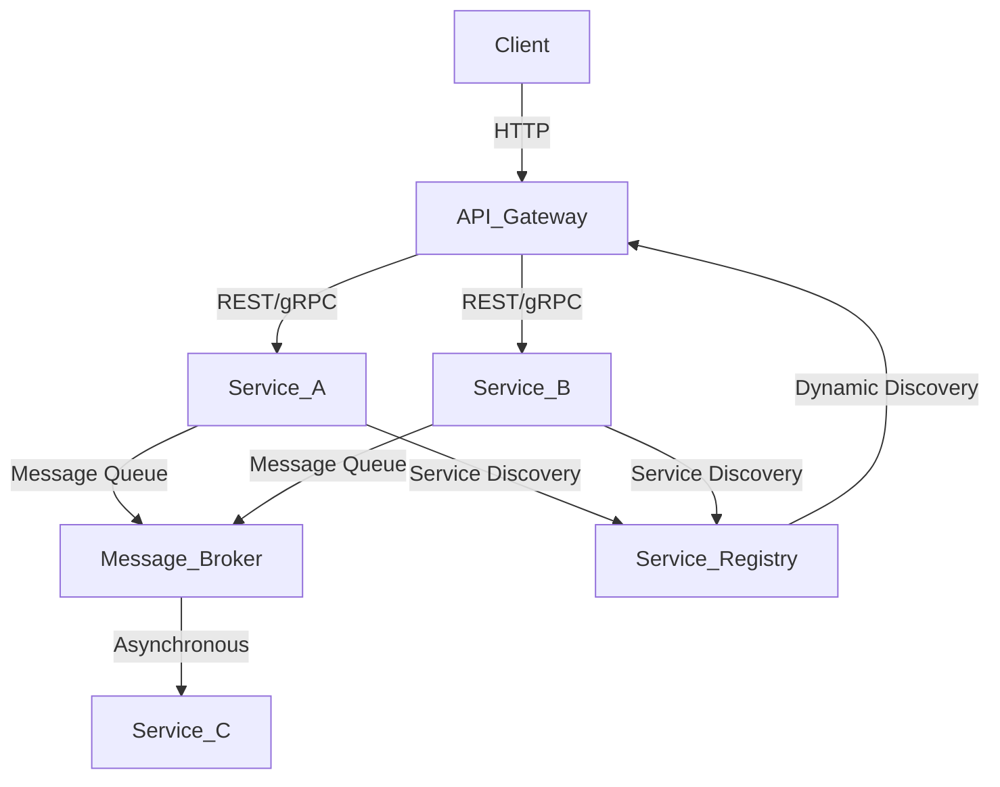

## 7.4.2 Implementation Strategies

In today's rapidly evolving software landscape, microservices architecture has emerged as a powerful paradigm for building scalable and maintainable applications. This section delves into the strategies and best practices for implementing microservices architecture using JavaScript, particularly Node.js, and TypeScript. We'll explore how to structure services using popular frameworks, establish communication between services, and deploy them effectively.

### Building Microservices with Node.js

Node.js is a popular choice for building microservices due to its non-blocking I/O model, which is well-suited for handling numerous simultaneous connections. Its lightweight nature and extensive package ecosystem make it an ideal candidate for microservices architecture.

#### Structuring Services with Frameworks

When building microservices, choosing the right framework can significantly impact the development process. Let's explore some popular frameworks for Node.js:

1. **Express.js**: A minimal and flexible Node.js web application framework that provides a robust set of features for web and mobile applications. It's widely used for creating RESTful APIs.

   ```javascript
   // Example of a simple Express.js microservice
   const express = require('express');
   const app = express();

   app.get('/api/data', (req, res) => {
     res.json({ message: 'Hello from Express microservice!' });
   });

   app.listen(3000, () => {
     console.log('Microservice running on port 3000');
   });
   ```

2. **Koa**: Developed by the team behind Express, Koa aims to be a smaller, more expressive, and robust foundation for web applications and APIs. It leverages async functions to eliminate callback hell and improve error handling.

   ```javascript
   // Example of a simple Koa microservice
   const Koa = require('koa');
   const app = new Koa();

   app.use(async ctx => {
     ctx.body = { message: 'Hello from Koa microservice!' };
   });

   app.listen(3000, () => {
     console.log('Microservice running on port 3000');
   });
   ```

3. **NestJS**: A progressive Node.js framework for building efficient, reliable, and scalable server-side applications. It uses TypeScript by default and incorporates concepts from Angular, making it a great choice for developers familiar with Angular.

   ```typescript
   // Example of a simple NestJS microservice
   import { Controller, Get } from '@nestjs/common';
   import { NestFactory } from '@nestjs/core';
   import { Module } from '@nestjs/common';

   @Controller('api')
   class AppController {
     @Get('data')
     getData() {
       return { message: 'Hello from NestJS microservice!' };
     }
   }

   @Module({
     controllers: [AppController],
   })
   class AppModule {}

   async function bootstrap() {
     const app = await NestFactory.create(AppModule);
     await app.listen(3000);
     console.log('Microservice running on port 3000');
   }

   bootstrap();
   ```

### Communication Between Services

In a microservices architecture, services need to communicate with each other. There are several methods to achieve this:

#### RESTful APIs

REST (Representational State Transfer) is a widely used architectural style for designing networked applications. It relies on stateless communication and standard HTTP methods.

- **Pros**: Simplicity, statelessness, and wide adoption.
- **Cons**: Overhead of HTTP and potential performance issues with large payloads.

#### GraphQL

GraphQL is a query language for APIs that allows clients to request exactly the data they need, making it more efficient than REST in some scenarios.

- **Pros**: Flexibility in data retrieval, reduced over-fetching.
- **Cons**: Complexity in setup and potential performance bottlenecks if not managed properly.

#### gRPC

gRPC is a high-performance, open-source universal RPC framework that uses HTTP/2 for transport and Protocol Buffers as the interface description language.

- **Pros**: High efficiency, support for multiple languages, built-in code generation.
- **Cons**: Steeper learning curve and more complex setup compared to REST.

#### Message Brokers

Message brokers like RabbitMQ or Apache Kafka enable asynchronous communication between services, which can improve resilience and decouple services.

- **Pros**: Asynchronous communication, decoupling, and scalability.
- **Cons**: Increased complexity in managing message queues and potential latency.

### Service Discovery and API Gateways

In a microservices architecture, services may be dynamically added or removed. Service discovery mechanisms help manage this dynamic environment.

- **Service Discovery**: Tools like Consul, etcd, or Eureka can be used to register and discover services dynamically.
- **API Gateways**: API gateways like Kong or AWS API Gateway act as a single entry point for clients, routing requests to the appropriate microservices.

### Fault Tolerance Mechanisms

Fault tolerance is crucial in microservices to ensure that the failure of one service does not bring down the entire system. Strategies include:

- **Circuit Breakers**: Tools like Hystrix can prevent cascading failures by monitoring service calls and opening a circuit if failures exceed a threshold.
- **Retries and Timeouts**: Implementing retries with exponential backoff and setting timeouts can help handle transient failures.

### Deployment Strategies

Deploying microservices requires careful planning to ensure scalability and resilience. Here are some popular deployment strategies:

#### Containerization with Docker

Docker allows you to package applications and their dependencies into containers, which can run consistently across different environments.

- **Benefits**: Consistency, isolation, and ease of scaling.
- **Example**: Define a Dockerfile for each microservice and use Docker Compose to manage multi-container applications.

   ```dockerfile
   # Example Dockerfile for a Node.js microservice
   FROM node:14
   WORKDIR /app
   COPY package*.json ./
   RUN npm install
   COPY . .
   EXPOSE 3000
   CMD ["node", "index.js"]
   ```

#### Orchestration with Kubernetes

Kubernetes is an open-source platform for automating the deployment, scaling, and management of containerized applications.

- **Benefits**: Automated scaling, self-healing, and rolling updates.
- **Example**: Use Kubernetes YAML files to define deployments, services, and ingress controllers.

   ```yaml
   # Example Kubernetes deployment for a Node.js microservice
   apiVersion: apps/v1
   kind: Deployment
   metadata:
     name: node-microservice
   spec:
     replicas: 3
     selector:
       matchLabels:
         app: node-microservice
     template:
       metadata:
         labels:
           app: node-microservice
       spec:
         containers:
         - name: node-microservice
           image: node-microservice:latest
           ports:
           - containerPort: 3000
   ```

#### Serverless Architectures

Serverless computing allows you to build and run applications without managing infrastructure. AWS Lambda, Azure Functions, and Google Cloud Functions are popular serverless platforms.

- **Benefits**: Cost efficiency, automatic scaling, and reduced operational overhead.
- **Example**: Deploy a function to AWS Lambda that triggers on HTTP requests.

   ```javascript
   // Example AWS Lambda function
   exports.handler = async (event) => {
     return {
       statusCode: 200,
       body: JSON.stringify({ message: 'Hello from AWS Lambda!' }),
     };
   };
   ```

### Visualizing Microservices Architecture

To better understand the interaction between components in a microservices architecture, let's visualize a typical setup using a diagram.



**Diagram Description**: This diagram illustrates a microservices architecture where clients interact with an API Gateway, which routes requests to various services (Service A and Service B). Services communicate asynchronously through a message broker and register themselves with a service registry for dynamic discovery.

### Try It Yourself

Now that we've explored various strategies for implementing microservices, try modifying the code examples to suit your needs. For instance, experiment with different frameworks or communication methods. Deploy a simple microservice using Docker and Kubernetes, or explore serverless options with AWS Lambda.

### Knowledge Check

To reinforce your understanding, consider these questions:

- What are the advantages of using Node.js for microservices?
- How do RESTful APIs and GraphQL differ in terms of data retrieval?
- What role do message brokers play in a microservices architecture?
- How can Docker and Kubernetes be used together to deploy microservices?
- What are the benefits of serverless architectures?

### Embrace the Journey

Implementing microservices architecture can be challenging but rewarding. Remember, this is just the beginning. As you progress, you'll build more complex and resilient systems. Keep experimenting, stay curious, and enjoy the journey!

## Quiz Time!



### What is a key advantage of using Node.js for microservices?

- [x] Non-blocking I/O model
- [ ] Synchronous processing
- [ ] Lack of package ecosystem
- [ ] High memory usage

> **Explanation:** Node.js's non-blocking I/O model is well-suited for handling numerous simultaneous connections, making it ideal for microservices.

### Which framework is known for its use of async functions to improve error handling?

- [ ] Express.js
- [x] Koa
- [ ] NestJS
- [ ] Angular

> **Explanation:** Koa uses async functions to eliminate callback hell and improve error handling.

### What is a benefit of using GraphQL over RESTful APIs?

- [x] Flexibility in data retrieval
- [ ] Simplicity in setup
- [ ] Stateless communication
- [ ] Built-in code generation

> **Explanation:** GraphQL allows clients to request exactly the data they need, reducing over-fetching compared to REST.

### What is a disadvantage of using gRPC?

- [ ] High efficiency
- [ ] Support for multiple languages
- [x] Steeper learning curve
- [ ] Built-in code generation

> **Explanation:** gRPC has a steeper learning curve and more complex setup compared to REST.

### What tool can be used for service discovery in a microservices architecture?

- [x] Consul
- [ ] RabbitMQ
- [ ] Docker
- [ ] AWS Lambda

> **Explanation:** Consul is a tool that can be used for service discovery, allowing services to register and discover each other dynamically.

### What is a benefit of using Docker for microservices deployment?

- [x] Consistency across environments
- [ ] Increased memory usage
- [ ] Lack of isolation
- [ ] Manual scaling

> **Explanation:** Docker allows you to package applications and their dependencies into containers, ensuring consistency across different environments.

### How does Kubernetes enhance microservices deployment?

- [x] Automated scaling and self-healing
- [ ] Manual updates
- [ ] Lack of orchestration
- [ ] Increased operational overhead

> **Explanation:** Kubernetes automates scaling, self-healing, and management of containerized applications.

### What is a characteristic of serverless architectures?

- [x] Cost efficiency
- [ ] Manual scaling
- [ ] High operational overhead
- [ ] Lack of automatic scaling

> **Explanation:** Serverless architectures are cost-efficient, automatically scale, and reduce operational overhead.

### Which communication method is asynchronous and decouples services?

- [ ] RESTful APIs
- [ ] GraphQL
- [ ] gRPC
- [x] Message brokers

> **Explanation:** Message brokers enable asynchronous communication and decouple services, improving resilience and scalability.

### True or False: API gateways act as a single entry point for clients, routing requests to the appropriate microservices.

- [x] True
- [ ] False

> **Explanation:** API gateways act as a single entry point for clients, routing requests to the appropriate microservices.


