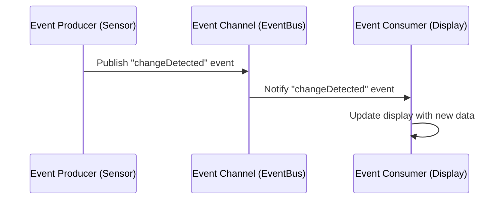

## 7.5.1 Intent and Motivation

In the ever-evolving landscape of software development, the need for systems that are both responsive and scalable has never been more critical. Event-Driven Architecture (EDA) emerges as a powerful paradigm to address these needs by promoting asynchronous communication and decoupling components. In this section, we will delve into the intent and motivation behind EDA, exploring its key components, advantages, challenges, and real-world analogies to provide a comprehensive understanding of this architectural style.

### Understanding Event-Driven Architecture

Event-Driven Architecture is a design paradigm where the flow of the program is determined by events. These events can be anything from user actions, sensor outputs, or messages from other programs. The architecture is built around the production, detection, and reaction to events, enabling systems to be more responsive and adaptable.

#### Key Components of EDA

EDA consists of three primary components:

1. **Event Producers**: These are the entities that generate events. In a software system, event producers can be user interfaces, sensors, or any component that detects a change in state or an action that needs to be communicated.

2. **Event Consumers**: These are the entities that listen for and react to events. They perform actions or trigger further processes based on the events they receive.

3. **Event Channels or Buses**: These serve as the medium through which events are transmitted from producers to consumers. They ensure that events are delivered to the appropriate consumers, often using a publish-subscribe (pub/sub) model.

### EDA vs. Traditional Request-Response Architectures

Traditional request-response architectures, such as RESTful services, operate synchronously. A client sends a request to a server and waits for a response. This model is straightforward but can become a bottleneck in systems requiring high scalability and responsiveness.

EDA, on the other hand, promotes asynchronous communication. Events are produced and consumed independently, allowing systems to handle high loads and complex interactions without being tied to a synchronous request-response cycle. This decoupling of components leads to more flexible and scalable systems.

### Advantages of Event-Driven Architecture

EDA offers several advantages that make it an attractive choice for modern software systems:

- **Improved Scalability**: By decoupling components, EDA allows systems to scale more effectively. Components can be scaled independently based on demand, ensuring efficient resource utilization.

- **Decoupling of Components**: EDA promotes loose coupling between components, making systems more modular and easier to maintain. Changes to one component do not necessarily impact others, facilitating easier updates and enhancements.

- **Real-Time Data Processing**: EDA is well-suited for applications requiring real-time data processing, such as financial trading platforms, IoT systems, and social media applications. Events can be processed as they occur, enabling timely responses to changes.

- **Enhanced Responsiveness**: By reacting to events as they occur, systems can provide more immediate feedback to users, improving the overall user experience.

### Challenges of Event-Driven Architecture

While EDA offers numerous benefits, it also presents several challenges that developers must address:

- **Ensuring Event Delivery**: Reliable event delivery is crucial in EDA. Developers must implement mechanisms to ensure that events are delivered accurately and in a timely manner, even in the face of network failures or system crashes.

- **Handling Event Ordering**: In some systems, the order in which events are processed is critical. Ensuring correct event ordering can be challenging, especially in distributed systems where events may be produced and consumed by multiple components simultaneously.

- **Managing Eventual Consistency**: EDA often leads to eventual consistency, where the system eventually reaches a consistent state after processing all events. Developers must design systems to handle temporary inconsistencies and ensure that eventual consistency is achieved.

### Analogies and Real-World Examples

To better understand EDA, let's consider a real-world analogy: a newspaper subscription service.

In this analogy, the newspaper publisher acts as the event producer, generating newspapers (events) regularly. Subscribers (event consumers) receive these newspapers through a delivery service (event channel or bus). Subscribers can choose which newspapers they want to receive, similar to how event consumers subscribe to specific events in a pub/sub model.

This analogy highlights the decoupling and asynchronous nature of EDA. The publisher and subscribers operate independently, and the delivery service ensures that newspapers are delivered to the right subscribers.

### Code Example: Implementing EDA in JavaScript

Let's explore a simple implementation of EDA in JavaScript using the pub/sub model:

```javascript
// Event Bus
class EventBus {
  constructor() {
    this.listeners = {};
  }

  subscribe(eventType, listener) {
    if (!this.listeners[eventType]) {
      this.listeners[eventType] = [];
    }
    this.listeners[eventType].push(listener);
  }

  unsubscribe(eventType, listener) {
    if (!this.listeners[eventType]) return;
    this.listeners[eventType] = this.listeners[eventType].filter(l => l !== listener);
  }

  publish(eventType, data) {
    if (!this.listeners[eventType]) return;
    this.listeners[eventType].forEach(listener => listener(data));
  }
}

// Event Producer
class Sensor {
  constructor(eventBus) {
    this.eventBus = eventBus;
  }

  detectChange(data) {
    console.log('Sensor detected change:', data);
    this.eventBus.publish('changeDetected', data);
  }
}

// Event Consumer
class Display {
  constructor(eventBus) {
    eventBus.subscribe('changeDetected', this.updateDisplay.bind(this));
  }

  updateDisplay(data) {
    console.log('Display updated with data:', data);
  }
}

// Usage
const eventBus = new EventBus();
const sensor = new Sensor(eventBus);
const display = new Display(eventBus);

sensor.detectChange({ temperature: 22 });
```

In this example, the `EventBus` class acts as the event channel, managing subscriptions and publishing events. The `Sensor` class is an event producer, generating events when it detects changes. The `Display` class is an event consumer, updating its display when it receives events.

### Try It Yourself

Experiment with the code example by adding additional event producers and consumers. Consider implementing a logging service that logs all events or a notification service that sends alerts based on specific event data.

### Visualizing Event-Driven Architecture

To further illustrate EDA, let's visualize the interaction between components using a Mermaid.js diagram:



This diagram shows the flow of events from the sensor (event producer) to the display (event consumer) via the event bus (event channel).

### References and Further Reading

For more information on Event-Driven Architecture, consider exploring the following resources:

- [Event-Driven Architecture on Wikipedia](https://en.wikipedia.org/wiki/Event-driven_architecture)
- [Pub/Sub Messaging on Google Cloud](https://cloud.google.com/pubsub/docs/overview)
- [Asynchronous Programming in JavaScript](https://developer.mozilla.org/en-US/docs/Learn/JavaScript/Asynchronous)

### Knowledge Check

- What are the key components of Event-Driven Architecture?
- How does EDA differ from traditional request-response architectures?
- What are some advantages of using EDA in modern software systems?
- What challenges might developers face when implementing EDA?
- How can the pub/sub model be used to implement EDA in JavaScript?

### Embrace the Journey

Remember, mastering Event-Driven Architecture is a journey. As you explore and experiment with EDA, you'll discover new ways to build responsive and scalable systems. Keep learning, stay curious, and enjoy the process!

## Quiz Time!



### What is a key component of Event-Driven Architecture?

- [x] Event Producers
- [ ] Request Handlers
- [ ] Data Models
- [ ] User Interfaces

> **Explanation:** Event Producers are entities that generate events in an Event-Driven Architecture.

### How does EDA differ from traditional request-response architectures?

- [x] It promotes asynchronous communication.
- [ ] It requires synchronous communication.
- [ ] It eliminates the need for event consumers.
- [ ] It relies solely on RESTful services.

> **Explanation:** EDA promotes asynchronous communication, allowing components to operate independently.

### What is an advantage of using EDA?

- [x] Improved Scalability
- [ ] Increased Complexity
- [ ] Reduced Modularity
- [ ] Slower Response Times

> **Explanation:** EDA improves scalability by decoupling components, allowing them to scale independently.

### What challenge is associated with EDA?

- [x] Ensuring Event Delivery
- [ ] Simplifying Code
- [ ] Reducing Event Production
- [ ] Increasing Synchronous Requests

> **Explanation:** Ensuring reliable event delivery is a challenge in EDA, especially in distributed systems.

### What analogy can be used to explain the pub/sub model?

- [x] Newspaper Subscription Service
- [ ] Online Shopping Cart
- [ ] Banking Transaction
- [ ] File Upload Process

> **Explanation:** A newspaper subscription service illustrates the pub/sub model, where publishers and subscribers operate independently.

### What role does the EventBus play in the JavaScript example?

- [x] It acts as the event channel.
- [ ] It generates events.
- [ ] It consumes events.
- [ ] It processes data.

> **Explanation:** The EventBus acts as the event channel, managing subscriptions and publishing events.

### What is a benefit of decoupling components in EDA?

- [x] Easier Maintenance
- [ ] Increased Dependency
- [ ] Reduced Flexibility
- [ ] Slower Development

> **Explanation:** Decoupling components makes systems more modular and easier to maintain.

### What is a common use case for EDA?

- [x] Real-Time Data Processing
- [ ] Static Web Pages
- [ ] Batch Processing
- [ ] Offline Applications

> **Explanation:** EDA is well-suited for real-time data processing, enabling timely responses to changes.

### What is eventual consistency in EDA?

- [x] The system eventually reaches a consistent state after processing events.
- [ ] The system is always consistent.
- [ ] The system never reaches consistency.
- [ ] The system is consistent only during initialization.

> **Explanation:** Eventual consistency means the system eventually reaches a consistent state after processing all events.

### True or False: EDA eliminates the need for event consumers.

- [ ] True
- [x] False

> **Explanation:** Event consumers are essential in EDA as they react to events and perform actions based on them.


