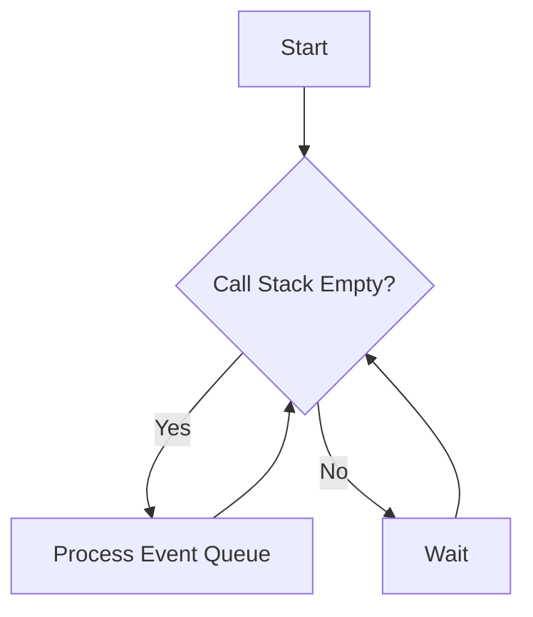
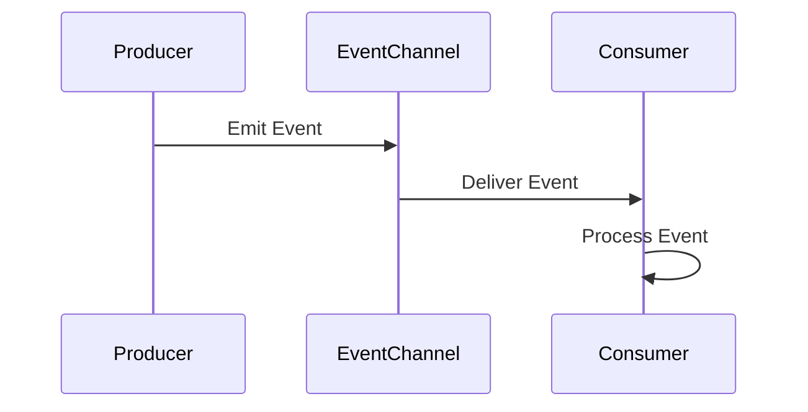

## 7.5.2 Implementation in JavaScript

Event-driven architecture (EDA) is a powerful paradigm that allows applications to respond to events or changes in state. In JavaScript, particularly with Node.js, EDA is a natural fit due to its non-blocking I/O and event loop model. In this section, we'll explore how to implement event-driven architecture in JavaScript, focusing on Node.js's `EventEmitter`, setting up event producers and consumers, and utilizing message brokers for inter-process communication.

### Understanding Event-Driven Architecture

In an event-driven architecture, components of a system communicate by emitting and responding to events. This decouples the components, allowing them to operate independently and asynchronously. The core components of EDA include:

- **Event Producers**: Components that generate events.
- **Event Consumers**: Components that listen for and respond to events.
- **Event Channels**: Pathways through which events are transmitted.

### Node.js and Event-Driven Architecture

Node.js is inherently event-driven, making it an excellent choice for implementing EDA. The `EventEmitter` class in Node.js provides a simple way to create and manage events.

#### EventEmitter Basics

The `EventEmitter` class is part of the `events` module in Node.js. It allows you to create an object that can emit named events and register listeners for those events.

```javascript
const EventEmitter = require('events');

// Create an instance of EventEmitter
const myEmitter = new EventEmitter();

// Register an event listener
myEmitter.on('event', () => {
  console.log('An event occurred!');
});

// Emit the event
myEmitter.emit('event');
```

In this example, we create an instance of `EventEmitter`, register a listener for the `event` event, and then emit the event. When the event is emitted, the listener is invoked, and "An event occurred!" is logged to the console.

#### Setting Up Event Producers and Consumers

In a real-world application, event producers and consumers can be different parts of the system. Let's consider a simple example where a file processing system emits events when files are added, processed, or deleted.

```javascript
const EventEmitter = require('events');

class FileProcessor extends EventEmitter {
  addFile(fileName) {
    console.log(`Adding file: ${fileName}`);
    this.emit('fileAdded', fileName);
  }

  processFile(fileName) {
    console.log(`Processing file: ${fileName}`);
    this.emit('fileProcessed', fileName);
  }

  deleteFile(fileName) {
    console.log(`Deleting file: ${fileName}`);
    this.emit('fileDeleted', fileName);
  }
}

const fileProcessor = new FileProcessor();

// Register event listeners
fileProcessor.on('fileAdded', (fileName) => {
  console.log(`File added: ${fileName}`);
});

fileProcessor.on('fileProcessed', (fileName) => {
  console.log(`File processed: ${fileName}`);
});

fileProcessor.on('fileDeleted', (fileName) => {
  console.log(`File deleted: ${fileName}`);
});

// Simulate file operations
fileProcessor.addFile('example.txt');
fileProcessor.processFile('example.txt');
fileProcessor.deleteFile('example.txt');
```

In this example, `FileProcessor` is an event producer that emits events when files are added, processed, or deleted. The main script registers listeners for these events, acting as event consumers.

#### Asynchronous Operations and Event-Driven Patterns

Node.js's non-blocking I/O model is ideal for handling asynchronous operations in an event-driven manner. Events can trigger asynchronous operations, such as reading a file or making an HTTP request.

```javascript
const fs = require('fs');
const EventEmitter = require('events');

class FileReader extends EventEmitter {
  readFile(filePath) {
    fs.readFile(filePath, 'utf8', (err, data) => {
      if (err) {
        this.emit('error', err);
      } else {
        this.emit('data', data);
      }
    });
  }
}

const fileReader = new FileReader();

// Register event listeners
fileReader.on('data', (data) => {
  console.log(`File data: ${data}`);
});

fileReader.on('error', (err) => {
  console.error(`Error reading file: ${err.message}`);
});

// Read a file
fileReader.readFile('example.txt');
```

Here, the `FileReader` class reads a file asynchronously. It emits a `data` event when the file is successfully read and an `error` event if an error occurs.

### Using Message Brokers for Inter-Process Communication

In distributed systems, components may run in separate processes or even on different machines. Message brokers facilitate communication between these components by routing messages (events) between them.

#### Redis Pub/Sub

Redis is a popular in-memory data structure store that supports a publish/subscribe (Pub/Sub) messaging pattern. Here's how you can use Redis Pub/Sub in a Node.js application:

```javascript
const redis = require('redis');

// Create Redis clients
const publisher = redis.createClient();
const subscriber = redis.createClient();

// Subscribe to a channel
subscriber.subscribe('notifications');

// Listen for messages
subscriber.on('message', (channel, message) => {
  console.log(`Received message from ${channel}: ${message}`);
});

// Publish a message
publisher.publish('notifications', 'Hello, Redis!');
```

In this example, we create a publisher and a subscriber using Redis clients. The subscriber listens for messages on the `notifications` channel, and the publisher sends a message to this channel.

#### Apache Kafka

Apache Kafka is a distributed event streaming platform capable of handling trillions of events a day. It is designed to provide high-throughput, low-latency, and fault-tolerant messaging.

To use Kafka in a Node.js application, you can use the `kafka-node` library:

```javascript
const kafka = require('kafka-node');
const Producer = kafka.Producer;
const Consumer = kafka.Consumer;
const client = new kafka.KafkaClient({ kafkaHost: 'localhost:9092' });

// Create a producer
const producer = new Producer(client);
producer.on('ready', () => {
  producer.send([{ topic: 'test', messages: 'Hello, Kafka!' }], (err, data) => {
    if (err) console.error(err);
    else console.log('Message sent:', data);
  });
});

// Create a consumer
const consumer = new Consumer(client, [{ topic: 'test', partition: 0 }], { autoCommit: true });
consumer.on('message', (message) => {
  console.log('Received message:', message);
});
```

In this example, we create a Kafka producer and consumer. The producer sends a message to the `test` topic, and the consumer listens for messages on this topic.

#### MQTT

MQTT is a lightweight messaging protocol designed for small sensors and mobile devices. It is ideal for IoT applications.

To use MQTT in a Node.js application, you can use the `mqtt` library:

```javascript
const mqtt = require('mqtt');

// Connect to an MQTT broker
const client = mqtt.connect('mqtt://broker.hivemq.com');

// Subscribe to a topic
client.on('connect', () => {
  client.subscribe('test/topic', (err) => {
    if (!err) {
      client.publish('test/topic', 'Hello, MQTT!');
    }
  });
});

// Listen for messages
client.on('message', (topic, message) => {
  console.log(`Received message from ${topic}: ${message.toString()}`);
});
```

In this example, we connect to an MQTT broker, subscribe to a topic, and publish a message to that topic. The client listens for messages on the subscribed topic.

### The Role of Event Loops and Non-Blocking I/O

The event loop is a fundamental part of Node.js's architecture. It allows Node.js to perform non-blocking I/O operations, making it highly efficient for handling multiple concurrent operations.

#### Understanding the Event Loop

The event loop continuously checks the call stack and the event queue. If the call stack is empty, it processes events from the event queue. This allows Node.js to handle asynchronous operations without blocking the main thread.



In this diagram, the event loop checks if the call stack is empty. If it is, it processes events from the event queue.

#### Non-Blocking I/O

Non-blocking I/O allows Node.js to perform I/O operations without waiting for them to complete. Instead, a callback function is invoked when the operation is finished.

```javascript
const fs = require('fs');

// Non-blocking file read
fs.readFile('example.txt', 'utf8', (err, data) => {
  if (err) {
    console.error(`Error reading file: ${err.message}`);
  } else {
    console.log(`File data: ${data}`);
  }
});

console.log('Reading file...');
```

In this example, `fs.readFile` is a non-blocking operation. The callback function is invoked when the file read operation is complete, allowing the program to continue executing other code in the meantime.

### Error Handling in Event-Driven Contexts

Error handling is crucial in event-driven systems to ensure that errors do not go unnoticed and the system remains robust.

#### Handling Errors with EventEmitters

You can handle errors in `EventEmitter` by emitting an `error` event and registering an error listener.

```javascript
const EventEmitter = require('events');

class ErrorProneEmitter extends EventEmitter {
  doSomething() {
    // Simulate an error
    const error = new Error('Something went wrong');
    this.emit('error', error);
  }
}

const emitter = new ErrorProneEmitter();

// Register an error listener
emitter.on('error', (err) => {
  console.error(`Error occurred: ${err.message}`);
});

// Trigger an error
emitter.doSomething();
```

In this example, the `ErrorProneEmitter` class emits an `error` event when an error occurs. The error listener logs the error message to the console.

### Try It Yourself

To deepen your understanding of event-driven architecture in JavaScript, try modifying the examples above:

1. **Extend the FileProcessor**: Add more events, such as `fileRenamed`, and implement corresponding methods and listeners.
2. **Experiment with Redis Pub/Sub**: Create multiple subscribers listening to different channels and observe how messages are routed.
3. **Explore Kafka**: Implement a Kafka producer that sends messages based on user input and a consumer that processes these messages.
4. **Play with MQTT**: Set up an MQTT broker and create multiple clients that communicate over various topics.

### Visualizing Event Flow

To better understand the flow of events in an event-driven system, consider the following sequence diagram, which illustrates the interaction between event producers and consumers:



In this diagram, the producer emits an event to the event channel, which then delivers the event to the consumer. The consumer processes the event upon receipt.

### References and Further Reading

- [Node.js EventEmitter](https://nodejs.org/api/events.html)
- [Redis Pub/Sub](https://redis.io/docs/manual/pubsub/)
- [Apache Kafka](https://kafka.apache.org/)
- [MQTT Protocol](https://mqtt.org/)
- [MDN Web Docs: Asynchronous JavaScript](https://developer.mozilla.org/en-US/docs/Learn/JavaScript/Asynchronous)

### Knowledge Check

Before we conclude, let's review some key concepts:

- **What is the role of the event loop in Node.js?**
- **How can you handle errors in an event-driven system?**
- **What are the benefits of using message brokers in distributed systems?**

### Embrace the Journey

Implementing event-driven architecture in JavaScript can significantly enhance the scalability and responsiveness of your applications. Remember, this is just the beginning. As you continue to explore and experiment, you'll discover new ways to leverage events to build robust and efficient systems. Keep learning, stay curious, and enjoy the journey!

## Quiz Time!



### What is the primary role of the EventEmitter in Node.js?

- [x] To create and manage events
- [ ] To handle HTTP requests
- [ ] To manage file operations
- [ ] To perform database queries

> **Explanation:** The EventEmitter class in Node.js is used to create and manage events, allowing different parts of an application to communicate asynchronously.

### How can you handle errors in an event-driven system using EventEmitter?

- [x] By emitting an 'error' event and registering an error listener
- [ ] By using try-catch blocks
- [ ] By logging errors to a file
- [ ] By ignoring errors

> **Explanation:** In an event-driven system using EventEmitter, errors can be handled by emitting an 'error' event and registering an error listener to handle these events.

### Which of the following is a message broker that supports the Pub/Sub pattern?

- [x] Redis
- [ ] MySQL
- [ ] MongoDB
- [ ] Express.js

> **Explanation:** Redis is a message broker that supports the Pub/Sub pattern, allowing different components of a system to communicate by publishing and subscribing to messages.

### What is the purpose of the event loop in Node.js?

- [x] To handle asynchronous operations without blocking the main thread
- [ ] To compile JavaScript code
- [ ] To manage user sessions
- [ ] To perform synchronous I/O operations

> **Explanation:** The event loop in Node.js handles asynchronous operations without blocking the main thread, allowing Node.js to efficiently manage multiple concurrent operations.

### Which library can be used to implement Kafka in a Node.js application?

- [x] kafka-node
- [ ] express
- [ ] mongoose
- [ ] socket.io

> **Explanation:** The kafka-node library can be used to implement Kafka in a Node.js application, providing tools for creating Kafka producers and consumers.

### What is the main advantage of using non-blocking I/O in Node.js?

- [x] It allows multiple operations to be handled concurrently
- [ ] It simplifies code syntax
- [ ] It increases memory usage
- [ ] It improves code readability

> **Explanation:** Non-blocking I/O allows multiple operations to be handled concurrently in Node.js, making it highly efficient for I/O-bound tasks.

### In the context of MQTT, what is a 'topic'?

- [x] A channel for message communication
- [ ] A type of database
- [ ] A JavaScript function
- [ ] A CSS class

> **Explanation:** In MQTT, a 'topic' is a channel for message communication, where clients can publish messages to and subscribe to receive messages from.

### What is the role of a consumer in an event-driven architecture?

- [x] To listen for and respond to events
- [ ] To generate events
- [ ] To manage database connections
- [ ] To handle user authentication

> **Explanation:** In an event-driven architecture, a consumer listens for and responds to events, processing them as they occur.

### Which of the following is a lightweight messaging protocol suitable for IoT applications?

- [x] MQTT
- [ ] HTTP
- [ ] FTP
- [ ] SMTP

> **Explanation:** MQTT is a lightweight messaging protocol designed for small sensors and mobile devices, making it suitable for IoT applications.

### True or False: The event loop in Node.js processes events from the event queue only when the call stack is empty.

- [x] True
- [ ] False

> **Explanation:** True. The event loop in Node.js processes events from the event queue only when the call stack is empty, ensuring that the main thread is not blocked.


