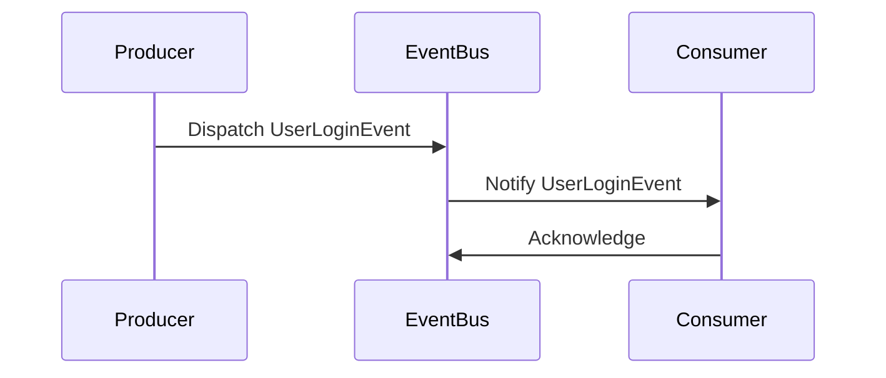

## 7.5.3 Implementation in TypeScript

In this section, we'll delve into implementing event-driven architecture using TypeScript. We'll explore how TypeScript's type system enhances the robustness and maintainability of event-driven systems. We'll also look at how libraries like RxJS can be leveraged for managing event streams, and how TypeScript's type annotations and interfaces can define clear contracts between event producers and consumers.

### Introduction to Event-Driven Architecture

Event-driven architecture (EDA) is a design paradigm where the flow of the program is determined by events. These events can be anything from user actions, sensor outputs, or messages from other programs. EDA is particularly useful in systems that require high scalability and loose coupling between components.

In TypeScript, implementing EDA involves defining event types, creating interfaces for event handlers, and using libraries to manage event streams. Let's explore each of these components in detail.

### Defining Event Types and Interfaces

TypeScript's type system allows us to define precise types for events, ensuring that event producers and consumers adhere to a contract. This reduces the risk of runtime errors and makes the codebase easier to maintain.

#### Defining Event Types

Start by defining the types of events your application will handle. This can be done using TypeScript's `type` or `interface` keywords.

```typescript
// Define a type for a user login event
interface UserLoginEvent {
  type: 'USER_LOGIN';
  payload: {
    userId: string;
    timestamp: Date;
  };
}

// Define a type for a user logout event
interface UserLogoutEvent {
  type: 'USER_LOGOUT';
  payload: {
    userId: string;
    timestamp: Date;
  };
}

// Union type for all possible events
type AppEvent = UserLoginEvent | UserLogoutEvent;
```

In this example, we've defined two event types: `UserLoginEvent` and `UserLogoutEvent`. Each event has a `type` property and a `payload` containing relevant data. The `AppEvent` type is a union of all possible events, allowing us to handle them in a type-safe manner.

#### Creating Event Handlers

Next, define interfaces for event handlers. These interfaces specify the contract that event handlers must adhere to.

```typescript
// Define an interface for event handlers
interface EventHandler<T> {
  (event: T): void;
}

// Example of a login event handler
const handleUserLogin: EventHandler<UserLoginEvent> = (event) => {
  console.log(`User logged in: ${event.payload.userId} at ${event.payload.timestamp}`);
};

// Example of a logout event handler
const handleUserLogout: EventHandler<UserLogoutEvent> = (event) => {
  console.log(`User logged out: ${event.payload.userId} at ${event.payload.timestamp}`);
};
```

Here, `EventHandler<T>` is a generic interface that takes an event type `T` and returns nothing (`void`). This pattern ensures that handlers are type-safe and can only process events of the specified type.

### Implementing an Event Bus

An event bus is a central component in an event-driven system that facilitates communication between event producers and consumers. Let's implement a simple, strongly-typed event bus in TypeScript.

```typescript
// EventBus class to manage event subscriptions and dispatching
class EventBus {
  private handlers: { [key: string]: Array<EventHandler<any>> } = {};

  // Subscribe to an event
  subscribe<T extends AppEvent>(eventType: T['type'], handler: EventHandler<T>): void {
    if (!this.handlers[eventType]) {
      this.handlers[eventType] = [];
    }
    this.handlers[eventType].push(handler);
  }

  // Dispatch an event
  dispatch<T extends AppEvent>(event: T): void {
    const handlers = this.handlers[event.type];
    if (handlers) {
      handlers.forEach(handler => handler(event));
    }
  }
}

// Usage example
const eventBus = new EventBus();

// Subscribe handlers to events
eventBus.subscribe('USER_LOGIN', handleUserLogin);
eventBus.subscribe('USER_LOGOUT', handleUserLogout);

// Dispatch events
eventBus.dispatch({ type: 'USER_LOGIN', payload: { userId: '123', timestamp: new Date() } });
eventBus.dispatch({ type: 'USER_LOGOUT', payload: { userId: '123', timestamp: new Date() } });
```

In this implementation, the `EventBus` class maintains a registry of event handlers. The `subscribe` method allows handlers to register for specific event types, while the `dispatch` method triggers all handlers associated with an event type.

### Leveraging RxJS for Reactive Programming

RxJS is a powerful library for reactive programming in JavaScript and TypeScript. It provides tools for working with asynchronous data streams, making it ideal for event-driven systems.

#### Setting Up RxJS with TypeScript

To use RxJS in a TypeScript project, first install the library:

```bash
npm install rxjs
```

Then, import the necessary operators and types:

```typescript
import { Subject } from 'rxjs';
import { filter } from 'rxjs/operators';
```

#### Creating and Managing Event Streams

Use RxJS's `Subject` to create an event stream. A `Subject` is both an observable and an observer, allowing it to emit and listen for events.

```typescript
// Create a subject for app events
const eventStream = new Subject<AppEvent>();

// Subscribe to specific events using RxJS operators
eventStream.pipe(
  filter((event): event is UserLoginEvent => event.type === 'USER_LOGIN')
).subscribe(handleUserLogin);

eventStream.pipe(
  filter((event): event is UserLogoutEvent => event.type === 'USER_LOGOUT')
).subscribe(handleUserLogout);

// Emit events
eventStream.next({ type: 'USER_LOGIN', payload: { userId: '123', timestamp: new Date() } });
eventStream.next({ type: 'USER_LOGOUT', payload: { userId: '123', timestamp: new Date() } });
```

In this example, we use the `filter` operator to listen for specific event types. The `filter` function narrows the event type using a type guard, ensuring type safety.

### TypeScript's Role in Preventing Runtime Errors

TypeScript's static type checking is invaluable in preventing runtime errors. By defining event types and interfaces, TypeScript catches mismatches in event data structures at compile time, reducing bugs and improving code reliability.

#### Example of Type Safety in Action

Consider the following scenario where a developer mistakenly dispatches an event with incorrect data:

```typescript
// Incorrect event data
// eventStream.next({ type: 'USER_LOGIN', payload: { user: '123', time: new Date() } }); // Error: Type '{ user: string; time: Date; }' is not assignable to type '{ userId: string; timestamp: Date; }'.
```

TypeScript immediately flags this error, preventing the code from compiling. This early feedback loop is crucial for maintaining a robust codebase.

### Implementing Custom Event Emitters

While libraries like RxJS are powerful, there are cases where a custom event emitter might be more appropriate. Let's implement a simple, strongly-typed event emitter in TypeScript.

```typescript
// Custom event emitter class
class EventEmitter<T extends AppEvent> {
  private listeners: { [key: string]: Array<EventHandler<any>> } = {};

  // Add an event listener
  on(eventType: T['type'], listener: EventHandler<T>): void {
    if (!this.listeners[eventType]) {
      this.listeners[eventType] = [];
    }
    this.listeners[eventType].push(listener);
  }

  // Emit an event
  emit(event: T): void {
    const listeners = this.listeners[event.type];
    if (listeners) {
      listeners.forEach(listener => listener(event));
    }
  }
}

// Usage example
const emitter = new EventEmitter<AppEvent>();

// Add listeners
emitter.on('USER_LOGIN', handleUserLogin);
emitter.on('USER_LOGOUT', handleUserLogout);

// Emit events
emitter.emit({ type: 'USER_LOGIN', payload: { userId: '123', timestamp: new Date() } });
emitter.emit({ type: 'USER_LOGOUT', payload: { userId: '123', timestamp: new Date() } });
```

This `EventEmitter` class is similar to the `EventBus` but focuses on a single event type. It provides `on` and `emit` methods for adding listeners and emitting events, respectively.

### Try It Yourself

To solidify your understanding, try modifying the code examples:

- Add a new event type, such as `UserProfileUpdateEvent`, and implement handlers for it.
- Experiment with RxJS operators like `map` or `debounceTime` to transform or throttle events.
- Implement error handling in the `EventBus` or `EventEmitter` to gracefully handle unexpected scenarios.

### Visualizing Event Flow

To better understand the flow of events in an event-driven system, let's use a Mermaid.js sequence diagram to visualize the process.



This diagram illustrates the interaction between an event producer, the event bus, and an event consumer. The producer dispatches an event, the event bus notifies the consumer, and the consumer acknowledges receipt.

### References and Links

For further reading on event-driven architecture and TypeScript, consider the following resources:

- [MDN Web Docs: Event-driven programming](https://developer.mozilla.org/en-US/docs/Learn/JavaScript/Asynchronous/Event_driven_programming)
- [TypeScript Handbook](https://www.typescriptlang.org/docs/handbook/intro.html)
- [RxJS Documentation](https://rxjs.dev/guide/overview)

### Knowledge Check

Before moving on, let's review some key concepts:

- **Type Safety**: How does TypeScript's type system enhance the reliability of event-driven systems?
- **Event Bus vs. Event Emitter**: What are the differences and when might you use one over the other?
- **RxJS Operators**: How can operators like `filter` and `map` be used to manage event streams?

### Embrace the Journey

Remember, mastering event-driven architecture is a journey. As you continue to experiment and build more complex systems, you'll gain deeper insights into how events can drive application behavior. Stay curious, keep learning, and enjoy the process!

## Quiz Time!



### What is the primary advantage of using TypeScript in event-driven architecture?

- [x] Type safety and early error detection
- [ ] Faster runtime performance
- [ ] Simplified syntax
- [ ] Automatic event handling

> **Explanation:** TypeScript provides type safety, which helps catch errors at compile time, reducing runtime bugs.

### Which TypeScript feature allows you to define precise types for events?

- [x] Interfaces
- [ ] Classes
- [ ] Enums
- [ ] Modules

> **Explanation:** Interfaces in TypeScript allow you to define the structure of objects, making them ideal for defining event types.

### How does RxJS enhance event-driven architecture in TypeScript?

- [x] By providing tools for managing asynchronous data streams
- [ ] By simplifying synchronous programming
- [ ] By automatically generating event handlers
- [ ] By eliminating the need for type annotations

> **Explanation:** RxJS is designed for reactive programming, offering powerful tools for handling asynchronous events and data streams.

### What is the role of an event bus in an event-driven system?

- [x] To facilitate communication between event producers and consumers
- [ ] To store event data persistently
- [ ] To automatically generate events
- [ ] To replace event handlers

> **Explanation:** An event bus acts as a central hub that manages the flow of events between producers and consumers.

### Which RxJS operator can be used to listen for specific event types?

- [x] filter
- [ ] map
- [ ] reduce
- [ ] merge

> **Explanation:** The `filter` operator allows you to narrow down events based on specific criteria, such as event type.

### What is a key benefit of using custom event emitters in TypeScript?

- [x] They provide a lightweight alternative to libraries for simple use cases
- [ ] They automatically handle all event types
- [ ] They eliminate the need for event handlers
- [ ] They improve runtime performance

> **Explanation:** Custom event emitters are useful for lightweight, specific use cases where a full library might be overkill.

### How can TypeScript prevent runtime errors in event-driven systems?

- [x] By catching type mismatches at compile time
- [ ] By optimizing event dispatching
- [ ] By automatically generating event handlers
- [ ] By simplifying event syntax

> **Explanation:** TypeScript's type checking ensures that data structures match expected types, preventing runtime errors.

### What is the purpose of using a union type for events in TypeScript?

- [x] To handle multiple event types in a type-safe manner
- [ ] To simplify event dispatching
- [ ] To automatically generate event handlers
- [ ] To improve runtime performance

> **Explanation:** Union types allow you to define a variable that can hold multiple types, making it ideal for handling different event types.

### Which TypeScript feature is used to define contracts between event producers and consumers?

- [x] Interfaces
- [ ] Classes
- [ ] Enums
- [ ] Modules

> **Explanation:** Interfaces define the structure and expected behavior of objects, serving as contracts between different parts of the system.

### True or False: TypeScript can automatically handle all runtime errors in event-driven systems.

- [ ] True
- [x] False

> **Explanation:** While TypeScript helps catch many errors at compile time, it cannot handle all runtime errors, especially those unrelated to type mismatches.


