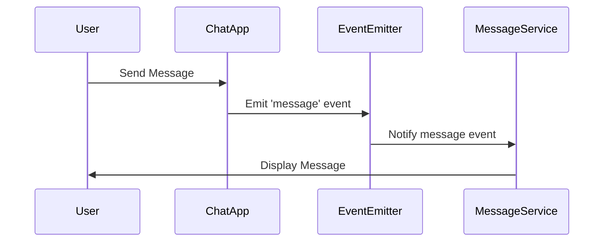

## 7.5.4 Use Cases and Examples

Event-Driven Architecture (EDA) is a powerful paradigm that allows systems to react to events asynchronously, making it ideal for applications that require real-time processing, scalability, and flexibility. In this section, we'll delve into practical use cases of EDA, exploring its implementation in JavaScript and TypeScript. We'll also discuss how EDA supports scalability, event sourcing, and best practices for reliability and auditing.

### Real-World Applications of Event-Driven Architecture

EDA is widely used across various domains due to its ability to handle dynamic workloads and provide real-time responses. Let's explore some common applications:

#### Real-Time Applications

Real-time applications, such as chat apps and live dashboards, benefit significantly from EDA. These applications require immediate updates and responses to user actions or external events.

**Example: Chat Application**

In a chat application, messages sent by users are events that need to be processed and delivered to other users in real-time. Here's a basic implementation using JavaScript:

```javascript
// EventEmitter class to handle events
class EventEmitter {
  constructor() {
    this.events = {};
  }

  // Subscribe to an event
  on(event, listener) {
    if (!this.events[event]) {
      this.events[event] = [];
    }
    this.events[event].push(listener);
  }

  // Emit an event
  emit(event, data) {
    if (this.events[event]) {
      this.events[event].forEach(listener => listener(data));
    }
  }
}

// Chat application logic
const chatApp = new EventEmitter();

// User joins the chat
chatApp.on('userJoined', (user) => {
  console.log(`${user} has joined the chat.`);
});

// New message received
chatApp.on('message', (message) => {
  console.log(`New message: ${message}`);
});

// Simulate user joining and sending a message
chatApp.emit('userJoined', 'Alice');
chatApp.emit('message', 'Hello, everyone!');
```

In this example, the `EventEmitter` class manages events, allowing users to join the chat and send messages. This pattern ensures that the application can handle multiple users and messages efficiently.

#### Microservices Communication

Microservices architecture often relies on EDA for communication between services. Each service can emit events and listen for events from other services, enabling loose coupling and scalability.

**Example: Order Processing System**

Consider an order processing system where different microservices handle order creation, payment, and shipping. Events facilitate communication between these services.

```typescript
// Order service emits an event when a new order is created
class OrderService {
  private eventEmitter: EventEmitter;

  constructor(eventEmitter: EventEmitter) {
    this.eventEmitter = eventEmitter;
  }

  createOrder(orderDetails: any) {
    console.log('Order created:', orderDetails);
    this.eventEmitter.emit('orderCreated', orderDetails);
  }
}

// Payment service listens for order creation events
class PaymentService {
  constructor(eventEmitter: EventEmitter) {
    eventEmitter.on('orderCreated', (orderDetails) => {
      console.log('Processing payment for order:', orderDetails);
      // Process payment logic here
    });
  }
}

// EventEmitter instance
const eventEmitter = new EventEmitter();

// Instantiate services
const orderService = new OrderService(eventEmitter);
const paymentService = new PaymentService(eventEmitter);

// Create a new order
orderService.createOrder({ id: 1, item: 'Laptop', price: 1000 });
```

In this TypeScript example, the `OrderService` emits an `orderCreated` event, which the `PaymentService` listens for to process payments. This decoupled approach allows each service to scale independently.

#### Internet of Things (IoT) Systems

IoT systems consist of numerous devices generating events that need to be processed in real-time. EDA is ideal for managing these events and triggering appropriate actions.

**Example: Smart Home System**

In a smart home system, devices like lights, thermostats, and security cameras generate events that need to be processed to automate actions.

```javascript
// EventEmitter for IoT devices
class IoTEventEmitter extends EventEmitter {
  constructor() {
    super();
  }

  // Simulate device event
  deviceEvent(device, event) {
    console.log(`Device ${device} triggered event: ${event}`);
    this.emit(event, { device });
  }
}

// Smart home system logic
const smartHome = new IoTEventEmitter();

// Listen for light on event
smartHome.on('lightOn', (data) => {
  console.log(`Turning on lights for device: ${data.device}`);
});

// Simulate light on event
smartHome.deviceEvent('Living Room Light', 'lightOn');
```

This example demonstrates how a smart home system can react to events from IoT devices, such as turning on lights when a motion sensor is triggered.

#### Stock Trading Platforms

Stock trading platforms require real-time processing of market data and user actions. EDA enables these platforms to handle high-frequency trading and provide instant feedback.

**Example: Stock Trading System**

In a stock trading system, events such as market data updates and trade executions need to be processed efficiently.

```typescript
// EventEmitter for stock trading
class StockEventEmitter extends EventEmitter {
  constructor() {
    super();
  }

  // Simulate market data update
  marketDataUpdate(stock, price) {
    console.log(`Market data update for ${stock}: $${price}`);
    this.emit('marketData', { stock, price });
  }

  // Simulate trade execution
  executeTrade(tradeDetails) {
    console.log('Executing trade:', tradeDetails);
    this.emit('tradeExecuted', tradeDetails);
  }
}

// Stock trading system logic
const stockTrading = new StockEventEmitter();

// Listen for market data updates
stockTrading.on('marketData', (data) => {
  console.log(`Received market data for ${data.stock}: $${data.price}`);
  // Trading logic based on market data
});

// Listen for trade execution
stockTrading.on('tradeExecuted', (trade) => {
  console.log(`Trade executed: ${trade}`);
  // Post-trade processing logic
});

// Simulate events
stockTrading.marketDataUpdate('AAPL', 150);
stockTrading.executeTrade({ stock: 'AAPL', quantity: 10, price: 150 });
```

In this TypeScript example, the `StockEventEmitter` handles market data updates and trade executions, allowing the system to react promptly to changes in the market.

### Scalability and Flexibility in Event-Driven Architecture

EDA supports scalability and flexibility by decoupling components and enabling asynchronous communication. This architecture can handle dynamic workloads and accommodate spikes in activity, making it suitable for applications with varying demands.

**Scalability**

- **Horizontal Scaling**: EDA allows services to scale horizontally by adding more instances to handle increased load. Each instance can process events independently, ensuring the system remains responsive.
- **Load Balancing**: Events can be distributed across multiple instances, balancing the load and preventing bottlenecks.

**Flexibility**

- **Loose Coupling**: Components in an event-driven system are loosely coupled, allowing them to evolve independently. This flexibility enables teams to update or replace components without affecting the entire system.
- **Dynamic Workflows**: EDA supports dynamic workflows where the sequence of actions can change based on events. This adaptability is crucial for systems that need to respond to changing conditions.

### Event Sourcing and CQRS Patterns

Event sourcing and CQRS (Command Query Responsibility Segregation) are patterns often used in conjunction with EDA to manage state and improve system architecture.

#### Event Sourcing

Event sourcing involves storing state changes as a sequence of events. Instead of persisting the current state, the system records each change, allowing it to reconstruct the state by replaying events.

**Benefits of Event Sourcing**

- **Auditability**: Every change is logged, providing a complete audit trail of the system's state.
- **Reproducibility**: The system can be reconstructed to any point in time by replaying events, aiding debugging and testing.
- **Scalability**: Events can be processed in parallel, improving performance and scalability.

**Example: Event Sourcing in a Banking System**

```typescript
// Event interface
interface Event {
  type: string;
  data: any;
  timestamp: Date;
}

// Bank account class with event sourcing
class BankAccount {
  private balance: number = 0;
  private events: Event[] = [];

  // Apply an event to the account
  private applyEvent(event: Event) {
    switch (event.type) {
      case 'deposit':
        this.balance += event.data.amount;
        break;
      case 'withdrawal':
        this.balance -= event.data.amount;
        break;
    }
  }

  // Deposit money
  deposit(amount: number) {
    const event: Event = { type: 'deposit', data: { amount }, timestamp: new Date() };
    this.events.push(event);
    this.applyEvent(event);
  }

  // Withdraw money
  withdraw(amount: number) {
    const event: Event = { type: 'withdrawal', data: { amount }, timestamp: new Date() };
    this.events.push(event);
    this.applyEvent(event);
  }

  // Get current balance
  getBalance() {
    return this.balance;
  }

  // Replay events to reconstruct state
  replayEvents(events: Event[]) {
    this.balance = 0; // Reset balance
    events.forEach(event => this.applyEvent(event));
  }
}

// Usage
const account = new BankAccount();
account.deposit(100);
account.withdraw(50);
console.log('Current balance:', account.getBalance());

// Replay events
account.replayEvents(account['events']);
console.log('Balance after replay:', account.getBalance());
```

In this example, the `BankAccount` class uses event sourcing to manage deposits and withdrawals. The account's state is reconstructed by replaying events, ensuring consistency and auditability.

#### CQRS (Command Query Responsibility Segregation)

CQRS separates the responsibilities of handling commands (write operations) and queries (read operations), optimizing the system for both.

**Benefits of CQRS**

- **Scalability**: Commands and queries can be scaled independently, improving performance.
- **Flexibility**: Different models can be used for reading and writing, allowing for more efficient data handling.

**Example: CQRS in an E-Commerce System**

```typescript
// Command interface
interface Command {
  execute(): void;
}

// Query interface
interface Query<T> {
  execute(): T;
}

// Add product command
class AddProductCommand implements Command {
  constructor(private productId: string, private quantity: number) {}

  execute() {
    console.log(`Adding product ${this.productId} with quantity ${this.quantity}`);
    // Logic to add product
  }
}

// Get product query
class GetProductQuery implements Query<any> {
  constructor(private productId: string) {}

  execute() {
    console.log(`Getting product details for ${this.productId}`);
    // Logic to get product details
    return { id: this.productId, name: 'Sample Product', price: 100 };
  }
}

// Usage
const addProductCommand = new AddProductCommand('123', 10);
addProductCommand.execute();

const getProductQuery = new GetProductQuery('123');
const product = getProductQuery.execute();
console.log('Product details:', product);
```

In this example, the `AddProductCommand` handles adding products, while the `GetProductQuery` retrieves product details. This separation allows each operation to be optimized independently.

### Best Practices for Event-Driven Systems

To ensure reliability and maintainability in event-driven systems, consider the following best practices:

#### Logging and Auditing

- **Comprehensive Logging**: Log all events and actions to provide a complete audit trail. This logging is crucial for debugging and compliance.
- **Structured Logs**: Use structured logging formats (e.g., JSON) to facilitate analysis and monitoring.

#### Idempotency and Replay Strategies

- **Idempotency**: Ensure that event handlers are idempotent, meaning they can process the same event multiple times without adverse effects. This idempotency is crucial for handling retries and ensuring consistency.
- **Event Replay**: Implement mechanisms to replay events, allowing the system to recover from failures and reconstruct state.

#### Reliability and Fault Tolerance

- **Retry Mechanisms**: Implement retry mechanisms for failed events to ensure eventual consistency.
- **Circuit Breakers**: Use circuit breakers to prevent cascading failures and maintain system stability.

### Visualizing Event-Driven Architecture

To better understand the flow of events in an event-driven system, let's visualize the architecture using a sequence diagram.



**Diagram Description**: This sequence diagram illustrates the flow of a message event in a chat application. The user sends a message, which the `ChatApp` emits as an event. The `EventEmitter` notifies the `MessageService`, which then displays the message to the user.

### Try It Yourself

Experiment with the code examples provided in this section. Try modifying the event types, adding new event listeners, or simulating different scenarios. This hands-on approach will deepen your understanding of event-driven architecture and its applications.

### Summary

Event-Driven Architecture is a versatile and powerful paradigm that enables real-time processing, scalability, and flexibility. By decoupling components and leveraging asynchronous communication, EDA supports dynamic workloads and provides a robust foundation for modern software systems. Whether you're building a chat application, a microservices-based system, or an IoT solution, EDA offers the tools and patterns needed to create responsive and resilient applications.

## Quiz Time!



### Which of the following is a benefit of using Event-Driven Architecture in real-time applications?

- [x] Real-time processing
- [ ] Increased latency
- [ ] Synchronous communication
- [ ] Tight coupling

> **Explanation:** Event-Driven Architecture supports real-time processing by allowing systems to react to events asynchronously.

### In a microservices architecture, how does Event-Driven Architecture facilitate communication between services?

- [x] By emitting and listening for events
- [ ] By using direct API calls
- [ ] By sharing a common database
- [ ] By using shared memory

> **Explanation:** Event-Driven Architecture allows services to emit and listen for events, enabling loose coupling and scalability.

### What is the primary purpose of event sourcing in an Event-Driven Architecture?

- [x] To store state changes as a sequence of events
- [ ] To increase system latency
- [ ] To reduce system complexity
- [ ] To eliminate the need for a database

> **Explanation:** Event sourcing involves storing state changes as a sequence of events, allowing the system to reconstruct the state by replaying events.

### Which pattern separates the responsibilities of handling commands and queries?

- [x] CQRS (Command Query Responsibility Segregation)
- [ ] Singleton
- [ ] Factory
- [ ] Observer

> **Explanation:** CQRS separates the responsibilities of handling commands (write operations) and queries (read operations).

### What is a key characteristic of idempotent event handlers?

- [x] They can process the same event multiple times without adverse effects.
- [ ] They increase system complexity.
- [ ] They require synchronous processing.
- [ ] They eliminate the need for retries.

> **Explanation:** Idempotent event handlers can process the same event multiple times without adverse effects, ensuring consistency.

### In the context of Event-Driven Architecture, what is the role of a circuit breaker?

- [x] To prevent cascading failures
- [ ] To increase system latency
- [ ] To eliminate the need for retries
- [ ] To store state changes

> **Explanation:** Circuit breakers prevent cascading failures and maintain system stability by temporarily blocking requests to a failing service.

### Which of the following is a common use case for Event-Driven Architecture in IoT systems?

- [x] Processing events from numerous devices in real-time
- [ ] Storing data in a centralized database
- [ ] Using synchronous communication
- [ ] Sharing memory between devices

> **Explanation:** Event-Driven Architecture is ideal for processing events from numerous IoT devices in real-time, enabling automation and responsiveness.

### How does Event-Driven Architecture support scalability?

- [x] By allowing services to scale independently
- [ ] By using a single instance for all services
- [ ] By increasing system latency
- [ ] By requiring synchronous communication

> **Explanation:** Event-Driven Architecture supports scalability by allowing services to scale independently and process events asynchronously.

### What is a benefit of using structured logs in an Event-Driven Architecture?

- [x] Facilitates analysis and monitoring
- [ ] Increases system complexity
- [ ] Reduces system performance
- [ ] Eliminates the need for auditing

> **Explanation:** Structured logs facilitate analysis and monitoring, providing a complete audit trail and aiding debugging.

### True or False: Event-Driven Architecture is suitable for applications with static workloads.

- [ ] True
- [x] False

> **Explanation:** Event-Driven Architecture is ideal for applications with dynamic workloads, as it supports real-time processing and scalability.



Remember, this is just the beginning. As you progress, you'll build more complex and interactive systems. Keep experimenting, stay curious, and enjoy the journey!
