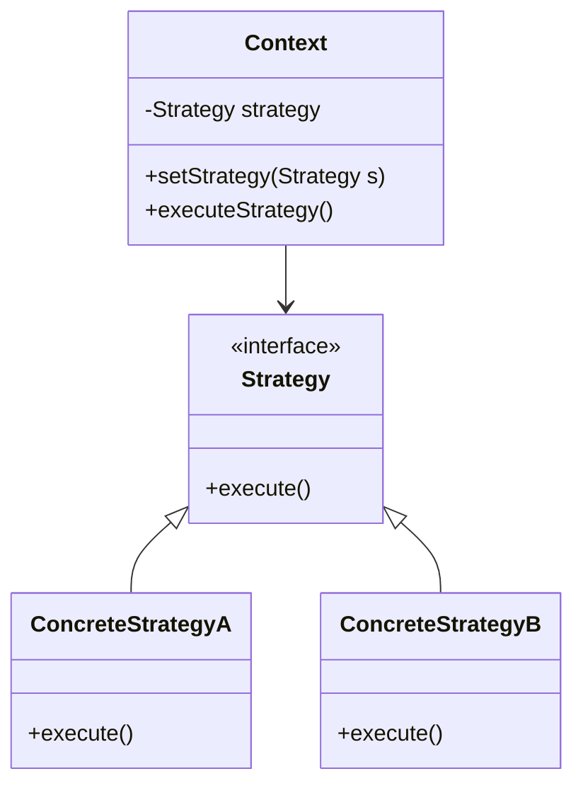

## 8.1 Applying Design Patterns to Real-World Projects

Design patterns are essential tools in a software developer's toolkit, offering proven solutions to common problems. However, applying these patterns effectively in real-world projects requires careful consideration of various factors, including project requirements, team dynamics, and technological constraints. In this section, we'll explore strategies for selecting and implementing design patterns in actual software projects, provide guidelines for integrating patterns into existing codebases, and discuss how to communicate design decisions to team members and stakeholders.

### Identifying Appropriate Design Patterns

The first step in applying design patterns is identifying which patterns are suitable for your project. This involves understanding the specific problems your project faces and matching them with the intent of various design patterns.

#### Analyzing Project Requirements

Begin by thoroughly analyzing the project's requirements. Ask yourself:

- What are the core functionalities the project must deliver?
- Are there any performance constraints?
- What are the scalability requirements?
- How critical is maintainability?

For instance, if your project involves creating a complex user interface with dynamic components, the Composite Pattern might be a good fit. If you need to manage object creation while keeping the system flexible, consider the Factory Method or Abstract Factory Pattern.

#### Mapping Problems to Patterns

Once you have a clear understanding of the requirements, map the problems to design patterns. Here's a brief guide to help you:

- **Singleton Pattern**: Use when you need to ensure a class has only one instance and provide a global point of access to it.
- **Factory Method Pattern**: Ideal for creating objects without specifying the exact class of object that will be created.
- **Observer Pattern**: Useful for implementing distributed event-handling systems.
- **Strategy Pattern**: Helps in defining a family of algorithms, encapsulating each one, and making them interchangeable.

#### Decision-Making Process

The decision-making process for choosing a design pattern involves evaluating the pros and cons of each pattern in the context of your project. Consider factors such as:

- **Complexity**: Does the pattern add unnecessary complexity?
- **Flexibility**: Does it allow for future changes and scalability?
- **Performance**: How does it impact the performance of the application?

### Integrating Patterns into Existing Codebases

Integrating design patterns into an existing codebase can be challenging but rewarding. It often involves refactoring the code to improve its structure and maintainability.

#### Guidelines for Integration

1. **Start Small**: Begin by applying patterns to small, manageable parts of the codebase. This allows you to test the pattern's effectiveness without risking the entire project.

2. **Refactor Incrementally**: Gradually refactor the code, replacing ad-hoc solutions with design patterns. This minimizes disruption and allows for continuous testing.

3. **Leverage Automated Testing**: Ensure that you have a robust suite of automated tests to verify that the refactoring does not introduce new bugs.

4. **Document Changes**: Keep detailed documentation of the changes made and the reasons behind them. This is crucial for future maintenance and for onboarding new team members.

#### Example: Refactoring with the Observer Pattern

Suppose you have a system where multiple components need to be notified of changes to a particular data source. Initially, you might have implemented this with direct calls to each component. This can be refactored using the Observer Pattern:

```typescript
// Subject interface
interface Subject {
  registerObserver(observer: Observer): void;
  removeObserver(observer: Observer): void;
  notifyObservers(): void;
}

// Concrete subject
class DataSource implements Subject {
  private observers: Observer[] = [];
  private data: number;

  registerObserver(observer: Observer): void {
    this.observers.push(observer);
  }

  removeObserver(observer: Observer): void {
    this.observers = this.observers.filter(obs => obs !== observer);
  }

  notifyObservers(): void {
    for (const observer of this.observers) {
      observer.update(this.data);
    }
  }

  setData(data: number): void {
    this.data = data;
    this.notifyObservers();
  }
}

// Observer interface
interface Observer {
  update(data: number): void;
}

// Concrete observer
class DataDisplay implements Observer {
  update(data: number): void {
    console.log(`Data updated: ${data}`);
  }
}

// Usage
const dataSource = new DataSource();
const display = new DataDisplay();

dataSource.registerObserver(display);
dataSource.setData(42); // Output: Data updated: 42
```

### Balancing Pattern Usage with Simplicity

While design patterns offer many benefits, it's crucial to balance their usage with simplicity. Overusing patterns can lead to overly complex code that is difficult to understand and maintain.

#### Avoiding Over-Engineering

- **Prioritize Simplicity**: Always aim for the simplest solution that works. If a pattern adds unnecessary complexity, it might not be the right choice.
- **Evaluate Necessity**: Before applying a pattern, evaluate whether it genuinely solves a problem or if it's being used for the sake of using a pattern.
- **Iterate and Refine**: Start with a simple solution and iterate, introducing patterns only when they provide clear benefits.

### Communicating Design Decisions

Effective communication of design decisions is vital for team cohesion and project success. It ensures that all team members and stakeholders understand the rationale behind the chosen patterns and can contribute to their successful implementation.

#### Tips for Communication

1. **Use Visual Aids**: Diagrams and flowcharts can help convey complex design ideas more clearly than text alone.

2. **Hold Design Reviews**: Regular design reviews provide a platform for discussing design decisions and receiving feedback from the team.

3. **Document Decisions**: Maintain a design document that outlines the chosen patterns, their purpose, and how they are implemented.

4. **Encourage Feedback**: Foster an environment where team members feel comfortable providing feedback and suggesting improvements.

#### Example: Communicating the Use of the Strategy Pattern

When explaining the use of the Strategy Pattern, you might use a diagram to illustrate how different strategies can be swapped without altering the client code:



### Try It Yourself

To deepen your understanding, try modifying the Observer Pattern example. Add another observer that performs a different action when notified, such as logging the data to a file. Experiment with adding and removing observers dynamically.

### Knowledge Check

- What are the key considerations when choosing a design pattern for a project?
- How can you integrate design patterns into an existing codebase without introducing bugs?
- Why is it important to balance pattern usage with simplicity?

### Conclusion

Applying design patterns to real-world projects requires a thoughtful approach that considers the project's unique needs and constraints. By carefully selecting patterns, integrating them into existing codebases, and effectively communicating design decisions, you can enhance the maintainability, scalability, and performance of your software projects. Remember, this is just the beginning. As you progress, you'll build more complex and interactive applications. Keep experimenting, stay curious, and enjoy the journey!

## Quiz Time!



### What is the first step in applying design patterns to a project?

- [x] Identifying which patterns are suitable for the project
- [ ] Implementing the patterns immediately
- [ ] Refactoring the entire codebase
- [ ] Writing extensive documentation

> **Explanation:** The first step is to identify which design patterns are suitable for the project based on the specific problems and requirements.

### What should you consider when mapping problems to patterns?

- [x] The intent of the pattern
- [ ] The popularity of the pattern
- [ ] The number of lines of code it requires
- [ ] The color scheme of the IDE

> **Explanation:** Mapping problems to patterns involves understanding the intent of the pattern and how it aligns with the project's requirements.

### Which pattern is suitable for creating a complex user interface with dynamic components?

- [x] Composite Pattern
- [ ] Singleton Pattern
- [ ] Factory Method Pattern
- [ ] Observer Pattern

> **Explanation:** The Composite Pattern is suitable for creating complex user interfaces with dynamic components.

### What is a key guideline for integrating patterns into existing codebases?

- [x] Start small and refactor incrementally
- [ ] Rewrite the entire codebase
- [ ] Avoid using automated testing
- [ ] Implement all patterns at once

> **Explanation:** Starting small and refactoring incrementally allows for testing the pattern's effectiveness without risking the entire project.

### Why is it important to balance pattern usage with simplicity?

- [x] To avoid over-engineering and maintain code readability
- [ ] To impress stakeholders with complex code
- [ ] To increase the number of lines of code
- [ ] To make the codebase more challenging for new developers

> **Explanation:** Balancing pattern usage with simplicity helps avoid over-engineering and ensures the code remains readable and maintainable.

### What is a benefit of using visual aids in communicating design decisions?

- [x] They help convey complex design ideas more clearly
- [ ] They replace the need for documentation
- [ ] They make the design process faster
- [ ] They are only useful for stakeholders

> **Explanation:** Visual aids like diagrams and flowcharts can help convey complex design ideas more clearly than text alone.

### What is the purpose of holding design reviews?

- [x] To discuss design decisions and receive feedback
- [ ] To finalize the design without input
- [ ] To assign blame for design flaws
- [ ] To reduce the number of design patterns used

> **Explanation:** Design reviews provide a platform for discussing design decisions and receiving feedback from the team.

### What is a key consideration when choosing a design pattern?

- [x] The pattern's impact on performance
- [ ] The pattern's name
- [ ] The number of lines of code it requires
- [ ] The color scheme of the IDE

> **Explanation:** When choosing a design pattern, it's important to consider its impact on performance and how it aligns with project requirements.

### How can you ensure that refactoring does not introduce new bugs?

- [x] By leveraging automated testing
- [ ] By avoiding any changes to the codebase
- [ ] By implementing all patterns at once
- [ ] By skipping code reviews

> **Explanation:** Leveraging automated testing ensures that refactoring does not introduce new bugs by verifying the changes continuously.

### True or False: Overusing design patterns can lead to overly complex code.

- [x] True
- [ ] False

> **Explanation:** Overusing design patterns can lead to overly complex code that is difficult to understand and maintain.


