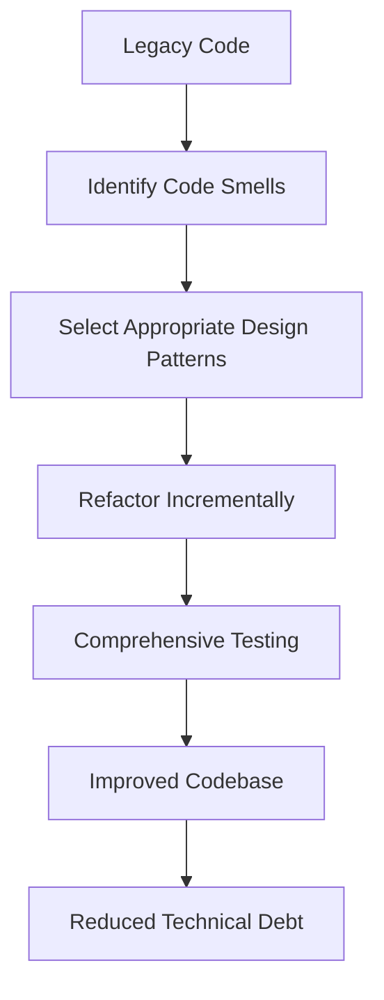

## 8.2 Refactoring Legacy Code with Design Patterns

In the ever-evolving landscape of software development, legacy code is an inevitable reality. As systems grow and requirements change, code that was once efficient and effective can become cumbersome and difficult to maintain. Refactoring legacy code using design patterns is a powerful strategy to modernize and improve these codebases. In this section, we will explore the challenges of working with legacy code, strategies for identifying refactoring opportunities, and how to apply design patterns to enhance code maintainability and address technical debt.

### Understanding the Challenges of Legacy Code

Legacy code is often characterized by its age, complexity, and lack of documentation. It might have been developed using outdated technologies or practices, making it difficult to understand and modify. Some common challenges associated with legacy code include:

- **Lack of Documentation**: Often, legacy code lacks proper documentation, making it hard for new developers to understand its purpose and functionality.
- **Technical Debt**: Over time, shortcuts and quick fixes accumulate, leading to technical debt that can hinder future development.
- **Tightly Coupled Components**: Legacy systems often have tightly coupled components, making changes in one part of the system ripple through others.
- **Outdated Practices**: The code may not adhere to modern best practices, such as SOLID principles, making it less efficient and harder to maintain.
- **Testing Difficulties**: Legacy code may lack automated tests, making it risky to change or refactor.

### Identifying Areas for Refactoring

Before diving into refactoring, it's crucial to identify areas in the code that will benefit the most from improvements. Here are some strategies to help pinpoint these areas:

1. **Code Smells**: Look for signs of poor design or implementation, such as duplicated code, long methods, and large classes.
2. **Complexity Metrics**: Use tools to measure code complexity and identify overly complex areas that could be simplified.
3. **Bug-Prone Areas**: Focus on parts of the code that frequently cause bugs or require constant maintenance.
4. **Performance Bottlenecks**: Identify sections of the code that are slow or inefficient and could benefit from optimization.
5. **Lack of Modularity**: Look for areas where code is tightly coupled and could be refactored into more modular components.

### Applying Design Patterns for Refactoring

Design patterns provide proven solutions to common software design problems. By applying these patterns, we can improve the structure and maintainability of legacy code. Let's explore some design patterns that are particularly useful for refactoring legacy systems.

#### Singleton Pattern

The Singleton pattern ensures a class has only one instance and provides a global point of access to it. This pattern is useful when refactoring code that relies on global variables or objects.

**Before Refactoring:**

```javascript
// Legacy code using a global variable
var config = {
  apiUrl: "https://api.example.com",
  timeout: 5000
};

// Function using the global config
function fetchData() {
  console.log(`Fetching data from ${config.apiUrl} with timeout ${config.timeout}`);
}
```

**After Refactoring:**

```typescript
// Singleton pattern in TypeScript
class Config {
  private static instance: Config;
  public apiUrl: string;
  public timeout: number;

  private constructor() {
    this.apiUrl = "https://api.example.com";
    this.timeout = 5000;
  }

  public static getInstance(): Config {
    if (!Config.instance) {
      Config.instance = new Config();
    }
    return Config.instance;
  }
}

// Using the singleton instance
function fetchData() {
  const config = Config.getInstance();
  console.log(`Fetching data from ${config.apiUrl} with timeout ${config.timeout}`);
}
```

#### Factory Method Pattern

The Factory Method pattern defines an interface for creating an object but allows subclasses to alter the type of objects that will be created. This pattern is useful for refactoring code that uses complex object creation logic.

**Before Refactoring:**

```javascript
// Legacy code with complex object creation
function createUser(type) {
  if (type === "admin") {
    return { role: "admin", permissions: ["read", "write", "delete"] };
  } else if (type === "guest") {
    return { role: "guest", permissions: ["read"] };
  }
  return { role: "user", permissions: ["read", "write"] };
}
```

**After Refactoring:**

```typescript
// Factory Method pattern in TypeScript
interface User {
  role: string;
  permissions: string[];
}

class AdminUser implements User {
  role = "admin";
  permissions = ["read", "write", "delete"];
}

class GuestUser implements User {
  role = "guest";
  permissions = ["read"];
}

class RegularUser implements User {
  role = "user";
  permissions = ["read", "write"];
}

class UserFactory {
  public static createUser(type: string): User {
    switch (type) {
      case "admin":
        return new AdminUser();
      case "guest":
        return new GuestUser();
      default:
        return new RegularUser();
    }
  }
}

// Using the factory method
const admin = UserFactory.createUser("admin");
console.log(admin);
```

#### Observer Pattern

The Observer pattern defines a one-to-many dependency between objects so that when one object changes state, all its dependents are notified and updated automatically. This pattern is useful for refactoring code that uses event handling or notification systems.

**Before Refactoring:**

```javascript
// Legacy event handling code
function EventEmitter() {
  this.events = {};
}

EventEmitter.prototype.on = function (event, listener) {
  if (!this.events[event]) {
    this.events[event] = [];
  }
  this.events[event].push(listener);
};

EventEmitter.prototype.emit = function (event, data) {
  if (this.events[event]) {
    this.events[event].forEach(listener => listener(data));
  }
};

const emitter = new EventEmitter();
emitter.on("data", (data) => console.log(`Received data: ${data}`));
emitter.emit("data", "Sample data");
```

**After Refactoring:**

```typescript
// Observer pattern in TypeScript
interface Observer {
  update(data: any): void;
}

class ConcreteObserver implements Observer {
  update(data: any): void {
    console.log(`Received data: ${data}`);
  }
}

class Subject {
  private observers: Observer[] = [];

  public attach(observer: Observer): void {
    this.observers.push(observer);
  }

  public detach(observer: Observer): void {
    this.observers = this.observers.filter(obs => obs !== observer);
  }

  public notify(data: any): void {
    this.observers.forEach(observer => observer.update(data));
  }
}

const subject = new Subject();
const observer = new ConcreteObserver();
subject.attach(observer);
subject.notify("Sample data");
```

### Best Practices for Refactoring

Refactoring legacy code can be a complex and risky process. Here are some best practices to ensure a successful refactoring effort:

- **Incremental Changes**: Make small, incremental changes rather than large, sweeping modifications. This reduces the risk of introducing new bugs.
- **Comprehensive Testing**: Ensure that there are comprehensive tests in place before refactoring. Write tests for existing functionality if they don't already exist.
- **Version Control**: Use version control systems to track changes and easily revert if necessary.
- **Code Reviews**: Conduct code reviews to catch potential issues and ensure that refactoring aligns with best practices.
- **Documentation**: Update documentation to reflect changes made during refactoring.

### Potential Risks and Mitigation Strategies

Refactoring legacy code is not without risks. Here are some potential risks and strategies to mitigate them:

- **Introducing Bugs**: Changes can introduce new bugs. Mitigate this by having a robust suite of automated tests.
- **Increased Complexity**: Refactoring can sometimes increase complexity if not done carefully. Focus on simplifying and clarifying code.
- **Resistance to Change**: Team members may resist changes to familiar code. Involve the team in the refactoring process and communicate the benefits clearly.
- **Time Constraints**: Refactoring can be time-consuming. Prioritize areas that will provide the most significant benefits and plan refactoring efforts accordingly.

### Visualizing the Refactoring Process

To better understand the refactoring process, let's visualize the transition from a tightly coupled legacy codebase to a more modular and maintainable system using design patterns.



**Figure 1:** The refactoring process involves identifying code smells, selecting appropriate design patterns, refactoring incrementally, and ensuring comprehensive testing to achieve an improved codebase with reduced technical debt.

### Try It Yourself

Now that we've explored how to refactor legacy code using design patterns, it's time to put these concepts into practice. Try modifying the code examples provided to suit your specific use cases. For instance, experiment with different design patterns or refactor additional parts of the codebase. Remember, practice is key to mastering these techniques.

### Embrace the Journey

Refactoring legacy code is a journey that requires patience and persistence. By applying design patterns, we can transform outdated and cumbersome code into a modern, maintainable, and efficient system. Remember, this is just the beginning. As you progress, you'll build more robust and scalable applications. Keep experimenting, stay curious, and enjoy the journey!

## Quiz Time!



### What is a common characteristic of legacy code?

- [x] Lack of documentation
- [ ] Adherence to modern best practices
- [ ] High modularity
- [ ] Comprehensive automated tests

> **Explanation:** Legacy code often lacks proper documentation, making it difficult to understand and maintain.


### Which design pattern ensures a class has only one instance?

- [x] Singleton Pattern
- [ ] Factory Method Pattern
- [ ] Observer Pattern
- [ ] Strategy Pattern

> **Explanation:** The Singleton pattern ensures that a class has only one instance and provides a global point of access to it.


### What is a key benefit of using the Factory Method pattern?

- [x] It allows subclasses to alter the type of objects that will be created.
- [ ] It ensures a class has only one instance.
- [ ] It defines a one-to-many dependency between objects.
- [ ] It encapsulates requests as objects.

> **Explanation:** The Factory Method pattern defines an interface for creating an object but allows subclasses to alter the type of objects that will be created.


### How does the Observer pattern help in refactoring legacy code?

- [x] It defines a one-to-many dependency between objects.
- [ ] It ensures a class has only one instance.
- [ ] It encapsulates requests as objects.
- [ ] It separates the construction of a complex object from its representation.

> **Explanation:** The Observer pattern defines a one-to-many dependency between objects so that when one object changes state, all its dependents are notified and updated automatically.


### What is a best practice for refactoring legacy code?

- [x] Make incremental changes.
- [ ] Avoid using version control.
- [ ] Conduct large, sweeping modifications.
- [ ] Skip code reviews.

> **Explanation:** Making small, incremental changes reduces the risk of introducing new bugs and allows for easier tracking and testing.


### What is a potential risk of refactoring legacy code?

- [x] Introducing new bugs
- [ ] Reducing complexity
- [ ] Improving code maintainability
- [ ] Enhancing performance

> **Explanation:** Changes made during refactoring can introduce new bugs, which is why comprehensive testing is crucial.


### How can resistance to change be mitigated during refactoring?

- [x] Involve the team in the process.
- [ ] Avoid communicating the benefits.
- [ ] Make changes without team input.
- [ ] Ignore team feedback.

> **Explanation:** Involving the team in the refactoring process and clearly communicating the benefits can help mitigate resistance to change.


### What is a sign of poor design or implementation in code?

- [x] Code smells
- [ ] High cohesion
- [ ] Low coupling
- [ ] Comprehensive documentation

> **Explanation:** Code smells are indicators of poor design or implementation, such as duplicated code, long methods, and large classes.


### Which pattern is useful for refactoring code that uses event handling?

- [x] Observer Pattern
- [ ] Singleton Pattern
- [ ] Factory Method Pattern
- [ ] Strategy Pattern

> **Explanation:** The Observer pattern is useful for refactoring code that uses event handling or notification systems.


### True or False: Refactoring should be done in large, sweeping modifications to be effective.

- [ ] True
- [x] False

> **Explanation:** Refactoring should be done in small, incremental changes to reduce the risk of introducing new bugs and to allow for easier testing and tracking.


