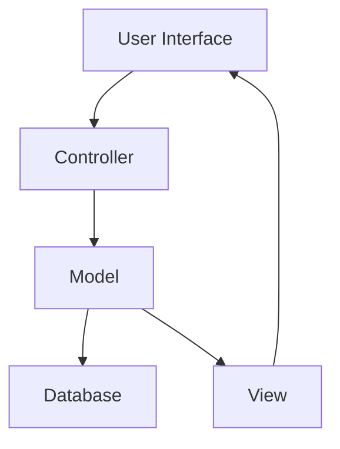

## 8.3.1 Project Overview

In this section, we will delve into the intricacies of building a complex application using design patterns in JavaScript and TypeScript. Our focus will be on a hypothetical yet realistic project that showcases the practical application of multiple design patterns. This project will serve as a comprehensive case study, illustrating how design patterns can be leveraged to create scalable, maintainable, and efficient software solutions.

### Application Purpose and Scope

The application we will explore is a **Collaborative Project Management Tool** designed to facilitate seamless collaboration among teams working on various projects. The tool aims to provide a centralized platform where team members can manage tasks, track progress, communicate effectively, and share resources. The primary goals of the application include:

- **Task Management**: Allow users to create, assign, and track tasks across different projects.
- **Real-Time Collaboration**: Enable team members to collaborate in real-time through chat and file sharing.
- **Progress Tracking**: Provide visual dashboards and reports to monitor project progress and performance.
- **Resource Management**: Manage resources such as documents, images, and other files related to projects.
- **User Management**: Facilitate user authentication, role-based access control, and user profile management.

The scope of this application is to cater to small to medium-sized teams, providing them with the tools necessary to enhance productivity and streamline project workflows.

### Key Features

To achieve the application's purpose, several key features are incorporated:

1. **Dashboard**: A customizable dashboard that provides an overview of ongoing projects, tasks, and team activities.

2. **Task Board**: A Kanban-style task board where users can create, assign, and move tasks across different stages of completion.

3. **Chat and Messaging**: A real-time chat feature that allows team members to communicate instantly, share files, and collaborate effectively.

4. **File Storage**: A secure file storage system that enables users to upload, organize, and access project-related documents.

5. **Notifications**: A notification system that alerts users about task updates, messages, and other important events.

6. **User Profiles**: User profiles that display personal information, roles, and activity history.

7. **Reports and Analytics**: Tools to generate reports and analytics on project performance, resource utilization, and team productivity.

### Architectural Requirements and Challenges

Building a complex application like a Collaborative Project Management Tool involves several architectural requirements and challenges. Let's explore these in detail:

#### Scalability

The application must be designed to handle an increasing number of users and projects without compromising performance. This requires a scalable architecture that can efficiently manage resources and data.

#### Maintainability

Given the complexity of the application, maintainability is crucial. The codebase should be organized and modular, allowing for easy updates and modifications. Design patterns play a vital role in achieving this by promoting code reuse and separation of concerns.

#### Real-Time Communication

Implementing real-time communication features, such as chat and notifications, poses challenges in terms of synchronization and data consistency. The architecture must support efficient data flow and state management.

#### Security

Security is paramount, especially when dealing with sensitive project data and user information. The application must implement robust authentication and authorization mechanisms to protect user data and ensure privacy.

#### Cross-Platform Compatibility

To cater to a diverse user base, the application should be accessible on various platforms, including web and mobile. This requires a responsive design and cross-platform compatibility.

#### Performance Optimization

With features like real-time collaboration and data analytics, performance optimization becomes critical. The application must be optimized to deliver a smooth user experience, even under heavy loads.

### Context for Applying Design Patterns

Design patterns provide a structured approach to addressing the architectural requirements and challenges outlined above. Here's how we plan to apply various design patterns in this project:

- **Creational Patterns**: To manage object creation and initialization, ensuring efficient resource utilization and scalability.
- **Structural Patterns**: To organize and manage the relationships between different components, promoting modularity and maintainability.
- **Behavioral Patterns**: To define the interactions and responsibilities of different components, ensuring seamless communication and data flow.
- **Architectural Patterns**: To establish a robust foundation for the application's architecture, addressing scalability, security, and performance.

In the following sections, we will explore each design pattern in detail, demonstrating how they are applied within the context of our Collaborative Project Management Tool. We will provide code examples, diagrams, and explanations to illustrate the practical implementation of these patterns.

### Code Examples and Diagrams

To better understand the application of design patterns, let's explore some code examples and diagrams that illustrate key concepts and components of our application.

#### Example: Singleton Pattern for Configuration Management

The Singleton pattern ensures that a class has only one instance and provides a global point of access to it. In our application, we can use the Singleton pattern to manage configuration settings.

```typescript
// ConfigurationManager.ts
class ConfigurationManager {
  private static instance: ConfigurationManager;
  private config: { [key: string]: string } = {};

  private constructor() {
    // Initialize configuration settings
    this.config = {
      apiUrl: 'https://api.projectmanagementtool.com',
      maxUploadSize: '10MB',
    };
  }

  public static getInstance(): ConfigurationManager {
    if (!ConfigurationManager.instance) {
      ConfigurationManager.instance = new ConfigurationManager();
    }
    return ConfigurationManager.instance;
  }

  public getConfig(key: string): string {
    return this.config[key];
  }
}

// Usage
const configManager = ConfigurationManager.getInstance();
console.log(configManager.getConfig('apiUrl')); // Output: https://api.projectmanagementtool.com
```

In this example, the `ConfigurationManager` class uses the Singleton pattern to ensure that only one instance of the configuration manager exists. This instance is used to access configuration settings throughout the application.

#### Diagram: MVC Architecture for Task Management

The Model-View-Controller (MVC) pattern is an architectural pattern that separates an application into three main components: Model, View, and Controller. This separation helps manage complexity and promotes organized code.



**Diagram Description**: This diagram illustrates the flow of data in an MVC architecture. The user interacts with the User Interface, which communicates with the Controller. The Controller updates the Model, which interacts with the Database and updates the View. The View then reflects the changes to the User Interface.

### Try It Yourself

To deepen your understanding of design patterns, try modifying the code examples provided. For instance, experiment with adding new configuration settings to the `ConfigurationManager` class or implement additional features in the MVC architecture diagram. This hands-on approach will help solidify your grasp of design patterns and their practical applications.

### References and Links

For further reading and exploration of design patterns, consider the following resources:

- [MDN Web Docs: JavaScript](https://developer.mozilla.org/en-US/docs/Web/JavaScript)
- [TypeScript Official Documentation](https://www.typescriptlang.org/docs/)
- [Refactoring Guru: Design Patterns](https://refactoring.guru/design-patterns)
- [W3Schools: JavaScript](https://www.w3schools.com/js/)

### Knowledge Check

As you progress through this section, consider the following questions to reinforce your understanding:

- How does the Singleton pattern help manage configuration settings in an application?
- What are the benefits of using the MVC pattern in a complex application?
- How can design patterns improve the maintainability and scalability of an application?

### Embrace the Journey

Remember, this is just the beginning of your journey into the world of design patterns. As you continue to explore and experiment, you'll gain a deeper understanding of how these patterns can transform your approach to software development. Keep experimenting, stay curious, and enjoy the journey!

### Formatting and Structure

This section is organized with clear headings and subheadings to guide you through the content. Bullet points are used to break down complex information, and important terms are highlighted for emphasis.

### Writing Style

We use first-person plural to create a collaborative feel, and gender-specific pronouns are avoided to ensure inclusivity. Acronyms and abbreviations are defined upon first use to aid understanding.

## Quiz Time!



### What is the primary purpose of the Collaborative Project Management Tool?

- [x] Facilitate seamless collaboration among teams
- [ ] Manage personal tasks and reminders
- [ ] Provide entertainment and games
- [ ] Serve as a social networking platform

> **Explanation:** The primary purpose of the Collaborative Project Management Tool is to facilitate seamless collaboration among teams working on various projects.

### Which design pattern is used to ensure a class has only one instance?

- [x] Singleton Pattern
- [ ] Factory Pattern
- [ ] Observer Pattern
- [ ] Strategy Pattern

> **Explanation:** The Singleton Pattern is used to ensure a class has only one instance and provides a global point of access to it.

### What architectural pattern is used to separate an application into Model, View, and Controller components?

- [x] MVC Pattern
- [ ] MVVM Pattern
- [ ] Observer Pattern
- [ ] Decorator Pattern

> **Explanation:** The MVC Pattern (Model-View-Controller) is used to separate an application into Model, View, and Controller components.

### Which feature of the application enables real-time communication among team members?

- [x] Chat and Messaging
- [ ] Task Board
- [ ] File Storage
- [ ] User Profiles

> **Explanation:** The Chat and Messaging feature enables real-time communication among team members.

### What is a key challenge in implementing real-time communication features?

- [x] Synchronization and data consistency
- [ ] User interface design
- [ ] File storage capacity
- [ ] User profile customization

> **Explanation:** Synchronization and data consistency are key challenges in implementing real-time communication features.

### Why is maintainability important in a complex application?

- [x] To allow for easy updates and modifications
- [ ] To increase the application's file size
- [ ] To reduce the number of users
- [ ] To limit the application's features

> **Explanation:** Maintainability is important to allow for easy updates and modifications, ensuring the application remains functional and efficient over time.

### What is the purpose of the Dashboard feature in the application?

- [x] Provide an overview of ongoing projects, tasks, and team activities
- [ ] Store and organize files
- [ ] Manage user profiles
- [ ] Generate reports and analytics

> **Explanation:** The Dashboard feature provides an overview of ongoing projects, tasks, and team activities.

### Which design pattern promotes code reuse and separation of concerns?

- [x] Design Patterns
- [ ] Anti-Patterns
- [ ] Spaghetti Code
- [ ] Callback Hell

> **Explanation:** Design Patterns promote code reuse and separation of concerns, making the codebase more organized and maintainable.

### What is a benefit of using the MVC pattern?

- [x] Manages complexity and promotes organized code
- [ ] Increases the number of bugs
- [ ] Decreases application performance
- [ ] Limits user access

> **Explanation:** The MVC pattern manages complexity and promotes organized code by separating the application into Model, View, and Controller components.

### True or False: The application is designed to cater to large enterprise teams.

- [ ] True
- [x] False

> **Explanation:** The application is designed to cater to small to medium-sized teams, providing them with the tools necessary to enhance productivity and streamline project workflows.


