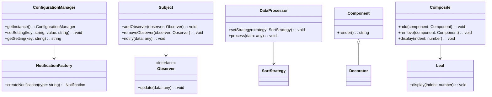

## 8.3.2 Design Patterns Used

In this section, we delve into the specific design patterns employed in our case study of building a complex application. By understanding the rationale behind each pattern's selection and its implementation, we can appreciate how these patterns collectively address the application's requirements, ensuring maintainability, scalability, and robustness.

### Overview of Design Patterns in the Application

The application in our case study is a sophisticated web-based platform that requires seamless interaction between various components, efficient data handling, and a responsive user interface. To achieve these objectives, we have utilized a combination of creational, structural, and behavioral design patterns. Let's explore each pattern, its purpose, and its implementation in detail.

### Singleton Pattern

#### Why Singleton?

The Singleton pattern is used to ensure that a class has only one instance and provides a global point of access to it. In our application, we utilize the Singleton pattern for managing the configuration settings and logging services. This ensures consistency across the application and avoids the overhead of multiple instances.

#### Implementation in TypeScript

```typescript
class ConfigurationManager {
  private static instance: ConfigurationManager;
  private settings: { [key: string]: string } = {};

  private constructor() {}

  public static getInstance(): ConfigurationManager {
    if (!ConfigurationManager.instance) {
      ConfigurationManager.instance = new ConfigurationManager();
    }
    return ConfigurationManager.instance;
  }

  public setSetting(key: string, value: string): void {
    this.settings[key] = value;
  }

  public getSetting(key: string): string {
    return this.settings[key];
  }
}

// Usage
const config = ConfigurationManager.getInstance();
config.setSetting('apiUrl', 'https://api.example.com');
console.log(config.getSetting('apiUrl'));
```

**Explanation:** The `ConfigurationManager` class ensures that only one instance exists by using a private constructor and a static method `getInstance` to control the instantiation process.

### Factory Method Pattern

#### Why Factory Method?

The Factory Method pattern is employed to create objects without specifying the exact class of object that will be created. In our application, this pattern is used to generate different types of user notifications (email, SMS, push notifications) based on user preferences.

#### Implementation in JavaScript

```javascript
class NotificationFactory {
  createNotification(type) {
    switch (type) {
      case 'email':
        return new EmailNotification();
      case 'sms':
        return new SMSNotification();
      case 'push':
        return new PushNotification();
      default:
        throw new Error('Unknown notification type');
    }
  }
}

class EmailNotification {
  send(message) {
    console.log(`Sending email: ${message}`);
  }
}

class SMSNotification {
  send(message) {
    console.log(`Sending SMS: ${message}`);
  }
}

class PushNotification {
  send(message) {
    console.log(`Sending push notification: ${message}`);
  }
}

// Usage
const factory = new NotificationFactory();
const notification = factory.createNotification('email');
notification.send('Hello, this is a test message!');
```

**Explanation:** The `NotificationFactory` class encapsulates the logic for creating different notification types, allowing for easy extension and maintenance.

### Observer Pattern

#### Why Observer?

The Observer pattern is crucial for implementing a subscription mechanism to allow multiple objects to listen and react to events. In our application, it is used for real-time data updates in the user interface, where UI components need to react to changes in the data model.

#### Implementation in TypeScript

```typescript
interface Observer {
  update(data: any): void;
}

class Subject {
  private observers: Observer[] = [];

  public addObserver(observer: Observer): void {
    this.observers.push(observer);
  }

  public removeObserver(observer: Observer): void {
    this.observers = this.observers.filter(obs => obs !== observer);
  }

  public notify(data: any): void {
    this.observers.forEach(observer => observer.update(data));
  }
}

class DataModel extends Subject {
  private data: any;

  public setData(newData: any): void {
    this.data = newData;
    this.notify(this.data);
  }
}

class UIComponent implements Observer {
  public update(data: any): void {
    console.log('Data updated:', data);
  }
}

// Usage
const dataModel = new DataModel();
const uiComponent = new UIComponent();
dataModel.addObserver(uiComponent);

dataModel.setData({ key: 'value' });
```

**Explanation:** The `Subject` class manages a list of observers and notifies them of any changes. The `DataModel` extends `Subject` to notify UI components whenever the data changes.

### Strategy Pattern

#### Why Strategy?

The Strategy pattern is used to define a family of algorithms, encapsulate each one, and make them interchangeable. It is applied in our application for implementing different sorting algorithms for data visualization, allowing users to switch between sorting strategies dynamically.

#### Implementation in JavaScript

```javascript
class SortStrategy {
  sort(data) {
    throw new Error('Sort method must be implemented');
  }
}

class BubbleSort extends SortStrategy {
  sort(data) {
    console.log('Sorting using bubble sort');
    // Implement bubble sort algorithm
  }
}

class QuickSort extends SortStrategy {
  sort(data) {
    console.log('Sorting using quick sort');
    // Implement quick sort algorithm
  }
}

class DataProcessor {
  constructor(strategy) {
    this.strategy = strategy;
  }

  setStrategy(strategy) {
    this.strategy = strategy;
  }

  process(data) {
    this.strategy.sort(data);
  }
}

// Usage
const dataProcessor = new DataProcessor(new BubbleSort());
dataProcessor.process([5, 3, 8, 1]);

dataProcessor.setStrategy(new QuickSort());
dataProcessor.process([5, 3, 8, 1]);
```

**Explanation:** The `DataProcessor` class uses a `SortStrategy` to sort data. The strategy can be changed at runtime, allowing for flexible algorithm selection.

### Decorator Pattern

#### Why Decorator?

The Decorator pattern is used to add new functionality to an object dynamically. In our application, it is used for extending the functionality of UI components, such as adding tooltips or additional styling without altering the original component structure.

#### Implementation in TypeScript

```typescript
class Component {
  public render(): string {
    return 'Component';
  }
}

class Decorator extends Component {
  protected component: Component;

  constructor(component: Component) {
    super();
    this.component = component;
  }

  public render(): string {
    return this.component.render();
  }
}

class TooltipDecorator extends Decorator {
  public render(): string {
    return `${super.render()} with Tooltip`;
  }
}

class StyleDecorator extends Decorator {
  public render(): string {
    return `${super.render()} with Style`;
  }
}

// Usage
let component = new Component();
console.log(component.render());

component = new TooltipDecorator(component);
console.log(component.render());

component = new StyleDecorator(component);
console.log(component.render());
```

**Explanation:** The `Decorator` class extends `Component` and adds additional behavior. The `TooltipDecorator` and `StyleDecorator` add specific functionalities to the component.

### Composite Pattern

#### Why Composite?

The Composite pattern is used to compose objects into tree structures to represent part-whole hierarchies. It is used in our application for managing complex UI components, such as forms and menus, where individual components can be grouped together.

#### Implementation in JavaScript

```javascript
class Component {
  constructor(name) {
    this.name = name;
  }

  add(component) {
    throw new Error('Method not implemented');
  }

  remove(component) {
    throw new Error('Method not implemented');
  }

  display(indent) {
    throw new Error('Method not implemented');
  }
}

class Leaf extends Component {
  display(indent) {
    console.log(`${' '.repeat(indent)}- ${this.name}`);
  }
}

class Composite extends Component {
  constructor(name) {
    super(name);
    this.children = [];
  }

  add(component) {
    this.children.push(component);
  }

  remove(component) {
    this.children = this.children.filter(child => child !== component);
  }

  display(indent) {
    console.log(`${' '.repeat(indent)}+ ${this.name}`);
    this.children.forEach(child => child.display(indent + 2));
  }
}

// Usage
const root = new Composite('root');
const leaf1 = new Leaf('leaf1');
const leaf2 = new Leaf('leaf2');

root.add(leaf1);
root.add(leaf2);

const subComposite = new Composite('subComposite');
subComposite.add(new Leaf('leaf3'));

root.add(subComposite);
root.display(0);
```

**Explanation:** The `Composite` class can contain both `Leaf` and other `Composite` objects, allowing for flexible tree structures.

### Interaction of Patterns

The design patterns in our application do not operate in isolation. They interact with each other to form a cohesive architecture. For instance, the Singleton pattern ensures that the configuration settings are consistent across the application, which is crucial for the Factory Method pattern when creating notification objects. The Observer pattern allows UI components to react to data changes, while the Strategy pattern provides flexibility in data processing algorithms. The Decorator pattern enhances UI components without altering their core functionality, and the Composite pattern manages complex UI hierarchies.

### Visualizing the Architecture

Below is a Mermaid.js diagram illustrating the interaction of these patterns within the application's architecture:



**Description:** This diagram illustrates how the Singleton pattern (`ConfigurationManager`) interacts with the Factory Method pattern (`NotificationFactory`), how the Observer pattern (`Subject` and `Observer`) facilitates data updates, how the Strategy pattern (`DataProcessor` and `SortStrategy`) allows for flexible data processing, and how the Decorator and Composite patterns enhance and manage UI components.

### Try It Yourself

To deepen your understanding, try modifying the code examples:

- **Singleton Pattern:** Add a method to reset the configuration settings and test its impact on the application.
- **Factory Method Pattern:** Introduce a new notification type (e.g., in-app notification) and update the factory to handle it.
- **Observer Pattern:** Implement a new observer that logs data changes to the console.
- **Strategy Pattern:** Create a new sorting strategy and integrate it into the data processor.
- **Decorator Pattern:** Add a new decorator that changes the component's color.
- **Composite Pattern:** Build a more complex tree structure and explore its display.

### Knowledge Check

Before moving on, let's summarize the key takeaways:

- **Singleton Pattern** ensures a single instance of a class, useful for global configurations.
- **Factory Method Pattern** allows for flexible object creation without specifying exact classes.
- **Observer Pattern** facilitates event-driven programming by notifying observers of changes.
- **Strategy Pattern** enables dynamic algorithm selection, enhancing flexibility.
- **Decorator Pattern** adds functionality to objects without altering their structure.
- **Composite Pattern** manages complex hierarchies, ideal for UI components.

Remember, mastering these patterns will significantly enhance your ability to design robust and scalable applications. Keep experimenting, stay curious, and enjoy the journey!

## Quiz Time!



### Which pattern ensures a class has only one instance?

- [x] Singleton Pattern
- [ ] Factory Method Pattern
- [ ] Observer Pattern
- [ ] Strategy Pattern

> **Explanation:** The Singleton Pattern ensures a class has only one instance and provides a global point of access to it.

### What is the primary purpose of the Factory Method Pattern?

- [x] To create objects without specifying the exact class
- [ ] To ensure a single instance of a class
- [ ] To add new functionality to an object
- [ ] To define a family of algorithms

> **Explanation:** The Factory Method Pattern is used to create objects without specifying the exact class of object that will be created.

### How does the Observer Pattern benefit an application?

- [x] It facilitates event-driven programming
- [ ] It ensures a single instance of a class
- [ ] It adds new functionality to an object
- [ ] It defines a family of algorithms

> **Explanation:** The Observer Pattern facilitates event-driven programming by allowing objects to listen and react to events.

### Which pattern allows for dynamic algorithm selection?

- [x] Strategy Pattern
- [ ] Singleton Pattern
- [ ] Observer Pattern
- [ ] Factory Method Pattern

> **Explanation:** The Strategy Pattern enables dynamic selection of algorithms, allowing them to be interchangeable.

### What is the role of the Decorator Pattern?

- [x] To add functionality to objects without altering their structure
- [ ] To create objects without specifying the exact class
- [ ] To ensure a single instance of a class
- [ ] To manage complex hierarchies

> **Explanation:** The Decorator Pattern adds new functionality to an object without altering its structure.

### Which pattern is ideal for managing complex UI hierarchies?

- [x] Composite Pattern
- [ ] Singleton Pattern
- [ ] Factory Method Pattern
- [ ] Observer Pattern

> **Explanation:** The Composite Pattern is ideal for managing complex hierarchies, such as UI components.

### How does the Singleton Pattern interact with the Factory Method Pattern in the case study?

- [x] It ensures consistent configuration settings for object creation
- [ ] It adds new functionality to created objects
- [ ] It manages complex hierarchies of created objects
- [ ] It allows for dynamic algorithm selection during object creation

> **Explanation:** The Singleton Pattern ensures consistent configuration settings, which is crucial for the Factory Method Pattern when creating objects.

### Which pattern is used for implementing different sorting algorithms?

- [x] Strategy Pattern
- [ ] Singleton Pattern
- [ ] Observer Pattern
- [ ] Factory Method Pattern

> **Explanation:** The Strategy Pattern is used for implementing different sorting algorithms, allowing them to be interchangeable.

### What is the benefit of using the Composite Pattern in UI components?

- [x] It allows for flexible tree structures
- [ ] It ensures a single instance of a component
- [ ] It facilitates event-driven programming
- [ ] It adds new functionality to components

> **Explanation:** The Composite Pattern allows for flexible tree structures, making it ideal for managing complex UI components.

### True or False: The Decorator Pattern modifies the original component structure.

- [ ] True
- [x] False

> **Explanation:** False. The Decorator Pattern adds functionality without modifying the original component structure.


