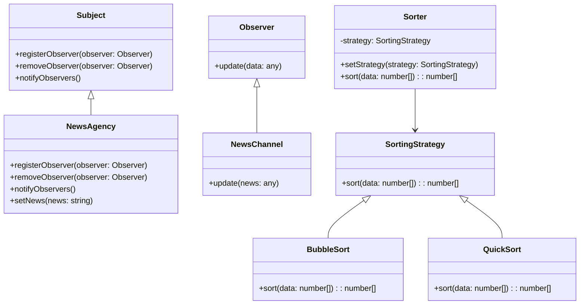

## 8.3.3 Challenges and Solutions

In the development of complex applications, developers often encounter a myriad of challenges that can hinder progress and affect the quality of the final product. These challenges can include issues related to scalability, maintainability, performance, and more. In this section, we will explore some of the key obstacles faced during the development of a complex application and how design patterns in JavaScript and TypeScript provided effective solutions. We will also share lessons learned and insights gained throughout the process, along with any adaptations or customizations made to standard patterns.

### Key Challenges Faced

1. **Scalability**: As the application grows, it becomes increasingly difficult to manage and scale efficiently. Ensuring that the application can handle increased loads and complexity is crucial.

2. **Maintainability**: With a large codebase, maintaining and updating the application can become cumbersome. Ensuring that the code is easy to understand and modify is essential for long-term success.

3. **Performance**: Optimizing the application to run efficiently and respond quickly to user interactions is a constant challenge, especially as the application grows in complexity.

4. **Code Reusability**: Writing reusable code components that can be easily integrated into different parts of the application is important for reducing redundancy and improving efficiency.

5. **Complexity Management**: Managing the complexity of the application architecture and ensuring that different components interact seamlessly is a significant challenge.

### Solutions Through Design Patterns

#### 1. Scalability with the Observer Pattern

The **Observer Pattern** was instrumental in addressing scalability challenges. This pattern allows an object, known as the subject, to maintain a list of its dependents, called observers, and notify them automatically of any state changes. This decouples the subject from the observers, allowing for more scalable and flexible code.

```typescript
// Subject interface
interface Subject {
    registerObserver(observer: Observer): void;
    removeObserver(observer: Observer): void;
    notifyObservers(): void;
}

// Observer interface
interface Observer {
    update(data: any): void;
}

// Concrete Subject
class NewsAgency implements Subject {
    private observers: Observer[] = [];
    private news: string;

    registerObserver(observer: Observer): void {
        this.observers.push(observer);
    }

    removeObserver(observer: Observer): void {
        this.observers = this.observers.filter(obs => obs !== observer);
    }

    notifyObservers(): void {
        for (let observer of this.observers) {
            observer.update(this.news);
        }
    }

    setNews(news: string): void {
        this.news = news;
        this.notifyObservers();
    }
}

// Concrete Observer
class NewsChannel implements Observer {
    update(news: any): void {
        console.log(`Breaking News: ${news}`);
    }
}

// Usage
const agency = new NewsAgency();
const channel1 = new NewsChannel();
const channel2 = new NewsChannel();

agency.registerObserver(channel1);
agency.registerObserver(channel2);

agency.setNews("New design patterns released!");
```

**Lessons Learned**: The Observer Pattern facilitated the addition of new observers without modifying the subject, enhancing scalability. It allowed for dynamic subscription and unsubscription, which is crucial for handling varying loads.

#### 2. Maintainability with the Strategy Pattern

To improve maintainability, the **Strategy Pattern** was employed. This pattern defines a family of algorithms, encapsulates each one, and makes them interchangeable. This allows the algorithm to vary independently from clients that use it.

```typescript
// Strategy interface
interface SortingStrategy {
    sort(data: number[]): number[];
}

// Concrete Strategy
class BubbleSort implements SortingStrategy {
    sort(data: number[]): number[] {
        // Bubble sort implementation
        for (let i = 0; i < data.length - 1; i++) {
            for (let j = 0; j < data.length - i - 1; j++) {
                if (data[j] > data[j + 1]) {
                    [data[j], data[j + 1]] = [data[j + 1], data[j]];
                }
            }
        }
        return data;
    }
}

// Another Concrete Strategy
class QuickSort implements SortingStrategy {
    sort(data: number[]): number[] {
        // Quick sort implementation
        if (data.length <= 1) return data;
        const pivot = data[data.length - 1];
        const left = [];
        const right = [];
        for (const el of data.slice(0, data.length - 1)) {
            el < pivot ? left.push(el) : right.push(el);
        }
        return [...this.sort(left), pivot, ...this.sort(right)];
    }
}

// Context
class Sorter {
    constructor(private strategy: SortingStrategy) {}

    setStrategy(strategy: SortingStrategy) {
        this.strategy = strategy;
    }

    sort(data: number[]): number[] {
        return this.strategy.sort(data);
    }
}

// Usage
const sorter = new Sorter(new BubbleSort());
console.log(sorter.sort([5, 3, 8, 6, 2])); // Bubble sort

sorter.setStrategy(new QuickSort());
console.log(sorter.sort([5, 3, 8, 6, 2])); // Quick sort
```

**Lessons Learned**: The Strategy Pattern allowed us to switch between different algorithms without altering the client code. This made the codebase more maintainable and adaptable to future changes.

#### 3. Performance Optimization with the Flyweight Pattern

The **Flyweight Pattern** was used to optimize performance by minimizing memory usage. This pattern is particularly useful for applications that need to create a large number of similar objects.

```typescript
// Flyweight interface
interface Shape {
    draw(): void;
}

// Concrete Flyweight
class Circle implements Shape {
    constructor(private color: string, private radius: number) {}

    draw(): void {
        console.log(`Drawing a ${this.color} circle with radius ${this.radius}`);
    }
}

// Flyweight Factory
class ShapeFactory {
    private static circleMap: Map<string, Circle> = new Map();

    static getCircle(color: string): Circle {
        let circle = this.circleMap.get(color);
        if (!circle) {
            circle = new Circle(color, 10); // Default radius
            this.circleMap.set(color, circle);
            console.log(`Creating a new circle of color: ${color}`);
        }
        return circle;
    }
}

// Usage
const circle1 = ShapeFactory.getCircle("Red");
circle1.draw();

const circle2 = ShapeFactory.getCircle("Green");
circle2.draw();

const circle3 = ShapeFactory.getCircle("Red");
circle3.draw(); // Reuses the existing red circle
```

**Lessons Learned**: By sharing common state among multiple objects, the Flyweight Pattern significantly reduced memory consumption, enhancing performance without sacrificing functionality.

#### 4. Code Reusability with the Factory Method Pattern

The **Factory Method Pattern** was employed to enhance code reusability. This pattern provides an interface for creating objects in a superclass, but allows subclasses to alter the type of objects that will be created.

```typescript
// Product interface
interface Button {
    render(): void;
}

// Concrete Products
class WindowsButton implements Button {
    render(): void {
        console.log("Rendering a Windows button.");
    }
}

class MacOSButton implements Button {
    render(): void {
        console.log("Rendering a MacOS button.");
    }
}

// Creator
abstract class Dialog {
    abstract createButton(): Button;

    render(): void {
        const button = this.createButton();
        button.render();
    }
}

// Concrete Creators
class WindowsDialog extends Dialog {
    createButton(): Button {
        return new WindowsButton();
    }
}

class MacOSDialog extends Dialog {
    createButton(): Button {
        return new MacOSButton();
    }
}

// Usage
const windowsDialog = new WindowsDialog();
windowsDialog.render();

const macDialog = new MacOSDialog();
macDialog.render();
```

**Lessons Learned**: The Factory Method Pattern enabled the creation of objects without specifying their concrete classes, promoting code reusability and flexibility.

#### 5. Complexity Management with the Composite Pattern

The **Composite Pattern** was used to manage complexity by allowing individual objects and compositions of objects to be treated uniformly. This pattern is particularly useful for building tree structures.

```typescript
// Component interface
interface Graphic {
    draw(): void;
}

// Leaf
class Dot implements Graphic {
    draw(): void {
        console.log("Drawing a dot.");
    }
}

// Composite
class CompoundGraphic implements Graphic {
    private children: Graphic[] = [];

    add(child: Graphic): void {
        this.children.push(child);
    }

    remove(child: Graphic): void {
        this.children = this.children.filter(c => c !== child);
    }

    draw(): void {
        for (let child of this.children) {
            child.draw();
        }
    }
}

// Usage
const dot1 = new Dot();
const dot2 = new Dot();
const compoundGraphic = new CompoundGraphic();

compoundGraphic.add(dot1);
compoundGraphic.add(dot2);
compoundGraphic.draw();
```

**Lessons Learned**: The Composite Pattern simplified the management of complex structures by allowing us to work with individual objects and compositions in a consistent manner.

### Adaptations and Customizations

During the development process, several adaptations and customizations were made to standard design patterns to better fit the specific needs of the application. For example:

- **Observer Pattern Customization**: We introduced a priority-based notification system where observers could be notified based on their priority level, allowing critical observers to receive updates first.

- **Strategy Pattern Adaptation**: We created a dynamic strategy loader that could load strategies from external sources, enabling real-time updates to the algorithm without redeploying the application.

- **Flyweight Pattern Enhancement**: We implemented a caching mechanism to store frequently used flyweights, further reducing memory usage and improving performance.

### Insights and Lessons Learned

1. **Design Patterns as Building Blocks**: Design patterns served as foundational building blocks that provided proven solutions to common problems, enabling us to focus on higher-level application logic.

2. **Flexibility and Adaptability**: By leveraging design patterns, we were able to create a flexible and adaptable codebase that could easily accommodate changes and new requirements.

3. **Improved Collaboration**: The use of well-known design patterns facilitated better communication and collaboration among team members, as patterns provided a common language for discussing solutions.

4. **Continuous Learning**: The process of applying and adapting design patterns was a valuable learning experience that deepened our understanding of software architecture and design principles.

### Try It Yourself

We encourage you to experiment with the code examples provided in this section. Try modifying the patterns to suit different scenarios or explore how combining multiple patterns can address complex challenges. For instance, consider integrating the Observer Pattern with the Strategy Pattern to create a dynamic notification system that adapts based on user preferences.

### Visualizing the Application Architecture

To better understand how these design patterns fit into the overall application architecture, let's visualize the relationships between different components using a Mermaid.js class diagram:



This diagram illustrates how the Observer Pattern and Strategy Pattern are integrated into the application, highlighting the relationships between subjects, observers, strategies, and the context.

### Knowledge Check

To reinforce your understanding of the concepts covered in this section, consider the following questions:

1. How does the Observer Pattern enhance scalability in an application?
2. What are the benefits of using the Strategy Pattern for maintainability?
3. How does the Flyweight Pattern optimize performance in a large-scale application?
4. In what ways does the Factory Method Pattern promote code reusability?
5. How does the Composite Pattern help manage complexity in an application architecture?

### Embrace the Journey

Remember, this is just the beginning. As you continue to explore and apply design patterns in your projects, you'll gain deeper insights into software architecture and design principles. Keep experimenting, stay curious, and enjoy the journey!

## Quiz Time!



### How does the Observer Pattern enhance scalability in an application?

- [x] By decoupling subjects from observers, allowing dynamic subscription and unsubscription.
- [ ] By tightly coupling subjects and observers to ensure consistent updates.
- [ ] By reducing the number of observers to improve performance.
- [ ] By limiting the number of notifications sent to observers.

> **Explanation:** The Observer Pattern enhances scalability by decoupling subjects from observers, allowing dynamic subscription and unsubscription, which is crucial for handling varying loads.

### What are the benefits of using the Strategy Pattern for maintainability?

- [x] It allows switching between different algorithms without altering client code.
- [ ] It tightly couples algorithms with client code for better performance.
- [ ] It limits the number of algorithms available to the client.
- [ ] It requires significant changes to client code when switching algorithms.

> **Explanation:** The Strategy Pattern allows switching between different algorithms without altering client code, making the codebase more maintainable and adaptable to future changes.

### How does the Flyweight Pattern optimize performance in a large-scale application?

- [x] By minimizing memory usage through shared common state among multiple objects.
- [ ] By creating a unique object for each instance to ensure consistency.
- [ ] By increasing the number of objects to improve performance.
- [ ] By reducing the functionality of objects to save memory.

> **Explanation:** The Flyweight Pattern optimizes performance by minimizing memory usage through shared common state among multiple objects, reducing memory consumption.

### In what ways does the Factory Method Pattern promote code reusability?

- [x] By providing an interface for creating objects without specifying their concrete classes.
- [ ] By requiring specific classes for object creation.
- [ ] By limiting the types of objects that can be created.
- [ ] By tightly coupling object creation with client code.

> **Explanation:** The Factory Method Pattern promotes code reusability by providing an interface for creating objects without specifying their concrete classes, allowing for flexible and reusable code.

### How does the Composite Pattern help manage complexity in an application architecture?

- [x] By allowing individual objects and compositions of objects to be treated uniformly.
- [ ] By requiring separate handling for individual objects and compositions.
- [ ] By increasing the complexity of the application architecture.
- [ ] By limiting the number of objects in the application.

> **Explanation:** The Composite Pattern helps manage complexity by allowing individual objects and compositions of objects to be treated uniformly, simplifying the management of complex structures.

### What customization was made to the Observer Pattern in the case study?

- [x] A priority-based notification system was introduced.
- [ ] Observers were tightly coupled with the subject.
- [ ] Notifications were limited to a fixed number of observers.
- [ ] Observers were required to update the subject.

> **Explanation:** A priority-based notification system was introduced, allowing critical observers to receive updates first, enhancing the pattern's flexibility.

### How was the Strategy Pattern adapted in the case study?

- [x] A dynamic strategy loader was created to load strategies from external sources.
- [ ] Strategies were hardcoded into the client code.
- [ ] Only one strategy was allowed at a time.
- [ ] Strategies were tightly coupled with the client code.

> **Explanation:** A dynamic strategy loader was created to load strategies from external sources, enabling real-time updates to the algorithm without redeploying the application.

### What enhancement was made to the Flyweight Pattern in the case study?

- [x] A caching mechanism was implemented to store frequently used flyweights.
- [ ] Flyweights were tightly coupled with client code.
- [ ] Flyweights were created for each instance to ensure uniqueness.
- [ ] Flyweights were limited to a fixed number.

> **Explanation:** A caching mechanism was implemented to store frequently used flyweights, further reducing memory usage and improving performance.

### What is a key insight gained from applying design patterns in the case study?

- [x] Design patterns served as foundational building blocks for proven solutions.
- [ ] Design patterns increased the complexity of the application.
- [ ] Design patterns limited the flexibility of the codebase.
- [ ] Design patterns required significant changes to the application architecture.

> **Explanation:** Design patterns served as foundational building blocks that provided proven solutions to common problems, enabling a focus on higher-level application logic.

### True or False: The use of design patterns facilitated better communication and collaboration among team members.

- [x] True
- [ ] False

> **Explanation:** The use of well-known design patterns facilitated better communication and collaboration among team members, as patterns provided a common language for discussing solutions.


