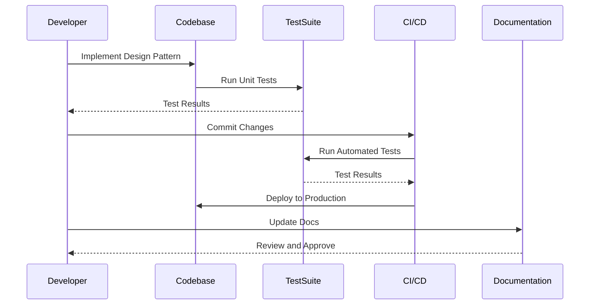

## 8.4 Testing and Maintenance

In the world of software development, ensuring the long-term quality and performance of your code is paramount. This is especially true when utilizing design patterns in JavaScript and TypeScript, as they often form the backbone of complex systems. In this section, we'll delve into the strategies for writing unit tests for pattern-based code, the role of design patterns in facilitating easier testing and debugging, best practices for maintaining and updating code, and the tools and techniques for monitoring code health over time. Additionally, we'll emphasize the critical role of documentation in maintaining complex systems.

### Importance of Testing in Design Patterns

Testing is a fundamental aspect of software development, and when it comes to design patterns, it becomes even more critical. Design patterns provide a structured approach to solving common problems, but they also introduce complexity that requires thorough testing to ensure reliability and maintainability.

#### Strategies for Writing Unit Tests

1. **Identify Test Cases**: Begin by identifying the key functionalities of the design pattern you are implementing. For instance, if you're using the Singleton pattern, test that only one instance is created.

2. **Mocking and Stubbing**: Use mocking and stubbing to isolate the unit of work. This is particularly useful in patterns like the Observer, where you can mock observers to test the subject independently.

3. **Behavioral Testing**: Focus on testing the behavior of the system rather than the implementation details. This aligns well with patterns like Strategy and Template Method, where the behavior can change dynamically.

4. **Test Coverage**: Aim for high test coverage, ensuring that all branches and paths in your pattern implementation are tested. Tools like Istanbul can help visualize coverage.

5. **Automated Testing**: Integrate automated testing tools like Jest or Mocha to run tests continuously, ensuring that changes do not break existing functionality.

```javascript
// Example: Testing a Singleton Pattern in JavaScript

// Singleton.js
class Singleton {
  constructor() {
    if (Singleton.instance) {
      return Singleton.instance;
    }
    this.data = [];
    Singleton.instance = this;
  }

  addData(item) {
    this.data.push(item);
  }

  getData() {
    return this.data;
  }
}

module.exports = Singleton;

// Singleton.test.js
const Singleton = require('./Singleton');

test('Singleton should return the same instance', () => {
  const instance1 = new Singleton();
  const instance2 = new Singleton();
  expect(instance1).toBe(instance2);
});

test('Singleton should store data correctly', () => {
  const instance = new Singleton();
  instance.addData('test');
  expect(instance.getData()).toContain('test');
});
```

### Facilitating Easier Testing and Debugging with Design Patterns

Design patterns inherently promote a separation of concerns, which can significantly simplify testing and debugging. Let's explore how:

#### Separation of Concerns

Design patterns like the MVC (Model-View-Controller) or MVVM (Model-View-ViewModel) naturally separate different aspects of the application, making it easier to test each component independently. This separation allows developers to pinpoint issues more efficiently during debugging.

#### Encapsulation and Modularity

Patterns such as the Factory Method or Abstract Factory encapsulate object creation logic, making it easier to test object creation in isolation. Similarly, the Decorator pattern allows for testing additional functionalities without altering the core object.

#### Reusability and Flexibility

The Strategy pattern, for example, allows for interchangeable algorithms, making it easier to test different strategies without altering the context. This flexibility also aids in debugging, as you can swap out strategies to isolate issues.

```typescript
// Example: Testing a Strategy Pattern in TypeScript

// Strategy.ts
interface Strategy {
  execute(a: number, b: number): number;
}

class AddStrategy implements Strategy {
  execute(a: number, b: number): number {
    return a + b;
  }
}

class SubtractStrategy implements Strategy {
  execute(a: number, b: number): number {
    return a - b;
  }
}

class Context {
  private strategy: Strategy;

  constructor(strategy: Strategy) {
    this.strategy = strategy;
  }

  setStrategy(strategy: Strategy) {
    this.strategy = strategy;
  }

  executeStrategy(a: number, b: number): number {
    return this.strategy.execute(a, b);
  }
}

// Strategy.test.ts
import { AddStrategy, SubtractStrategy, Context } from './Strategy';

test('AddStrategy should add numbers', () => {
  const context = new Context(new AddStrategy());
  expect(context.executeStrategy(1, 2)).toBe(3);
});

test('SubtractStrategy should subtract numbers', () => {
  const context = new Context(new SubtractStrategy());
  expect(context.executeStrategy(5, 3)).toBe(2);
});
```

### Best Practices for Maintaining and Updating Pattern-Implemented Code

Maintaining and updating code that utilizes design patterns requires careful consideration to preserve the benefits of the patterns while adapting to new requirements.

#### Consistent Refactoring

Regularly refactor your code to improve readability and performance. Refactoring helps in keeping the codebase clean and manageable, especially when dealing with complex patterns like Composite or Visitor.

#### Version Control

Use version control systems like Git to track changes and collaborate effectively. Branching strategies can help manage updates and bug fixes without disrupting the main codebase.

#### Code Reviews

Conduct regular code reviews to ensure adherence to design principles and patterns. Peer reviews can catch potential issues early and provide insights into better implementation strategies.

#### Dependency Management

Manage dependencies carefully, especially in patterns like Dependency Injection. Tools like npm or Yarn can help keep track of package versions and updates.

#### Continuous Integration and Deployment (CI/CD)

Implement CI/CD pipelines to automate testing and deployment processes. This ensures that changes are tested thoroughly before being deployed to production.

### Tools and Techniques for Monitoring Code Health

Monitoring the health of your codebase is crucial for long-term maintenance and performance. Here are some tools and techniques to consider:

#### Static Code Analysis

Use tools like ESLint or TSLint to enforce coding standards and catch potential issues early. Static analysis helps maintain code quality and consistency.

#### Performance Monitoring

Implement performance monitoring tools like New Relic or Google Lighthouse to track application performance and identify bottlenecks.

#### Error Tracking

Use error tracking tools like Sentry or Rollbar to capture and analyze runtime errors. These tools provide insights into error patterns and help prioritize fixes.

#### Logging

Implement robust logging mechanisms to capture application behavior and debug issues. Tools like Winston or Log4js can help manage logs effectively.

#### Health Checks

Set up regular health checks to monitor system status and performance. Automated scripts or tools like Nagios can alert you to potential issues before they impact users.

### The Role of Documentation in Maintaining Complex Systems

Documentation is a vital component of maintaining complex systems, especially those utilizing design patterns. It serves as a reference for current and future developers, ensuring continuity and understanding.

#### Comprehensive Documentation

Document the purpose and implementation of each design pattern used in your codebase. Include diagrams and examples to illustrate complex concepts.

#### Code Comments

Use comments to explain non-obvious code sections, especially in intricate patterns like Proxy or Flyweight. Comments help new developers understand the logic and intent behind the code.

#### API Documentation

Generate API documentation using tools like JSDoc or TypeDoc. This provides a clear reference for developers interacting with your code.

#### Change Logs

Maintain change logs to document updates and modifications. This helps track the evolution of the codebase and provides context for changes.

#### Knowledge Sharing

Encourage knowledge sharing through documentation sessions or internal wikis. This fosters a culture of learning and collaboration within the team.

### Try It Yourself

To solidify your understanding of testing and maintaining design pattern-based code, try modifying the code examples provided. Experiment with adding new strategies to the Strategy pattern or extending the Singleton pattern with additional methods. Observe how these changes impact your tests and consider how you might document these modifications.

### Visualizing Testing and Maintenance

To better understand the flow of testing and maintenance in design patterns, let's visualize the process using a sequence diagram.



This diagram illustrates the interaction between the developer, codebase, test suite, CI/CD pipeline, and documentation during the testing and maintenance process.

### Conclusion

Testing and maintaining code that utilizes design patterns is essential for ensuring long-term quality and performance. By adopting strategies for writing unit tests, leveraging the benefits of design patterns for easier testing and debugging, and following best practices for maintenance, you can create robust and reliable software systems. Remember, documentation plays a crucial role in maintaining complex systems, providing a reference for current and future developers. As you continue your journey in software development, keep experimenting, stay curious, and enjoy the process of creating high-quality code.

## Quiz Time!



### What is the primary purpose of unit testing in design pattern-based code?

- [x] To ensure that each part of the pattern works as expected
- [ ] To replace manual testing entirely
- [ ] To increase the complexity of the code
- [ ] To eliminate the need for documentation

> **Explanation:** Unit testing ensures that each part of the design pattern works as expected, providing confidence in the code's reliability.

### How can design patterns facilitate easier debugging?

- [x] By promoting separation of concerns
- [ ] By increasing code complexity
- [ ] By reducing the need for testing
- [ ] By eliminating the need for documentation

> **Explanation:** Design patterns promote separation of concerns, making it easier to isolate and debug issues within specific components.

### Which tool is commonly used for static code analysis in JavaScript?

- [x] ESLint
- [ ] Mocha
- [ ] Jest
- [ ] Sentry

> **Explanation:** ESLint is a popular tool for static code analysis in JavaScript, helping enforce coding standards and catch potential issues.

### What is the benefit of using mocking in unit tests?

- [x] It isolates the unit of work
- [ ] It increases test complexity
- [ ] It eliminates the need for integration tests
- [ ] It reduces test coverage

> **Explanation:** Mocking isolates the unit of work, allowing you to test specific components without interference from other parts of the system.

### What is a key benefit of continuous integration and deployment (CI/CD)?

- [x] Automates testing and deployment processes
- [ ] Eliminates the need for manual testing
- [ ] Increases the complexity of the codebase
- [ ] Reduces the need for documentation

> **Explanation:** CI/CD automates testing and deployment processes, ensuring that changes are thoroughly tested before being deployed to production.

### Why is documentation important in maintaining complex systems?

- [x] It provides a reference for current and future developers
- [ ] It replaces the need for testing
- [ ] It increases code complexity
- [ ] It eliminates the need for code comments

> **Explanation:** Documentation provides a reference for current and future developers, ensuring continuity and understanding of the codebase.

### What is the role of error tracking tools like Sentry?

- [x] To capture and analyze runtime errors
- [ ] To replace unit tests
- [ ] To increase code complexity
- [ ] To eliminate the need for debugging

> **Explanation:** Error tracking tools like Sentry capture and analyze runtime errors, providing insights into error patterns and helping prioritize fixes.

### How does the Strategy pattern facilitate testing?

- [x] By allowing interchangeable algorithms
- [ ] By increasing code complexity
- [ ] By reducing the need for unit tests
- [ ] By eliminating the need for documentation

> **Explanation:** The Strategy pattern allows for interchangeable algorithms, making it easier to test different strategies without altering the context.

### What is a common practice for managing dependencies in JavaScript projects?

- [x] Using npm or Yarn
- [ ] Using Mocha
- [ ] Using Jest
- [ ] Using Sentry

> **Explanation:** npm and Yarn are common tools for managing dependencies in JavaScript projects, helping keep track of package versions and updates.

### True or False: Refactoring is unnecessary once a design pattern is implemented.

- [ ] True
- [x] False

> **Explanation:** Refactoring is necessary to improve readability and performance, even after a design pattern is implemented, to keep the codebase clean and manageable.


